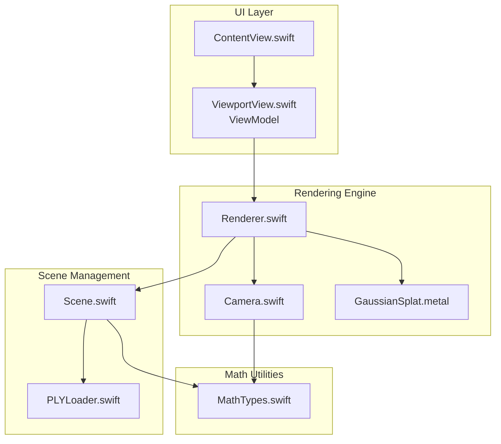
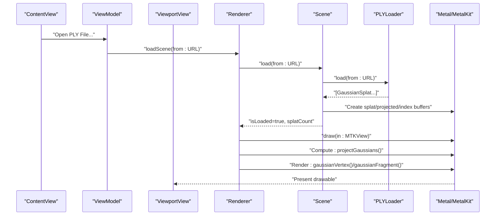
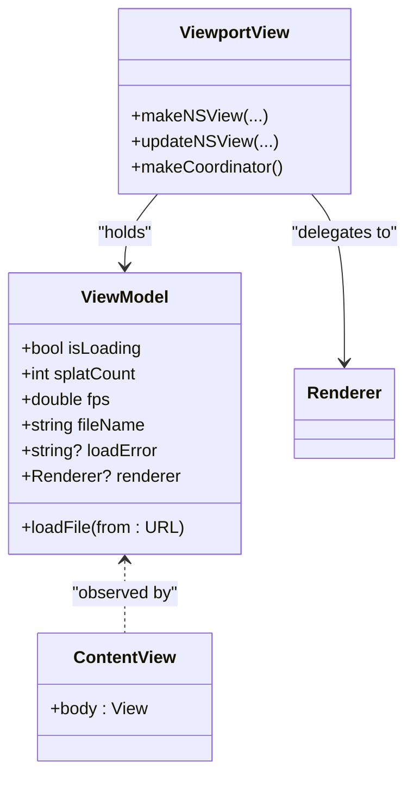
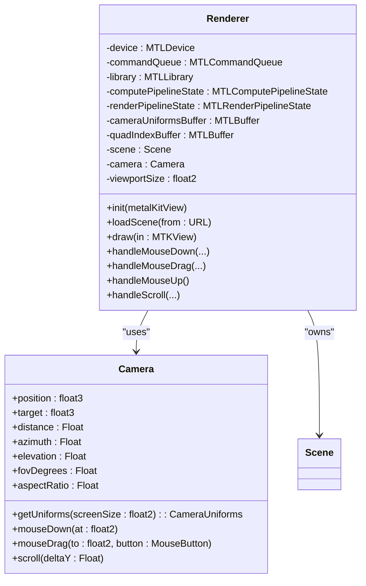
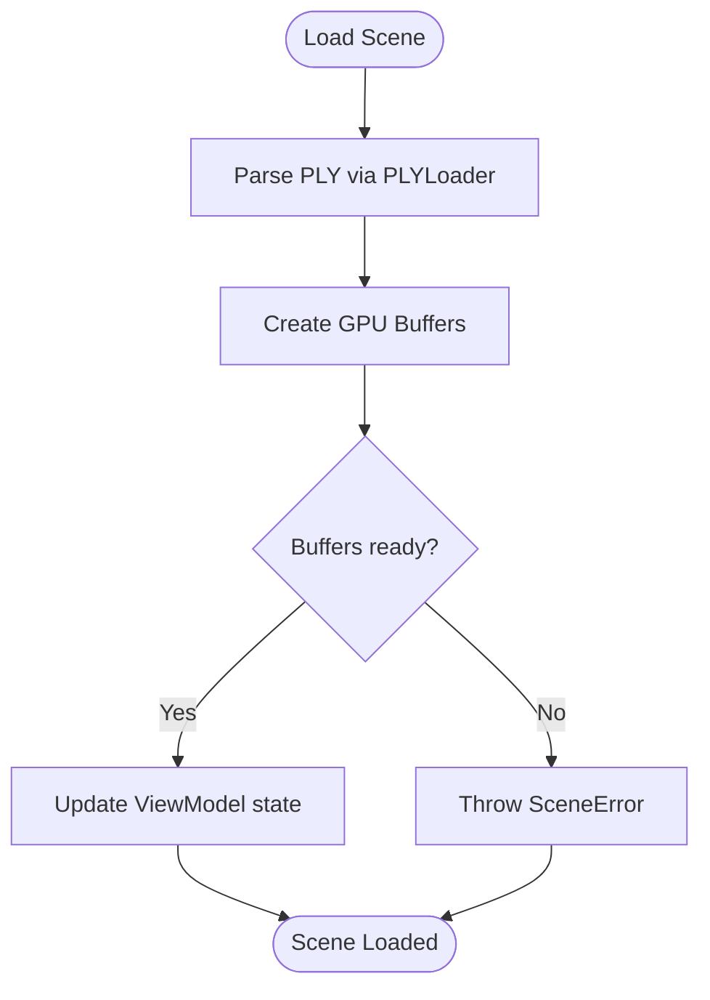
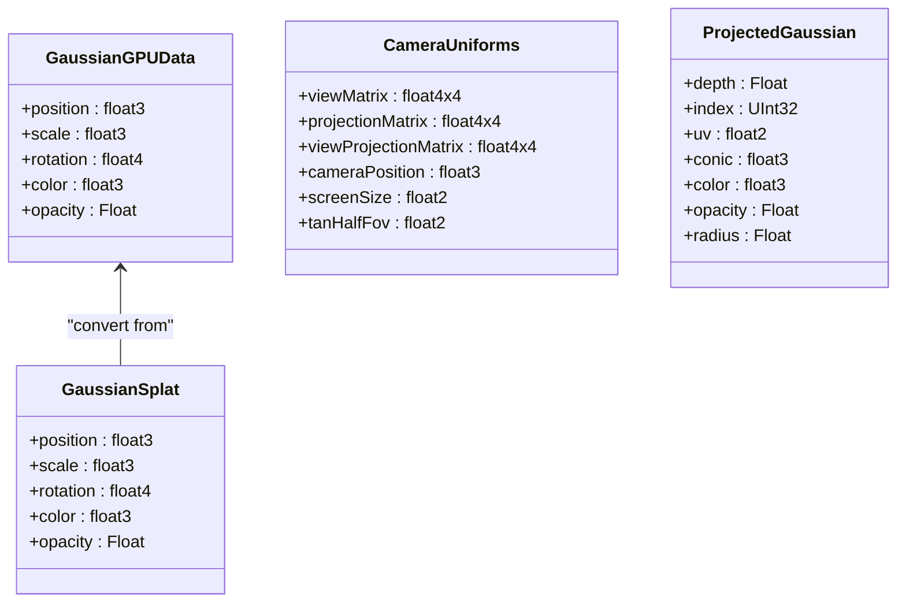
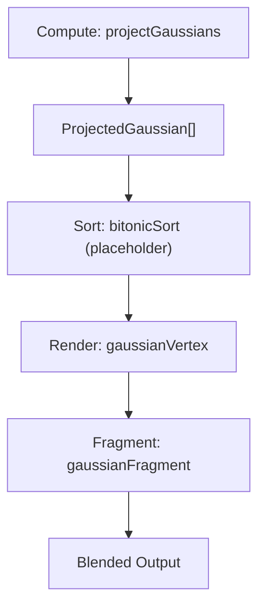
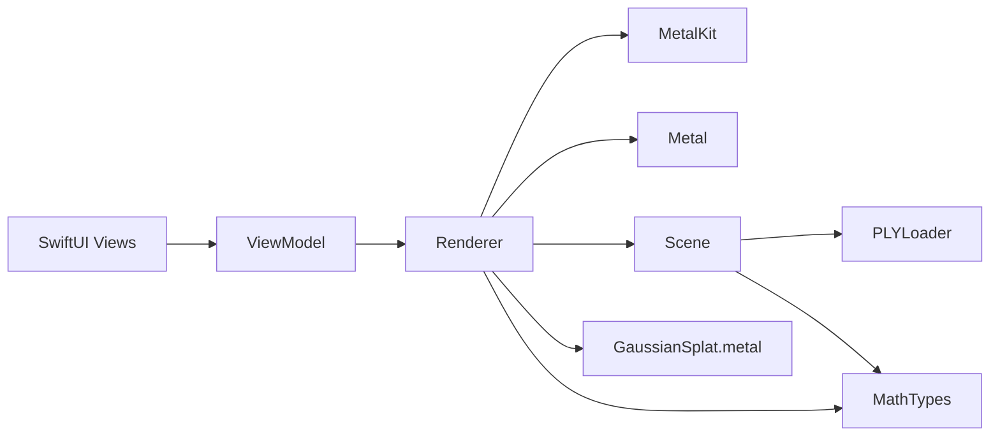

# Architecture Overview

<cite>
**Referenced Files in This Document**
- [GaussianSplatViewerApp.swift](file://GaussianSplatViewer/GaussianSplatViewerApp.swift)
- [ContentView.swift](file://GaussianSplatViewer/ContentView.swift)
- [ViewportView.swift](file://GaussianSplatViewer/UI/ViewportView.swift)
- [ViewModel.swift](file://GaussianSplatViewer/UI/ViewportView.swift)
- [Renderer.swift](file://GaussianSplatViewer/Rendering/Renderer.swift)
- [Camera.swift](file://GaussianSplatViewer/Rendering/Camera.swift)
- [Scene.swift](file://GaussianSplatViewer/Scene/Scene.swift)
- [PLYLoader.swift](file://GaussianSplatViewer/Scene/PLYLoader.swift)
- [MathTypes.swift](file://GaussianSplatViewer/Math/MathTypes.swift)
- [GaussianSplat.metal](file://GaussianSplatViewer/Shaders/GaussianSplat.metal)
</cite>

## Table of Contents
1. [Introduction](#introduction)
2. [Project Structure](#project-structure)
3. [Core Components](#core-components)
4. [Architecture Overview](#architecture-overview)
5. [Detailed Component Analysis](#detailed-component-analysis)
6. [Dependency Analysis](#dependency-analysis)
7. [Performance Considerations](#performance-considerations)
8. [Troubleshooting Guide](#troubleshooting-guide)
9. [Conclusion](#conclusion)

## Introduction
This document describes the Gaussian Splat Viewer system architecture with a focus on modular separation of concerns, GPU-centric rendering using Metal, and the MVVM pattern implemented with SwiftUI. The system is composed of:
- UI layer (SwiftUI) for user interaction and presentation
- Rendering engine (Metal) for compute, sorting, and rasterization
- Scene management for data loading and GPU resource lifecycle
- Mathematical utilities for 3D transforms, projections, and covariance computation

The rendering pipeline follows compute → sort → render stages, driven by a Metal compute shader and Metal shaders for vertex and fragment stages. The MVVM pattern is implemented with an ObservableObject ViewModel coordinating UI and Renderer.

## Project Structure
The project is organized into clear modules:
- UI: SwiftUI views and ViewModel for MVVM
- Rendering: Renderer, Camera, and Metal integration
- Scene: Scene management and PLY file loading
- Math: GPU-compatible data structures and math utilities
- Shaders: Metal compute and fragment shaders

**Diagram sources**
- [ContentView.swift:1-130](file://GaussianSplatViewer/ContentView.swift#L1-L130)
- [ViewportView.swift:1-185](file://GaussianSplatViewer/UI/ViewportView.swift#L1-L185)
- [Renderer.swift:1-288](file://GaussianSplatViewer/Rendering/Renderer.swift#L1-L288)
- [Camera.swift:1-184](file://GaussianSplatViewer/Rendering/Camera.swift#L1-L184)
- [Scene.swift:1-140](file://GaussianSplatViewer/Scene/Scene.swift#L1-L140)
- [PLYLoader.swift:1-403](file://GaussianSplatViewer/Scene/PLYLoader.swift#L1-L403)
- [MathTypes.swift:1-189](file://GaussianSplatViewer/Math/MathTypes.swift#L1-L189)
- [GaussianSplat.metal:1-309](file://GaussianSplatViewer/Shaders/GaussianSplat.metal#L1-L309)

**Section sources**
- [GaussianSplatViewerApp.swift:1-18](file://GaussianSplatViewer/GaussianSplatViewer/GaussianSplatViewerApp.swift#L1-L18)
- [ContentView.swift:1-130](file://GaussianSplatViewer/ContentView.swift#L1-L130)
- [ViewportView.swift:1-185](file://GaussianSplatViewer/UI/ViewportView.swift#L1-L185)
- [Renderer.swift:1-288](file://GaussianSplatViewer/Rendering/Renderer.swift#L1-L288)
- [Scene.swift:1-140](file://GaussianSplatViewer/Scene/Scene.swift#L1-L140)
- [PLYLoader.swift:1-403](file://GaussianSplatViewer/Scene/PLYLoader.swift#L1-L403)
- [MathTypes.swift:1-189](file://GaussianSplatViewer/Math/MathTypes.swift#L1-L189)
- [GaussianSplat.metal:1-309](file://GaussianSplatViewer/Shaders/GaussianSplat.metal#L1-L309)

## Core Components
- Application entry point: App that hosts a WindowGroup containing ContentView
- UI layer: ContentView orchestrates toolbar, viewport, overlays, and file import; ViewModel exposes observable state and coordinates loading
- Viewport bridge: ViewportView wraps MTKView and delegates input to Renderer via Coordinator
- Renderer: MTKViewDelegate that manages Metal pipelines, buffers, compute dispatch, and draw calls
- Camera: Orbit camera with spherical coordinates and matrix generation
- Scene: Manages CPU and GPU data for splats, creates GPU buffers, computes bounding stats
- Loader: PLYLoader parses ASCII/binary PLY vertex data into GaussianSplat instances
- Math: GPU-compatible structures and SIMD-based math for matrices, quaternions, covariance

**Section sources**
- [GaussianSplatViewerApp.swift:10-17](file://GaussianSplatViewer/GaussianSplatViewer/GaussianSplatViewerApp.swift#L10-L17)
- [ContentView.swift:4-125](file://GaussianSplatViewer/ContentView.swift#L4-L125)
- [ViewportView.swift:6-90](file://GaussianSplatViewer/UI/ViewportView.swift#L6-L90)
- [Renderer.swift:7-77](file://GaussianSplatViewer/Rendering/Renderer.swift#L7-L77)
- [Camera.swift:5-60](file://GaussianSplatViewer/Rendering/Camera.swift#L5-L60)
- [Scene.swift:6-28](file://GaussianSplatViewer/Scene/Scene.swift#L6-L28)
- [PLYLoader.swift:13-68](file://GaussianSplatViewer/Scene/PLYLoader.swift#L13-L68)
- [MathTypes.swift:12-73](file://GaussianSplatViewer/Math/MathTypes.swift#L12-L73)

## Architecture Overview
The system follows a GPU-centric rendering pipeline:
- File loading: PLYLoader reads and parses Gaussian splat data
- Scene preparation: Scene constructs GPU buffers and metadata
- Compute stage: Metal compute shader projects splats to screen space and prepares per-splat data
- Sort stage: Depth sorting is planned (bitonic sort kernel present) to improve blending quality
- Render stage: Vertex and fragment shaders draw instanced quads per splat with alpha blending

**Diagram sources**
- [ContentView.swift:110-124](file://GaussianSplatViewer/ContentView.swift#L110-L124)
- [ViewportView.swift:151-183](file://GaussianSplatViewer/UI/ViewportView.swift#L151-L183)
- [Renderer.swift:147-157](file://GaussianSplatViewer/Rendering/Renderer.swift#L147-L157)
- [Scene.swift:31-55](file://GaussianSplatViewer/Scene/Scene.swift#L31-L55)
- [PLYLoader.swift:42-68](file://GaussianSplatViewer/Scene/PLYLoader.swift#L42-L68)
- [Renderer.swift:166-250](file://GaussianSplatViewer/Rendering/Renderer.swift#L166-L250)
- [GaussianSplat.metal:138-201](file://GaussianSplatViewer/Shaders/GaussianSplat.metal#L138-L201)

## Detailed Component Analysis

### MVVM Pattern Implementation
- Model: GaussianSplat and GPU-compatible structures in MathTypes
- View: ContentView composes toolbar, viewport, overlays, and instructions
- ViewModel: ViewModel holds observable state (isLoading, splatCount, fps, fileName, loadError) and coordinates file loading and Renderer access
- View binding: SwiftUI observes ViewModel published properties and triggers re-render

**Diagram sources**
- [ViewModel.swift:142-184](file://GaussianSplatViewer/UI/ViewportView.swift#L142-L184)
- [ContentView.swift:4-125](file://GaussianSplatViewer/ContentView.swift#L4-L125)
- [ViewportView.swift:6-90](file://GaussianSplatViewer/UI/ViewportView.swift#L6-L90)

**Section sources**
- [ContentView.swift:4-125](file://GaussianSplatViewer/ContentView.swift#L4-L125)
- [ViewportView.swift:142-184](file://GaussianSplatViewer/UI/ViewportView.swift#L142-L184)

### Rendering Engine (Metal)
- Device and pipeline creation: Renderer initializes MTLDevice, command queue, MTLLibrary, and pipelines
- Compute pipeline: projectGaussians Metal compute function
- Render pipeline: gaussianVertex and gaussianFragment shaders
- Buffers: Camera uniforms (triply-buffered), quad indices, splat and projected buffers
- Draw loop: compute → sort placeholder → render with instanced triangles

**Diagram sources**
- [Renderer.swift:7-77](file://GaussianSplatViewer/Rendering/Renderer.swift#L7-L77)
- [Camera.swift:5-60](file://GaussianSplatViewer/Rendering/Camera.swift#L5-L60)
- [Renderer.swift:166-250](file://GaussianSplatViewer/Rendering/Renderer.swift#L166-L250)

**Section sources**
- [Renderer.swift:7-77](file://GaussianSplatViewer/Rendering/Renderer.swift#L7-L77)
- [Renderer.swift:166-250](file://GaussianSplatViewer/Rendering/Renderer.swift#L166-L250)
- [Camera.swift:134-147](file://GaussianSplatViewer/Rendering/Camera.swift#L134-L147)

### Scene Management
- Loading: Scene.load(from:) delegates to PLYLoader and creates GPU buffers
- GPU resources: splatBuffer (per-splat GPU data), projectedBuffer (compute output), indexBuffer (sorting)
- Stats: boundingBox(), center, radius computed from splat positions
- Error handling: SceneError enumerates buffer creation and empty scene errors

**Diagram sources**
- [Scene.swift:31-95](file://GaussianSplatViewer/Scene/Scene.swift#L31-L95)
- [PLYLoader.swift:42-68](file://GaussianSplatViewer/Scene/PLYLoader.swift#L42-L68)

**Section sources**
- [Scene.swift:31-95](file://GaussianSplatViewer/Scene/Scene.swift#L31-L95)
- [PLYLoader.swift:42-68](file://GaussianSplatViewer/Scene/PLYLoader.swift#L42-L68)

### Mathematical Utilities
- GPU-compatible structures: GaussianGPUData, CameraUniforms, ProjectedGaussian
- Quaternions: conversion to rotation matrix, normalization
- Matrices: lookAt, perspective, translation, scale, extraction helpers
- Covariance: 3D covariance from scale and rotation; 2D projection for rendering

**Diagram sources**
- [MathTypes.swift:12-73](file://GaussianSplatViewer/Math/MathTypes.swift#L12-L73)
- [MathTypes.swift:76-101](file://GaussianSplatViewer/Math/MathTypes.swift#L76-L101)
- [MathTypes.swift:104-167](file://GaussianSplatViewer/Math/MathTypes.swift#L104-L167)
- [MathTypes.swift:170-188](file://GaussianSplatViewer/Math/MathTypes.swift#L170-L188)

**Section sources**
- [MathTypes.swift:12-73](file://GaussianSplatViewer/Math/MathTypes.swift#L12-L73)
- [MathTypes.swift:76-101](file://GaussianSplatViewer/Math/MathTypes.swift#L76-L101)
- [MathTypes.swift:104-167](file://GaussianSplatViewer/Math/MathTypes.swift#L104-L167)
- [MathTypes.swift:170-188](file://GaussianSplatViewer/Math/MathTypes.swift#L170-L188)

### Rendering Pipeline Architecture
- Compute: projectGaussians computes 3D covariance, projects to 2D, builds conic matrices, and writes ProjectedGaussian
- Sort: bitonicSort kernel is present for depth sorting (placeholder in Renderer)
- Render: gaussianVertex generates quad vertices per instance; gaussianFragment evaluates 2D Gaussian and applies premultiplied alpha

**Diagram sources**
- [GaussianSplat.metal:138-201](file://GaussianSplatViewer/Shaders/GaussianSplat.metal#L138-L201)
- [GaussianSplat.metal:274-308](file://GaussianSplatViewer/Shaders/GaussianSplat.metal#L274-L308)
- [GaussianSplat.metal:205-241](file://GaussianSplatViewer/Shaders/GaussianSplat.metal#L205-L241)
- [GaussianSplat.metal:245-270](file://GaussianSplatViewer/Shaders/GaussianSplat.metal#L245-L270)
- [Renderer.swift:186-217](file://GaussianSplatViewer/Rendering/Renderer.swift#L186-L217)

**Section sources**
- [GaussianSplat.metal:138-201](file://GaussianSplatViewer/Shaders/GaussianSplat.metal#L138-L201)
- [GaussianSplat.metal:274-308](file://GaussianSplatViewer/Shaders/GaussianSplat.metal#L274-L308)
- [GaussianSplat.metal:205-241](file://GaussianSplatViewer/Shaders/GaussianSplat.metal#L205-L241)
- [GaussianSplat.metal:245-270](file://GaussianSplatViewer/Shaders/GaussianSplat.metal#L245-L270)
- [Renderer.swift:186-217](file://GaussianSplatViewer/Rendering/Renderer.swift#L186-L217)

## Dependency Analysis
Key dependencies and integration points:
- SwiftUI depends on ObservableObject ViewModel for reactive updates
- ViewportView bridges SwiftUI to MetalKit via NSViewRepresentable and Coordinator
- Renderer depends on MetalKit (MTKViewDelegate), Metal (MTLDevice, MTLCommandQueue, MTLLibrary), and simd
- Scene depends on Metal and PLYLoader
- MathTypes provides GPU-compatible structures and SIMD math used across Renderer and shaders
- Shaders depend on Metal headers and share structures with host code

**Diagram sources**
- [ViewportView.swift:6-90](file://GaussianSplatViewer/UI/ViewportView.swift#L6-L90)
- [Renderer.swift:7-77](file://GaussianSplatViewer/Rendering/Renderer.swift#L7-L77)
- [Scene.swift:31-55](file://GaussianSplatViewer/Scene/Scene.swift#L31-L55)
- [MathTypes.swift:1-3](file://GaussianSplatViewer/Math/MathTypes.swift#L1-L3)
- [GaussianSplat.metal:1-3](file://GaussianSplatViewer/Shaders/GaussianSplat.metal#L1-L3)

**Section sources**
- [ViewportView.swift:6-90](file://GaussianSplatViewer/UI/ViewportView.swift#L6-L90)
- [Renderer.swift:7-77](file://GaussianSplatViewer/Rendering/Renderer.swift#L7-L77)
- [Scene.swift:31-55](file://GaussianSplatViewer/Scene/Scene.swift#L31-L55)
- [MathTypes.swift:1-3](file://GaussianSplatViewer/Math/MathTypes.swift#L1-L3)
- [GaussianSplat.metal:1-3](file://GaussianSplatViewer/Shaders/GaussianSplat.metal#L1-L3)

## Performance Considerations
- Triple-buffered camera uniforms reduce CPU/GPU synchronization stalls
- Compute dispatch sized to splat count with 256-wide thread groups
- Alpha blending enabled for correct splat compositing
- Depth sorting is configured to run periodically to balance quality and cost
- GPU buffers use appropriate storage modes (shared/private) for data locality

[No sources needed since this section provides general guidance]

## Troubleshooting Guide
Common issues and diagnostics:
- Metal library load failures: Renderer prints failure messages when MTLLibrary creation fails
- Compute pipeline creation: Renderer prints errors if compute function is missing
- Buffer creation: Scene throws SceneError.failedToCreateBuffer when GPU buffer allocation fails
- PLY parsing: PLYLoaderError enumerates invalid headers, unsupported formats, and parse errors
- Command buffer errors: Renderer logs Metal command buffer failures on completion handler

**Section sources**
- [Renderer.swift:47-53](file://GaussianSplatViewer/Rendering/Renderer.swift#L47-L53)
- [Renderer.swift:82-92](file://GaussianSplatViewer/Rendering/Renderer.swift#L82-L92)
- [Scene.swift:70-85](file://GaussianSplatViewer/Scene/Scene.swift#L70-L85)
- [PLYLoader.swift:4-10](file://GaussianSplatViewer/Scene/PLYLoader.swift#L4-L10)
- [Renderer.swift:243-247](file://GaussianSplatViewer/Rendering/Renderer.swift#L243-L247)

## Conclusion
The Gaussian Splat Viewer employs a clean modular architecture with clear separation between UI, rendering, scene management, and math utilities. The MVVM pattern with SwiftUI ensures responsive UI updates, while the Metal-based rendering pipeline delivers GPU-accelerated projection, sorting, and rasterization. The system integrates tightly with Apple’s frameworks (SwiftUI, MetalKit, Metal) and is structured for extensibility, maintainability, and high-performance 3D rendering.