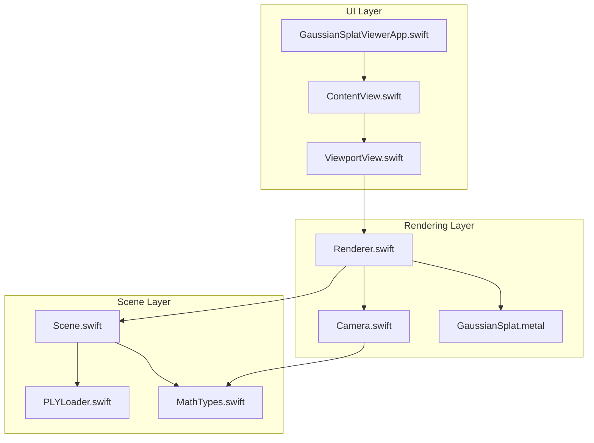
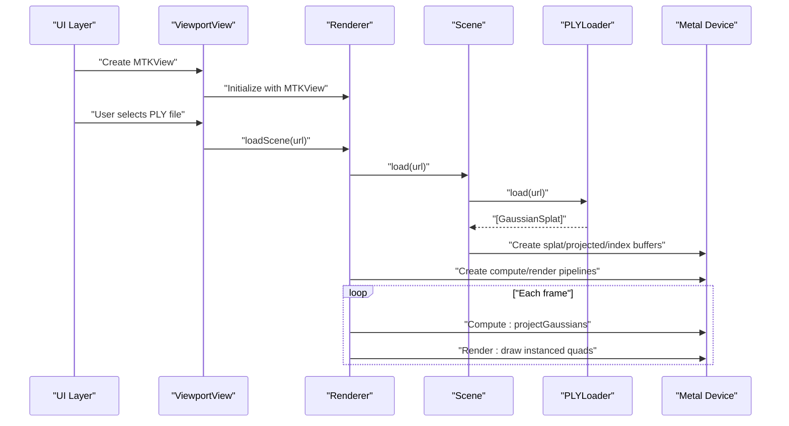
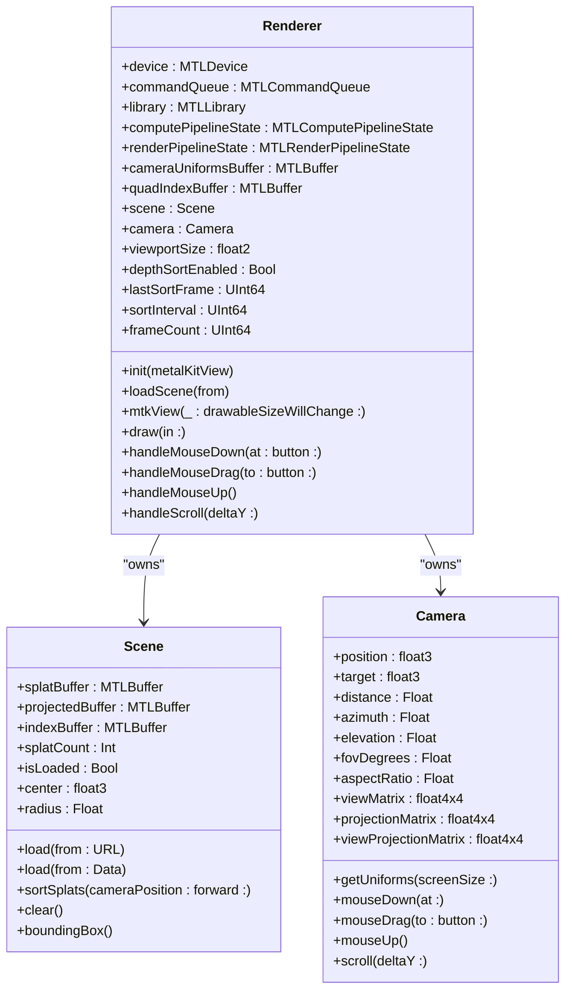
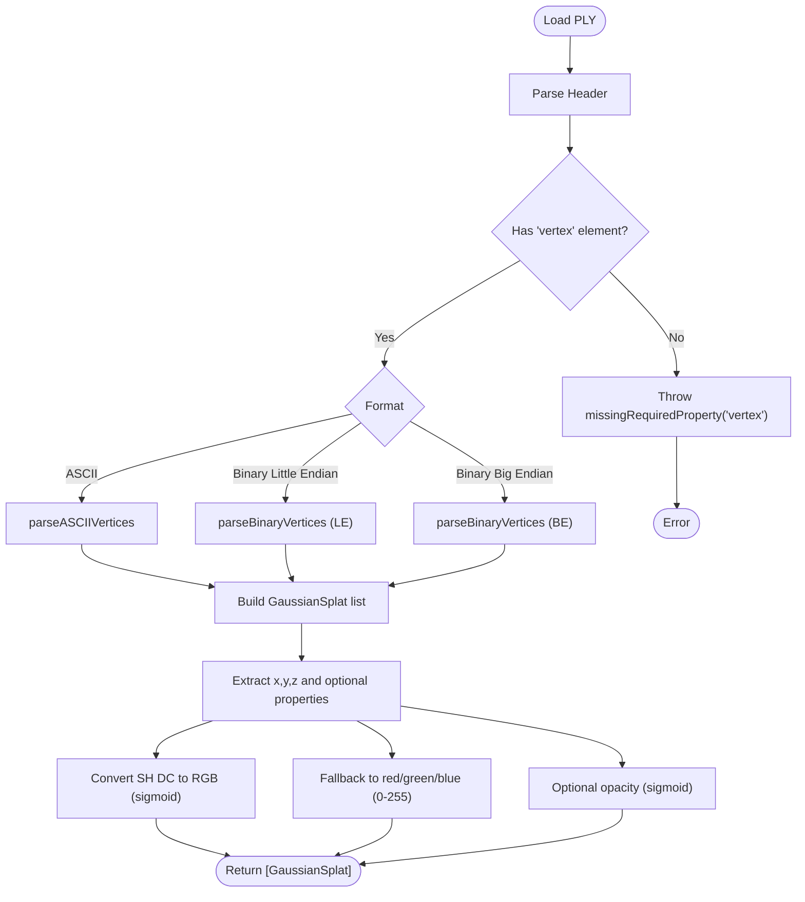
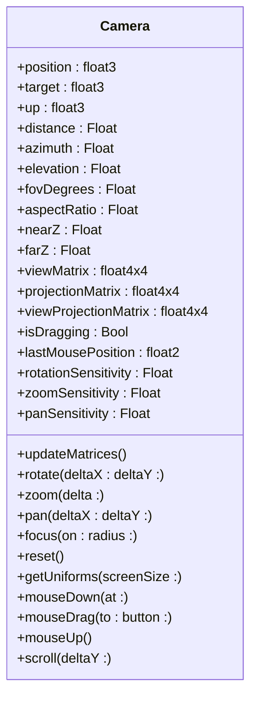
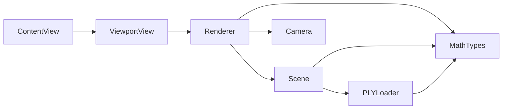

# Core Components

<cite>
**Referenced Files in This Document**
- [Renderer.swift](file://Rendering/Renderer.swift)
- [Scene.swift](file://Scene/Scene.swift)
- [PLYLoader.swift](file://Scene/PLYLoader.swift)
- [Camera.swift](file://Rendering/Camera.swift)
- [MathTypes.swift](file://Math/MathTypes.swift)
- [GaussianSplat.metal](file://Shaders/GaussianSplat.metal)
- [ContentView.swift](file://UI/ContentView.swift)
- [ViewportView.swift](file://UI/ViewportView.swift)
- [GaussianSplatViewerApp.swift](file://GaussianSplatViewerApp.swift)
- [GaussianSplatViewerTests.swift](file://GaussianSplatViewerTests/GaussianSplatViewerTests.swift)
</cite>

## Table of Contents
1. [Introduction](#introduction)
2. [Project Structure](#project-structure)
3. [Core Components](#core-components)
4. [Architecture Overview](#architecture-overview)
5. [Detailed Component Analysis](#detailed-component-analysis)
6. [Dependency Analysis](#dependency-analysis)
7. [Performance Considerations](#performance-considerations)
8. [Troubleshooting Guide](#troubleshooting-guide)
9. [Conclusion](#conclusion)
10. [Appendices](#appendices)

## Introduction
This document describes the core components of the Gaussian Splat Viewer, focusing on the rendering engine, scene management, PLY loader, camera system, and their interactions. It explains Metal integration, compute pipeline usage, render pass management, GPU buffer allocation, data loading, resource management, coordinate transformations, and the application lifecycle. It also covers error handling and recovery mechanisms, and outlines the public interfaces and key methods exposed by each component.

## Project Structure
The project is organized around four primary domains:
- Rendering: Metal-based renderer, camera, and shaders
- Scene: Scene graph abstraction, GPU buffers, and PLY loader
- UI: SwiftUI views and MetalKit viewport integration
- Math: Shared math types and GPU-compatible structures

**Diagram sources**
- [Renderer.swift:1-289](file://Rendering/Renderer.swift#L1-L289)
- [Scene.swift:1-158](file://Scene/Scene.swift#L1-L158)
- [PLYLoader.swift:1-403](file://Scene/PLYLoader.swift#L1-L403)
- [Camera.swift:1-184](file://Rendering/Camera.swift#L1-L184)
- [MathTypes.swift:1-189](file://Math/MathTypes.swift#L1-L189)
- [GaussianSplat.metal:1-317](file://Shaders/GaussianSplat.metal#L1-L317)
- [ContentView.swift:1-130](file://UI/ContentView.swift#L1-L130)
- [ViewportView.swift:1-185](file://UI/ViewportView.swift#L1-L185)
- [GaussianSplatViewerApp.swift:1-13](file://GaussianSplatViewerApp.swift#L1-L13)

**Section sources**
- [Renderer.swift:1-289](file://Rendering/Renderer.swift#L1-L289)
- [Scene.swift:1-158](file://Scene/Scene.swift#L1-L158)
- [PLYLoader.swift:1-403](file://Scene/PLYLoader.swift#L1-L403)
- [Camera.swift:1-184](file://Rendering/Camera.swift#L1-L184)
- [MathTypes.swift:1-189](file://Math/MathTypes.swift#L1-L189)
- [GaussianSplat.metal:1-317](file://Shaders/GaussianSplat.metal#L1-L317)
- [ContentView.swift:1-130](file://UI/ContentView.swift#L1-L130)
- [ViewportView.swift:1-185](file://UI/ViewportView.swift#L1-L185)
- [GaussianSplatViewerApp.swift:1-13](file://GaussianSplatViewerApp.swift#L1-L13)

## Core Components
This section documents the main components and their responsibilities.

- Renderer: Initializes Metal device, creates pipelines, manages buffers, orchestrates compute and render passes, handles camera updates, and exposes camera control methods.
- Scene: Loads Gaussian splats from PLY, allocates GPU buffers, maintains CPU-side splat data, sorts splats for depth blending, and computes scene bounds.
- PLYLoader: Parses PLY headers and vertex data, supports ASCII and binary little/big endian formats, extracts Gaussian properties, and converts to internal structures.
- Camera: Implements orbit navigation, mouse controls, coordinate transformations, and provides GPU uniform structures.
- MathTypes: Defines shared data structures and math helpers used across components.
- UI: Integrates Metal viewport, handles user input, and coordinates loading and display.

**Section sources**
- [Renderer.swift:6-289](file://Rendering/Renderer.swift#L6-L289)
- [Scene.swift:5-158](file://Scene/Scene.swift#L5-L158)
- [PLYLoader.swift:12-403](file://Scene/PLYLoader.swift#L12-L403)
- [Camera.swift:4-184](file://Rendering/Camera.swift#L4-L184)
- [MathTypes.swift:4-189](file://Math/MathTypes.swift#L4-L189)
- [GaussianSplat.metal:1-317](file://Shaders/GaussianSplat.metal#L1-L317)
- [ViewportView.swift:1-185](file://UI/ViewportView.swift#L1-L185)
- [ContentView.swift:1-130](file://UI/ContentView.swift#L1-L130)

## Architecture Overview
The system follows a layered architecture:
- UI layer constructs the viewport and delegates input to the renderer.
- Renderer manages Metal device, pipelines, buffers, and draws Gaussian splats.
- Scene encapsulates data and GPU resources, exposing sorted splats and bounds.
- PLYLoader parses external data into internal structures.
- Camera provides view/projection matrices and uniforms for GPU.

**Diagram sources**
- [ViewportView.swift:18-21](file://UI/ViewportView.swift#L18-L21)
- [Renderer.swift:38-77](file://Rendering/Renderer.swift#L38-L77)
- [Scene.swift:31-55](file://Scene/Scene.swift#L31-L55)
- [PLYLoader.swift:42-68](file://Scene/PLYLoader.swift#L42-L68)
- [Renderer.swift:167-251](file://Rendering/Renderer.swift#L167-L251)

## Detailed Component Analysis

### Renderer
Responsibilities:
- Initialize Metal device, command queue, and shader library.
- Create compute and render pipelines using Metal functions.
- Manage camera uniforms buffer (tripled-buffered), quad index buffer, and viewport size.
- Load scenes, update camera uniforms, and drive the frame loop.
- Handle camera input events and delegate to Camera.

Key methods and behaviors:
- Initialization: Creates device, sets MTKView properties, builds pipelines, and initializes Scene.
- Pipeline creation: Compiles compute and render functions and sets up blending.
- Buffer management: Allocates camera uniforms and quad indices.
- Scene loading: Delegates to Scene, focuses camera, triggers initial sort.
- Frame loop: Updates camera uniforms, sorts splats periodically, dispatches compute encoder, renders instanced quads, and presents.
- Camera controls: Exposes mouse down/drag/up and scroll handlers.

Public interface highlights:
- Initializer: [Renderer.init(metalKitView:):38-77](file://Rendering/Renderer.swift#L38-L77)
- Scene loading: [Renderer.loadScene(from:):147-158](file://Rendering/Renderer.swift#L147-L158)
- MTKViewDelegate: [Renderer.mtkView(_:drawableSizeWillChange:):162-165](file://Rendering/Renderer.swift#L162-L165), [Renderer.draw(in:):167-251](file://Rendering/Renderer.swift#L167-L251)
- Camera controls: [Renderer.handleMouseDown(at:button:):271-274](file://Rendering/Renderer.swift#L271-L274), [Renderer.handleMouseDrag(to:button:):276-279](file://Rendering/Renderer.swift#L276-L279), [Renderer.handleMouseUp():281-283](file://Rendering/Renderer.swift#L281-L283), [Renderer.handleScroll(deltaY:):285-287](file://Rendering/Renderer.swift#L285-L287)

Metal integration details:
- Device and command queue: [Renderer.device, Renderer.commandQueue:8-9](file://Rendering/Renderer.swift#L8-L9)
- Library and functions: [Renderer.library:47-53](file://Rendering/Renderer.swift#L47-L53), [projectGaussians:146-209](file://Shaders/GaussianSplat.metal#L146-L209), [gaussianVertex:213-249](file://Shaders/GaussianSplat.metal#L213-L249), [gaussianFragment:253-278](file://Shaders/GaussianSplat.metal#L253-L278)
- Compute pipeline: [Renderer.createComputePipeline():81-93](file://Rendering/Renderer.swift#L81-L93)
- Render pipeline: [Renderer.createRenderPipeline():95-127](file://Rendering/Renderer.swift#L95-L127)
- Render pass: Uses MTKView’s current render pass descriptor and presents drawable.

Depth sorting:
- Enabled by default and triggered every fixed interval frames.
- Calls Scene.sortSplats(...) and updates GPU buffer.

Error handling:
- Prints errors for pipeline creation failures and Metal command buffer failures.
- Returns early when required resources are missing.

**Section sources**
- [Renderer.swift:6-289](file://Rendering/Renderer.swift#L6-L289)
- [GaussianSplat.metal:146-278](file://Shaders/GaussianSplat.metal#L146-L278)

#### Renderer Class Diagram

**Diagram sources**
- [Renderer.swift:7-289](file://Rendering/Renderer.swift#L7-L289)
- [Scene.swift:6-158](file://Scene/Scene.swift#L6-L158)
- [Camera.swift:5-184](file://Rendering/Camera.swift#L5-L184)

### Scene
Responsibilities:
- Load Gaussian splats from PLY via PLYLoader.
- Allocate GPU buffers for splat data, projected data, and indices.
- Maintain CPU-side splat array and expose state.
- Sort splats for depth blending and update GPU buffer.
- Compute bounding box and radius for camera framing.

Key methods and behaviors:
- Loading: [Scene.load(from:URL):31-42](file://Scene/Scene.swift#L31-L42), [Scene.load(from:Data):45-55](file://Scene/Scene.swift#L45-L55)
- GPU resource creation: [Scene.createGPUResources(for:):58-95](file://Scene/Scene.swift#L58-L95)
- Sorting: [Scene.sortSplats(cameraPosition:forward:):106-121](file://Scene/Scene.swift#L106-L121)
- Bounds: [Scene.boundingBox():124-138](file://Scene/Scene.swift#L124-L138), [Scene.center:141-144](file://Scene/Scene.swift#L141-L144), [Scene.radius:146-151](file://Scene/Scene.swift#L146-L151)

GPU buffer allocation:
- Splats buffer: [Scene.splatBuffer:13-14](file://Scene/Scene.swift#L13-L14)
- Projected buffer: [Scene.projectedBuffer:14-15](file://Scene/Scene.swift#L14-L15)
- Index buffer: [Scene.indexBuffer:15-16](file://Scene/Scene.swift#L15-L16)

Error handling:
- Throws [SceneError.failedToCreateBuffer:154-157](file://Scene/Scene.swift#L154-L157) when buffer creation fails.
- Throws [SceneError.noSplatsLoaded:149-150](file://Scene/Scene.swift#L149-L150) when attempting to load without a Scene instance.

**Section sources**
- [Scene.swift:5-158](file://Scene/Scene.swift#L5-L158)
- [PLYLoader.swift:42-68](file://Scene/PLYLoader.swift#L42-L68)

### PLY Loader
Responsibilities:
- Parse PLY headers and elements.
- Support ASCII and binary little/big endian formats.
- Extract Gaussian properties (position, scales, rotations, colors, opacity).
- Convert SH DC coefficients to RGB and apply sigmoid activation.
- Provide fallbacks for missing properties.

Key parsing logic:
- Header parsing: [PLYLoader.parseHeader(_:):72-158](file://Scene/PLYLoader.swift#L72-L158)
- ASCII vertex parsing: [PLYLoader.parseASCIIVertices(_:headerEnd:element:):162-204](file://Scene/PLYLoader.swift#L162-L204)
- Binary vertex parsing: [PLYLoader.parseBinaryVertices(_:headerEnd:element:bigEndian:):208-317](file://Scene/PLYLoader.swift#L208-L317)
- Vertex extraction: [PLYLoader.parseVertex(values:propertyMap:):321-385](file://Scene/PLYLoader.swift#L321-L385)

Supported property types:
- Numeric types mapped to Float: [PLYLoader.sizeOfType(_:):389-397](file://Scene/PLYLoader.swift#L389-L397)
- Sigmoid activation: [PLYLoader.sigmoid(_:):399-401](file://Scene/PLYLoader.swift#L399-L401)

Error handling:
- [PLYLoaderError.fileNotFound:5-10](file://Scene/PLYLoader.swift#L5-L10), [PLYLoaderError.invalidHeader:5-10](file://Scene/PLYLoader.swift#L5-L10), [PLYLoaderError.unsupportedFormat:5-10](file://Scene/PLYLoader.swift#L5-L10), [PLYLoaderError.parseError(_:):5-10](file://Scene/PLYLoader.swift#L5-L10), [PLYLoaderError.missingRequiredProperty(_:):5-10](file://Scene/PLYLoader.swift#L5-L10)

**Section sources**
- [PLYLoader.swift:12-403](file://Scene/PLYLoader.swift#L12-L403)

#### PLY Loader Flowchart

**Diagram sources**
- [PLYLoader.swift:42-68](file://Scene/PLYLoader.swift#L42-L68)
- [PLYLoader.swift:72-158](file://Scene/PLYLoader.swift#L72-L158)
- [PLYLoader.swift:162-204](file://Scene/PLYLoader.swift#L162-L204)
- [PLYLoader.swift:208-317](file://Scene/PLYLoader.swift#L208-L317)
- [PLYLoader.swift:321-385](file://Scene/PLYLoader.swift#L321-L385)

### Camera
Responsibilities:
- Orbit navigation with spherical coordinates.
- Mouse-driven rotation, pan, and zoom.
- Matrix computation for view, projection, and combined transforms.
- Provide GPU uniforms for rendering.

Key methods and behaviors:
- Initialization and matrix updates: [Camera.updateMatrices():63-84](file://Rendering/Camera.swift#L63-L84)
- Rotation: [Camera.rotate(deltaX:deltaY:):87-96](file://Rendering/Camera.swift#L87-L96)
- Zoom: [Camera.zoom(delta:):99-103](file://Rendering/Camera.swift#L99-L103)
- Pan: [Camera.pan(deltaX:deltaY:):106-115](file://Rendering/Camera.swift#L106-L115)
- Focus and reset: [Camera.focus(on:radius:):118-122](file://Rendering/Camera.swift#L118-L122), [Camera.reset():125-131](file://Rendering/Camera.swift#L125-L131)
- Input handling: [Camera.mouseDown(at:):150-153](file://Rendering/Camera.swift#L150-L153), [Camera.mouseDrag(to:button:):156-166](file://Rendering/Camera.swift#L156-L166), [Camera.mouseUp():169-171](file://Rendering/Camera.swift#L169-L171), [Camera.scroll(deltaY:):174-176](file://Rendering/Camera.swift#L174-L176)
- GPU uniforms: [Camera.getUniforms(screenSize:):134-147](file://Rendering/Camera.swift#L134-L147)

Coordinate transformations:
- Spherical to Cartesian conversion for position.
- Look-at and perspective matrix construction.
- Forward/right/up extraction from matrices.

**Section sources**
- [Camera.swift:4-184](file://Rendering/Camera.swift#L4-L184)
- [MathTypes.swift:104-167](file://Math/MathTypes.swift#L104-L167)

#### Camera Class Diagram

**Diagram sources**
- [Camera.swift:5-184](file://Rendering/Camera.swift#L5-L184)

### Application Lifecycle and Initialization Sequence
- App entry: [GaussianSplatViewerApp:4-11](file://GaussianSplatViewerApp.swift#L4-L11)
- UI composition: [ContentView:4-125](file://UI/ContentView.swift#L4-L125)
- Viewport creation: [ViewportView.makeNSView:9-26](file://UI/ViewportView.swift#L9-L26)
- Renderer initialization: [Renderer.init(metalKitView:):38-77](file://Rendering/Renderer.swift#L38-L77)
- Scene initialization: [Renderer.scene = Scene(device:):76-76](file://Rendering/Renderer.swift#L76-L76)
- Pipeline creation: [Renderer.createComputePipeline():81-93](file://Rendering/Renderer.swift#L81-L93), [Renderer.createRenderPipeline():95-127](file://Rendering/Renderer.swift#L95-L127)
- Buffer creation: [Renderer.createBuffers():129-143](file://Rendering/Renderer.swift#L129-L143)
- First draw: [Renderer.draw(in:):167-251](file://Rendering/Renderer.swift#L167-L251)

**Section sources**
- [GaussianSplatViewerApp.swift:1-13](file://GaussianSplatViewerApp.swift#L1-L13)
- [ContentView.swift:1-130](file://UI/ContentView.swift#L1-L130)
- [ViewportView.swift:1-185](file://UI/ViewportView.swift#L1-L185)
- [Renderer.swift:38-143](file://Rendering/Renderer.swift#L38-L143)

## Dependency Analysis
- Renderer depends on:
  - Metal device and libraries for pipeline creation.
  - Scene for splat data and GPU buffers.
  - Camera for uniforms and matrices.
  - MathTypes for GPU-compatible structures.
- Scene depends on:
  - PLYLoader for data ingestion.
  - MathTypes for Gaussian and matrix types.
- PLYLoader depends on:
  - Foundation for parsing and Data handling.
  - MathTypes for sigmoid and conversions.
- UI depends on:
  - SwiftUI and MetalKit.
  - Renderer for input delegation and drawing.

**Diagram sources**
- [Renderer.swift:7-289](file://Rendering/Renderer.swift#L7-L289)
- [Scene.swift:6-158](file://Scene/Scene.swift#L6-L158)
- [PLYLoader.swift:12-403](file://Scene/PLYLoader.swift#L12-L403)
- [MathTypes.swift:4-189](file://Math/MathTypes.swift#L4-L189)
- [ViewportView.swift:1-185](file://UI/ViewportView.swift#L1-L185)
- [ContentView.swift:1-130](file://UI/ContentView.swift#L1-L130)

**Section sources**
- [Renderer.swift:7-289](file://Rendering/Renderer.swift#L7-L289)
- [Scene.swift:6-158](file://Scene/Scene.swift#L6-L158)
- [PLYLoader.swift:12-403](file://Scene/PLYLoader.swift#L12-L403)
- [MathTypes.swift:4-189](file://Math/MathTypes.swift#L4-L189)
- [ViewportView.swift:1-185](file://UI/ViewportView.swift#L1-L185)
- [ContentView.swift:1-130](file://UI/ContentView.swift#L1-L130)

## Performance Considerations
- Triple-buffered camera uniforms reduce CPU/GPU synchronization stalls.
- Compute shader projects Gaussians in parallel with 256-thread groups.
- Instanced rendering draws a quad per splat with indexed triangles.
- Depth sorting occurs at a fixed interval to balance quality and cost.
- GPU buffers use shared/private storage modes depending on usage.
- Alpha blending enabled for correct compositing.

[No sources needed since this section provides general guidance]

## Troubleshooting Guide
Common issues and recovery mechanisms:
- Metal library load failure: Renderer prints an error and returns nil during initialization. Ensure shaders compile and are bundled.
  - Reference: [Renderer.init(metalKitView:):47-53](file://Rendering/Renderer.swift#L47-L53)
- Compute pipeline creation failure: Renderer prints an error and continues without compute pass. Verify compute function name and shader compilation.
  - Reference: [Renderer.createComputePipeline():81-93](file://Rendering/Renderer.swift#L81-L93)
- Render pipeline creation failure: Renderer prints an error and continues without render pass. Verify vertex/fragment function names and attachment formats.
  - Reference: [Renderer.createRenderPipeline():95-127](file://Rendering/Renderer.swift#L95-L127)
- Buffer creation failure: Scene throws [SceneError.failedToCreateBuffer:154-157](file://Scene/Scene.swift#L154-L157) when GPU buffer allocation fails. Check memory availability and buffer sizes.
  - Reference: [Scene.createGPUResources(for:):58-95](file://Scene/Scene.swift#L58-L95)
- No splats loaded: [SceneError.noSplatsLoaded:149-150](file://Scene/Scene.swift#L149-L150) thrown when attempting to load without a Scene instance. Ensure Scene is initialized before loading.
  - Reference: [Renderer.loadScene(from:):147-150](file://Rendering/Renderer.swift#L147-L150)
- PLY parsing errors: PLYLoaderError variants indicate invalid headers, unsupported formats, or missing properties. Validate PLY file and properties.
  - Reference: [PLYLoaderError:4-10](file://Scene/PLYLoader.swift#L4-L10)
- Metal command buffer errors: Renderer logs completion handler errors for diagnostics.
  - Reference: [Renderer.draw(in:):244-248](file://Rendering/Renderer.swift#L244-L248)

**Section sources**
- [Renderer.swift:47-53](file://Rendering/Renderer.swift#L47-L53)
- [Renderer.swift:81-93](file://Rendering/Renderer.swift#L81-L93)
- [Renderer.swift:95-127](file://Rendering/Renderer.swift#L95-L127)
- [Scene.swift:149-150](file://Scene/Scene.swift#L149-L150)
- [Scene.swift:58-95](file://Scene/Scene.swift#L58-L95)
- [PLYLoader.swift:4-10](file://Scene/PLYLoader.swift#L4-L10)
- [Renderer.swift:244-248](file://Rendering/Renderer.swift#L244-L248)

## Conclusion
The Gaussian Splat Viewer integrates SwiftUI and MetalKit to deliver an interactive viewer for 3D Gaussian splatting scenes. The Renderer coordinates Metal pipelines and GPU buffers, the Scene manages data and resources, the PLYLoader supports multiple encodings, and the Camera provides intuitive navigation. The UI layer connects user input to the renderer and displays loading states and errors. Robust error logging and structured data types enable reliable operation and easy maintenance.

[No sources needed since this section summarizes without analyzing specific files]

## Appendices

### Public Interfaces Summary
- Renderer
  - Initialization: [Renderer.init(metalKitView:):38-77](file://Rendering/Renderer.swift#L38-L77)
  - Scene loading: [Renderer.loadScene(from:):147-158](file://Rendering/Renderer.swift#L147-L158)
  - Drawing: [Renderer.draw(in:):167-251](file://Rendering/Renderer.swift#L167-L251)
  - Camera controls: [Renderer.handleMouseDown(at:button:):271-274](file://Rendering/Renderer.swift#L271-L274), [Renderer.handleMouseDrag(to:button:):276-279](file://Rendering/Renderer.swift#L276-L279), [Renderer.handleMouseUp():281-283](file://Rendering/Renderer.swift#L281-L283), [Renderer.handleScroll(deltaY:):285-287](file://Rendering/Renderer.swift#L285-L287)

- Scene
  - Loading: [Scene.load(from:URL):31-42](file://Scene/Scene.swift#L31-L42), [Scene.load(from:Data):45-55](file://Scene/Scene.swift#L45-L55)
  - Sorting: [Scene.sortSplats(cameraPosition:forward:):106-121](file://Scene/Scene.swift#L106-L121)
  - State: [Scene.isLoaded:19-24](file://Scene/Scene.swift#L19-L24), [Scene.splatCount:18-18](file://Scene/Scene.swift#L18-L18)

- PLYLoader
  - Loading: [PLYLoader.load(from:URL):42-45](file://Scene/PLYLoader.swift#L42-L45), [PLYLoader.load(from:Data):47-48](file://Scene/PLYLoader.swift#L47-L48)
  - Parsing: [PLYLoader.parseHeader(_:):72-158](file://Scene/PLYLoader.swift#L72-L158), [PLYLoader.parseASCIIVertices(_:headerEnd:element:):162-204](file://Scene/PLYLoader.swift#L162-L204), [PLYLoader.parseBinaryVertices(_:headerEnd:element:bigEndian:):208-317](file://Scene/PLYLoader.swift#L208-L317)

- Camera
  - Navigation: [Camera.rotate(deltaX:deltaY:):87-96](file://Rendering/Camera.swift#L87-L96), [Camera.zoom(delta:):99-103](file://Rendering/Camera.swift#L99-L103), [Camera.pan(deltaX:deltaY:):106-115](file://Rendering/Camera.swift#L106-L115)
  - Matrices: [Camera.updateMatrices():63-84](file://Rendering/Camera.swift#L63-L84), [Camera.getUniforms(screenSize:):134-147](file://Rendering/Camera.swift#L134-L147)

- UI
  - Viewport: [ViewportView.makeNSView:9-26](file://UI/ViewportView.swift#L9-L26), [ViewportView.Coodinator:38-89](file://UI/ViewportView.swift#L38-L89)
  - ViewModel: [ViewModel.loadFile(from:):151-183](file://UI/ViewportView.swift#L151-L183)

**Section sources**
- [Renderer.swift:38-289](file://Rendering/Renderer.swift#L38-L289)
- [Scene.swift:31-158](file://Scene/Scene.swift#L31-L158)
- [PLYLoader.swift:42-317](file://Scene/PLYLoader.swift#L42-L317)
- [Camera.swift:63-184](file://Rendering/Camera.swift#L63-L184)
- [ViewportView.swift:9-185](file://UI/ViewportView.swift#L9-L185)
- [ContentView.swift:1-130](file://UI/ContentView.swift#L1-L130)