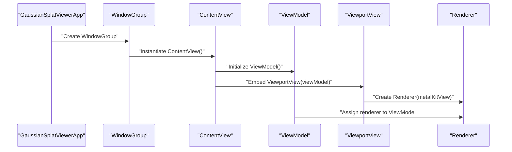

# Getting Started

<cite>
**Referenced Files in This Document**
- [GaussianSplatViewerApp.swift](file://GaussianSplatViewerApp.swift)
- [UI/ContentView.swift](file://UI/ContentView.swift)
- [UI/ViewportView.swift](file://UI/ViewportView.swift)
- [Rendering/Renderer.swift](file://Rendering/Renderer.swift)
- [Rendering/Camera.swift](file://Rendering/Camera.swift)
- [Scene/Scene.swift](file://Scene/Scene.swift)
- [Scene/PLYLoader.swift](file://Scene/PLYLoader.swift)
- [Math/MathTypes.swift](file://Math/MathTypes.swift)
- [Shaders/GaussianSplat.metal](file://Shaders/GaussianSplat.metal)
</cite>

## Table of Contents
1. [Introduction](#introduction)
2. [System Requirements](#system-requirements)
3. [Installation and Setup](#installation-and-setup)
4. [Initial Setup and First-Time Workflow](#initial-setup-and-first-time-workflow)
5. [Basic Usage Examples](#basic-usage-examples)
6. [Application Entry Point and Main Window](#application-entry-point-and-main-window)
7. [Quick Start Examples](#quick-start-examples)
8. [Troubleshooting](#troubleshooting)
9. [Conclusion](#conclusion)

## Introduction
This guide helps you build and run the Gaussian Splat Viewer locally on macOS. It explains how to open PLY files containing 3D Gaussian splats, navigate the 3D scene, and understand the application’s architecture. The viewer uses SwiftUI for the UI and Metal for GPU-accelerated rendering of Gaussian splats.

## System Requirements
- Platform: macOS
- Frameworks: SwiftUI, Metal, MetalKit, simd
- Development Environment: Xcode (recommended)
- Device Capability: Metal-compatible GPU

These requirements are evident from the codebase:
- SwiftUI App entry point and views
- Metal and MetalKit usage for rendering
- simd vector math types
- Metal shaders compiled into the app bundle

**Section sources**
- [GaussianSplatViewerApp.swift:1-13](file://GaussianSplatViewerApp.swift#L1-L13)
- [Rendering/Renderer.swift:1-77](file://Rendering/Renderer.swift#L1-L77)
- [Math/MathTypes.swift:1-189](file://Math/MathTypes.swift#L1-L189)
- [Shaders/GaussianSplat.metal:1-309](file://Shaders/GaussianSplat.metal#L1-L309)

## Installation and Setup
Follow these steps to build and run the project locally:

1. Open the project in Xcode.
2. Select the target device (macOS simulator or physical Mac with Metal support).
3. Build and run the project.

Notes:
- The project uses SwiftUI and Metal, which are standard on modern macOS systems.
- The Metal shaders are included in the app bundle and accessed via the default Metal library.

**Section sources**
- [GaussianSplatViewerApp.swift:3-10](file://GaussianSplatViewerApp.swift#L3-L10)
- [Rendering/Renderer.swift:38-77](file://Rendering/Renderer.swift#L38-L77)

## Initial Setup and First-Time Workflow
On first launch, the application presents a window with:
- A toolbar with an “Open PLY File…” button
- A viewport area for rendering
- An overlay with instructions for navigation

First-time workflow:
1. Click the “Open PLY File…” button.
2. Choose a .ply file from your system.
3. The app loads the file, updates the file name and splat count, and renders the scene.
4. Use mouse controls to navigate the 3D scene.

**Section sources**
- [UI/ContentView.swift:8-34](file://UI/ContentView.swift#L8-L34)
- [UI/ContentView.swift:110-124](file://UI/ContentView.swift#L110-L124)
- [UI/ViewportView.swift:9-36](file://UI/ViewportView.swift#L9-L36)
- [UI/ViewportView.swift:142-184](file://UI/ViewportView.swift#L142-L184)

## Basic Usage Examples
- Load a PLY file:
  - Use the toolbar button to open a .ply file.
  - The app displays loading progress and shows the file name and splat count when ready.
- Navigate the 3D scene:
  - Left drag: Rotate around the scene
  - Right drag: Pan the view
  - Scroll: Zoom in/out
- Explore the interface:
  - The viewport shows the rendered Gaussian splats.
  - On first launch, an instruction overlay appears guiding you to open a file.

**Section sources**
- [UI/ContentView.swift:12-14](file://UI/ContentView.swift#L12-L14)
- [UI/ContentView.swift:68-106](file://UI/ContentView.swift#L68-L106)
- [Rendering/Camera.swift:86-115](file://Rendering/Camera.swift#L86-L115)
- [Rendering/Camera.swift:150-176](file://Rendering/Camera.swift#L150-L176)

## Application Entry Point and Main Window
- Entry point:
  - The SwiftUI App struct defines the main entry point and creates the primary window group.
- Main window:
  - The window displays the ContentView, which hosts the toolbar, viewport, and overlays.

**Diagram sources**
- [GaussianSplatViewerApp.swift:4-10](file://GaussianSplatViewerApp.swift#L4-L10)
- [UI/ContentView.swift:4-6](file://UI/ContentView.swift#L4-L6)
- [UI/ViewportView.swift:9-26](file://UI/ViewportView.swift#L9-L26)
- [UI/ViewportView.swift:18-21](file://UI/ViewportView.swift#L18-L21)
- [UI/ViewportView.swift:142-149](file://UI/ViewportView.swift#L142-L149)

**Section sources**
- [GaussianSplatViewerApp.swift:4-10](file://GaussianSplatViewerApp.swift#L4-L10)
- [UI/ContentView.swift:8-109](file://UI/ContentView.swift#L8-L109)

## Quick Start Examples
- Open a sample PLY file:
  - From the toolbar, select “Open PLY File…” and pick a .ply file.
  - The app loads the file asynchronously and updates the UI.
- Explore navigation:
  - Left drag to rotate the camera around the scene.
  - Right drag to pan the view.
  - Scroll to zoom in and out.
- Verify rendering:
  - The viewport shows the Gaussian splats after successful load.
  - The file name and splat count appear in the toolbar.

**Section sources**
- [UI/ContentView.swift:110-124](file://UI/ContentView.swift#L110-L124)
- [UI/ViewportView.swift:48-88](file://UI/ViewportView.swift#L48-L88)
- [Rendering/Camera.swift:86-115](file://Rendering/Camera.swift#L86-L115)

## Troubleshooting
Common issues and resolutions:

- Metal initialization fails:
  - Ensure your Mac has a Metal-capable GPU and macOS supports Metal.
  - The renderer attempts to create a default Metal device and library; failures indicate missing Metal support or shader compilation issues.
- No scene renders after loading:
  - Confirm the PLY file contains Gaussian splats with expected properties (positions, scales, rotations, colors).
  - The loader validates headers and required properties; errors are surfaced to the UI.
- Poor performance or blank viewport:
  - Verify the file is accessible and not locked by another process.
  - Try a smaller PLY file to confirm GPU memory constraints are not exceeded.
- Navigation not responding:
  - Ensure the viewport has focus; the MTK view requests first responder status on creation.
  - Confirm mouse events are reaching the input handler.

**Section sources**
- [Rendering/Renderer.swift:38-77](file://Rendering/Renderer.swift#L38-L77)
- [Rendering/Renderer.swift:147-157](file://Rendering/Renderer.swift#L147-L157)
- [Scene/PLYLoader.swift:42-68](file://Scene/PLYLoader.swift#L42-L68)
- [UI/ViewportView.swift:102-139](file://UI/ViewportView.swift#L102-L139)

## Conclusion
You can build and run the Gaussian Splat Viewer locally on macOS using Xcode. The app loads PLY files containing Gaussian splats, renders them with Metal, and provides intuitive navigation controls. Use the toolbar to open files, and explore the scene with mouse gestures. If you encounter issues, verify Metal support, file accessibility, and shader availability.