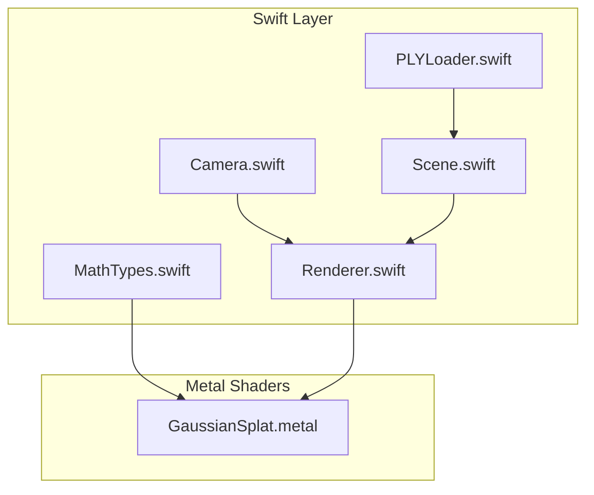
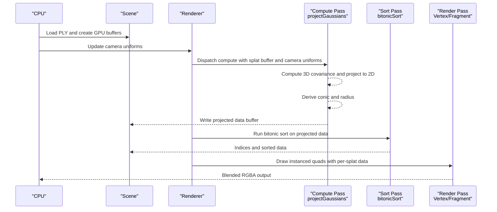
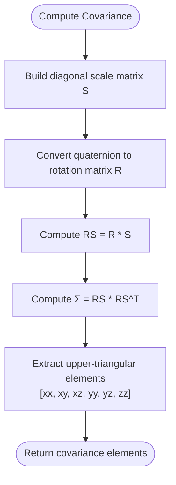
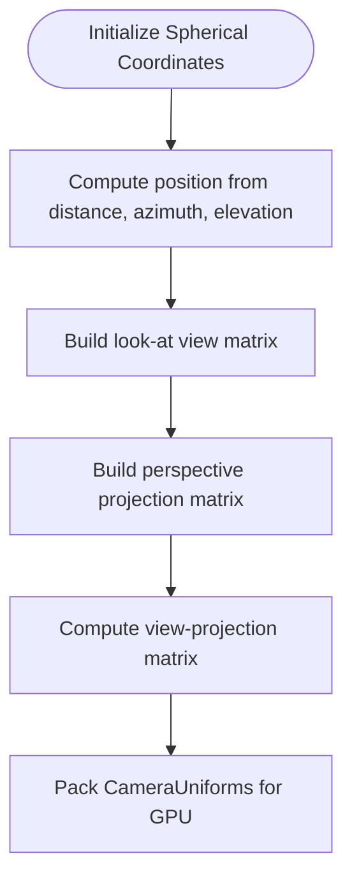
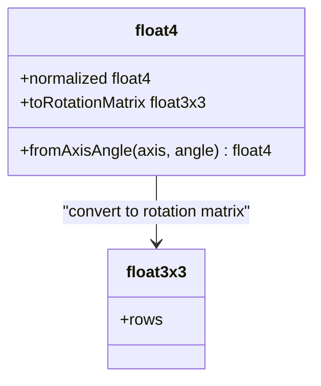
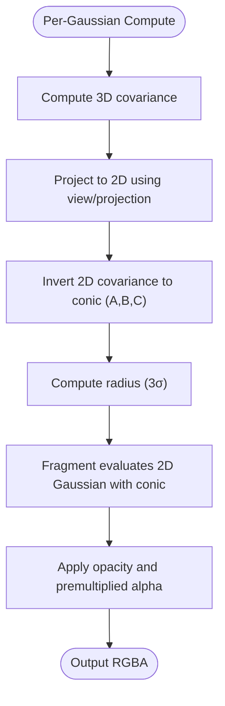
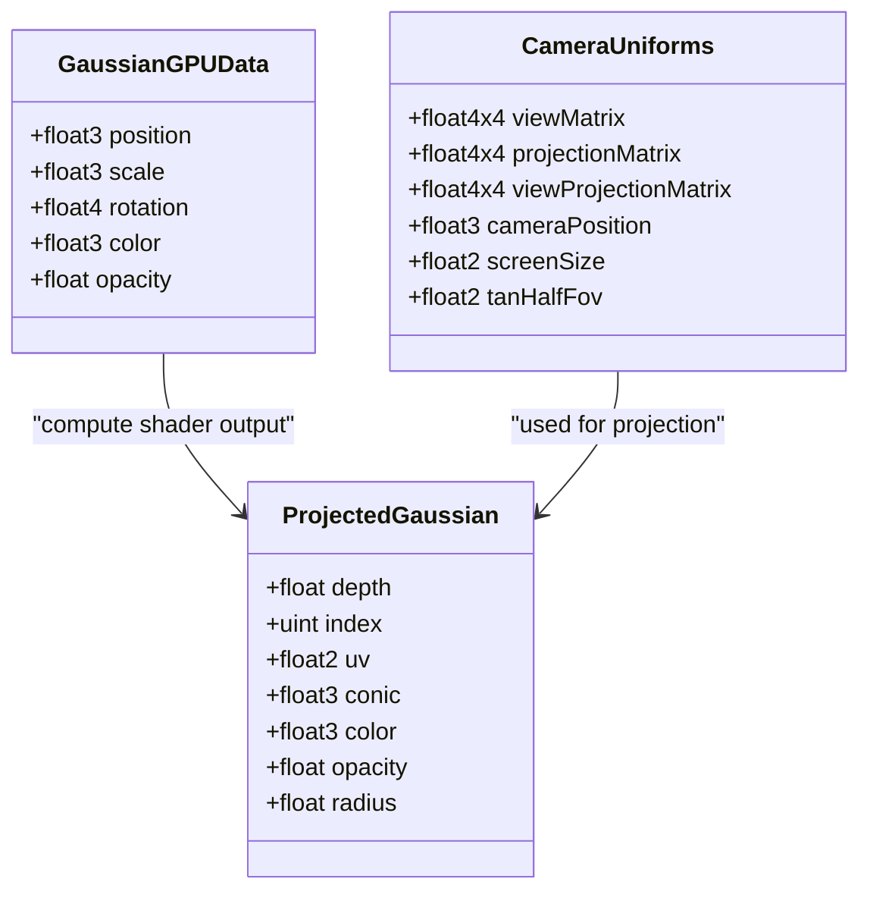
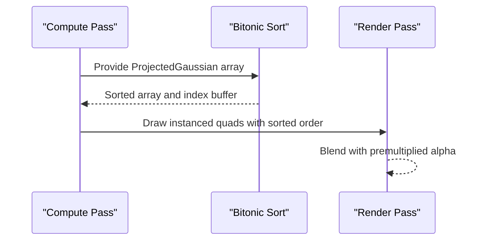
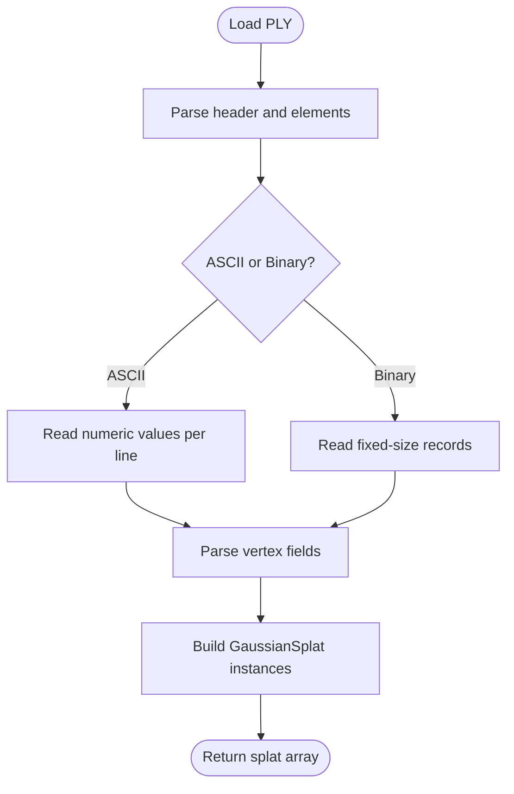
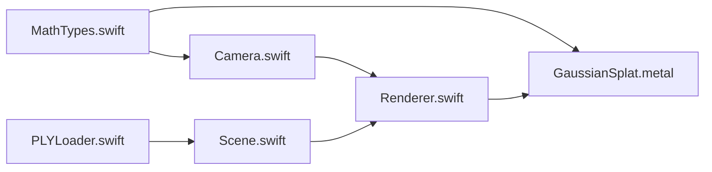

# Mathematical Foundation

<cite>
**Referenced Files in This Document**
- [MathTypes.swift](file://Math/MathTypes.swift)
- [Camera.swift](file://Rendering/Camera.swift)
- [GaussianSplat.metal](file://Shaders/GaussianSplat.metal)
- [Renderer.swift](file://Rendering/Renderer.swift)
- [Scene.swift](file://Scene/Scene.swift)
- [PLYLoader.swift](file://Scene/PLYLoader.swift)
</cite>

## Table of Contents
1. [Introduction](#introduction)
2. [Project Structure](#project-structure)
3. [Core Components](#core-components)
4. [Architecture Overview](#architecture-overview)
5. [Detailed Component Analysis](#detailed-component-analysis)
6. [Dependency Analysis](#dependency-analysis)
7. [Performance Considerations](#performance-considerations)
8. [Troubleshooting Guide](#troubleshooting-guide)
9. [Conclusion](#conclusion)

## Introduction
This document establishes the mathematical foundation for Gaussian Splat Viewer, focusing on Gaussian splatting theory, rendering principles, and GPU-friendly computations. It explains vector operations, matrix transformations, covariance calculations, camera mathematics (including spherical coordinates, rotation matrices, and perspective projections), and the role of quaternions in 3D rotations. It also documents the GPU data layouts, compute shader transformations, and the mathematical basis for depth-based sorting and transparency rendering.

## Project Structure
The project organizes mathematically relevant code across Swift and Metal shader files:
- Math types and camera math live in Swift for CPU-side computation and data structures.
- GPU kernels and data layouts are defined in Metal shaders.
- Scene and renderer orchestrate data transfer and rendering passes.

**Diagram sources**
- [MathTypes.swift:1-189](file://Math/MathTypes.swift#L1-L189)
- [Camera.swift:1-184](file://Rendering/Camera.swift#L1-L184)
- [GaussianSplat.metal:1-309](file://Shaders/GaussianSplat.metal#L1-L309)
- [Renderer.swift:1-288](file://Rendering/Renderer.swift#L1-L288)
- [Scene.swift:1-140](file://Scene/Scene.swift#L1-L140)
- [PLYLoader.swift:1-403](file://Scene/PLYLoader.swift#L1-L403)

**Section sources**
- [MathTypes.swift:1-189](file://Math/MathTypes.swift#L1-L189)
- [Camera.swift:1-184](file://Rendering/Camera.swift#L1-L184)
- [GaussianSplat.metal:1-309](file://Shaders/GaussianSplat.metal#L1-L309)
- [Renderer.swift:1-288](file://Rendering/Renderer.swift#L1-L288)
- [Scene.swift:1-140](file://Scene/Scene.swift#L1-L140)
- [PLYLoader.swift:1-403](file://Scene/PLYLoader.swift#L1-L403)

## Core Components
- Gaussian splat data structure and GPU-compatible representation define the per-splat attributes: position, scale, rotation (as a quaternion), color, and opacity.
- Camera model encapsulates spherical coordinates, look-at view matrices, and perspective projection matrices.
- GPU shader pipeline computes 3D covariance from scale and rotation, projects covariance to 2D, evaluates 2D Gaussians, and performs depth-based sorting.

Key mathematical concepts:
- Vector algebra: dot product, cross product, normalization.
- Matrix algebra: translation, scaling, rotation matrices, perspective projection.
- Quaternions: axis-angle to quaternion conversion, normalization, and conversion to rotation matrices.
- Covariance propagation under linear transforms and perspective projection.
- Gaussian evaluation in 2D with conic form derived from covariance.

**Section sources**
- [MathTypes.swift:11-30](file://Math/MathTypes.swift#L11-L30)
- [MathTypes.swift:34-51](file://Math/MathTypes.swift#L34-L51)
- [MathTypes.swift:64-73](file://Math/MathTypes.swift#L64-L73)
- [MathTypes.swift:75-101](file://Math/MathTypes.swift#L75-L101)
- [MathTypes.swift:103-167](file://Math/MathTypes.swift#L103-L167)
- [MathTypes.swift:169-188](file://Math/MathTypes.swift#L169-L188)

## Architecture Overview
The rendering pipeline consists of:
- CPU: Scene loads Gaussian splats from PLY, creates GPU buffers, and updates camera uniforms.
- Compute pass: Each Gaussian’s 3D covariance is computed and projected to 2D screen space; conic form and radius are derived; per-instance data is stored.
- Sorting pass: Projected Gaussians are sorted by depth (bitonic sort kernel).
- Render pass: Instanced quads are drawn with per-splat data; fragment shader evaluates 2D Gaussian and applies premultiplied alpha blending.

**Diagram sources**
- [Renderer.swift:166-250](file://Rendering/Renderer.swift#L166-L250)
- [GaussianSplat.metal:138-201](file://Shaders/GaussianSplat.metal#L138-L201)
- [GaussianSplat.metal:274-308](file://Shaders/GaussianSplat.metal#L274-L308)
- [GaussianSplat.metal:205-241](file://Shaders/GaussianSplat.metal#L205-L241)
- [GaussianSplat.metal:245-270](file://Shaders/GaussianSplat.metal#L245-L270)

## Detailed Component Analysis

### Gaussian Splats and Covariance Mathematics
- Each Gaussian is defined by position, scale, rotation (quaternion), color, and opacity.
- Covariance in 3D is computed from scale and rotation using a linear transform: Σ = R · S · S^T · R^T, where S is a diagonal scale matrix and R is the rotation matrix derived from the quaternion.
- Upper-triangular elements of Σ are exposed for GPU consumption.

**Diagram sources**
- [MathTypes.swift:170-188](file://Math/MathTypes.swift#L170-L188)
- [GaussianSplat.metal:64-74](file://Shaders/GaussianSplat.metal#L64-L74)

**Section sources**
- [MathTypes.swift:11-30](file://Math/MathTypes.swift#L11-L30)
- [MathTypes.swift:169-188](file://Math/MathTypes.swift#L169-L188)
- [GaussianSplat.metal:64-74](file://Shaders/GaussianSplat.metal#L64-L74)

### Camera Mathematics: Spherical Coordinates, Rotation Matrices, Perspective Projection
- Spherical coordinates (distance, azimuth, elevation) are converted to Cartesian position relative to the target.
- Look-at view matrix is constructed from eye, center, and up vectors.
- Perspective projection matrix uses field-of-view, aspect ratio, near/far planes.
- Camera uniforms include view, projection, view-projection matrices, camera position, screen size, and tangent of half FOV.

**Diagram sources**
- [Camera.swift:62-84](file://Rendering/Camera.swift#L62-L84)
- [MathTypes.swift:103-167](file://Math/MathTypes.swift#L103-L167)

**Section sources**
- [Camera.swift:6-60](file://Rendering/Camera.swift#L6-L60)
- [Camera.swift:62-84](file://Rendering/Camera.swift#L62-L84)
- [MathTypes.swift:103-167](file://Math/MathTypes.swift#L103-L167)

### Quaternions for 3D Rotations
- Axis-angle to quaternion conversion and normalization.
- Quaternion-to-rotation-matrix conversion using standard formula.
- Used to derive rotation matrices for covariance computation.

**Diagram sources**
- [MathTypes.swift:75-101](file://Math/MathTypes.swift#L75-L101)
- [GaussianSplat.metal:44-60](file://Shaders/GaussianSplat.metal#L44-L60)

**Section sources**
- [MathTypes.swift:75-101](file://Math/MathTypes.swift#L75-L101)
- [GaussianSplat.metal:44-60](file://Shaders/GaussianSplat.metal#L44-L60)

### 3D Point Cloud Rendering Using Gaussian Functions
- Each Gaussian is rendered as a 2D ellipse (covariance ellipse) evaluated by a 2D Gaussian.
- Conic form (inverse covariance) is computed from 2D projected covariance.
- Fragment shader evaluates the 2D Gaussian with conic coefficients and applies premultiplied alpha.

**Diagram sources**
- [GaussianSplat.metal:138-201](file://Shaders/GaussianSplat.metal#L138-L201)
- [GaussianSplat.metal:245-270](file://Shaders/GaussianSplat.metal#L245-L270)

**Section sources**
- [GaussianSplat.metal:138-201](file://Shaders/GaussianSplat.metal#L138-L201)
- [GaussianSplat.metal:245-270](file://Shaders/GaussianSplat.metal#L245-L270)

### GPU Data Layouts and Compute Shader Transformations
- CPU-side GaussianGPUData mirrors GPU layout with explicit padding for alignment.
- ProjectedGaussian stores per-instance data for rendering: depth, UV, conic, color, opacity, radius.
- Compute shader derives focal lengths from projection matrix, projects positions, computes conic, and writes ProjectedGaussian entries.

**Diagram sources**
- [MathTypes.swift:34-51](file://Math/MathTypes.swift#L34-L51)
- [MathTypes.swift:64-73](file://Math/MathTypes.swift#L64-L73)
- [MathTypes.swift:53-62](file://Math/MathTypes.swift#L53-L62)
- [GaussianSplat.metal:6-34](file://Shaders/GaussianSplat.metal#L6-L34)

**Section sources**
- [MathTypes.swift:34-73](file://Math/MathTypes.swift#L34-L73)
- [GaussianSplat.metal:6-34](file://Shaders/GaussianSplat.metal#L6-L34)

### Depth-Based Sorting and Transparency Rendering
- Depth sorting is performed using a bitonic sort kernel over ProjectedGaussian data.
- Transparency uses premultiplied alpha blending in the render pipeline and discards fragments with negligible alpha.
- Sorting interval is configurable to balance quality and performance.

**Diagram sources**
- [GaussianSplat.metal:274-308](file://Shaders/GaussianSplat.metal#L274-L308)
- [Renderer.swift:111-119](file://Rendering/Renderer.swift#L111-L119)
- [Renderer.swift:213-217](file://Rendering/Renderer.swift#L213-L217)

**Section sources**
- [GaussianSplat.metal:274-308](file://Shaders/GaussianSplat.metal#L274-L308)
- [Renderer.swift:111-119](file://Rendering/Renderer.swift#L111-L119)
- [Renderer.swift:213-217](file://Rendering/Renderer.swift#L213-L217)

### PLY Loader and Data Extraction
- Loads Gaussian splats from PLY files, parsing ASCII or binary formats.
- Extracts position, scale, rotation (quaternion), color (SH DC or RGB), and opacity.
- Applies exponential mapping to scales and sigmoid activation to SH DC and opacity.

**Diagram sources**
- [PLYLoader.swift:41-68](file://Scene/PLYLoader.swift#L41-L68)
- [PLYLoader.swift:162-204](file://Scene/PLYLoader.swift#L162-L204)
- [PLYLoader.swift:208-317](file://Scene/PLYLoader.swift#L208-L317)
- [PLYLoader.swift:321-385](file://Scene/PLYLoader.swift#L321-L385)

**Section sources**
- [PLYLoader.swift:41-68](file://Scene/PLYLoader.swift#L41-L68)
- [PLYLoader.swift:321-385](file://Scene/PLYLoader.swift#L321-L385)

## Dependency Analysis
- MathTypes.swift defines core types and extensions used by Camera.swift and consumed by GaussianSplat.metal.
- Camera.swift constructs matrices and uniforms used by Renderer.swift and passed to shaders.
- Scene.swift manages GPU buffers and provides splat data to Renderer.swift.
- Renderer.swift orchestrates compute and render passes, invoking Metal functions and passing CameraUniforms and ProjectedGaussian arrays.

**Diagram sources**
- [MathTypes.swift:1-189](file://Math/MathTypes.swift#L1-L189)
- [Camera.swift:1-184](file://Rendering/Camera.swift#L1-L184)
- [GaussianSplat.metal:1-309](file://Shaders/GaussianSplat.metal#L1-L309)
- [Renderer.swift:1-288](file://Rendering/Renderer.swift#L1-L288)
- [Scene.swift:1-140](file://Scene/Scene.swift#L1-L140)
- [PLYLoader.swift:1-403](file://Scene/PLYLoader.swift#L1-L403)

**Section sources**
- [MathTypes.swift:1-189](file://Math/MathTypes.swift#L1-L189)
- [Camera.swift:1-184](file://Rendering/Camera.swift#L1-L184)
- [GaussianSplat.metal:1-309](file://Shaders/GaussianSplat.metal#L1-L309)
- [Renderer.swift:1-288](file://Rendering/Renderer.swift#L1-L288)
- [Scene.swift:1-140](file://Scene/Scene.swift#L1-L140)
- [PLYLoader.swift:1-403](file://Scene/PLYLoader.swift#L1-L403)

## Performance Considerations
- GPU memory layout: Structured buffers with explicit padding ensure alignment and coalesced access.
- Compute dispatch sizing: Thread groups of 256 are used to efficiently process large point clouds.
- Sorting cadence: Depth sorting is throttled to reduce overhead; adjust interval based on scene complexity.
- Early discard: Fragments with negligible alpha are discarded to save bandwidth and improve blending quality.
- Low-pass filtering: Small constants added to diagonal of 2D covariance stabilize inversion and prevent numerical issues.

[No sources needed since this section provides general guidance]

## Troubleshooting Guide
- Visibility issues:
  - Ensure splats are in front of the camera; behind-camera checks discard projections.
  - Verify that opacity and radius are positive; otherwise, instances are culled.
- Incorrect orientation or scale:
  - Confirm quaternion normalization and correct axis-angle conversion.
  - Validate scale values; exponential mapping is applied during PLY parsing.
- Sorting artifacts:
  - Confirm bitonic sort is invoked with correct counts and indices.
  - Ensure depth values are written to ProjectedGaussian.depth and used for comparisons.
- Blending anomalies:
  - Premultiplied alpha is used; ensure color channels are pre-multiplied by opacity in the fragment shader.

**Section sources**
- [GaussianSplat.metal:91-94](file://Shaders/GaussianSplat.metal#L91-L94)
- [GaussianSplat.metal:221-226](file://Shaders/GaussianSplat.metal#L221-L226)
- [GaussianSplat.metal:261-269](file://Shaders/GaussianSplat.metal#L261-L269)
- [GaussianSplat.metal:274-308](file://Shaders/GaussianSplat.metal#L274-L308)

## Conclusion
Gaussian Splat Viewer combines robust mathematical foundations—vector/matrix operations, quaternions, covariance propagation, and 2D Gaussian evaluation—with efficient GPU pipelines. The system models each Gaussian with position, scale, rotation, color, and opacity, computes 3D covariance and projects it to 2D, evaluates per-pixel contributions with conic forms, and renders with depth sorting and premultiplied alpha blending. The structured data layouts and compute shader transformations enable scalable rendering of dense 3D point clouds.