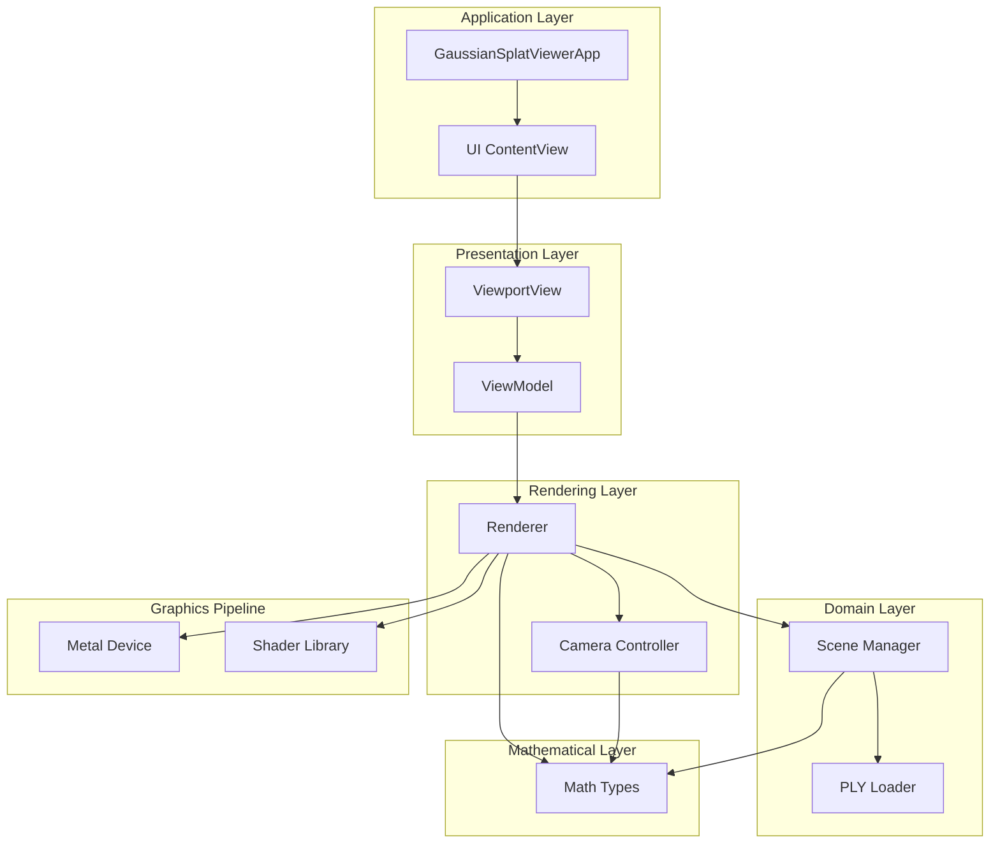
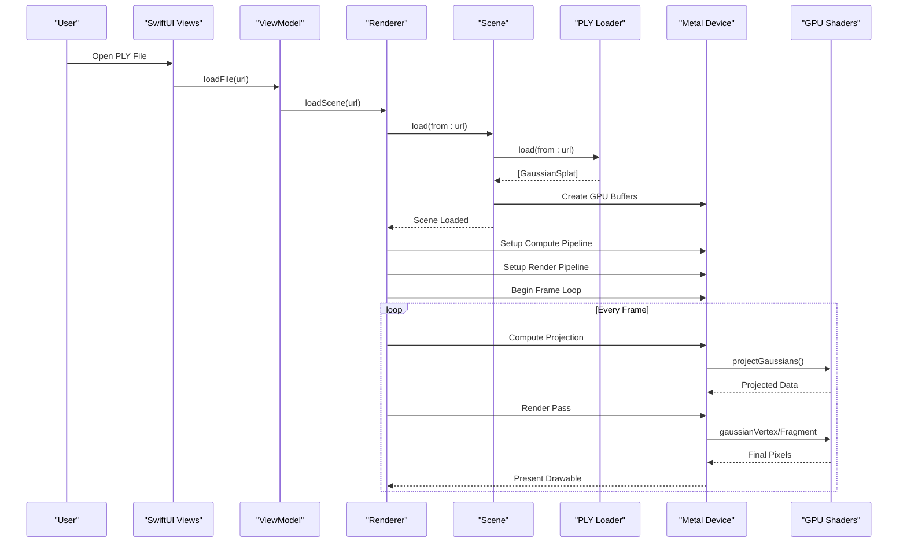
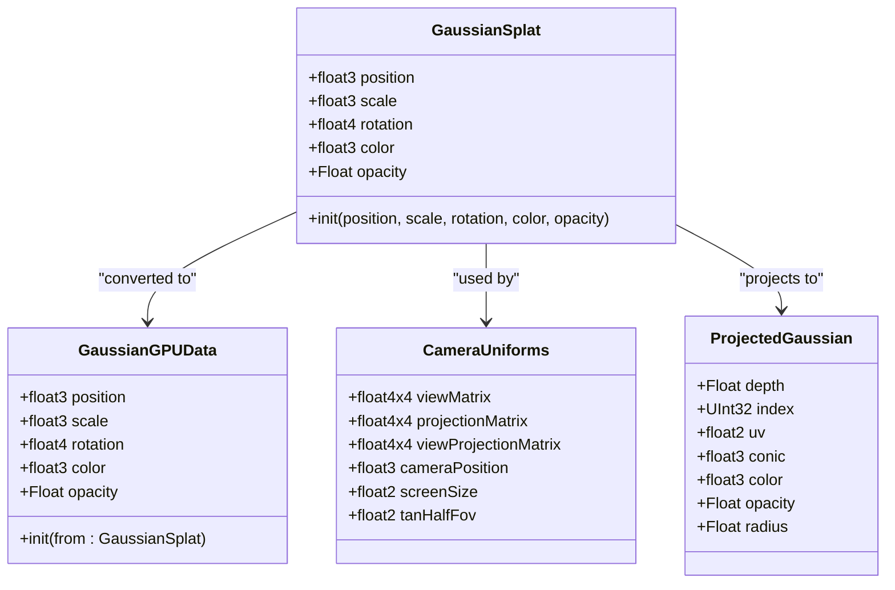
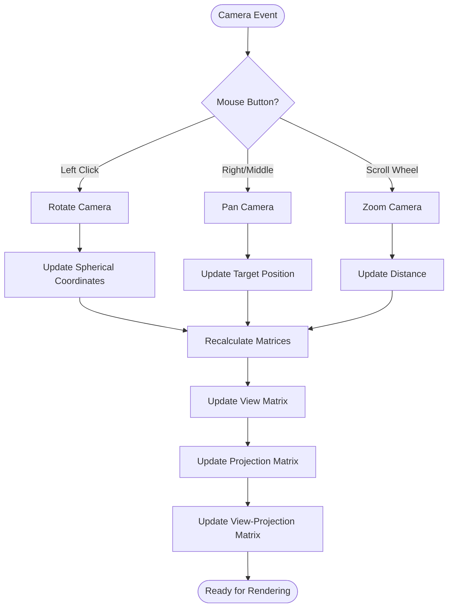
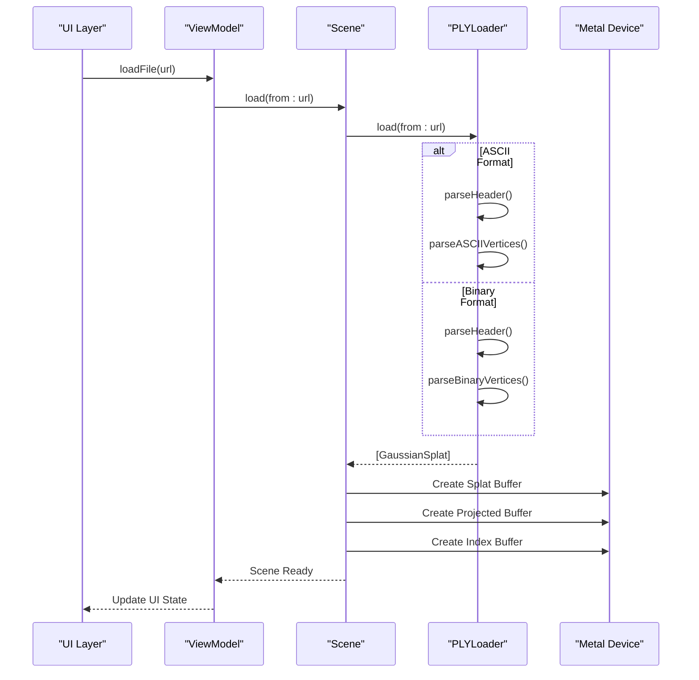
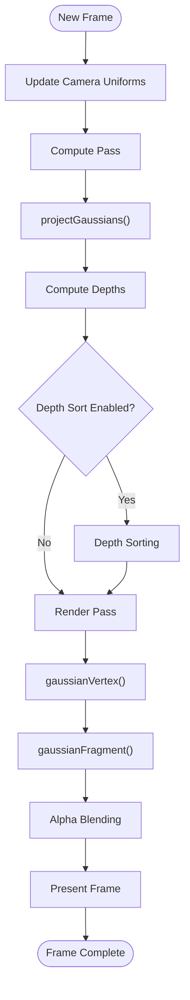
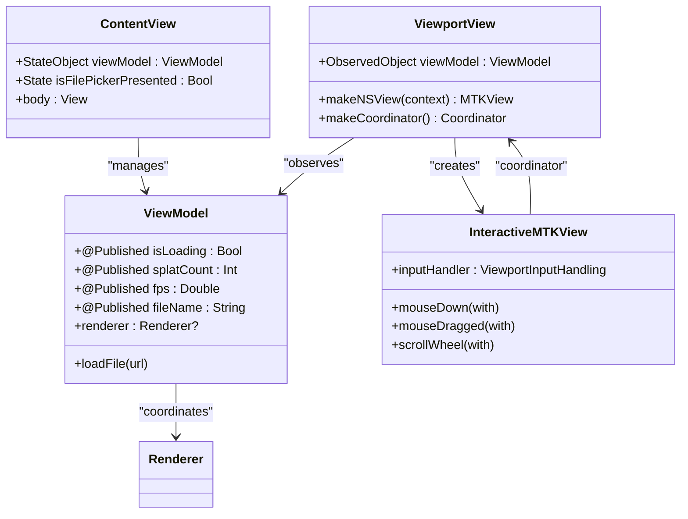
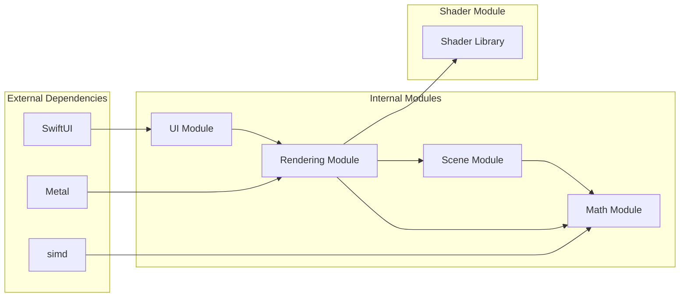

# Project Overview

<cite>
**Referenced Files in This Document**
- [GaussianSplatViewerApp.swift](file://GaussianSplatViewerApp.swift)
- [GaussianSplatViewer/ContentView.swift](file://GaussianSplatViewer/ContentView.swift)
- [Math/MathTypes.swift](file://Math/MathTypes.swift)
- [Rendering/Camera.swift](file://Rendering/Camera.swift)
- [Rendering/Renderer.swift](file://Rendering/Renderer.swift)
- [Scene/PLYLoader.swift](file://Scene/PLYLoader.swift)
- [Scene/Scene.swift](file://Scene/Scene.swift)
- [UI/ContentView.swift](file://UI/ContentView.swift)
- [UI/ViewportView.swift](file://UI/ViewportView.swift)
- [Shaders/GaussianSplat.metal](file://Shaders/GaussianSplat.metal)
</cite>

## Table of Contents
1. [Introduction](#introduction)
2. [Project Structure](#project-structure)
3. [Core Components](#core-components)
4. [Architecture Overview](#architecture-overview)
5. [Detailed Component Analysis](#detailed-component-analysis)
6. [Dependency Analysis](#dependency-analysis)
7. [Performance Considerations](#performance-considerations)
8. [Troubleshooting Guide](#troubleshooting-guide)
9. [Conclusion](#conclusion)

## Introduction
Gaussian Splat Viewer is a high-performance 3D graphics application designed to render 3D Gaussian splatting scenes using Apple's Metal framework. The application targets developers and researchers who work with 3D point cloud visualization, enabling real-time exploration of scenes composed of thousands to millions of 3D Gaussians.

The project implements a modern modular architecture that separates concerns into four primary domains:
- Math: Mathematical primitives, transformations, and GPU-compatible data structures
- Rendering: Metal-based compute and rendering pipelines
- Scene: Data loading, management, and GPU resource allocation
- UI: SwiftUI-based user interface with interactive viewport controls

Key features include:
- Real-time Gaussian splatting rendering with GPU acceleration
- Interactive 3D camera navigation (orbit, pan, zoom)
- PLY file format support for importing 3D point cloud data
- Dual-stage pipeline: compute shaders for projection and Metal render passes for rasterization
- Depth sorting infrastructure for correct transparency handling

## Project Structure
The project follows a clean modular architecture with clear separation of concerns:

**Diagram sources**
- [GaussianSplatViewerApp.swift:1-13](file://GaussianSplatViewerApp.swift#L1-L13)
- [UI/ContentView.swift:1-130](file://UI/ContentView.swift#L1-L130)
- [UI/ViewportView.swift:1-185](file://UI/ViewportView.swift#L1-L185)
- [Rendering/Renderer.swift:1-292](file://Rendering/Renderer.swift#L1-L292)
- [Scene/Scene.swift:1-131](file://Scene/Scene.swift#L1-L131)
- [Math/MathTypes.swift:1-189](file://Math/MathTypes.swift#L1-L189)

**Section sources**
- [GaussianSplatViewerApp.swift:1-13](file://GaussianSplatViewerApp.swift#L1-L13)
- [UI/ContentView.swift:1-130](file://UI/ContentView.swift#L1-L130)
- [UI/ViewportView.swift:1-185](file://UI/ViewportView.swift#L1-L185)
- [Rendering/Renderer.swift:1-292](file://Rendering/Renderer.swift#L1-L292)
- [Scene/Scene.swift:1-131](file://Scene/Scene.swift#L1-L131)
- [Math/MathTypes.swift:1-189](file://Math/MathTypes.swift#L1-L189)

## Core Components
The application is built around several core components that work together to deliver high-performance Gaussian splatting visualization:

### Mathematical Foundation
The Math module provides GPU-compatible data structures and mathematical operations essential for 3D transformations and Gaussian computations. It defines:
- Vector and matrix types using SIMD for optimal GPU performance
- Gaussian data structures with position, scale, rotation, color, and opacity
- Camera uniform structures for GPU shader consumption
- Projection data structures for depth sorting and rendering

### Camera System
The Camera component implements an orbit camera controller with intuitive mouse interactions:
- Spherical coordinate system for natural 3D navigation
- Rotation, zoom, and pan controls with configurable sensitivity
- Look-at matrix computation and perspective projection
- Mouse event handling for seamless user interaction

### Scene Management
The Scene component manages 3D Gaussian data and GPU resources:
- PLY file loading with support for ASCII and binary formats
- GPU buffer creation for efficient rendering
- Bounding box calculations for automatic camera framing
- Resource lifecycle management and cleanup

### Rendering Pipeline
The Renderer orchestrates the complete graphics pipeline:
- Dual-stage compute-render architecture
- Metal compute shaders for Gaussian projection
- Instanced rendering with quad geometry
- Depth sorting infrastructure for transparency
- Triple-buffered camera uniforms for synchronization

**Section sources**
- [Math/MathTypes.swift:1-189](file://Math/MathTypes.swift#L1-L189)
- [Rendering/Camera.swift:1-184](file://Rendering/Camera.swift#L1-L184)
- [Scene/Scene.swift:1-131](file://Scene/Scene.swift#L1-L131)
- [Rendering/Renderer.swift:1-292](file://Rendering/Renderer.swift#L1-L292)

## Architecture Overview
The application implements a layered architecture with clear separation between presentation, domain, and rendering concerns:

**Diagram sources**
- [UI/ViewportView.swift:141-185](file://UI/ViewportView.swift#L141-L185)
- [Rendering/Renderer.swift:147-254](file://Rendering/Renderer.swift#L147-L254)
- [Scene/Scene.swift:25-86](file://Scene/Scene.swift#L25-L86)
- [Scene/PLYLoader.swift:41-68](file://Scene/PLYLoader.swift#L41-L68)
- [Shaders/GaussianSplat.metal:138-201](file://Shaders/GaussianSplat.metal#L138-L201)

The architecture emphasizes:
- **Separation of Concerns**: Math, Rendering, Scene, and UI components remain decoupled
- **GPU Acceleration**: All computationally intensive operations run on the GPU
- **Real-time Performance**: Triple buffering and efficient memory management
- **Extensibility**: Modular design allows easy addition of new features

## Detailed Component Analysis

### Mathematical Types and Transformations
The Math module serves as the foundation for all 3D computations in the application:

**Diagram sources**
- [Math/MathTypes.swift:11-73](file://Math/MathTypes.swift#L11-L73)

Key mathematical operations include:
- Quaternion-to-matrix conversion for 3D rotations
- Covariance matrix computation from scale and rotation
- Perspective projection with field-of-view calculations
- Look-at matrix construction for camera positioning

**Section sources**
- [Math/MathTypes.swift:1-189](file://Math/MathTypes.swift#L1-L189)

### Camera Navigation System
The Camera component implements an intuitive orbit camera with sophisticated interaction handling:

**Diagram sources**
- [Rendering/Camera.swift:86-177](file://Rendering/Camera.swift#L86-L177)

The camera system provides:
- Natural 3D navigation with left-click rotation
- Smooth panning with right-click drag
- Zoom control via scroll wheel
- Automatic constraint handling to prevent gimbal lock
- Configurable sensitivity for different user preferences

**Section sources**
- [Rendering/Camera.swift:1-184](file://Rendering/Camera.swift#L1-L184)

### Scene Loading and Management
The Scene component handles data ingestion and GPU resource management:

**Diagram sources**
- [Scene/Scene.swift:25-86](file://Scene/Scene.swift#L25-L86)
- [Scene/PLYLoader.swift:41-68](file://Scene/PLYLoader.swift#L41-L68)

The loader supports:
- Multiple PLY formats (ASCII, binary little-endian, binary big-endian)
- Flexible property parsing with fallback defaults
- Robust error handling for malformed files
- Efficient binary data processing

**Section sources**
- [Scene/Scene.swift:1-131](file://Scene/Scene.swift#L1-L131)
- [Scene/PLYLoader.swift:1-403](file://Scene/PLYLoader.swift#L1-L403)

### Rendering Pipeline
The Renderer implements a sophisticated dual-stage pipeline for optimal performance:

**Diagram sources**
- [Rendering/Renderer.swift:166-254](file://Rendering/Renderer.swift#L166-L254)
- [Shaders/GaussianSplat.metal:138-270](file://Shaders/GaussianSplat.metal#L138-L270)

The pipeline features:
- Compute shaders for parallel Gaussian projection
- Instanced rendering with quad geometry
- Sophisticated alpha blending for transparency
- Depth testing and stencil operations
- Triple-buffered camera uniforms for synchronization

**Section sources**
- [Rendering/Renderer.swift:1-292](file://Rendering/Renderer.swift#L1-L292)
- [Shaders/GaussianSplat.metal:1-309](file://Shaders/GaussianSplat.metal#L1-L309)

### User Interface Architecture
The UI layer provides an intuitive interface built with SwiftUI:

**Diagram sources**
- [UI/ContentView.swift:4-125](file://UI/ContentView.swift#L4-L125)
- [UI/ViewportView.swift:6-90](file://UI/ViewportView.swift#L6-L90)

The interface includes:
- File picker for PLY file selection
- Real-time loading indicators
- Error handling and user feedback
- Intuitive navigation instructions
- Responsive layout with proper sizing constraints

**Section sources**
- [UI/ContentView.swift:1-130](file://UI/ContentView.swift#L1-L130)
- [UI/ViewportView.swift:1-185](file://UI/ViewportView.swift#L1-L185)

## Dependency Analysis
The project exhibits excellent modularity with well-defined dependencies:

**Diagram sources**
- [Math/MathTypes.swift:1](file://Math/MathTypes.swift#L1)
- [Rendering/Renderer.swift:2-4](file://Rendering/Renderer.swift#L2-L4)
- [UI/ViewportView.swift:1-3](file://UI/ViewportView.swift#L1-L3)

Key dependency characteristics:
- **Low Coupling**: Modules communicate primarily through well-defined interfaces
- **Clear Boundaries**: Each module has a single responsibility
- **Minimal External Dependencies**: Relies only on Apple's frameworks
- **GPU Integration**: Seamless Metal integration without tight coupling

**Section sources**
- [Math/MathTypes.swift:1-189](file://Math/MathTypes.swift#L1-L189)
- [Rendering/Renderer.swift:1-292](file://Rendering/Renderer.swift#L1-L292)
- [UI/ViewportView.swift:1-185](file://UI/ViewportView.swift#L1-L185)

## Performance Considerations
The application is designed for high-performance real-time rendering:

### GPU-Accelerated Computing
- **Parallel Projection**: Compute shaders process all Gaussians simultaneously
- **Efficient Data Layout**: GPU-friendly structures minimize memory bandwidth
- **Instanced Rendering**: Single draw call renders thousands of instances
- **Triple Buffering**: Prevents CPU-GPU synchronization bottlenecks

### Memory Management
- **Buffer Pooling**: Reuses GPU buffers to minimize allocation overhead
- **Lazy Loading**: Scene data loaded only when needed
- **Resource Cleanup**: Proper deallocation of GPU resources

### Rendering Optimizations
- **Early Depth Testing**: Reduces fragment shader workload
- **Alpha-to-Coverage**: Improves transparency rendering quality
- **Frustum Culling**: Potential optimization for large datasets
- **Level-of-Detail**: Future enhancement for massive point clouds

## Troubleshooting Guide
Common issues and their solutions:

### Loading Issues
- **PLY File Format Problems**: Ensure the file uses supported PLY formats (ASCII or binary)
- **Missing Required Properties**: Verify presence of position coordinates (x, y, z)
- **Large File Performance**: Consider reducing point cloud density for initial testing

### Rendering Problems
- **Black Screen**: Check Metal device availability and shader compilation
- **Poor Performance**: Verify compute shader dispatch parameters and buffer sizes
- **Visual Artifacts**: Review depth sorting implementation and alpha blending settings

### Camera Control Issues
- **Stuttering Movement**: Adjust sensitivity parameters in camera initialization
- **Navigation Limits**: Camera automatically prevents gimbal lock scenarios
- **Viewport Resizing**: Camera aspect ratio updates automatically with window changes

**Section sources**
- [Scene/PLYLoader.swift:3-10](file://Scene/PLYLoader.swift#L3-L10)
- [Rendering/Renderer.swift:47-53](file://Rendering/Renderer.swift#L47-L53)
- [Rendering/Camera.swift:92-94](file://Rendering/Camera.swift#L92-L94)

## Conclusion
Gaussian Splat Viewer represents a sophisticated implementation of modern 3D graphics rendering techniques on Apple platforms. The project successfully demonstrates how to combine mathematical rigor with practical engineering to create a responsive, high-performance application for 3D point cloud visualization.

Key achievements include:
- **Technical Excellence**: Clean modular architecture with clear separation of concerns
- **Performance Optimization**: Efficient GPU utilization through compute shaders and instanced rendering
- **User Experience**: Intuitive interface with responsive controls and helpful feedback
- **Extensibility**: Well-designed APIs that facilitate future enhancements

The application serves as an excellent foundation for researchers and developers working with 3D Gaussian splatting, providing both educational value and practical utility for exploring complex 3D point cloud datasets.