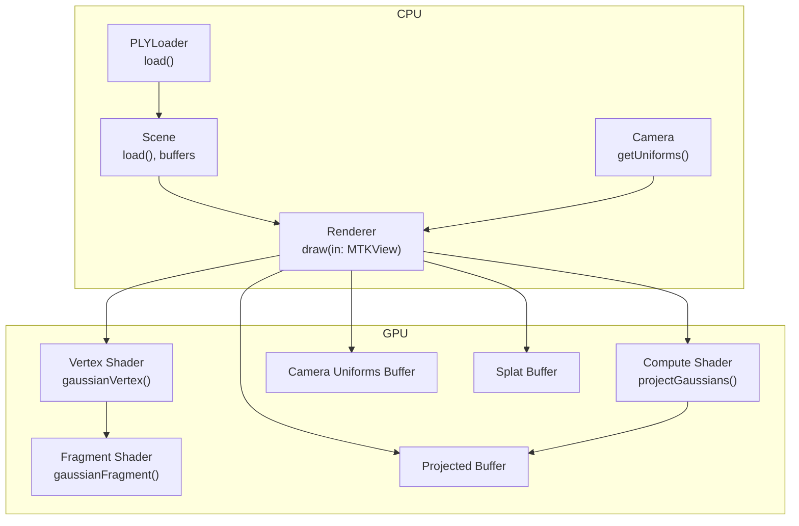
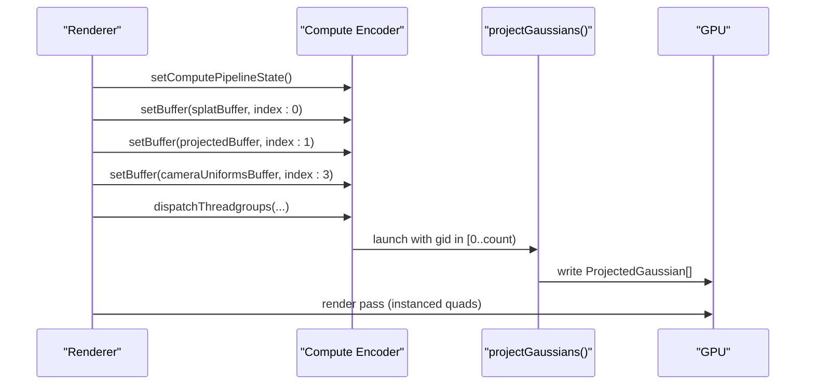
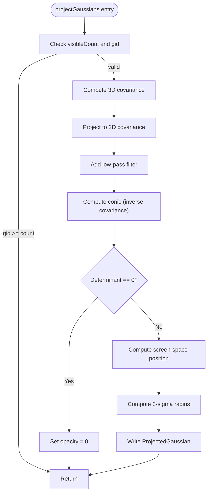
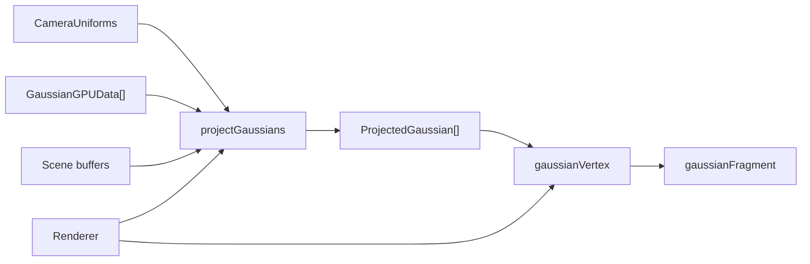

# Compute Shader Implementation

<cite>
**Referenced Files in This Document**
- [GaussianSplat.metal](file://Sources/Shaders/GaussianSplat.metal)
- [Renderer.swift](file://Sources/Rendering/Renderer.swift)
- [Scene.swift](file://Sources/Scene/Scene.swift)
- [MathTypes.swift](file://Sources/Math/MathTypes.swift)
- [Camera.swift](file://Sources/Rendering/Camera.swift)
- [PLYLoader.swift](file://Sources/Scene/PLYLoader.swift)
</cite>

## Table of Contents
1. [Introduction](#introduction)
2. [Project Structure](#project-structure)
3. [Core Components](#core-components)
4. [Architecture Overview](#architecture-overview)
5. [Detailed Component Analysis](#detailed-component-analysis)
6. [Dependency Analysis](#dependency-analysis)
7. [Performance Considerations](#performance-considerations)
8. [Troubleshooting Guide](#troubleshooting-guide)
9. [Conclusion](#conclusion)

## Introduction
This document explains the compute shader implementation for Gaussian projection and processing in a Metal-based renderer. It focuses on the projectGaussians compute function that transforms 3D Gaussian splats into screen-space projections, covering GPU data structures, vertex projection calculations, compute dispatch configuration, and the integration between CPU-side scene data and GPU compute execution. Practical optimization guidance and performance considerations for handling large numbers of splats are included, along with the relationship between compute shader execution and the main rendering pipeline.

## Project Structure
The Gaussian splatting pipeline is organized around three primary areas:
- GPU compute shader: performs projection and prepares per-splat data for rasterization
- CPU renderer: orchestrates compute and render passes, manages buffers and uniforms
- Scene and math utilities: load PLY data, define GPU-compatible structures, and provide camera matrices

**Diagram sources**
- [Renderer.swift:171-250](file://Sources/Rendering/Renderer.swift#L171-L250)
- [Scene.swift:52-85](file://Sources/Scene/Scene.swift#L52-L85)
- [Camera.swift:134-147](file://Sources/Rendering/Camera.swift#L134-L147)
- [GaussianSplat.metal:138-241](file://Sources/Shaders/GaussianSplat.metal#L138-L241)

**Section sources**
- [Renderer.swift:171-250](file://Sources/Rendering/Renderer.swift#L171-L250)
- [Scene.swift:52-85](file://Sources/Scene/Scene.swift#L52-L85)
- [Camera.swift:134-147](file://Sources/Rendering/Camera.swift#L134-L147)
- [GaussianSplat.metal:138-241](file://Sources/Shaders/GaussianSplat.metal#L138-L241)

## Core Components
- GPU data structures:
  - GaussianGPUData: per-splat data passed to the compute shader
  - ProjectedGaussian: per-splat data produced by the compute shader for rasterization
  - CameraUniforms: matrices and screen parameters for GPU
- Compute shader:
  - projectGaussians: computes 2D covariance, conic (inverse covariance), screen-space position, and radius
- Vertex and fragment shaders:
  - gaussianVertex: expands projected splats into screen-space quads
  - gaussianFragment: evaluates 2D Gaussian and applies premultiplied alpha

Key implementation references:
- [GaussianGPUData:35-51](file://Sources/Math/MathTypes.swift#L35-L51)
- [ProjectedGaussian:65-73](file://Sources/Math/MathTypes.swift#L65-L73)
- [CameraUniforms:54-62](file://Sources/Math/MathTypes.swift#L54-L62)
- [projectGaussians:138-198](file://Sources/Shaders/GaussianSplat.metal#L138-L198)
- [gaussianVertex:202-241](file://Sources/Shaders/GaussianSplat.metal#L202-L241)
- [gaussianFragment:245-270](file://Sources/Shaders/GaussianSplat.metal#L245-L270)

**Section sources**
- [MathTypes.swift:35-73](file://Sources/Math/MathTypes.swift#L35-L73)
- [GaussianSplat.metal:138-270](file://Sources/Shaders/GaussianSplat.metal#L138-L270)

## Architecture Overview
The pipeline executes in three stages per frame:
1. Compute pass: projectGaussians runs once per splat to produce per-splat screen-space data
2. Optional sorting pass: depth sorting (bitonic sort) to improve blending quality
3. Render pass: draw instanced quads using per-splat data

**Diagram sources**
- [Renderer.swift:188-212](file://Sources/Rendering/Renderer.swift#L188-L212)
- [GaussianSplat.metal:138-198](file://Sources/Shaders/GaussianSplat.metal#L138-L198)

**Section sources**
- [Renderer.swift:188-212](file://Sources/Rendering/Renderer.swift#L188-L212)
- [GaussianSplat.metal:138-198](file://Sources/Shaders/GaussianSplat.metal#L138-L198)

## Detailed Component Analysis

### Compute Shader: projectGaussians
The compute shader transforms each 3D Gaussian into screen-space projection data:
- Input: GaussianGPUData array, visibleCount, CameraUniforms
- Output: ProjectedGaussian array
- Work distribution: one thread per visible splat

Processing steps:
1. Validate visibleCount and early return if gid >= count
2. Compute 3D covariance from scale and rotation
3. Project 3D covariance to 2D using perspective projection Jacobian and view rotation
4. Add low-pass filter to covariance diagonal
5. Compute conic (inverse covariance) and detect degeneracy
6. Compute screen-space position via view-projection transform and NDC-to-screen conversion
7. Compute radius as 3-sigma ellipse extent
8. Write ProjectedGaussian fields

**Diagram sources**
- [GaussianSplat.metal:138-198](file://Sources/Shaders/GaussianSplat.metal#L138-L198)

**Section sources**
- [GaussianSplat.metal:138-198](file://Sources/Shaders/GaussianSplat.metal#L138-L198)

### GPU Data Structures
- GaussianGPUData: position, scale, rotation (quaternion), color, opacity
- ProjectedGaussian: depth, index, uv, conic (A,B,C), color, opacity, radius
- CameraUniforms: viewMatrix, projectionMatrix, viewProjectionMatrix, cameraPosition, screenSize, tanHalfFov

Memory layout and alignment:
- Structs are designed for Metal buffer usage with explicit padding to ensure alignment
- CameraUniforms are triple-buffered for CPU/GPU synchronization

References:
- [GaussianGPUData:35-51](file://Sources/Math/MathTypes.swift#L35-L51)
- [ProjectedGaussian:65-73](file://Sources/Math/MathTypes.swift#L65-L73)
- [CameraUniforms:54-62](file://Sources/Math/MathTypes.swift#L54-L62)

**Section sources**
- [MathTypes.swift:35-73](file://Sources/Math/MathTypes.swift#L35-L73)

### Vertex Projection Calculations
The compute shader performs:
- View matrix multiplication: transform 3D position to view space
- Perspective division: compute clip-space and NDC coordinates
- Screen space conversion: map NDC to pixel coordinates using screenSize

The vertex shader then:
- Builds a screen-space quad centered at uv with radius
- Converts pixel positions to NDC for rasterization
- Normalizes depth to [0,1] for the depth buffer

References:
- [projectGaussians screen-space computation:177-179](file://Sources/Shaders/GaussianSplat.metal#L177-L179)
- [gaussianVertex quad expansion and NDC mapping:202-241](file://Sources/Shaders/GaussianSplat.metal#L202-L241)

**Section sources**
- [GaussianSplat.metal:177-179](file://Sources/Shaders/GaussianSplat.metal#L177-L179)
- [GaussianSplat.metal:202-241](file://Sources/Shaders/GaussianSplat.metal#L202-L241)

### Compute Shader Dispatch Configuration
The renderer configures compute dispatch as follows:
- Thread group size: 256 threads per group (widely supported)
- Thread groups: ceil(splatCount / 256)
- Buffer bindings:
  - Buffer 0: splatBuffer (input)
  - Buffer 1: projectedBuffer (output)
  - Buffer 3: cameraUniformsBuffer (uniforms)
- Triple buffering: offsets computed via frameCount modulo 3

References:
- [Dispatch configuration:202-208](file://Sources/Rendering/Renderer.swift#L202-L208)
- [Buffer binding in compute encoder:192-199](file://Sources/Rendering/Renderer.swift#L192-L199)

**Section sources**
- [Renderer.swift:202-208](file://Sources/Rendering/Renderer.swift#L202-L208)
- [Renderer.swift:192-199](file://Sources/Rendering/Renderer.swift#L192-L199)

### Integration Between CPU and GPU
- Scene creates GPU buffers for splats and projected data
- Renderer updates CameraUniforms each frame and binds them to compute and render passes
- PLYLoader loads Gaussian splats from disk into CPU arrays, then uploads to GPU

References:
- [Scene GPU resource creation:52-85](file://Sources/Scene/Scene.swift#L52-L85)
- [Renderer draw loop and dispatch:171-250](file://Sources/Rendering/Renderer.swift#L171-250)
- [PLYLoader parsing and GaussianSplat construction:42-68](file://Sources/Scene/PLYLoader.swift#L42-L68)

**Section sources**
- [Scene.swift:52-85](file://Sources/Scene/Scene.swift#L52-L85)
- [Renderer.swift:171-250](file://Sources/Rendering/Renderer.swift#L171-L250)
- [PLYLoader.swift:42-68](file://Sources/Scene/PLYLoader.swift#L42-L68)

### Relationship to Rendering Pipeline
- Compute pass precedes render pass
- Render pass draws instanced quads using per-splat data from projectedBuffer
- Depth testing enabled; blending configured for additive compositing

References:
- [Render pass setup and drawIndexedPrimitives:221-246](file://Sources/Rendering/Renderer.swift#L221-246)
- [Depth stencil state and blending:261-266](file://Sources/Rendering/Renderer.swift#L261-266)

**Section sources**
- [Renderer.swift:221-246](file://Sources/Rendering/Renderer.swift#L221-L246)
- [Renderer.swift:261-266](file://Sources/Rendering/Renderer.swift#L261-L266)

## Dependency Analysis
The compute shader depends on:
- Camera matrices and parameters from CameraUniforms
- Per-splat data from GaussianGPUData
- Atomic visibleCount for work distribution

The renderer depends on:
- Scene buffers and splatCount
- Camera matrices and uniforms
- Metal compute and render pipeline states

**Diagram sources**
- [GaussianSplat.metal:138-241](file://Sources/Shaders/GaussianSplat.metal#L138-L241)
- [Renderer.swift:188-212](file://Sources/Rendering/Renderer.swift#L188-L212)
- [Scene.swift:52-85](file://Sources/Scene/Scene.swift#L52-L85)

**Section sources**
- [GaussianSplat.metal:138-241](file://Sources/Shaders/GaussianSplat.metal#L138-L241)
- [Renderer.swift:188-212](file://Sources/Rendering/Renderer.swift#L188-L212)
- [Scene.swift:52-85](file://Sources/Scene/Scene.swift#L52-L85)

## Performance Considerations
- Work distribution
  - Use thread group size of 256 for broad GPU support
  - Dispatch ceil(count/256) thread groups to cover all visible splats
- Memory access patterns
  - Coalesced access: adjacent threads access nearby splat indices
  - Consider sorting by spatial locality to improve cache hit rates
- Compute intensity
  - Each thread performs matrix multiplications and scalar math; keep per-thread work minimal
  - Avoid branching on per-splat data; early exit when determinant is zero
- Data structures
  - Align structs to minimize padding overhead
  - Use storageModePrivate for intermediate buffers (projectedBuffer) when possible
- Sorting
  - Bitonic sort kernel is provided; integrate with frame scheduling to reduce overdraw
- Blending
  - Additive blending reduces overdraw impact; consider depth pre-pass for dense scenes

[No sources needed since this section provides general guidance]

## Troubleshooting Guide
Common issues and remedies:
- No visible output
  - Verify visibleCount is set and splatCount is nonzero
  - Check opacity threshold in vertex shader and fragment shader
- Incorrect projection or scaling
  - Confirm CameraUniforms are updated each frame and screenSize is correct
  - Validate focal length computation from projection matrix
- Degenerate splats
  - Determinant check prevents invalid conics; ensure scales and rotations are valid
- Performance drops with large splat counts
  - Adjust thread group size and ensure adequate GPU memory bandwidth
  - Consider reducing splat count or enabling spatial sorting

**Section sources**
- [GaussianSplat.metal:167-171](file://Sources/Shaders/GaussianSplat.metal#L167-L171)
- [GaussianSplat.metal:218-223](file://Sources/Shaders/GaussianSplat.metal#L218-L223)
- [Renderer.swift:202-208](file://Sources/Rendering/Renderer.swift#L202-L208)

## Conclusion
The compute shader implementation efficiently projects 3D Gaussian splats into screen space using a dedicated compute pass, followed by instanced quad rendering. The design leverages Metal’s compute capabilities with careful buffer management, aligned data structures, and straightforward dispatch configuration. By optimizing memory access patterns, considering spatial sorting, and tuning thread group sizing, the pipeline can scale to large datasets while maintaining interactive performance.