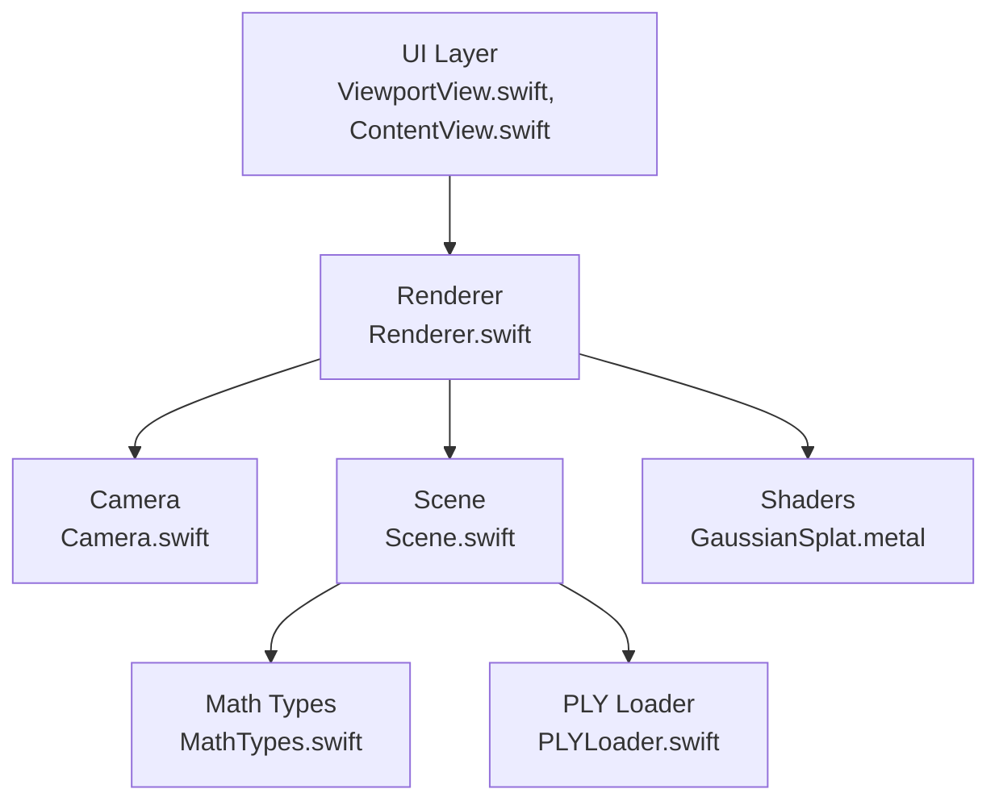
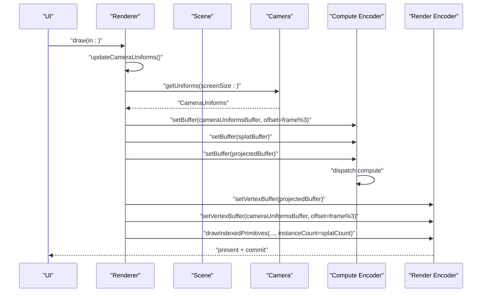
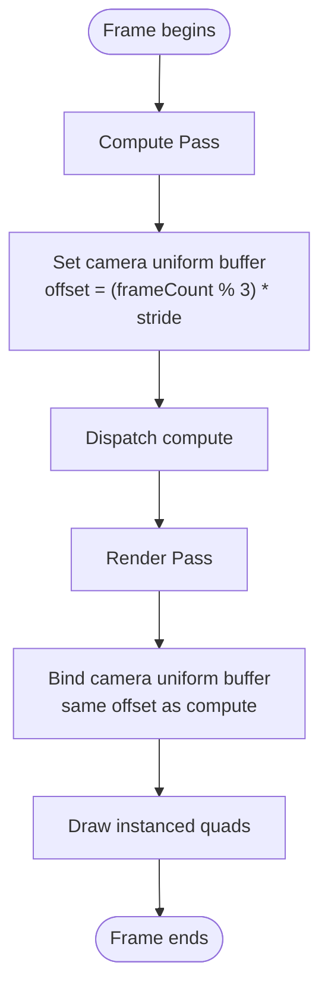
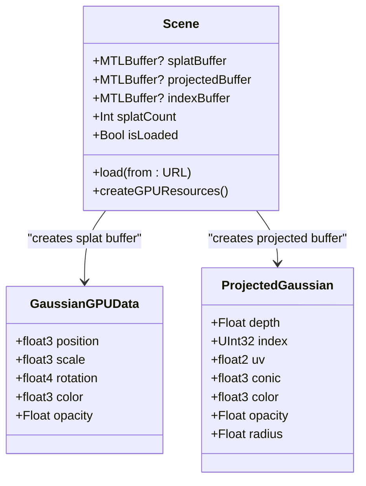
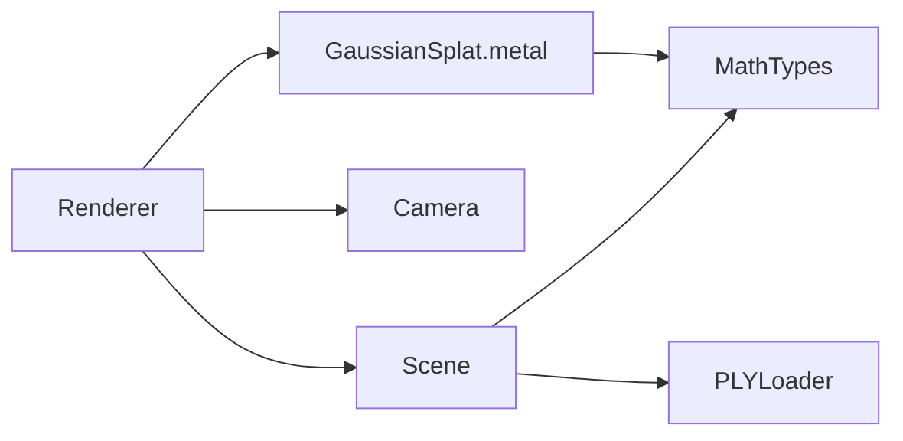

# GPU Resource Management

<cite>
**Referenced Files in This Document**
- [Renderer.swift](file://Sources/Rendering/Renderer.swift)
- [Camera.swift](file://Sources/Rendering/Camera.swift)
- [Scene.swift](file://Sources/Scene/Scene.swift)
- [MathTypes.swift](file://Sources/Math/MathTypes.swift)
- [GaussianSplat.metal](file://Sources/Shaders/GaussianSplat.metal)
- [PLYLoader.swift](file://Sources/Scene/PLYLoader.swift)
- [ViewportView.swift](file://Sources/UI/ViewportView.swift)
- [ContentView.swift](file://Sources/UI/ContentView.swift)
</cite>

## Table of Contents
1. [Introduction](#introduction)
2. [Project Structure](#project-structure)
3. [Core Components](#core-components)
4. [Architecture Overview](#architecture-overview)
5. [Detailed Component Analysis](#detailed-component-analysis)
6. [Dependency Analysis](#dependency-analysis)
7. [Performance Considerations](#performance-considerations)
8. [Troubleshooting Guide](#troubleshooting-guide)
9. [Conclusion](#conclusion)

## Introduction
This document explains GPU resource management for a Metal-based Gaussian Splatting viewer. It focuses on buffer allocation, lifecycle management, and memory optimization strategies. It covers:
- Triple-buffering for camera uniforms and CPU/GPU synchronization
- Buffer creation for Gaussian data (vertex-like data, index-like data, and uniform buffers)
- Dynamic buffer management for scene data (buffer sizing, memory mapping, and transfers)
- Resource cleanup and GPU lifecycle management
- Integration between CPU-side data structures and GPU buffer representations
- Practical buffer binding patterns, memory access optimization, and performance monitoring

## Project Structure
The project organizes GPU resource concerns across rendering, scene, math types, shaders, and UI layers. Rendering creates and binds buffers; Scene manages GPU buffers for splat data; MathTypes defines GPU-compatible structures; Shaders consume those structures; UI integrates Metal via MTKView.

**Diagram sources**
- [Renderer.swift:1-288](file://Sources/Rendering/Renderer.swift#L1-L288)
- [Camera.swift:1-184](file://Sources/Rendering/Camera.swift#L1-L184)
- [Scene.swift:1-130](file://Sources/Scene/Scene.swift#L1-L130)
- [MathTypes.swift:1-189](file://Sources/Math/MathTypes.swift#L1-L189)
- [GaussianSplat.metal:1-309](file://Sources/Shaders/GaussianSplat.metal#L1-L309)
- [PLYLoader.swift:1-386](file://Sources/Scene/PLYLoader.swift#L1-L386)
- [ViewportView.swift:1-118](file://Sources/UI/ViewportView.swift#L1-L118)
- [ContentView.swift:1-119](file://Sources/UI/ContentView.swift#L1-L119)

**Section sources**
- [Renderer.swift:1-288](file://Sources/Rendering/Renderer.swift#L1-L288)
- [Scene.swift:1-130](file://Sources/Scene/Scene.swift#L1-L130)
- [MathTypes.swift:1-189](file://Sources/Math/MathTypes.swift#L1-L189)
- [GaussianSplat.metal:1-309](file://Sources/Shaders/GaussianSplat.metal#L1-L309)
- [PLYLoader.swift:1-386](file://Sources/Scene/PLYLoader.swift#L1-L386)
- [ViewportView.swift:1-118](file://Sources/UI/ViewportView.swift#L1-L118)
- [ContentView.swift:1-119](file://Sources/UI/ContentView.swift#L1-L119)

## Core Components
- Renderer: Creates and manages Metal buffers, pipelines, and draws frames. Implements triple-buffering for camera uniforms and sets buffers in compute and render passes.
- Scene: Owns GPU buffers for splat data, projected data, and indices; creates buffers from CPU data.
- Camera: Produces CameraUniforms for GPU consumption and updates matrices.
- MathTypes: Defines GPU-compatible structures (GaussianGPUData, CameraUniforms, ProjectedGaussian) and provides conversions.
- Shaders: Consume buffers bound by Renderer and operate on GPU data.
- PLYLoader: Loads scene data from PLY files and produces CPU-side GaussianSplat arrays.
- UI: Bridges SwiftUI to Metal via MTKView and delegates drawing to Renderer.

**Section sources**
- [Renderer.swift:1-288](file://Sources/Rendering/Renderer.swift#L1-L288)
- [Scene.swift:1-130](file://Sources/Scene/Scene.swift#L1-L130)
- [Camera.swift:1-184](file://Sources/Rendering/Camera.swift#L1-L184)
- [MathTypes.swift:1-189](file://Sources/Math/MathTypes.swift#L1-L189)
- [GaussianSplat.metal:1-309](file://Sources/Shaders/GaussianSplat.metal#L1-L309)
- [PLYLoader.swift:1-386](file://Sources/Scene/PLYLoader.swift#L1-L386)
- [ViewportView.swift:1-118](file://Sources/UI/ViewportView.swift#L1-L118)
- [ContentView.swift:1-119](file://Sources/UI/ContentView.swift#L1-L119)

## Architecture Overview
The rendering pipeline uses a compute pass to project Gaussian splats and a render pass to draw instanced quads. Camera uniforms are triple-buffered to decouple CPU updates from GPU consumption.

**Diagram sources**
- [Renderer.swift:171-250](file://Sources/Rendering/Renderer.swift#L171-L250)
- [Renderer.swift:252-259](file://Sources/Rendering/Renderer.swift#L252-L259)
- [Camera.swift:133-147](file://Sources/Rendering/Camera.swift#L133-L147)
- [GaussianSplat.metal:138-198](file://Sources/Shaders/GaussianSplat.metal#L138-L198)
- [GaussianSplat.metal:202-241](file://Sources/Shaders/GaussianSplat.metal#L202-L241)

## Detailed Component Analysis

### Triple-Buffering for Camera Uniforms
Triple-buffering avoids CPU/GPU synchronization stalls by cycling through three uniform blocks. The Renderer allocates a single buffer sized for three CameraUniforms and writes to the block indicated by frameCount modulo 3. The compute and render passes bind the same offset.

Key implementation points:
- Allocation: Single MTLBuffer sized for three CameraUniforms with shared storage mode.
- Writing: updateCameraUniforms computes CameraUniforms and copies to the frame-specific offset.
- Binding: Both compute and render encoders set the camera uniform buffer with offset = (frameCount % 3) * stride.

**Diagram sources**
- [Renderer.swift:131-145](file://Sources/Rendering/Renderer.swift#L131-L145)
- [Renderer.swift:197-209](file://Sources/Rendering/Renderer.swift#L197-L209)
- [Renderer.swift:229-231](file://Sources/Rendering/Renderer.swift#L229-L231)
- [Renderer.swift:252-259](file://Sources/Rendering/Renderer.swift#L252-L259)

**Section sources**
- [Renderer.swift:131-145](file://Sources/Rendering/Renderer.swift#L131-L145)
- [Renderer.swift:197-209](file://Sources/Rendering/Renderer.swift#L197-L209)
- [Renderer.swift:229-231](file://Sources/Rendering/Renderer.swift#L229-L231)
- [Renderer.swift:252-259](file://Sources/Rendering/Renderer.swift#L252-L259)

### Buffer Creation for Gaussian Data
Scene creates GPU buffers from CPU data:
- Splat buffer: Host-visible shared storage containing GaussianGPUData entries.
- Projected buffer: Private storage for compute shader output (ProjectedGaussian per splat).
- Index buffer: Private storage for sorting indices (UInt32 per splat).

Allocation strategy:
- Splat buffer uses shared storage to enable fast CPU-to-GPU copy.
- Projected and index buffers use private storage to optimize GPU-only access.

**Diagram sources**
- [Scene.swift:51-85](file://Sources/Scene/Scene.swift#L51-L85)
- [MathTypes.swift:34-51](file://Sources/Math/MathTypes.swift#L34-L51)
- [MathTypes.swift:64-73](file://Sources/Math/MathTypes.swift#L64-L73)

**Section sources**
- [Scene.swift:51-85](file://Sources/Scene/Scene.swift#L51-L85)
- [MathTypes.swift:34-51](file://Sources/Math/MathTypes.swift#L34-L51)
- [MathTypes.swift:64-73](file://Sources/Math/MathTypes.swift#L64-L73)

### Dynamic Buffer Management for Scene Data
Dynamic management includes:
- Buffer sizing: Scene calculates buffer sizes from the number of splats and element strides.
- Memory mapping: Scene uses shared storage for splat buffer to copy CPU data into GPU memory efficiently.
- Data transfer optimization: Copy occurs once during initial load; subsequent updates use triple-buffered uniforms.

Resizing considerations:
- Current implementation does not resize buffers dynamically. If splat counts change, buffers would need recreation.

**Section sources**
- [Scene.swift:55-64](file://Sources/Scene/Scene.swift#L55-L64)
- [Scene.swift:66-80](file://Sources/Scene/Scene.swift#L66-L80)
- [Renderer.swift:131-145](file://Sources/Rendering/Renderer.swift#L131-L145)

### Resource Cleanup Strategies
Cleanup responsibilities:
- Scene clears GPU buffers and internal arrays when clearing data.
- Renderer holds references to buffers and pipelines; buffers are implicitly released when MTLDevice is deallocated or buffers go out of scope.
- No explicit deallocation code is present; Swift/Metal ownership ensures buffers are released when no longer referenced.

Lifecycle management:
- Renderer retains device and command queue; buffers are created from device.
- UI maintains MTKView; MTKView retains device and delegates to Renderer.

**Section sources**
- [Scene.swift:87-93](file://Sources/Scene/Scene.swift#L87-L93)
- [Renderer.swift:37-79](file://Sources/Rendering/Renderer.swift#L37-L79)
- [ViewportView.swift:8-31](file://Sources/UI/ViewportView.swift#L8-L31)

### Integration Between CPU and GPU Data Structures
CPU-side structures are mapped to GPU-compatible structures:
- GaussianSplat (CPU) -> GaussianGPUData (GPU)
- Camera (CPU) -> CameraUniforms (GPU)
- ProjectedGaussian (GPU output) -> consumed by vertex shader

Alignment and layout:
- Structs define explicit fields and padding to match Metal’s memory layout expectations.
- Renderer uses stride-based offsets for triple-buffering.

Serialization and conversion:
- Scene converts [GaussianSplat] to [GaussianGPUData] and copies into GPU buffer.
- Camera constructs CameraUniforms from current view/projection matrices and viewport.

**Section sources**
- [MathTypes.swift:11-30](file://Sources/Math/MathTypes.swift#L11-L30)
- [MathTypes.swift:34-51](file://Sources/Math/MathTypes.swift#L34-L51)
- [MathTypes.swift:53-62](file://Sources/Math/MathTypes.swift#L53-L62)
- [MathTypes.swift:64-73](file://Sources/Math/MathTypes.swift#L64-L73)
- [Scene.swift:55-64](file://Sources/Scene/Scene.swift#L55-L64)
- [Camera.swift:133-147](file://Sources/Rendering/Camera.swift#L133-L147)

### Buffer Binding Patterns and Memory Access Optimization
Binding patterns:
- Compute encoder binds splat buffer (input) and projected buffer (output).
- Render encoder binds projected buffer (per-instance data) and camera uniform buffer (per-frame).
- Index buffer is bound for instanced triangle drawing.

Memory access optimization:
- Shared storage for splat buffer enables efficient host-to-device copy.
- Private storage for projected and index buffers reduces memory bandwidth pressure.
- Triple-buffering eliminates contention between CPU writes and GPU reads.

**Section sources**
- [Renderer.swift:191-209](file://Sources/Rendering/Renderer.swift#L191-L209)
- [Renderer.swift:225-243](file://Sources/Rendering/Renderer.swift#L225-L243)
- [Renderer.swift:138-144](file://Sources/Rendering/Renderer.swift#L138-L144)

### Performance Monitoring for GPU Resource Utilization
Current monitoring:
- Renderer prints pipeline creation status and scene buffer sizes.
- ViewModel exposes FPS and splat count to UI.

Recommended additions:
- Use MTLCommandBuffer.encodeSignalEvent to measure GPU time per frame.
- Track buffer sizes and counts to detect leaks or excessive allocations.
- Monitor frame times and batch sizes to tune compute dispatch parameters.

**Section sources**
- [Renderer.swift:83-95](file://Sources/Rendering/Renderer.swift#L83-L95)
- [Renderer.swift:123-129](file://Sources/Rendering/Renderer.swift#L123-L129)
- [Renderer.swift:82-89](file://Sources/Rendering/Renderer.swift#L82-L89)
- [Renderer.swift:25-33](file://Sources/Rendering/Renderer.swift#L25-L33)
- [ViewportView.swift:13](file://Sources/UI/ViewportView.swift#L13)
- [ContentView.swift:19-29](file://Sources/UI/ContentView.swift#L19-L29)

## Dependency Analysis
Renderer depends on Scene for splat buffers and on Camera for uniforms. Scene depends on MathTypes for GPU-compatible structures and on PLYLoader for CPU data. Shaders depend on structures defined in MathTypes.

**Diagram sources**
- [Renderer.swift:1-288](file://Sources/Rendering/Renderer.swift#L1-L288)
- [Scene.swift:1-130](file://Sources/Scene/Scene.swift#L1-L130)
- [Camera.swift:1-184](file://Sources/Rendering/Camera.swift#L1-L184)
- [MathTypes.swift:1-189](file://Sources/Math/MathTypes.swift#L1-L189)
- [PLYLoader.swift:1-386](file://Sources/Scene/PLYLoader.swift#L1-L386)
- [GaussianSplat.metal:1-309](file://Sources/Shaders/GaussianSplat.metal#L1-L309)

**Section sources**
- [Renderer.swift:1-288](file://Sources/Rendering/Renderer.swift#L1-L288)
- [Scene.swift:1-130](file://Sources/Scene/Scene.swift#L1-L130)
- [Camera.swift:1-184](file://Sources/Rendering/Camera.swift#L1-L184)
- [MathTypes.swift:1-189](file://Sources/Math/MathTypes.swift#L1-L189)
- [PLYLoader.swift:1-386](file://Sources/Scene/PLYLoader.swift#L1-L386)
- [GaussianSplat.metal:1-309](file://Sources/Shaders/GaussianSplat.metal#L1-L309)

## Performance Considerations
- Triple-buffering: Reduces CPU/GPU synchronization stalls by writing to a different uniform block each frame.
- Storage modes: Shared for splat buffer to minimize copy overhead; Private for compute outputs to reduce bandwidth.
- Compute dispatch: Use sensible threadgroup sizes and ensure dispatch counts match splat counts.
- Instancing: Draw a single quad with per-instance ProjectedGaussian data to minimize draw calls.
- Depth sorting: Implemented as a placeholder; consider efficient GPU sorting kernels if needed.

[No sources needed since this section provides general guidance]

## Troubleshooting Guide
Common issues and remedies:
- Buffer creation failures: Scene throws a dedicated error when buffer creation fails; ensure device availability and sufficient memory.
- Missing shader functions: Renderer checks for compute and vertex/fragment functions; verify shader compilation and function names.
- No splats loaded: Scene exposes isLoaded; ensure PLYLoader successfully parses the file and initializes splats.
- Uniforms not updating: Verify frameCount modulo and stride calculations in updateCameraUniforms and buffer binding.

**Section sources**
- [Scene.swift:126-129](file://Sources/Scene/Scene.swift#L126-L129)
- [Renderer.swift:83-95](file://Sources/Rendering/Renderer.swift#L83-L95)
- [Renderer.swift:149-162](file://Sources/Rendering/Renderer.swift#L149-L162)
- [Renderer.swift:252-259](file://Sources/Rendering/Renderer.swift#L252-L259)

## Conclusion
The project implements robust GPU resource management with triple-buffered camera uniforms, efficient buffer creation using Metal’s storage modes, and clear separation between CPU and GPU data structures. The rendering pipeline binds buffers appropriately for compute and render passes, and the UI integrates seamlessly with Metal via MTKView. Future enhancements could include dynamic buffer resizing, explicit resource cleanup hooks, and GPU timing instrumentation for deeper performance insights.