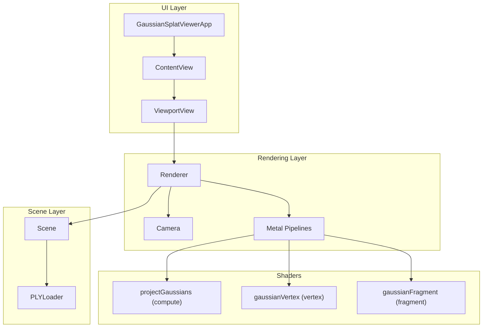
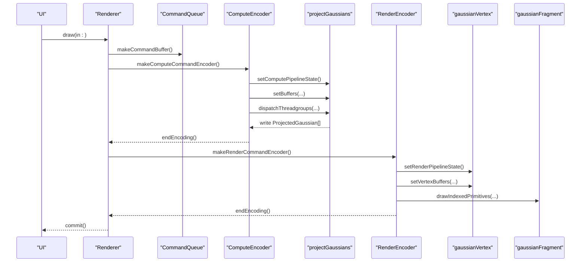
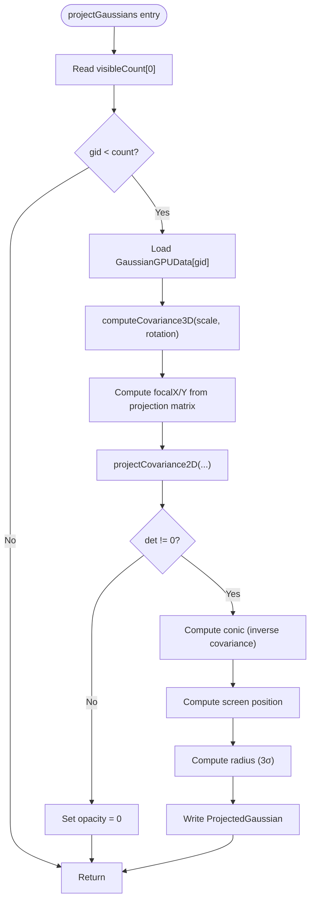
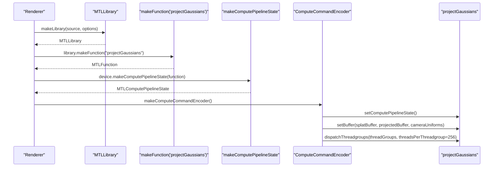
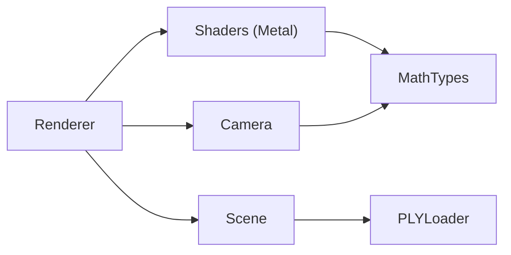

# Compute Shader Optimization

<cite>
**Referenced Files in This Document**
- [GaussianSplat.metal](file://Sources/Shaders/GaussianSplat.metal)
- [Renderer.swift](file://Sources/Rendering/Renderer.swift)
- [MathTypes.swift](file://Sources/Math/MathTypes.swift)
- [Camera.swift](file://Sources/Rendering/Camera.swift)
- [Scene.swift](file://Sources/Scene/Scene.swift)
- [PLYLoader.swift](file://Sources/Scene/PLYLoader.swift)
- [ContentView.swift](file://Sources/UI/ContentView.swift)
- [ViewportView.swift](file://Sources/UI/ViewportView.swift)
- [GaussianSplatViewerApp.swift](file://Sources/GaussianSplatViewerApp.swift)
- [Package.swift](file://Package.swift)
</cite>

## Table of Contents
1. [Introduction](#introduction)
2. [Project Structure](#project-structure)
3. [Core Components](#core-components)
4. [Architecture Overview](#architecture-overview)
5. [Detailed Component Analysis](#detailed-component-analysis)
6. [Dependency Analysis](#dependency-analysis)
7. [Performance Considerations](#performance-considerations)
8. [Troubleshooting Guide](#troubleshooting-guide)
9. [Conclusion](#conclusion)
10. [Appendices](#appendices)

## Introduction
This document focuses on compute shader optimization techniques for maximizing Gaussian projection performance in a Metal-based viewer. It explains thread group sizing strategies, memory access patterns, computational efficiency, and the implementation of the projectGaussians compute kernel. It also covers Metal compute pipeline state creation, function compilation, error handling, and practical profiling approaches using Xcode’s GPU Frame Debugger.

## Project Structure
The project is organized around a SwiftUI/Metal application that loads Gaussian splat data from PLY files, computes projections on the GPU, and renders them as textured quads. The compute shader performs per-gaussian projection and covariance computation, while the render pipeline draws instanced quads with alpha blending.

**Diagram sources**
- [ContentView.swift:1-119](file://Sources/UI/ContentView.swift#L1-L119)
- [ViewportView.swift:1-118](file://Sources/UI/ViewportView.swift#L1-L118)
- [Renderer.swift:1-288](file://Sources/Rendering/Renderer.swift#L1-L288)
- [Camera.swift:1-184](file://Sources/Rendering/Camera.swift#L1-L184)
- [Scene.swift:1-130](file://Sources/Scene/Scene.swift#L1-L130)
- [PLYLoader.swift:1-386](file://Sources/Scene/PLYLoader.swift#L1-L386)
- [GaussianSplat.metal:138-198](file://Sources/Shaders/GaussianSplat.metal#L138-L198)

**Section sources**
- [Package.swift:1-17](file://Package.swift#L1-L17)
- [ContentView.swift:1-119](file://Sources/UI/ContentView.swift#L1-L119)
- [ViewportView.swift:1-118](file://Sources/UI/ViewportView.swift#L1-L118)
- [Renderer.swift:1-288](file://Sources/Rendering/Renderer.swift#L1-L288)
- [Camera.swift:1-184](file://Sources/Rendering/Camera.swift#L1-L184)
- [Scene.swift:1-130](file://Sources/Scene/Scene.swift#L1-L130)
- [PLYLoader.swift:1-386](file://Sources/Scene/PLYLoader.swift#L1-L386)
- [GaussianSplat.metal:138-198](file://Sources/Shaders/GaussianSplat.metal#L138-L198)

## Core Components
- Compute shader: projectGaussians performs per-gaussian projection, covariance computation, and outputs ProjectedGaussian data.
- Renderer: sets up Metal compute and render pipelines, dispatches compute, and drives the render pass.
- Scene: manages CPU/GPU buffers for splat data and projected output.
- Camera: provides view/projection matrices and uniforms for the shader.
- Math types: define GPU-compatible structures and math helpers.

Key implementation references:
- Compute kernel: [projectGaussians:138-198](file://Sources/Shaders/GaussianSplat.metal#L138-L198)
- Pipeline creation: [createComputePipeline:83-95](file://Sources/Rendering/Renderer.swift#L83-L95), [createRenderPipeline:97-129](file://Sources/Rendering/Renderer.swift#L97-L129)
- Dispatch configuration: [draw(in:):171-250](file://Sources/Rendering/Renderer.swift#L171-L250)
- GPU data structures: [GaussianGPUData:35-51](file://Sources/Math/MathTypes.swift#L35-L51), [ProjectedGaussian:65-73](file://Sources/Math/MathTypes.swift#L65-L73), [CameraUniforms:54-62](file://Sources/Math/MathTypes.swift#L54-L62)

**Section sources**
- [GaussianSplat.metal:138-198](file://Sources/Shaders/GaussianSplat.metal#L138-L198)
- [Renderer.swift:83-129](file://Sources/Rendering/Renderer.swift#L83-L129)
- [Renderer.swift:171-250](file://Sources/Rendering/Renderer.swift#L171-L250)
- [MathTypes.swift:35-73](file://Sources/Math/MathTypes.swift#L35-L73)

## Architecture Overview
The compute pass transforms per-gaussian data into projected attributes. The render pass draws instanced quads using the computed ProjectedGaussian data.

**Diagram sources**
- [Renderer.swift:171-250](file://Sources/Rendering/Renderer.swift#L171-L250)
- [GaussianSplat.metal:138-198](file://Sources/Shaders/GaussianSplat.metal#L138-L198)

## Detailed Component Analysis

### Compute Shader: projectGaussians
- Purpose: For each visible Gaussian, compute 3D covariance from scale and rotation, project to 2D, invert covariance to conic form, compute screen-space position and radius, and write ProjectedGaussian.
- Thread indexing: Uses global thread ID (gid) to index into the visible count and Gaussian arrays.
- Atomic usage: The shader signature declares a device atomic_uint buffer for visibleCount; however, the compute kernel reads visibleCount[0] and uses it as a bound. No atomic operations are performed inside projectGaussians.
- Output: Writes ProjectedGaussian entries into the projected buffer.

**Diagram sources**
- [GaussianSplat.metal:138-198](file://Sources/Shaders/GaussianSplat.metal#L138-L198)
- [GaussianSplat.metal:65-74](file://Sources/Shaders/GaussianSplat.metal#L65-L74)
- [GaussianSplat.metal:77-134](file://Sources/Shaders/GaussianSplat.metal#L77-L134)

**Section sources**
- [GaussianSplat.metal:138-198](file://Sources/Shaders/GaussianSplat.metal#L138-L198)
- [GaussianSplat.metal:65-74](file://Sources/Shaders/GaussianSplat.metal#L65-L74)
- [GaussianSplat.metal:77-134](file://Sources/Shaders/GaussianSplat.metal#L77-L134)

### Metal Compute Pipeline and Dispatch
- Function compilation: The Metal library is compiled from source at runtime and the compute function “projectGaussians” is resolved.
- Pipeline state: A compute pipeline state is created from the compute function.
- Dispatch: Dispatches with a fixed threadGroupSize of 256 threads and computes threadGroups based on splatCount.

**Diagram sources**
- [Renderer.swift:46-55](file://Sources/Rendering/Renderer.swift#L46-L55)
- [Renderer.swift:83-95](file://Sources/Rendering/Renderer.swift#L83-L95)
- [Renderer.swift:189-208](file://Sources/Rendering/Renderer.swift#L189-L208)

**Section sources**
- [Renderer.swift:46-55](file://Sources/Rendering/Renderer.swift#L46-L55)
- [Renderer.swift:83-95](file://Sources/Rendering/Renderer.swift#L83-L95)
- [Renderer.swift:189-208](file://Sources/Rendering/Renderer.swift#L189-L208)

### Data Structures and Alignment
- GaussianGPUData: GPU-compatible structure containing position, scale, rotation, color, and opacity. Padding fields are present to align members to 16-byte boundaries for efficient device memory access.
- ProjectedGaussian: Contains depth, index, uv, conic (A,B,C), color, opacity, and radius.
- CameraUniforms: Holds matrices and screen/tanHalfFov for the shader.

Alignment and memory layout:
- Device buffers are created with storageModeShared for camera uniforms and storageModePrivate for splat/projected buffers. Proper alignment ensures coalesced access patterns.

**Section sources**
- [MathTypes.swift:35-73](file://Sources/Math/MathTypes.swift#L35-L73)
- [Scene.swift:52-85](file://Sources/Scene/Scene.swift#L52-L85)

### Rendering Pipeline and Instanced Drawing
- Render pipeline: Vertex and fragment functions are resolved from the library and configured with alpha blending.
- Instanced drawing: Draws indexed triangles using the projected buffer as vertex buffer and a quad index buffer for instanced quads.

**Section sources**
- [Renderer.swift:97-129](file://Sources/Rendering/Renderer.swift#L97-L129)
- [Renderer.swift:221-246](file://Sources/Rendering/Renderer.swift#L221-L246)
- [Scene.swift:131-145](file://Sources/Scene/Scene.swift#L131-L145)

## Dependency Analysis
- Renderer depends on Camera for uniforms and Scene for GPU buffers.
- Scene depends on PLYLoader for data ingestion and creates GPU buffers for splats and projections.
- Shaders depend on MathTypes for GPU-compatible structures and on Camera for uniforms.

**Diagram sources**
- [Renderer.swift:1-288](file://Sources/Rendering/Renderer.swift#L1-L288)
- [Camera.swift:1-184](file://Sources/Rendering/Camera.swift#L1-L184)
- [Scene.swift:1-130](file://Sources/Scene/Scene.swift#L1-L130)
- [PLYLoader.swift:1-386](file://Sources/Scene/PLYLoader.swift#L1-L386)
- [MathTypes.swift:1-189](file://Sources/Math/MathTypes.swift#L1-L189)
- [GaussianSplat.metal:138-198](file://Sources/Shaders/GaussianSplat.metal#L138-L198)

**Section sources**
- [Renderer.swift:1-288](file://Sources/Rendering/Renderer.swift#L1-L288)
- [Camera.swift:1-184](file://Sources/Rendering/Camera.swift#L1-L184)
- [Scene.swift:1-130](file://Sources/Scene/Scene.swift#L1-L130)
- [PLYLoader.swift:1-386](file://Sources/Scene/PLYLoader.swift#L1-L386)
- [MathTypes.swift:1-189](file://Sources/Math/MathTypes.swift#L1-L189)
- [GaussianSplat.metal:138-198](file://Sources/Shaders/GaussianSplat.metal#L138-L198)

## Performance Considerations

### Thread Group Sizing Strategies
- Current configuration: threadsPerThreadgroup = 256. This is a common choice for Metal compute because it aligns well with GPU warp sizes and maximizes occupancy on many architectures.
- Dispatch sizing: threadGroups are calculated as (count + 255) / 256 to ensure full coverage of all visible Gaussians.

Optimization opportunities:
- Verify occupancy and latency with different sizes (e.g., 128 or 512) depending on workload characteristics.
- Ensure the total number of dispatched threads equals or exceeds the number of active Gaussians to avoid under-utilization.

**Section sources**
- [Renderer.swift:202-208](file://Sources/Rendering/Renderer.swift#L202-L208)

### Memory Access Patterns and Bandwidth Utilization
- Coalesced access: The compute shader accesses GaussianGPUData and writes ProjectedGaussian sequentially by gid. This promotes coalesced reads/writes when threads in a warp access consecutive elements.
- Buffer alignment: GaussianGPUData includes padding fields to maintain 16-byte alignment, improving memory throughput on Metal devices.
- Storage modes:
  - Camera uniforms: storageModeShared for CPU/GPU sharing.
  - Splats and projections: storageModePrivate for GPU-only access, reducing contention.

Recommendations:
- Keep data structures aligned to 16-byte boundaries.
- Prefer sequential access patterns and avoid strided or scattered reads/writes.
- Minimize redundant data movement; reuse buffers across passes when possible.

**Section sources**
- [MathTypes.swift:35-51](file://Sources/Math/MathTypes.swift#L35-L51)
- [Scene.swift:52-85](file://Sources/Scene/Scene.swift#L52-L85)
- [Renderer.swift:131-145](file://Sources/Rendering/Renderer.swift#L131-L145)

### Computational Efficiency Improvements
- Vectorized operations: The shader uses scalar math; Metal compute benefits from vector registers and SIMD-friendly patterns. Consider vectorizing math operations where feasible (e.g., using float3/float4 operations) to improve throughput.
- Shared memory usage: The current compute kernel does not use shared memory. For future enhancements, consider tiled or grouped computations if the workload grows larger and requires intermediate aggregation.
- Redundant calculation elimination:
  - Early exit when determinant is zero avoids unnecessary work.
  - Avoid recomputing constants if they can be passed via uniforms or precomputed.

**Section sources**
- [GaussianSplat.metal:167-174](file://Sources/Shaders/GaussianSplat.metal#L167-L174)
- [GaussianSplat.metal:138-198](file://Sources/Shaders/GaussianSplat.metal#L138-L198)

### Atomic Operations Usage
- Declaration: The compute kernel signature declares a device atomic_uint buffer for visibleCount.
- Actual usage: The kernel reads visibleCount[0] and uses it as a bound; no atomic operations are performed inside the kernel.
- Implications: If visibleCount is intended to be updated atomically elsewhere (e.g., a separate compute pass), ensure proper synchronization and ordering.

Recommendations:
- If visibility filtering is dynamic, consider using atomic operations to safely update counts and synchronize across threads.
- Alternatively, precompute and pass a bound to avoid atomic overhead.

**Section sources**
- [GaussianSplat.metal:141-146](file://Sources/Shaders/GaussianSplat.metal#L141-L146)
- [GaussianSplat.metal:138-198](file://Sources/Shaders/GaussianSplat.metal#L138-L198)

### Sorting Kernel (Bitonic Sort)
- Purpose: Provides a simple bitonic sort kernel for depth sorting.
- Implementation: Swaps ProjectedGaussian entries and associated indices based on depth comparison.
- Notes: The sorting pass is currently a placeholder in the renderer.

Recommendations:
- Implement iterative bitonic stages with appropriate stage and step parameters.
- Consider using Metal Performance Shaders (MPS) sorting primitives for production workloads.

**Section sources**
- [GaussianSplat.metal:274-308](file://Sources/Shaders/GaussianSplat.metal#L274-L308)
- [Renderer.swift:214-218](file://Sources/Rendering/Renderer.swift#L214-L218)

## Troubleshooting Guide

### Metal Pipeline and Function Compilation Errors
- Library compilation: Errors during makeLibrary(source, options) indicate shader compilation failures. Check for syntax errors or unsupported constructs.
- Function resolution: If makeFunction(name:) fails, verify the function name matches the kernel name in the shader.
- Pipeline creation: Errors during makeComputePipelineState or makeRenderPipelineState indicate pipeline configuration issues.

Mitigation:
- Validate shader compilation logs and fix syntax errors.
- Ensure function names match between Swift and Metal.
- Confirm pipeline descriptor settings (blend factors, attachments) are correct.

**Section sources**
- [Renderer.swift:46-55](file://Sources/Rendering/Renderer.swift#L46-L55)
- [Renderer.swift:83-95](file://Sources/Rendering/Renderer.swift#L83-L95)
- [Renderer.swift:97-129](file://Sources/Rendering/Renderer.swift#L97-L129)

### Compute Dispatch Issues
- Incorrect thread group sizing: If performance is poor, adjust threadsPerThreadgroup and recalculate threadGroups accordingly.
- Buffer binding: Ensure splatBuffer and projectedBuffer are set before dispatch and that offsets are correct.

**Section sources**
- [Renderer.swift:189-208](file://Sources/Rendering/Renderer.swift#L189-L208)

### Profiling with Xcode GPU Frame Debugger
- Steps:
  - Run the app in Xcode with GPU Frame Debugger attached.
  - Observe compute dispatches and render passes.
  - Inspect memory bandwidth and coalescing by examining buffer access patterns.
  - Identify hotspots: heavy compute kernels, texture bandwidth, or primitive overdraw.
- Practical tips:
  - Compare performance with different thread group sizes (e.g., 128 vs 256 vs 512).
  - Profile with and without alpha blending to isolate rasterization costs.
  - Use the debugger to verify that ProjectedGaussian writes are coherent and not causing stalls.

[No sources needed since this section provides general guidance]

## Conclusion
The project implements an efficient compute-first Gaussian projection pipeline using Metal. The compute shader performs per-gaussian projection and covariance inversion, while the render pass draws instanced quads with alpha blending. Current optimizations include 256-thread groups, aligned data structures, and early exits. Future enhancements can leverage vectorized operations, shared memory, and robust atomic updates for dynamic visibility. Profiling with Xcode’s GPU Frame Debugger is essential to validate performance and identify bottlenecks.

## Appendices

### Practical Example: Compute Shader Profiling Workflow
- Open the project in Xcode.
- Attach GPU Frame Debugger.
- Navigate to the frame where the compute pass executes.
- Inspect:
  - Compute dispatch metrics (threads per threadgroup, threadgroups).
  - Memory bandwidth and coalescing.
  - Render pass timing and blending cost.
- Iterate:
  - Adjust thread group size and re-profile.
  - Optimize memory access patterns and reduce redundant calculations.

[No sources needed since this section provides general guidance]