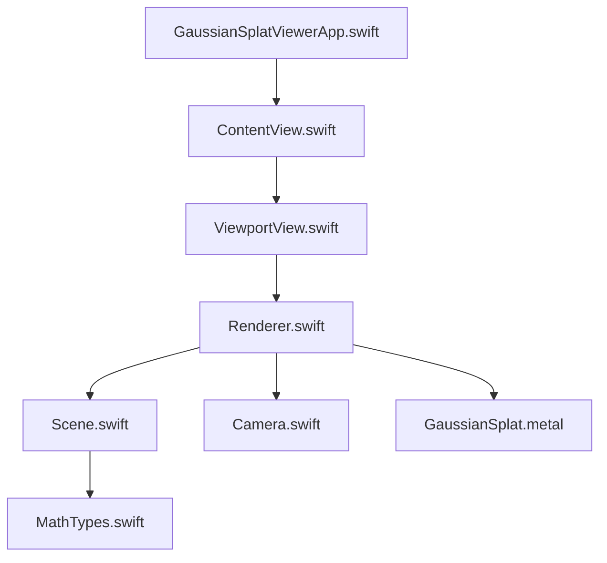
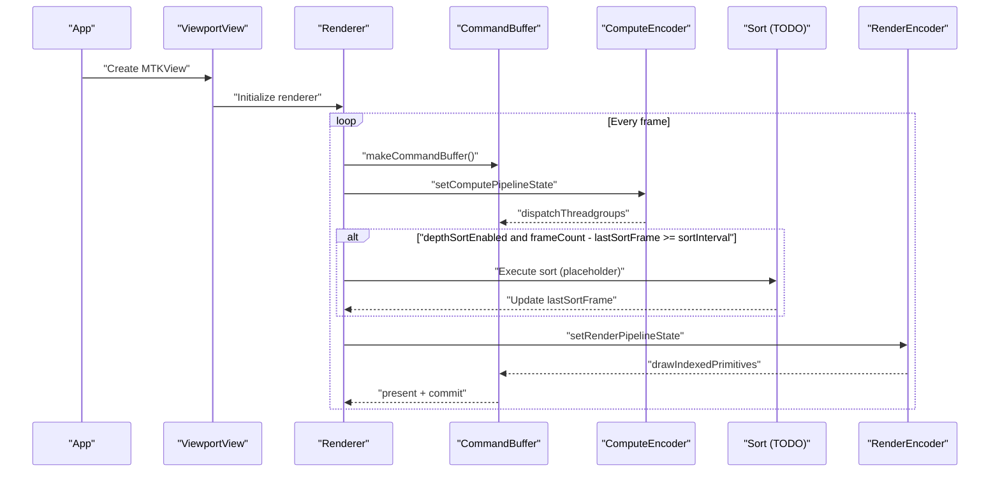
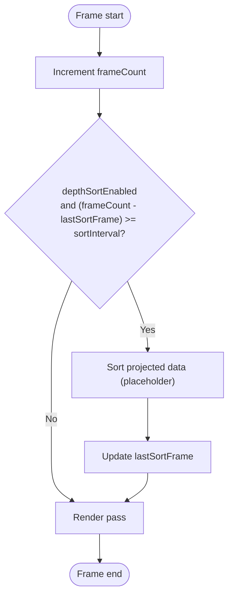
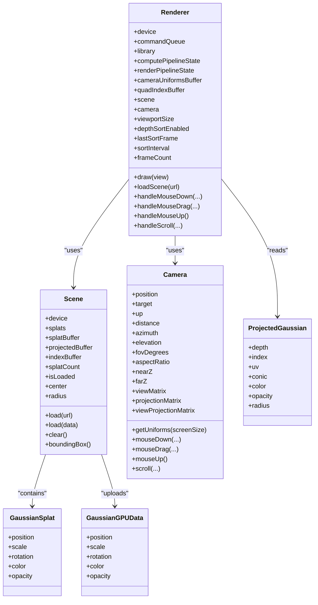

# Frame Rate Optimization

<cite>
**Referenced Files in This Document**
- [Renderer.swift](file://Sources/Rendering/Renderer.swift)
- [Scene.swift](file://Sources/Scene/Scene.swift)
- [MathTypes.swift](file://Sources/Math/MathTypes.swift)
- [Camera.swift](file://Sources/Rendering/Camera.swift)
- [GaussianSplat.metal](file://Sources/Shaders/GaussianSplat.metal)
- [ViewportView.swift](file://Sources/UI/ViewportView.swift)
- [ContentView.swift](file://Sources/UI/ContentView.swift)
- [GaussianSplatViewerApp.swift](file://Sources/GaussianSplatViewerApp.swift)
- [Package.swift](file://Package.swift)
</cite>

## Table of Contents
1. [Introduction](#introduction)
2. [Project Structure](#project-structure)
3. [Core Components](#core-components)
4. [Architecture Overview](#architecture-overview)
5. [Detailed Component Analysis](#detailed-component-analysis)
6. [Dependency Analysis](#dependency-analysis)
7. [Performance Considerations](#performance-considerations)
8. [Troubleshooting Guide](#troubleshooting-guide)
9. [Conclusion](#conclusion)
10. [Appendices](#appendices)

## Introduction
This document focuses on frame rate optimization techniques for a Metal-based Gaussian Splatting viewer. It explains the frame-based depth sorting strategy, frame counting and timing mechanisms, CPU-GPU synchronization, profiling approaches, and platform-specific optimizations. It also provides practical guidance for identifying bottlenecks, implementing optimizations, and measuring performance.

## Project Structure
The project is organized around a SwiftUI app that hosts a Metal viewport. Rendering is handled by a dedicated renderer that manages Metal device, command queues, pipelines, and buffers. Scene data is loaded from PLY files and represented as Gaussian splats with GPU buffers. Shaders implement compute and rasterization passes for projecting splats and drawing them as textured quads.

**Diagram sources**
- [GaussianSplatViewerApp.swift:1-27](file://Sources/GaussianSplatViewerApp.swift#L1-L27)
- [ContentView.swift:1-119](file://Sources/UI/ContentView.swift#L1-L119)
- [ViewportView.swift:1-118](file://Sources/UI/ViewportView.swift#L1-L118)
- [Renderer.swift:1-288](file://Sources/Rendering/Renderer.swift#L1-L288)
- [Scene.swift:1-130](file://Sources/Scene/Scene.swift#L1-L130)
- [Camera.swift:1-184](file://Sources/Rendering/Camera.swift#L1-L184)
- [GaussianSplat.metal:1-309](file://Sources/Shaders/GaussianSplat.metal#L1-L309)
- [MathTypes.swift:1-189](file://Sources/Math/MathTypes.swift#L1-L189)

**Section sources**
- [GaussianSplatViewerApp.swift:1-27](file://Sources/GaussianSplatViewerApp.swift#L1-L27)
- [ContentView.swift:1-119](file://Sources/UI/ContentView.swift#L1-L119)
- [ViewportView.swift:1-118](file://Sources/UI/ViewportView.swift#L1-L118)
- [Renderer.swift:1-288](file://Sources/Rendering/Renderer.swift#L1-L288)
- [Scene.swift:1-130](file://Sources/Scene/Scene.swift#L1-L130)
- [Camera.swift:1-184](file://Sources/Rendering/Camera.swift#L1-L184)
- [GaussianSplat.metal:1-309](file://Sources/Shaders/GaussianSplat.metal#L1-L309)
- [MathTypes.swift:1-189](file://Sources/Math/MathTypes.swift#L1-L189)

## Core Components
- Renderer: Manages Metal device, command queue, pipelines, buffers, camera, and the draw loop. Implements frame counting and a configurable depth sorting schedule.
- Scene: Loads Gaussian splats from PLY, creates GPU buffers, and computes scene bounds.
- Camera: Provides view/projection matrices and uniforms for shaders.
- Shaders: Compute pass projects splats; vertex/fragment shaders draw instanced quads with alpha blending.
- UI: SwiftUI app and views integrate the Metal viewport and expose FPS and file info.

Key performance-relevant elements:
- Frame-based depth sorting with a configurable interval (default 5 frames).
- Triple-buffered camera uniforms for CPU/GPU synchronization.
- Alpha blending enabled for correct compositing.
- Compute dispatch tuned to splat count.

**Section sources**
- [Renderer.swift:29-34](file://Sources/Rendering/Renderer.swift#L29-L34)
- [Renderer.swift:171-250](file://Sources/Rendering/Renderer.swift#L171-L250)
- [Scene.swift:52-85](file://Sources/Scene/Scene.swift#L52-L85)
- [Camera.swift:134-147](file://Sources/Rendering/Camera.swift#L134-L147)
- [GaussianSplat.metal:138-198](file://Sources/Shaders/GaussianSplat.metal#L138-L198)
- [GaussianSplat.metal:202-270](file://Sources/Shaders/GaussianSplat.metal#L202-L270)

## Architecture Overview
The rendering pipeline consists of:
1) Compute pass: Project Gaussian splats to screen space and produce per-splat projected data.
2) Optional depth sorting: Reorder projected data every N frames to reduce overdraw.
3) Render pass: Draw instanced quads with alpha blending.

**Diagram sources**
- [Renderer.swift:171-250](file://Sources/Rendering/Renderer.swift#L171-L250)
- [GaussianSplat.metal:138-198](file://Sources/Shaders/GaussianSplat.metal#L138-L198)
- [GaussianSplat.metal:202-270](file://Sources/Shaders/GaussianSplat.metal#L202-L270)

## Detailed Component Analysis

### Frame-Based Depth Sorting Strategy
- Configuration: The renderer tracks frameCount and lastSortFrame, and sorts every sortInterval frames (default 5).
- Purpose: Reduces overdraw by drawing farther splats first, improving alpha blending throughput.
- Current state: The sorting step is a placeholder and does not yet reorder projected data.

**Diagram sources**
- [Renderer.swift:214-218](file://Sources/Rendering/Renderer.swift#L214-L218)
- [Renderer.swift:30-33](file://Sources/Rendering/Renderer.swift#L30-L33)

Optimization alternatives:
- Dynamic sort interval: Increase interval when CPU/GPU load is high; decrease when visibility improves.
- Adaptive sorting: Sort only visible splats or use spatial partitioning to reduce work.
- Asynchronous sort: Offload sorting to a separate compute pass and synchronize via barriers.

**Section sources**
- [Renderer.swift:29-34](file://Sources/Rendering/Renderer.swift#L29-L34)
- [Renderer.swift:214-218](file://Sources/Rendering/Renderer.swift#L214-L218)
- [GaussianSplat.metal:274-308](file://Sources/Shaders/GaussianSplat.metal#L274-L308)

### Frame Counting, Timing, and Monitoring
- Frame counting: Incremented per frame in the draw loop.
- Timing: Scene loading measures elapsed time using a monotonic timer.
- Monitoring: ViewModel exposes an FPS publisher; however, FPS calculation is not implemented in the current code.

Recommended additions:
- Rolling average FPS calculation in the renderer using timestamps.
- Frame duration histogram for detecting stalls.
- UI overlay to display instantaneous and average FPS.

**Section sources**
- [Renderer.swift:182](file://Sources/Rendering/Renderer.swift#L182)
- [Scene.swift:28-32](file://Sources/Scene/Scene.swift#L28-L32)
- [ViewportView.swift:99](file://Sources/UI/ViewportView.swift#L99)

### CPU-GPU Synchronization and Command Buffer Management
- Triple-buffered camera uniforms: Uses modulo arithmetic to select the next uniform slot each frame, avoiding CPU/GPU conflicts.
- Command buffer lifecycle: Created per frame, presented, and committed.
- Compute dispatch sizing: Thread groups sized to cover all splats with a fixed group size.

Optimization opportunities:
- Use a command queue with multiple command buffers for better overlap.
- Employ asynchronous compute scheduling and pipeline barriers to hide latency.
- Reduce uniform updates when camera state is unchanged.

**Section sources**
- [Renderer.swift:197-208](file://Sources/Rendering/Renderer.swift#L197-L208)
- [Renderer.swift:255-259](file://Sources/Rendering/Renderer.swift#L255-L259)
- [Renderer.swift:248-249](file://Sources/Rendering/Renderer.swift#L248-L249)

### Rendering Passes and Blending
- Compute pass: Projects splats and writes per-splat data consumed by the render pass.
- Render pass: Draws instanced quads with alpha blending enabled to composite translucent splats.
- Depth testing: Enabled with less-than compare and depth writes.

Optimization opportunities:
- Minimize overdraw by sorting and early discard.
- Use primitive restart or indexed draws efficiently.
- Consider tiled forward or deferred approaches for large splat counts.

**Section sources**
- [Renderer.swift:187-212](file://Sources/Rendering/Renderer.swift#L187-L212)
- [Renderer.swift:221-246](file://Sources/Rendering/Renderer.swift#L221-L246)
- [GaussianSplat.metal:113-121](file://Sources/Shaders/GaussianSplat.metal#L113-L121)

### Data Structures and GPU Buffers
- GaussianGPUData: CPU-to-GPU representation of splats.
- ProjectedGaussian: Output of compute pass used for rendering.
- Buffers: Splats buffer (shared), projected buffer (private), index buffer (private).

Considerations:
- Storage modes: Shared vs private affect bandwidth and coherency.
- Buffer sizes: Proportional to splat count; monitor memory usage.

**Section sources**
- [MathTypes.swift:34-73](file://Sources/Math/MathTypes.swift#L34-L73)
- [Scene.swift:52-85](file://Sources/Scene/Scene.swift#L52-L85)

### Camera and Uniforms
- CameraUniforms: View, projection, view-projection matrices, camera position, screen size, and tangent of half FOV.
- Triple-buffering: Uniforms are written to a rotating slot to avoid contention.

**Section sources**
- [MathTypes.swift:54-62](file://Sources/Math/MathTypes.swift#L54-L62)
- [Camera.swift:134-147](file://Sources/Rendering/Camera.swift#L134-L147)
- [Renderer.swift:255-259](file://Sources/Rendering/Renderer.swift#L255-L259)

## Dependency Analysis

**Diagram sources**
- [Renderer.swift:7-79](file://Sources/Rendering/Renderer.swift#L7-L79)
- [Scene.swift:5-22](file://Sources/Scene/Scene.swift#L5-L22)
- [Camera.swift:5-60](file://Sources/Rendering/Camera.swift#L5-L60)
- [MathTypes.swift:12-73](file://Sources/Math/MathTypes.swift#L12-L73)

**Section sources**
- [Renderer.swift:7-79](file://Sources/Rendering/Renderer.swift#L7-L79)
- [Scene.swift:5-22](file://Sources/Scene/Scene.swift#L5-L22)
- [Camera.swift:5-60](file://Sources/Rendering/Camera.swift#L5-L60)
- [MathTypes.swift:12-73](file://Sources/Math/MathTypes.swift#L12-L73)

## Performance Considerations

### Frame-Based Depth Sorting
- Default interval: 5 frames. Increasing the interval reduces CPU/GPU work but may increase overdraw.
- Impact: Sorting cost scales with number of splats; consider bitonic or merge-based kernels for larger datasets.
- Alternatives: Spatial sorting, hierarchical buckets, or dynamic intervals based on motion and visibility.

**Section sources**
- [Renderer.swift:30-33](file://Sources/Rendering/Renderer.swift#L30-L33)
- [GaussianSplat.metal:274-308](file://Sources/Shaders/GaussianSplat.metal#L274-L308)

### Frame Counting and Timing
- Current: frameCount incremented per frame; no FPS calculation.
- Recommendation: Track timestamps per frame and compute rolling averages for FPS and frame durations.

**Section sources**
- [Renderer.swift:182](file://Sources/Rendering/Renderer.swift#L182)

### CPU-GPU Synchronization
- Triple-buffered uniforms mitigate contention; ensure consistent offsets.
- Command buffer per frame is simple but can be improved with multiple buffers and asynchronous scheduling.

**Section sources**
- [Renderer.swift:197-208](file://Sources/Rendering/Renderer.swift#L197-L208)
- [Renderer.swift:255-259](file://Sources/Rendering/Renderer.swift#L255-L259)

### Rendering Throughput
- Alpha blending: Correctly configured for translucent splats; keep blend factors consistent.
- Instanced rendering: Efficient for large splat counts; ensure index buffer usage is optimal.

**Section sources**
- [Renderer.swift:113-121](file://Sources/Rendering/Renderer.swift#L113-L121)
- [Renderer.swift:234-243](file://Sources/Rendering/Renderer.swift#L234-L243)

### Platform-Specific Optimizations
- macOS target: The app targets macOS 12+; leverage Metal features available on modern GPUs.
- Power management: No explicit power-aware throttling; consider adjusting sort interval or resolution scaling under thermal constraints.
- Thermal throttling: Monitor frame times and reduce workload dynamically if sustained stalls occur.

**Section sources**
- [Package.swift:6](file://Package.swift#L6)

## Troubleshooting Guide

Common issues and remedies:
- Stuttering or low FPS:
  - Verify sort interval tuning and ensure sorting is not overly frequent.
  - Confirm triple-buffered uniform updates are consistent.
  - Check for excessive overdraw; consider increasing sort interval or enabling early discard in shaders.

- Incorrect blending:
  - Ensure alpha blending is enabled and blend factors match premultiplied alpha.
  - Validate depth buffer settings and compare function.

- High CPU usage:
  - Reduce sort interval or defer sorting to background.
  - Minimize uniform updates when camera is static.

- Memory pressure:
  - Monitor GPU buffer sizes; large splat counts require significant VRAM.

**Section sources**
- [Renderer.swift:113-121](file://Sources/Rendering/Renderer.swift#L113-L121)
- [Renderer.swift:214-218](file://Sources/Rendering/Renderer.swift#L214-L218)
- [Scene.swift:52-85](file://Sources/Scene/Scene.swift#L52-L85)

## Conclusion
The Gaussian Splatting viewer implements a solid foundation for Metal rendering with a frame-based depth sorting strategy and triple-buffered uniforms. To maximize throughput and stability:
- Implement the depth sorting kernel and tune the sort interval dynamically.
- Add robust frame timing and FPS monitoring.
- Optimize CPU-GPU synchronization with asynchronous compute scheduling.
- Profile with Metal System Trace and GPU counters to identify bottlenecks.
- Consider platform-specific adjustments for power and thermal constraints.

## Appendices

### Practical Profiling Methodology
- Use Metal System Trace to capture command buffers, compute dispatches, and render passes.
- Collect GPU performance counters (fill rate, memory bandwidth, shader throughput).
- Analyze frame timing histograms to detect stalls and jitter.
- Correlate CPU time with compute dispatches and uniform updates.

### Example Bottleneck Identification and Fixes
- Overdraw hotspots: Increase sort interval or enable early discard in fragment shader.
- Compute-bound: Reduce dispatched work or split compute into smaller batches.
- CPU-bound: Move heavy tasks off the main thread and optimize uniform updates.

[No sources needed since this section provides general guidance]