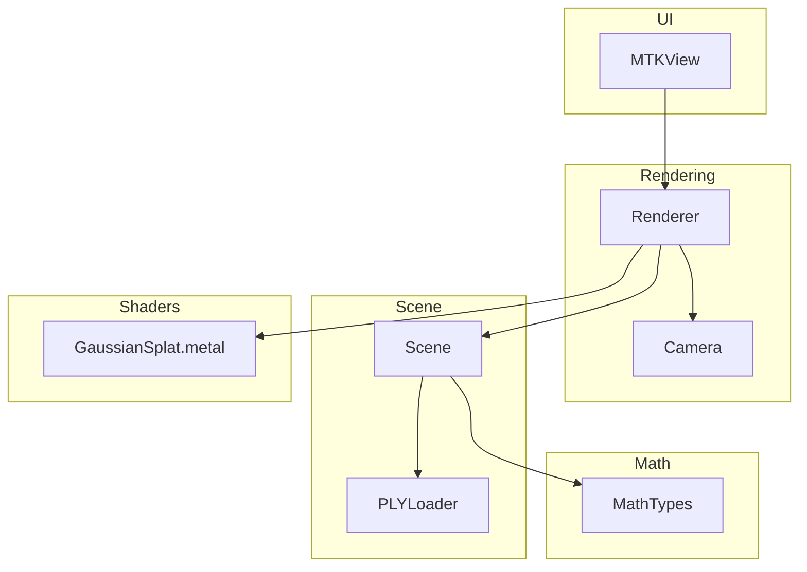
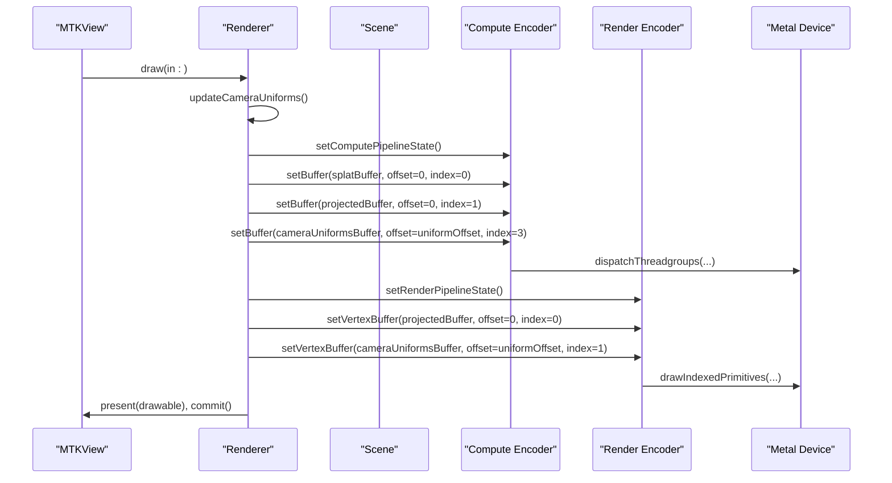
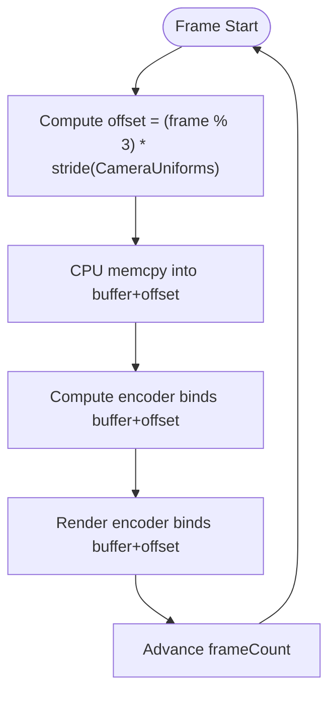
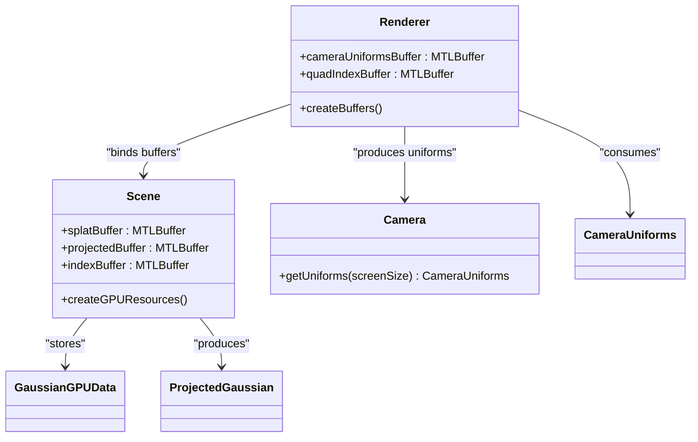
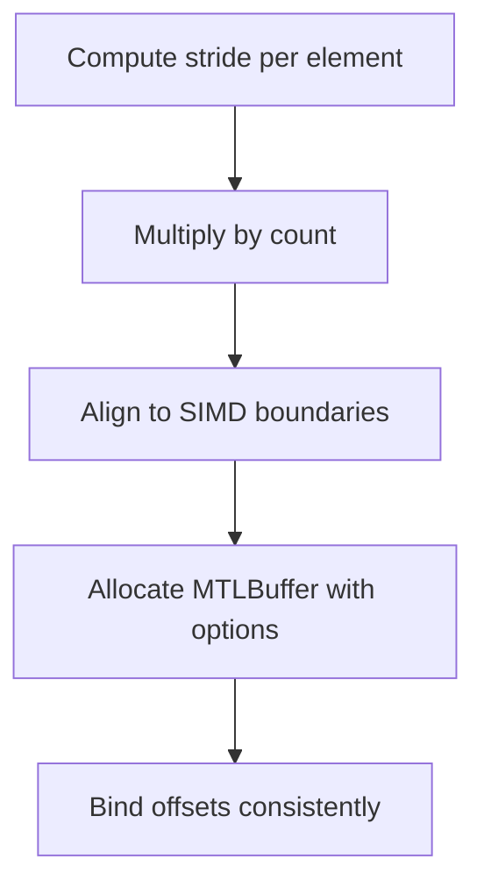
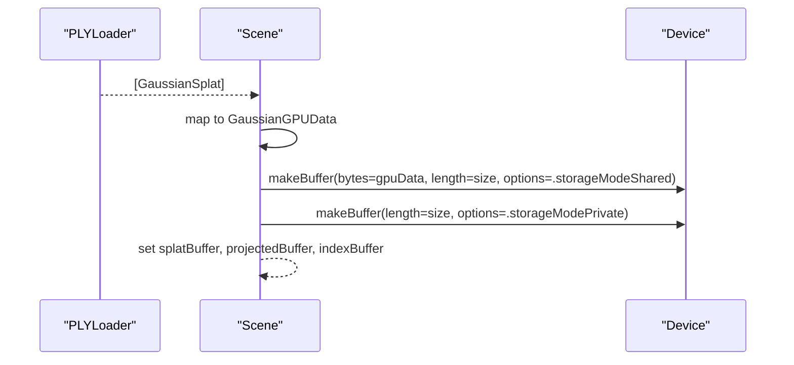
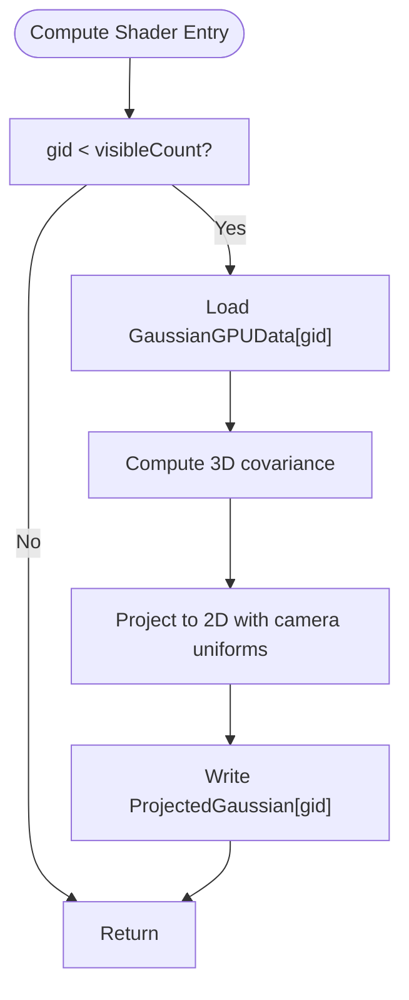
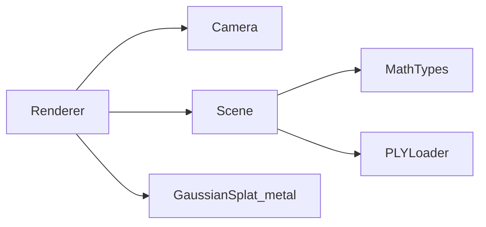

# Memory Management Optimization

<cite>
**Referenced Files in This Document**
- [Renderer.swift](file://Sources/Rendering/Renderer.swift)
- [Camera.swift](file://Sources/Rendering/Camera.swift)
- [Scene.swift](file://Sources/Scene/Scene.swift)
- [MathTypes.swift](file://Sources/Math/MathTypes.swift)
- [GaussianSplat.metal](file://Sources/Shaders/GaussianSplat.metal)
- [PLYLoader.swift](file://Sources/Scene/PLYLoader.swift)
- [Package.swift](file://Package.swift)
</cite>

## Table of Contents
1. [Introduction](#introduction)
2. [Project Structure](#project-structure)
3. [Core Components](#core-components)
4. [Architecture Overview](#architecture-overview)
5. [Detailed Component Analysis](#detailed-component-analysis)
6. [Dependency Analysis](#dependency-analysis)
7. [Performance Considerations](#performance-considerations)
8. [Troubleshooting Guide](#troubleshooting-guide)
9. [Conclusion](#conclusion)
10. [Appendices](#appendices)

## Introduction
This document focuses on GPU memory management optimization techniques implemented in the Gaussian Splatting viewer. It explains buffer allocation strategies, synchronization via triple-buffering for camera uniforms, memory bandwidth optimization, scene data management, and practical profiling approaches. It also covers buffer lifecycle, memory pools, and garbage collection considerations grounded in the repository’s code.

## Project Structure
The project organizes rendering, scene data, math types, and shaders into cohesive modules:
- Rendering: Renderer orchestrates Metal pipelines, buffers, and draw calls.
- Scene: Loads PLY data, constructs GPU buffers, and manages scene state.
- Math: Defines GPU-compatible structures and SIMD helpers.
- Shaders: Implement compute and rendering passes for Gaussian splatting.
- UI: Minimal integration with MTKView for presentation.

**Diagram sources**
- [Renderer.swift:1-288](file://Sources/Rendering/Renderer.swift#L1-L288)
- [Camera.swift:1-184](file://Sources/Rendering/Camera.swift#L1-L184)
- [Scene.swift:1-130](file://Sources/Scene/Scene.swift#L1-L130)
- [MathTypes.swift:1-189](file://Sources/Math/MathTypes.swift#L1-L189)
- [GaussianSplat.metal:1-309](file://Sources/Shaders/GaussianSplat.metal#L1-L309)
- [PLYLoader.swift:1-386](file://Sources/Scene/PLYLoader.swift#L1-L386)

**Section sources**
- [Renderer.swift:1-288](file://Sources/Rendering/Renderer.swift#L1-L288)
- [Scene.swift:1-130](file://Sources/Scene/Scene.swift#L1-L130)
- [MathTypes.swift:1-189](file://Sources/Math/MathTypes.swift#L1-L189)
- [GaussianSplat.metal:1-309](file://Sources/Shaders/GaussianSplat.metal#L1-L309)
- [PLYLoader.swift:1-386](file://Sources/Scene/PLYLoader.swift#L1-L386)
- [Package.swift:1-17](file://Package.swift#L1-L17)

## Core Components
- Renderer: Creates Metal pipelines, allocates buffers, drives compute and render passes, and synchronizes camera uniforms via triple-buffering.
- Scene: Loads Gaussian splats from PLY, constructs GPU buffers for splat data, projected data, and indices, and computes scene bounds.
- Camera: Computes view/projection matrices and produces CameraUniforms for GPU consumption.
- MathTypes: Defines GPU-compatible structures and SIMD utilities used across CPU and GPU.
- Shaders: Implement compute projection, vertex shading, and fragment evaluation for splats.

Key memory-related responsibilities:
- Buffer creation: Camera uniforms buffer (tripled), quad index buffer, splat buffer, projected buffer, and index buffer.
- Synchronization: Frame-based offset calculation for camera uniforms to prevent CPU-GPU conflicts.
- Data layout: Struct packing and padding to ensure GPU alignment and coalesced access.

**Section sources**
- [Renderer.swift:131-145](file://Sources/Rendering/Renderer.swift#L131-L145)
- [Renderer.swift:252-259](file://Sources/Rendering/Renderer.swift#L252-L259)
- [Scene.swift:51-85](file://Sources/Scene/Scene.swift#L51-L85)
- [MathTypes.swift:34-73](file://Sources/Math/MathTypes.swift#L34-L73)
- [GaussianSplat.metal:6-34](file://Sources/Shaders/GaussianSplat.metal#L6-L34)

## Architecture Overview
The rendering pipeline consists of:
- Compute pass: Project Gaussians using a compute shader with per-splat data and camera uniforms.
- Optional depth sorting: Placeholder for future sorting kernel.
- Render pass: Draw instanced quads using projected data and camera uniforms.

**Diagram sources**
- [Renderer.swift:171-250](file://Sources/Rendering/Renderer.swift#L171-L250)
- [GaussianSplat.metal:138-198](file://Sources/Shaders/GaussianSplat.metal#L138-L198)
- [GaussianSplat.metal:202-241](file://Sources/Shaders/GaussianSplat.metal#L202-L241)

## Detailed Component Analysis

### Triple-Buffering Strategy for Camera Uniforms
Triple-buffering ensures the CPU writes to a uniform slot while the GPU reads from another, preventing stalls and race conditions. The strategy:
- Buffer layout: Single MTLBuffer sized to three CameraUniforms.
- Offset calculation: frameCount modulo 3 determines the current write slot.
- CPU update: memcpy into the computed offset.
- GPU binding: Same offset used for compute and render encoders.

**Diagram sources**
- [Renderer.swift:197-200](file://Sources/Rendering/Renderer.swift#L197-L200)
- [Renderer.swift:229-231](file://Sources/Rendering/Renderer.swift#L229-L231)
- [Renderer.swift:252-259](file://Sources/Rendering/Renderer.swift#L252-L259)

**Section sources**
- [Renderer.swift:131-145](file://Sources/Rendering/Renderer.swift#L131-L145)
- [Renderer.swift:197-200](file://Sources/Rendering/Renderer.swift#L197-L200)
- [Renderer.swift:229-231](file://Sources/Rendering/Renderer.swift#L229-L231)
- [Renderer.swift:252-259](file://Sources/Rendering/Renderer.swift#L252-L259)

### Buffer Creation Strategies and Storage Mode Selection
- Camera uniforms buffer: Triple-sized shared buffer to enable CPU-GPU overlap.
- Quad index buffer: Shared buffer for small, static indices.
- Splat buffer: Shared buffer containing GaussianGPUData for compute input.
- Projected buffer: Private buffer for compute output (projected data).
- Index buffer: Private buffer for sorting indices.

**Diagram sources**
- [Renderer.swift:131-145](file://Sources/Rendering/Renderer.swift#L131-L145)
- [Scene.swift:51-85](file://Sources/Scene/Scene.swift#L51-L85)
- [MathTypes.swift:34-73](file://Sources/Math/MathTypes.swift#L34-L73)

**Section sources**
- [Renderer.swift:131-145](file://Sources/Rendering/Renderer.swift#L131-L145)
- [Scene.swift:51-85](file://Sources/Scene/Scene.swift#L51-L85)
- [MathTypes.swift:34-73](file://Sources/Math/MathTypes.swift#L34-L73)

### Buffer Sizing and Alignment Requirements
- CameraUniforms stride multiplied by 3 for triple buffering.
- GaussianGPUData stride times splat count for splat buffer.
- ProjectedGaussian stride times splat count for projected buffer.
- Index buffer stride times splat count for indices.
- Padding fields in GPU structures ensure alignment for vectorized loads.

**Diagram sources**
- [MathTypes.swift:34-73](file://Sources/Math/MathTypes.swift#L34-L73)
- [Scene.swift:56-75](file://Sources/Scene/Scene.swift#L56-L75)
- [Renderer.swift:133-144](file://Sources/Rendering/Renderer.swift#L133-L144)

**Section sources**
- [MathTypes.swift:34-73](file://Sources/Math/MathTypes.swift#L34-L73)
- [Scene.swift:56-75](file://Sources/Scene/Scene.swift#L56-L75)
- [Renderer.swift:133-144](file://Sources/Rendering/Renderer.swift#L133-L144)

### Scene Data Management: Gaussian Splats and Projected Buffers
- PLYLoader parses ASCII/binary PLY and constructs GaussianSplat arrays.
- Scene creates GPU buffers from CPU arrays and prints buffer sizes.
- Projected buffer stores per-splat projected data for rendering.

**Diagram sources**
- [PLYLoader.swift:41-68](file://Sources/Scene/PLYLoader.swift#L41-L68)
- [Scene.swift:51-85](file://Sources/Scene/Scene.swift#L51-L85)

**Section sources**
- [PLYLoader.swift:41-68](file://Sources/Scene/PLYLoader.swift#L41-L68)
- [Scene.swift:51-85](file://Sources/Scene/Scene.swift#L51-L85)

### Memory Access Patterns Optimization
- Coalesced reads/writes: Compute shader iterates per splat with contiguous memory access.
- Cache-friendly layouts: Structs padded to align with SIMD boundaries; GPU reads aligned vectors efficiently.
- Bandwidth utilization: Projected buffer is private to minimize cross-traffic; compute output is written contiguously.

**Diagram sources**
- [GaussianSplat.metal:138-198](file://Sources/Shaders/GaussianSplat.metal#L138-L198)

**Section sources**
- [GaussianSplat.metal:138-198](file://Sources/Shaders/GaussianSplat.metal#L138-L198)
- [MathTypes.swift:34-73](file://Sources/Math/MathTypes.swift#L34-L73)

### Practical Memory Profiling and Leak Detection
- Use Metal Developer Tools to:
  - Inspect buffer allocations and lifetimes.
  - Track GPU memory usage per frame.
  - Identify buffer leaks by monitoring retained references.
- Recommendations:
  - Verify buffers are released when clearing Scene or deallocating Renderer.
  - Monitor compute vs. render encoder bindings to avoid stale buffer references.
  - Profile bandwidth by measuring compute throughput and render pass costs.

[No sources needed since this section provides general guidance]

### Buffer Lifecycle Management, Memory Pools, and Garbage Collection
- Lifecycle:
  - Create buffers during initialization and scene load.
  - Bind offsets per frame for triple-buffered uniforms.
  - Release buffers on clear or app teardown.
- Memory pools:
  - Consider reusing buffers when scene size remains stable.
  - Reallocate only when splat count changes significantly.
- Garbage collection:
  - Swift ARC handles CPU-side references; ensure GPU buffers are explicitly released when no longer needed.

[No sources needed since this section provides general guidance]

## Dependency Analysis
Renderer depends on Camera for uniforms and Scene for GPU buffers. Scene depends on MathTypes for GPU-compatible structures and PLYLoader for data ingestion. Shaders define the contract for buffer layouts and data structures.

**Diagram sources**
- [Renderer.swift:1-288](file://Sources/Rendering/Renderer.swift#L1-L288)
- [Scene.swift:1-130](file://Sources/Scene/Scene.swift#L1-L130)
- [MathTypes.swift:1-189](file://Sources/Math/MathTypes.swift#L1-L189)
- [PLYLoader.swift:1-386](file://Sources/Scene/PLYLoader.swift#L1-L386)
- [GaussianSplat.metal:1-309](file://Sources/Shaders/GaussianSplat.metal#L1-L309)

**Section sources**
- [Renderer.swift:1-288](file://Sources/Rendering/Renderer.swift#L1-L288)
- [Scene.swift:1-130](file://Sources/Scene/Scene.swift#L1-L130)
- [MathTypes.swift:1-189](file://Sources/Math/MathTypes.swift#L1-L189)
- [PLYLoader.swift:1-386](file://Sources/Scene/PLYLoader.swift#L1-L386)
- [GaussianSplat.metal:1-309](file://Sources/Shaders/GaussianSplat.metal#L1-L309)

## Performance Considerations
- Triple-buffered uniforms reduce CPU-GPU synchronization overhead.
- Private buffers for compute outputs minimize contention with other subsystems.
- Coalesced access patterns in compute kernels maximize throughput.
- Alpha blending and discard paths in fragment shader reduce unnecessary fragment writes.

[No sources needed since this section provides general guidance]

## Troubleshooting Guide
- Buffer creation failures: Check SceneError handling and device capabilities.
- Incorrect uniform updates: Verify frame-based offset calculation and memcpy usage.
- Render artifacts: Confirm CameraUniforms alignment and shader buffer bindings.

**Section sources**
- [Scene.swift:61-71](file://Sources/Scene/Scene.swift#L61-L71)
- [Renderer.swift:252-259](file://Sources/Rendering/Renderer.swift#L252-L259)
- [GaussianSplat.metal:16-24](file://Sources/Shaders/GaussianSplat.metal#L16-L24)

## Conclusion
The project implements efficient GPU memory management through triple-buffered camera uniforms, carefully sized and aligned buffers, and compute-driven projection with coalesced access patterns. By leveraging Metal’s buffer binding model and struct padding, it achieves predictable synchronization and bandwidth utilization. Extending with a sorting kernel and profiling with Metal Developer Tools will further optimize performance and stability.

## Appendices

### Appendix A: Buffer Layout Reference
- CameraUniforms: Triple-buffered, shared storage, frame-based offset.
- GaussianGPUData: Shared storage, CPU-to-GPU upload.
- ProjectedGaussian: Private storage, compute output.
- Indices: Private storage, sorting support.

**Section sources**
- [Renderer.swift:131-145](file://Sources/Rendering/Renderer.swift#L131-L145)
- [Scene.swift:51-85](file://Sources/Scene/Scene.swift#L51-L85)
- [MathTypes.swift:34-73](file://Sources/Math/MathTypes.swift#L34-L73)