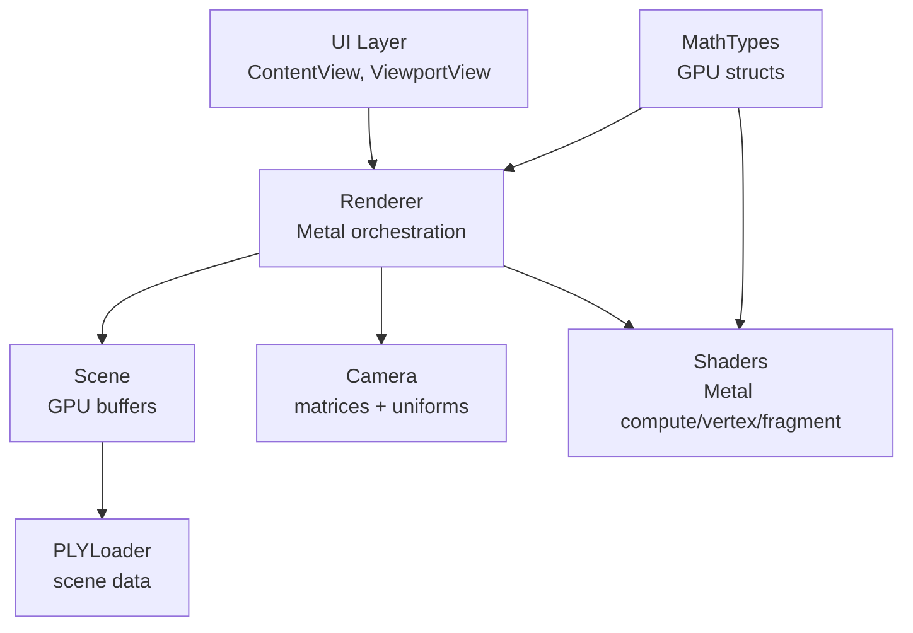
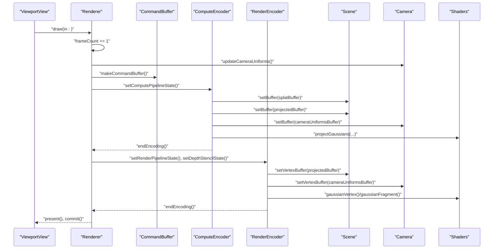
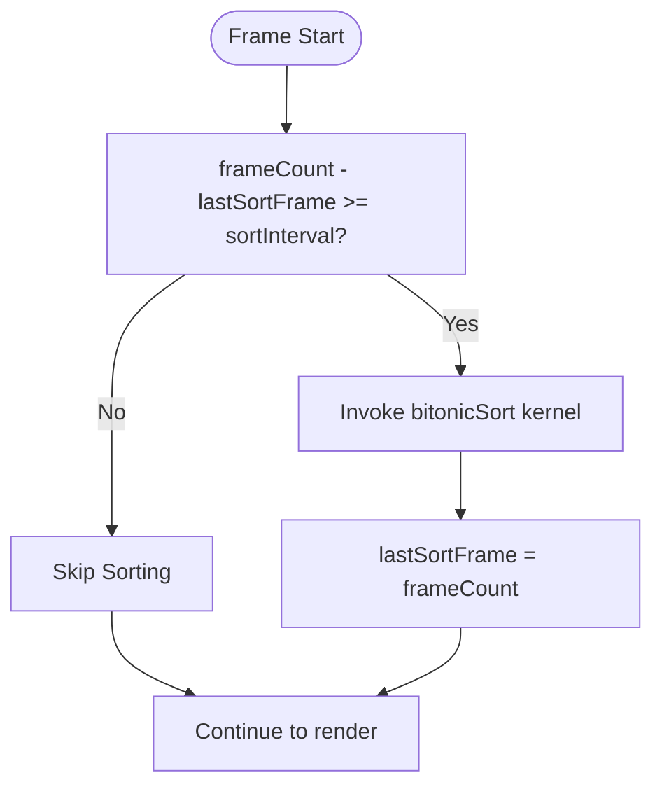
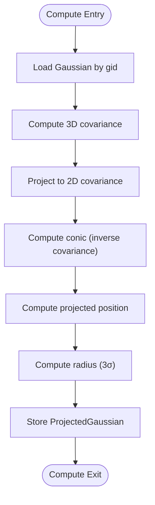
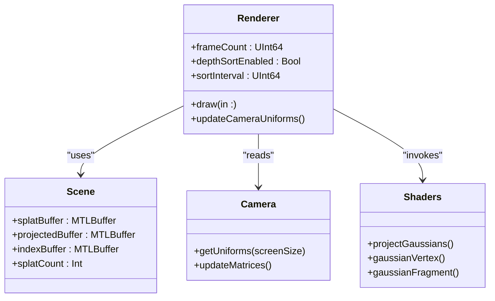
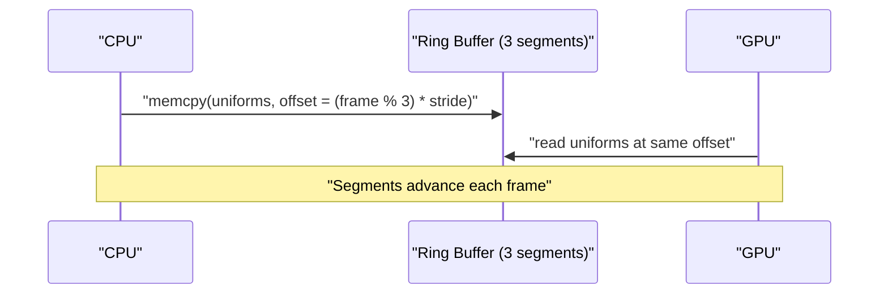
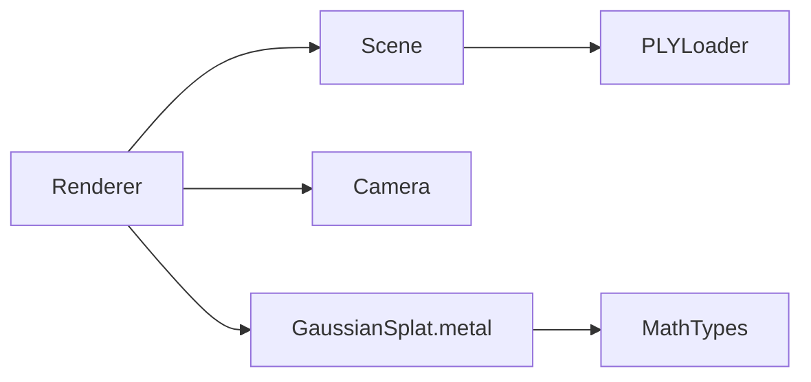

# Performance Optimization

<cite>
**Referenced Files in This Document**
- [Renderer.swift](file://Sources/Rendering/Renderer.swift)
- [GaussianSplat.metal](file://Sources/Shaders/GaussianSplat.metal)
- [Scene.swift](file://Sources/Scene/Scene.swift)
- [Camera.swift](file://Sources/Rendering/Camera.swift)
- [MathTypes.swift](file://Sources/Math/MathTypes.swift)
- [PLYLoader.swift](file://Sources/Scene/PLYLoader.swift)
- [ContentView.swift](file://Sources/UI/ContentView.swift)
- [ViewportView.swift](file://Sources/UI/ViewportView.swift)
- [Package.swift](file://Package.swift)
</cite>

## Table of Contents
1. [Introduction](#introduction)
2. [Project Structure](#project-structure)
3. [Core Components](#core-components)
4. [Architecture Overview](#architecture-overview)
5. [Detailed Component Analysis](#detailed-component-analysis)
6. [Dependency Analysis](#dependency-analysis)
7. [Performance Considerations](#performance-considerations)
8. [Troubleshooting Guide](#troubleshooting-guide)
9. [Conclusion](#conclusion)
10. [Appendices](#appendices)

## Introduction
This document focuses on performance optimization techniques for maximizing rendering throughput and minimizing GPU bottlenecks in a Metal-based Gaussian Splatting viewer. It explains the frame-based depth sorting strategy, compute shader optimization, render pipeline batching, triple-buffering for camera uniform updates, and profiling methodologies. Practical examples demonstrate bottleneck identification, optimization implementation, and measurement approaches tailored to Metal-capable macOS devices.

## Project Structure
The project follows a layered structure:
- UI layer (SwiftUI) wraps a Metal viewport and delegates input to the renderer.
- Rendering layer orchestrates Metal pipelines, buffers, and per-frame passes.
- Scene layer manages GPU buffers and scene data.
- Math and shader layers define GPU-compatible data structures and compute/graphics shaders.

**Diagram sources**
- [Renderer.swift:1-288](file://Sources/Rendering/Renderer.swift#L1-L288)
- [Scene.swift:1-130](file://Sources/Scene/Scene.swift#L1-L130)
- [Camera.swift:1-184](file://Sources/Rendering/Camera.swift#L1-L184)
- [MathTypes.swift:1-189](file://Sources/Math/MathTypes.swift#L1-L189)
- [PLYLoader.swift:1-386](file://Sources/Scene/PLYLoader.swift#L1-L386)
- [GaussianSplat.metal:1-309](file://Sources/Shaders/GaussianSplat.metal#L1-L309)
- [ContentView.swift:1-119](file://Sources/UI/ContentView.swift#L1-L119)
- [ViewportView.swift:1-118](file://Sources/UI/ViewportView.swift#L1-L118)

**Section sources**
- [Renderer.swift:1-288](file://Sources/Rendering/Renderer.swift#L1-L288)
- [Scene.swift:1-130](file://Sources/Scene/Scene.swift#L1-L130)
- [Camera.swift:1-184](file://Sources/Rendering/Camera.swift#L1-L184)
- [MathTypes.swift:1-189](file://Sources/Math/MathTypes.swift#L1-L189)
- [PLYLoader.swift:1-386](file://Sources/Scene/PLYLoader.swift#L1-L386)
- [GaussianSplat.metal:1-309](file://Sources/Shaders/GaussianSplat.metal#L1-L309)
- [ContentView.swift:1-119](file://Sources/UI/ContentView.swift#L1-L119)
- [ViewportView.swift:1-118](file://Sources/UI/ViewportView.swift#L1-L118)

## Core Components
- Renderer: Creates Metal pipelines, manages buffers, performs compute and render passes, and handles camera uniform updates with triple buffering.
- Scene: Loads Gaussian splats from PLY, constructs GPU buffers, and exposes counts and bounds.
- Camera: Maintains view/projection matrices and generates CameraUniforms for shaders.
- Shaders: Compute shader projects Gaussians, vertex shader prepares per-instance geometry, fragment shader evaluates splats with alpha blending.
- MathTypes: Defines GPU-compatible structures and math helpers used by both CPU and GPU.
- PLYLoader: Parses PLY files and extracts Gaussian parameters.

Key performance-relevant elements:
- Triple-buffered camera uniforms buffer for CPU/GPU synchronization.
- Instanced rendering with a quad index buffer.
- Frame-based depth sorting placeholder with configurable interval.
- Compute shader dispatch with fixed thread group size.

**Section sources**
- [Renderer.swift:1-288](file://Sources/Rendering/Renderer.swift#L1-L288)
- [Scene.swift:1-130](file://Sources/Scene/Scene.swift#L1-L130)
- [Camera.swift:1-184](file://Sources/Rendering/Camera.swift#L1-L184)
- [MathTypes.swift:1-189](file://Sources/Math/MathTypes.swift#L1-L189)
- [PLYLoader.swift:1-386](file://Sources/Scene/PLYLoader.swift#L1-L386)
- [GaussianSplat.metal:1-309](file://Sources/Shaders/GaussianSplat.metal#L1-L309)

## Architecture Overview
The renderer executes a two-stage pipeline per frame:
1) Compute pass: Project Gaussians to screen space and prepare per-splat data.
2) Render pass: Draw instanced quads with alpha blending and depth testing.

**Diagram sources**
- [Renderer.swift:171-250](file://Sources/Rendering/Renderer.swift#L171-L250)
- [GaussianSplat.metal:138-270](file://Sources/Shaders/GaussianSplat.metal#L138-L270)

**Section sources**
- [Renderer.swift:171-250](file://Sources/Rendering/Renderer.swift#L171-L250)
- [GaussianSplat.metal:138-270](file://Sources/Shaders/GaussianSplat.metal#L138-L270)

## Detailed Component Analysis

### Frame-Based Depth Sorting Strategy
The renderer includes a frame-based depth sorting mechanism with a configurable interval. The sorting is currently a placeholder and disabled by default.

- Sort interval configuration: The sort interval is defined as a constant and used to gate sorting execution every N frames.
- Performance impact assessment: Sorting introduces additional compute work proportional to the number of splats. The provided bitonic sort kernel demonstrates a parallel sorting approach suitable for GPU execution.
- Optimization alternatives:
  - Reduce sort frequency by increasing the interval for static or slowly moving scenes.
  - Implement hierarchical or coarse-to-fine sorting to reduce per-frame cost.
  - Use spatial partitioning to sort only visible or nearby splats.
  - Replace with a simpler heuristic (e.g., back-to-front for dense clouds) when sorting overhead outweighs gains.

**Diagram sources**
- [Renderer.swift:214-218](file://Sources/Rendering/Renderer.swift#L214-L218)
- [GaussianSplat.metal:274-308](file://Sources/Shaders/GaussianSplat.metal#L274-L308)

**Section sources**
- [Renderer.swift:29-34](file://Sources/Rendering/Renderer.swift#L29-L34)
- [Renderer.swift:214-218](file://Sources/Rendering/Renderer.swift#L214-L218)
- [GaussianSplat.metal:274-308](file://Sources/Shaders/GaussianSplat.metal#L274-L308)

### Compute Shader Optimization
The compute shader projects each Gaussian to screen space and prepares per-splat data for the vertex shader. Current dispatch configuration and potential optimizations:

- Thread group sizing:
  - Current: Fixed 256-wide thread groups along X.
  - Recommendation: Align with GPU wavefront sizes (e.g., 32 for SIMD) and ensure multiples of warp/wavefront granularity. Adjust based on device family and occupancy.
- Memory access patterns:
  - Coalesced access: Ensure consecutive threads access adjacent elements in splat arrays.
  - Shared memory: Consider using shared memory for frequently accessed per-thread scratch data if applicable.
- Computational efficiency:
  - Minimize branching inside hot loops; precompute constants (e.g., focal lengths) where possible.
  - Use vectorized math operations and avoid expensive transcendental functions when feasible.
  - Early discard paths (opacity/radius checks) reduce downstream work.

**Diagram sources**
- [GaussianSplat.metal:138-198](file://Sources/Shaders/GaussianSplat.metal#L138-L198)

**Section sources**
- [Renderer.swift:202-208](file://Sources/Rendering/Renderer.swift#L202-L208)
- [GaussianSplat.metal:138-198](file://Sources/Shaders/GaussianSplat.metal#L138-L198)

### Render Pipeline Optimization
The render pipeline uses alpha blending and indexed instanced drawing. Optimizations include:

- Draw call batching:
  - Single instanced draw call renders all splats, reducing state changes.
  - Consider grouping by material or texture if adding textures later.
- State change minimization:
  - Reuse render pipeline state and depth/stencil state across frames.
  - Avoid redundant setRenderPipelineState calls.
- GPU utilization maximization:
  - Ensure compute and render passes overlap where possible (command encoder reuse).
  - Use asynchronous compute when feasible to hide latency.

**Diagram sources**
- [Renderer.swift:171-250](file://Sources/Rendering/Renderer.swift#L171-L250)
- [Scene.swift:1-130](file://Sources/Scene/Scene.swift#L1-L130)
- [Camera.swift:134-147](file://Sources/Rendering/Camera.swift#L134-L147)
- [GaussianSplat.metal:138-270](file://Sources/Shaders/GaussianSplat.metal#L138-L270)

**Section sources**
- [Renderer.swift:171-250](file://Sources/Rendering/Renderer.swift#L171-L250)
- [GaussianSplat.metal:200-270](file://Sources/Shaders/GaussianSplat.metal#L200-L270)

### Triple-Buffering Strategy for Camera Uniform Updates
Triple buffering prevents CPU/GPU contention by cycling through three uniform buffer segments per frame. The renderer selects the segment based on frameCount modulo 3.

Benefits:
- Reduces stalls caused by CPU writing while GPU reads the same region.
- Enables smoother frame pacing under dynamic camera motion.

Implementation highlights:
- Camera uniforms buffer length is three times the size of a single CameraUniforms struct.
- Offset calculation uses frameCount modulo 3 to select the current segment.

**Diagram sources**
- [Renderer.swift:132-136](file://Sources/Rendering/Renderer.swift#L132-L136)
- [Renderer.swift:198-199](file://Sources/Rendering/Renderer.swift#L198-L199)
- [Renderer.swift:229-230](file://Sources/Rendering/Renderer.swift#L229-L230)
- [Renderer.swift:252-259](file://Sources/Rendering/Renderer.swift#L252-L259)

**Section sources**
- [Renderer.swift:132-136](file://Sources/Rendering/Renderer.swift#L132-L136)
- [Renderer.swift:198-199](file://Sources/Rendering/Renderer.swift#L198-L199)
- [Renderer.swift:229-230](file://Sources/Rendering/Renderer.swift#L229-L230)
- [Renderer.swift:252-259](file://Sources/Rendering/Renderer.swift#L252-L259)

### Performance Profiling Techniques
Recommended profiling approaches for Metal-based rendering:

- Metal System Trace:
  - Record traces to identify GPU bottlenecks, CPU stalls, and driver overhead.
  - Analyze compute vs. render pass durations and memory bandwidth usage.
- GPU performance counters:
  - Monitor fill rate, rasterization throughput, and memory bandwidth.
  - Track fragment shader invocations and early-z rejection rates.
- Frame timing analysis:
  - Measure frame times and identify outliers.
  - Correlate spikes with heavy compute workloads (sorting, projection).

Practical steps:
- Use Instruments (Metal System Trace) to capture a session while interacting with the scene.
- Toggle depth sorting on/off to quantify its impact.
- Profile with varying sort intervals to find the optimal balance.

[No sources needed since this section provides general guidance]

### Platform-Specific Optimizations and Hardware Considerations
- macOS platform:
  - The project targets macOS 12+, leveraging modern Metal features.
  - Consider device-specific tuning for integrated vs. discrete GPUs.
- Thread group sizing:
  - Align with SIMD widths (e.g., 32) for better occupancy on Apple GPUs.
- Memory access:
  - Prefer coalesced access patterns; minimize bank conflicts on GPU.
- Alpha blending:
  - Premultiplied alpha reduces overdraw costs; ensure consistent blending factors.

**Section sources**
- [Package.swift:6](file://Package.swift#L6)

## Dependency Analysis
The renderer depends on Scene for GPU buffers and on Camera for uniforms. Shaders depend on MathTypes for GPU-compatible structures.

**Diagram sources**
- [Renderer.swift:1-288](file://Sources/Rendering/Renderer.swift#L1-L288)
- [Scene.swift:1-130](file://Sources/Scene/Scene.swift#L1-L130)
- [Camera.swift:1-184](file://Sources/Rendering/Camera.swift#L1-L184)
- [MathTypes.swift:1-189](file://Sources/Math/MathTypes.swift#L1-L189)
- [PLYLoader.swift:1-386](file://Sources/Scene/PLYLoader.swift#L1-L386)
- [GaussianSplat.metal:1-309](file://Sources/Shaders/GaussianSplat.metal#L1-L309)

**Section sources**
- [Renderer.swift:1-288](file://Sources/Rendering/Renderer.swift#L1-L288)
- [Scene.swift:1-130](file://Sources/Scene/Scene.swift#L1-L130)
- [Camera.swift:1-184](file://Sources/Rendering/Camera.swift#L1-L184)
- [MathTypes.swift:1-189](file://Sources/Math/MathTypes.swift#L1-L189)
- [PLYLoader.swift:1-386](file://Sources/Scene/PLYLoader.swift#L1-L386)
- [GaussianSplat.metal:1-309](file://Sources/Shaders/GaussianSplat.metal#L1-L309)

## Performance Considerations
- Compute throughput:
  - Increase thread group size in multiples of 32 for better occupancy.
  - Ensure splat arrays are aligned and sized to minimize partial work.
- Render throughput:
  - Maintain a single instanced draw call; avoid per-splat state changes.
  - Use appropriate blend modes and enable early depth testing.
- Memory bandwidth:
  - Reuse buffers and minimize transfers; keep uniform updates small.
  - Consider packing data tightly to reduce memory footprint.
- CPU-GPU synchronization:
  - Triple buffering avoids stalls; ensure offsets are computed efficiently.
- Sorting overhead:
  - Tune sort interval based on scene dynamics; disable for static scenes.

[No sources needed since this section provides general guidance]

## Troubleshooting Guide
Common issues and remedies:
- Stuttering or dropped frames:
  - Verify compute dispatch sizing and occupancy; adjust thread group dimensions.
  - Disable depth sorting temporarily to isolate compute cost.
- Visual artifacts:
  - Confirm CameraUniforms alignment and offset calculations.
  - Ensure alpha blending parameters match premultiplied alpha expectations.
- Slow scene loading:
  - Optimize PLY parsing and buffer creation; consider streaming large scenes.

**Section sources**
- [Renderer.swift:198-199](file://Sources/Rendering/Renderer.swift#L198-L199)
- [Renderer.swift:229-230](file://Sources/Rendering/Renderer.swift#L229-L230)
- [GaussianSplat.metal:114-121](file://Sources/Shaders/GaussianSplat.metal#L114-L121)

## Conclusion
This project’s rendering pipeline is structured for efficient GPU utilization with a compute-first projection pass and instanced rendering. Performance gains can be achieved by optimizing compute shader thread group sizing, refining memory access patterns, tuning the frame-based depth sorting interval, and leveraging triple-buffered camera uniforms. Profiling with Metal System Trace and GPU counters enables targeted optimization and validation across Metal-capable macOS devices.

## Appendices
- Practical example: To measure sorting impact, toggle the depth sort flag and compare average frame times with and without sorting enabled. Adjust the sort interval to balance quality and performance.
- Practical example: To improve compute throughput, experiment with thread group sizes that align with SIMD widths and monitor occupancy metrics via Instruments.

[No sources needed since this section provides general guidance]