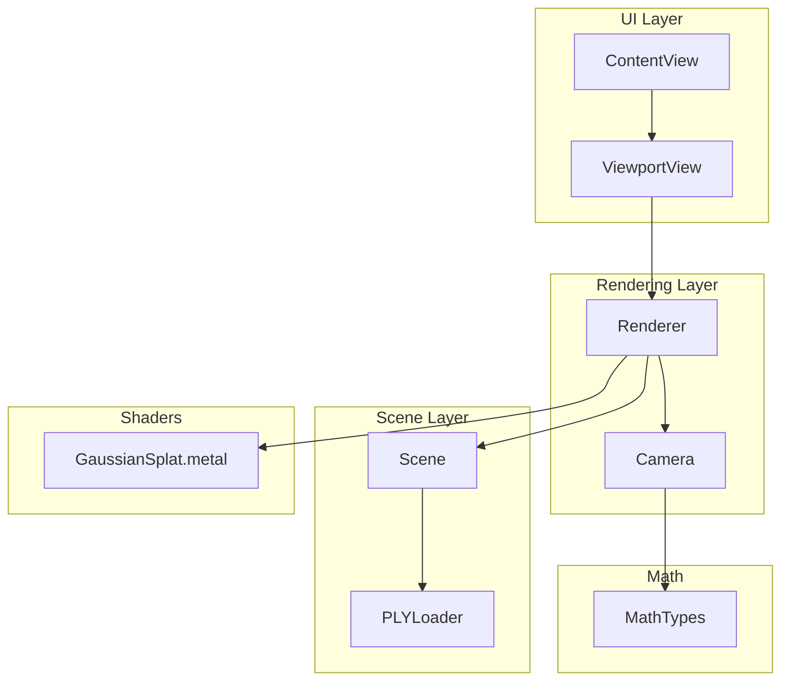
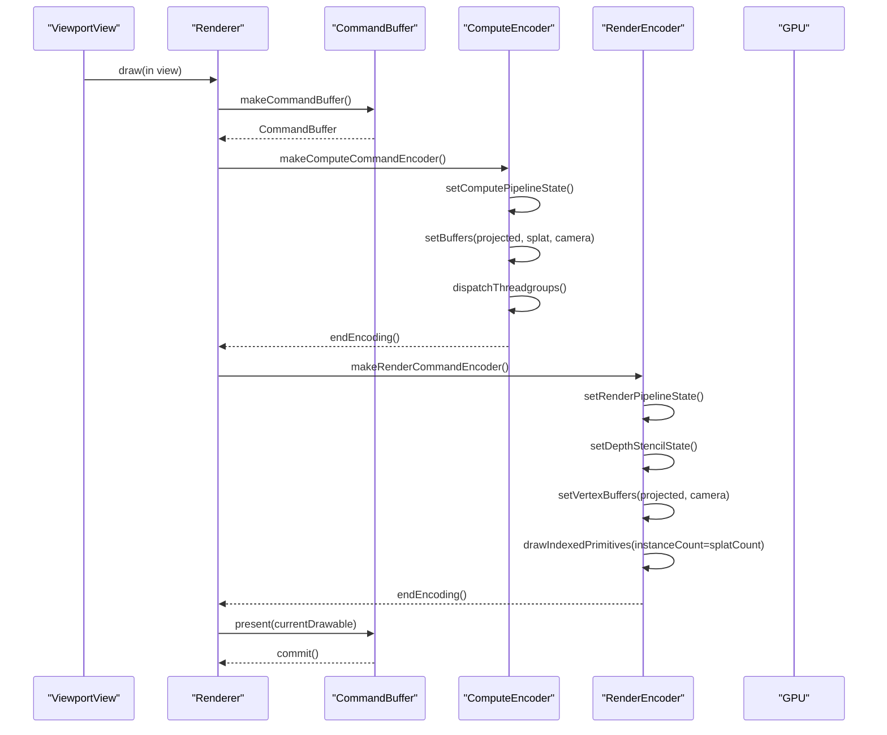
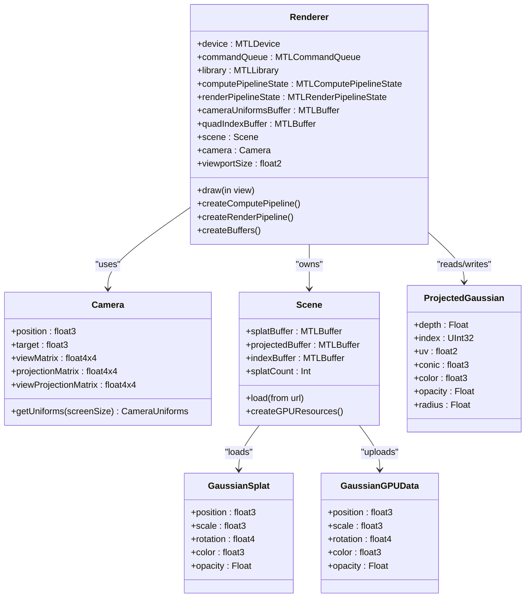
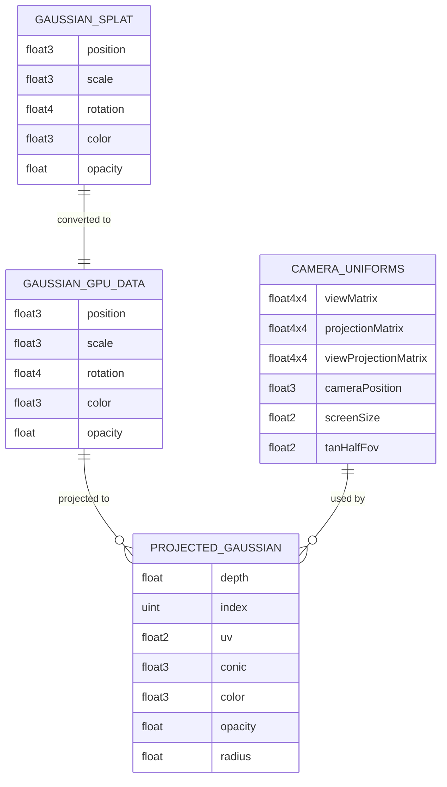

# Render Pipeline Optimization

<cite>
**Referenced Files in This Document**
- [Renderer.swift](file://Sources/Rendering/Renderer.swift)
- [GaussianSplat.metal](file://Sources/Shaders/GaussianSplat.metal)
- [Camera.swift](file://Sources/Rendering/Camera.swift)
- [MathTypes.swift](file://Sources/Math/MathTypes.swift)
- [Scene.swift](file://Sources/Scene/Scene.swift)
- [PLYLoader.swift](file://Sources/Scene/PLYLoader.swift)
- [ViewportView.swift](file://Sources/UI/ViewportView.swift)
- [ContentView.swift](file://Sources/UI/ContentView.swift)
- [GaussianSplatViewerApp.swift](file://Sources/GaussianSplatViewerApp.swift)
</cite>

## Table of Contents
1. [Introduction](#introduction)
2. [Project Structure](#project-structure)
3. [Core Components](#core-components)
4. [Architecture Overview](#architecture-overview)
5. [Detailed Component Analysis](#detailed-component-analysis)
6. [Dependency Analysis](#dependency-analysis)
7. [Performance Considerations](#performance-considerations)
8. [Troubleshooting Guide](#troubleshooting-guide)
9. [Conclusion](#conclusion)
10. [Appendices](#appendices)

## Introduction
This document explains render pipeline optimization techniques for maximizing draw call efficiency and GPU utilization in a Metal-based Gaussian splatting viewer. It focuses on:
- Instanced rendering using quad index buffers and vertex buffer management for efficient Gaussian drawing
- Blending configuration optimization including alpha blending setup and performance impact
- State management optimization including pipeline state object reuse, render pass descriptor optimization, and depth/stencil configuration
- Rendering workflow including vertex attribute setup, uniform buffer binding, and primitive assembly optimization
- Practical examples of render pipeline profiling, draw call reduction, and GPU utilization analysis
- Metal render pipeline state creation, shader function compilation, and performance monitoring approaches

## Project Structure
The project follows a modular structure:
- Rendering: Metal-based renderer, camera, and render pipeline creation
- Scene: PLY loader and scene data management with GPU buffers
- Shaders: Metal compute and fragment shaders for Gaussian projection and rendering
- UI: SwiftUI views and MTKView integration for viewport and user interaction
- Math: GPU-compatible data structures and math utilities

**Diagram sources**
- [Renderer.swift:1-288](file://Sources/Rendering/Renderer.swift#L1-L288)
- [GaussianSplat.metal:1-309](file://Sources/Shaders/GaussianSplat.metal#L1-L309)
- [Camera.swift:1-184](file://Sources/Rendering/Camera.swift#L1-L184)
- [MathTypes.swift:1-189](file://Sources/Math/MathTypes.swift#L1-L189)
- [Scene.swift:1-130](file://Sources/Scene/Scene.swift#L1-L130)
- [PLYLoader.swift:1-386](file://Sources/Scene/PLYLoader.swift#L1-L386)
- [ViewportView.swift:1-118](file://Sources/UI/ViewportView.swift#L1-L118)
- [ContentView.swift:1-119](file://Sources/UI/ContentView.swift#L1-L119)

**Section sources**
- [Renderer.swift:1-288](file://Sources/Rendering/Renderer.swift#L1-L288)
- [GaussianSplat.metal:1-309](file://Sources/Shaders/GaussianSplat.metal#L1-L309)
- [Camera.swift:1-184](file://Sources/Rendering/Camera.swift#L1-L184)
- [MathTypes.swift:1-189](file://Sources/Math/MathTypes.swift#L1-L189)
- [Scene.swift:1-130](file://Sources/Scene/Scene.swift#L1-L130)
- [PLYLoader.swift:1-386](file://Sources/Scene/PLYLoader.swift#L1-L386)
- [ViewportView.swift:1-118](file://Sources/UI/ViewportView.swift#L1-L118)
- [ContentView.swift:1-119](file://Sources/UI/ContentView.swift#L1-L119)

## Core Components
- Renderer: Creates Metal pipeline states, manages buffers, and executes compute and render passes. Implements triple-buffered camera uniforms and an instanced quad draw.
- Camera: Computes view/projection matrices and exposes CameraUniforms for GPU consumption.
- Scene: Loads Gaussian splats from PLY, creates GPU buffers, and tracks scene metrics.
- Shaders: Compute shader projects Gaussians, vertex shader generates quad vertices per instance, and fragment shader evaluates 2D Gaussians with premultiplied alpha blending.
- UI: MTKView-backed viewport with mouse controls and SwiftUI integration.

Key optimization highlights:
- Triple-buffered camera uniforms reduce CPU/GPU synchronization stalls.
- Instanced rendering with a shared quad index buffer minimizes draw calls.
- Alpha blending configured for additive accumulation with premultiplied alpha.
- Depth testing enabled with write; depth sorting is planned.

**Section sources**
- [Renderer.swift:6-288](file://Sources/Rendering/Renderer.swift#L6-L288)
- [Camera.swift:54-147](file://Sources/Rendering/Camera.swift#L54-L147)
- [Scene.swift:52-85](file://Sources/Scene/Scene.swift#L52-L85)
- [GaussianSplat.metal:138-270](file://Sources/Shaders/GaussianSplat.metal#L138-L270)

## Architecture Overview
The rendering pipeline consists of:
1) Compute pass: Project Gaussians to screen space and compute per-instance conic and radius.
2) Optional depth sorting (planned).
3) Render pass: Draw instanced quads with per-instance projected data.

**Diagram sources**
- [Renderer.swift:171-250](file://Sources/Rendering/Renderer.swift#L171-L250)
- [GaussianSplat.metal:138-241](file://Sources/Shaders/GaussianSplat.metal#L138-L241)

## Detailed Component Analysis

### Renderer: Pipeline Creation and Draw Loop
- Metal library compiled from source at runtime.
- Compute pipeline created from compute function.
- Render pipeline with vertex and fragment functions, alpha blending enabled, and depth attachment.
- Triple-buffered camera uniforms buffer for CPU/GPU synchronization.
- Shared quad index buffer for instanced triangle draws.
- Depth sorting disabled by default with a planned interval-based mechanism.
- Depth stencil state configured with less compare and depth writes enabled.

Optimization opportunities:
- Reuse pipeline state objects across frames.
- Minimize render pass descriptor allocations; cache descriptors when size does not change.
- Consider precomputing and caching camera matrices to reduce uniform updates.
- Implement depth sorting using compute shaders and atomic operations.

**Section sources**
- [Renderer.swift:37-79](file://Sources/Rendering/Renderer.swift#L37-L79)
- [Renderer.swift:83-129](file://Sources/Rendering/Renderer.swift#L83-L129)
- [Renderer.swift:131-145](file://Sources/Rendering/Renderer.swift#L131-L145)
- [Renderer.swift:171-250](file://Sources/Rendering/Renderer.swift#L171-L250)
- [Renderer.swift:261-266](file://Sources/Rendering/Renderer.swift#L261-L266)

### Camera: Uniform Buffer Generation
- Provides CameraUniforms with view, projection, view-projection matrices, camera position, screen size, and tangent of half field-of-view.
- Used by both compute and vertex stages to transform Gaussians and compute quad positions.

Best practices:
- Keep uniform sizes aligned to 16-byte boundaries for optimal performance.
- Avoid recomputing matrices unless camera parameters change.

**Section sources**
- [Camera.swift:134-147](file://Sources/Rendering/Camera.swift#L134-L147)
- [MathTypes.swift:54-62](file://Sources/Math/MathTypes.swift#L54-L62)

### Scene: GPU Buffer Management
- Creates splat buffer (CPU-to-GPU copy), projected buffer (private storage for compute output), and index buffer (planned for sorting).
- Computes scene center and radius for camera framing.

Optimization opportunities:
- Use buffer pooling to avoid frequent allocations.
- Consider structured buffers for better memory coalescing.
- Pre-size buffers to minimize reallocations.

**Section sources**
- [Scene.swift:52-85](file://Sources/Scene/Scene.swift#L52-L85)
- [Scene.swift:95-123](file://Sources/Scene/Scene.swift#L95-L123)

### Shaders: Compute, Vertex, and Fragment
- Compute shader: Projects 3D Gaussians to 2D, computes covariance, conic, radius, and stores per-instance data.
- Vertex shader: Generates quad vertices per instance using projected data and camera uniforms.
- Fragment shader: Evaluates 2D Gaussian with conic parameters, applies premultiplied alpha, and discards small contributions.

Optimization opportunities:
- Reduce branching in fragment shader (early discard).
- Use vectorized math operations where possible.
- Consider fixed-point or quantized representations for covariance when safe.

**Section sources**
- [GaussianSplat.metal:138-198](file://Sources/Shaders/GaussianSplat.metal#L138-L198)
- [GaussianSplat.metal:202-241](file://Sources/Shaders/GaussianSplat.metal#L202-L241)
- [GaussianSplat.metal:245-270](file://Sources/Shaders/GaussianSplat.metal#L245-L270)

### UI Integration: MTKView and Input Handling
- SwiftUI ViewportView wraps MTKView and forwards mouse events to Renderer.
- Renderer handles camera controls via mouse drag and scroll.

**Section sources**
- [ViewportView.swift:8-31](file://Sources/UI/ViewportView.swift#L8-L31)
- [ViewportView.swift:51-92](file://Sources/UI/ViewportView.swift#L51-L92)
- [Renderer.swift:270-286](file://Sources/Rendering/Renderer.swift#L270-L286)

## Dependency Analysis

**Diagram sources**
- [Renderer.swift:7-288](file://Sources/Rendering/Renderer.swift#L7-L288)
- [Camera.swift:5-147](file://Sources/Rendering/Camera.swift#L5-L147)
- [Scene.swift:5-85](file://Sources/Scene/Scene.swift#L5-L85)
- [MathTypes.swift:12-73](file://Sources/Math/MathTypes.swift#L12-L73)

**Section sources**
- [Renderer.swift:7-288](file://Sources/Rendering/Renderer.swift#L7-L288)
- [Camera.swift:5-147](file://Sources/Rendering/Camera.swift#L5-L147)
- [Scene.swift:5-85](file://Sources/Scene/Scene.swift#L5-L85)
- [MathTypes.swift:12-73](file://Sources/Math/MathTypes.swift#L12-L73)

## Performance Considerations

### Draw Call Efficiency
- Single instanced draw call per frame: The renderer issues one indexed draw call with instanceCount equal to the number of Gaussians. This reduces draw call overhead compared to per-gaussian draw calls.
- Quad index buffer: A shared index buffer defines two triangles per instance, minimizing index buffer bandwidth.
- Triple-buffered camera uniforms: Reduces contention between CPU updates and GPU reads by cycling through three uniform blocks.

Optimization tips:
- Batch instances by material or texture if applicable.
- Consider partitioning large scenes into tiles to reduce overdraw and improve cache locality.
- Use dynamic batching for small, frequent geometry changes.

**Section sources**
- [Renderer.swift:233-243](file://Sources/Rendering/Renderer.swift#L233-L243)
- [Renderer.swift:131-145](file://Sources/Rendering/Renderer.swift#L131-L145)

### GPU Utilization
- Compute shader: Projects Gaussians in parallel; tune threadgroup size for occupancy.
- Vertex shader: Minimal per-vertex computation; relies on per-instance data.
- Fragment shader: Early discard reduces fragment throughput; consider culling before compute.

**Section sources**
- [GaussianSplat.metal:138-198](file://Sources/Shaders/GaussianSplat.metal#L138-L198)
- [GaussianSplat.metal:202-241](file://Sources/Shaders/GaussianSplat.metal#L202-L241)
- [GaussianSplat.metal:245-270](file://Sources/Shaders/GaussianSplat.metal#L245-L270)

### Blending Configuration Optimization
- Alpha blending enabled with:
  - rgbBlendOperation and alphaBlendOperation set to add
  - sourceRGBBlendFactor and sourceAlphaBlendFactor set to one
  - destinationRGBBlendFactor and destinationAlphaBlendFactor set to oneMinusSourceAlpha
- Premultiplied alpha used in fragment shader for correct compositing.

Impact:
- Additive blending accumulates splats efficiently; premultiplied alpha avoids extra blending math.
- Performance depends on coverage; consider occlusion culling to reduce overdraw.

**Section sources**
- [Renderer.swift:113-121](file://Sources/Rendering/Renderer.swift#L113-L121)
- [GaussianSplat.metal:268-270](file://Sources/Shaders/GaussianSplat.metal#L268-L270)

### State Management Optimization
- Pipeline state reuse: Compute and render pipeline states are created once and reused each frame.
- Depth/stencil state: Created per-frame; consider caching if camera parameters remain unchanged.
- Render pass descriptor: Retrieved from MTKView each frame; ensure consistent pixel formats to avoid reconfiguration.

Recommendations:
- Cache depth/stencil state when camera matrices are stable.
- Avoid unnecessary descriptor re-creation; reuse where possible.

**Section sources**
- [Renderer.swift:223](file://Sources/Rendering/Renderer.swift#L223)
- [Renderer.swift:261-266](file://Sources/Rendering/Renderer.swift#L261-L266)

### Rendering Workflow Details
- Vertex attribute setup: Vertex shader consumes per-instance ProjectedGaussian and CameraUniforms.
- Uniform buffer binding: Triple-buffered offsets selected per frame to avoid synchronization stalls.
- Primitive assembly: Instanced triangles assembled from shared quad indices.

**Section sources**
- [Renderer.swift:225-231](file://Sources/Rendering/Renderer.swift#L225-L231)
- [Renderer.swift:233-243](file://Sources/Rendering/Renderer.swift#L233-L243)
- [GaussianSplat.metal:202-241](file://Sources/Shaders/GaussianSplat.metal#L202-L241)

### Practical Profiling and Monitoring
- Frame timing: Track frame durations around command buffer commit to estimate GPU time.
- Draw call counting: Use GPU counters to verify single instanced draw per frame.
- Overhead analysis: Compare compute dispatch time versus render pass time to identify bottlenecks.
- Memory bandwidth: Monitor buffer upload sizes and stride alignment.

Approaches:
- Use Instruments (Time Profiler, GPU Frame Capture) to inspect pipeline stages.
- Add logging around compute and render encoders to correlate CPU/GPU timings.

[No sources needed since this section provides general guidance]

### Metal Pipeline Creation and Shader Compilation
- Runtime compilation: Metal library compiled from source path; ensure shader function names match pipeline descriptors.
- Pipeline creation: Vertex and fragment functions bound to render pipeline; compute function bound to compute pipeline.
- Descriptor configuration: Color attachments, depth attachment, and blending parameters set at pipeline creation time.

**Section sources**
- [Renderer.swift:46-55](file://Sources/Rendering/Renderer.swift#L46-L55)
- [Renderer.swift:97-129](file://Sources/Rendering/Renderer.swift#L97-L129)
- [Renderer.swift:83-95](file://Sources/Rendering/Renderer.swift#L83-L95)

## Troubleshooting Guide
Common issues and resolutions:
- Missing shader functions: Ensure compute and vertex/fragment function names match pipeline descriptors.
- Incorrect blending: Verify blend factors and operations; confirm premultiplied alpha in fragment shader.
- Depth artifacts: Confirm depth compare function and depth write enable; ensure consistent depth buffer format.
- Stuttering: Check uniform buffer binding offsets and triple-buffering strategy; verify threadgroup sizing for compute.

**Section sources**
- [Renderer.swift:83-95](file://Sources/Rendering/Renderer.swift#L83-L95)
- [Renderer.swift:97-129](file://Sources/Rendering/Renderer.swift#L97-L129)
- [Renderer.swift:261-266](file://Sources/Rendering/Renderer.swift#L261-L266)

## Conclusion
The Gaussian splatting viewer demonstrates efficient Metal rendering through:
- Instanced rendering with a shared quad index buffer
- Triple-buffered camera uniforms for smooth CPU/GPU synchronization
- Alpha blending configured for additive accumulation with premultiplied alpha
- Reusable pipeline states and straightforward render pass setup

Future enhancements include implementing depth sorting, caching depth/stencil states, and adding profiling hooks to quantify performance gains from these optimizations.

[No sources needed since this section summarizes without analyzing specific files]

## Appendices

### Appendix A: Data Model Overview

**Diagram sources**
- [MathTypes.swift:12-73](file://Sources/Math/MathTypes.swift#L12-L73)
- [GaussianSplat.metal:6-42](file://Sources/Shaders/GaussianSplat.metal#L6-L42)