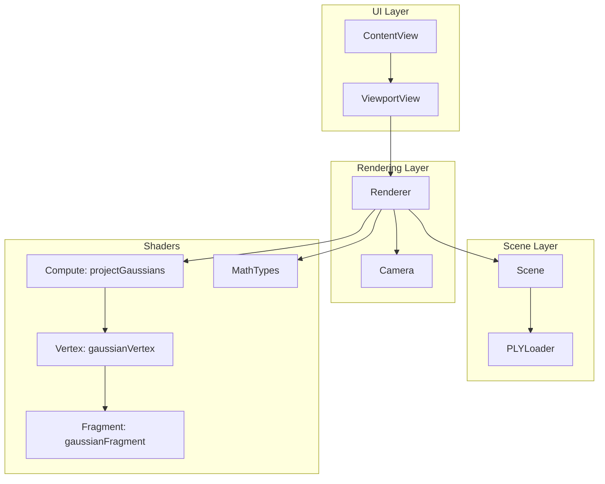
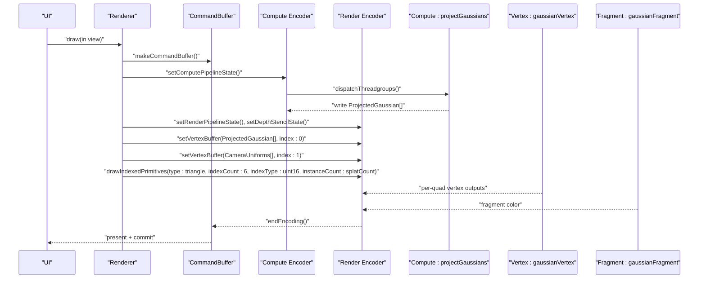
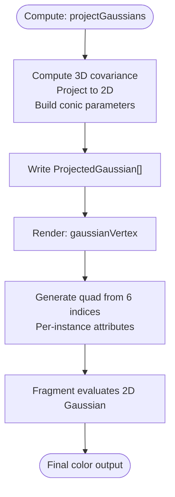
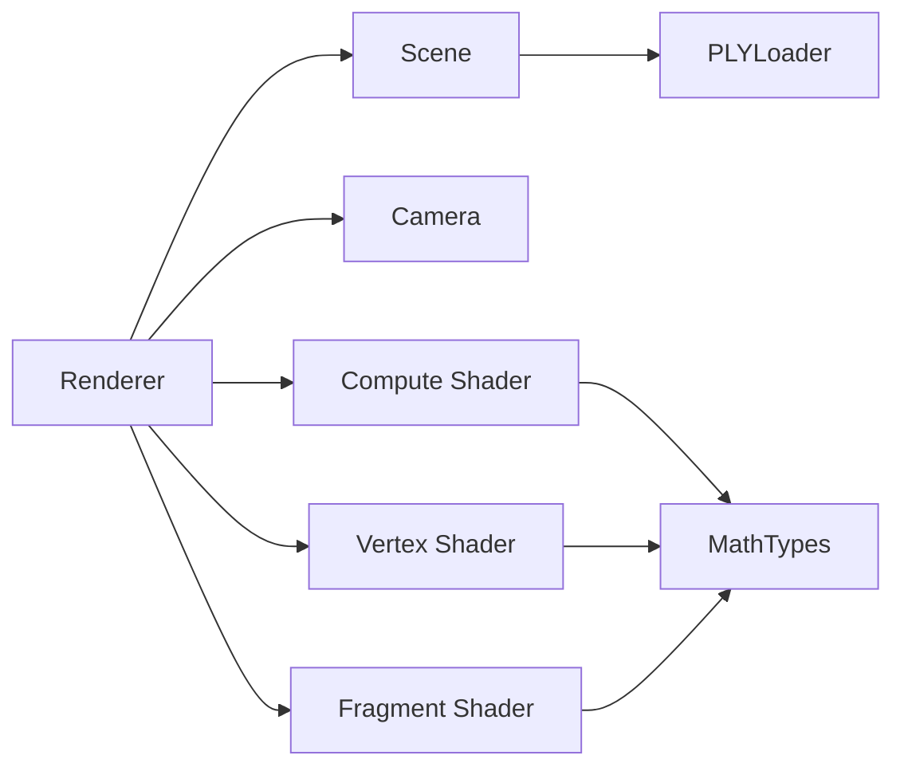

# Instanced Rendering

<cite>
**Referenced Files in This Document**
- [GaussianSplat.metal](file://Sources/Shaders/GaussianSplat.metal)
- [Renderer.swift](file://Sources/Rendering/Renderer.swift)
- [Scene.swift](file://Sources/Scene/Scene.swift)
- [MathTypes.swift](file://Sources/Math/MathTypes.swift)
- [Camera.swift](file://Sources/Rendering/Camera.swift)
- [PLYLoader.swift](file://Sources/Scene/PLYLoader.swift)
- [ContentView.swift](file://Sources/UI/ContentView.swift)
- [ViewportView.swift](file://Sources/UI/ViewportView.swift)
</cite>

## Table of Contents
1. [Introduction](#introduction)
2. [Project Structure](#project-structure)
3. [Core Components](#core-components)
4. [Architecture Overview](#architecture-overview)
5. [Detailed Component Analysis](#detailed-component-analysis)
6. [Dependency Analysis](#dependency-analysis)
7. [Performance Considerations](#performance-considerations)
8. [Troubleshooting Guide](#troubleshooting-guide)
9. [Conclusion](#conclusion)

## Introduction
This document explains the instanced rendering pipeline for quad-based Gaussian splat rendering. It covers how the compute shader projects 3D Gaussians into 2D screen-space data, how the vertex shader generates per-instance quad geometry using six indices for efficient triangle drawing, and how Metal’s instanced rendering draws thousands of splats with minimal CPU overhead. It also documents buffer layouts, instance data organization, and the relationship between compute shader output and instanced rendering input.

## Project Structure
The project is organized around a Metal-based renderer, a compute/vertex/fragment shader pipeline, and scene data management. The rendering flow is driven by a SwiftUI/MetalKit viewport and a renderer that orchestrates compute and render passes.

**Diagram sources**
- [ContentView.swift:1-119](file://Sources/UI/ContentView.swift#L1-L119)
- [ViewportView.swift:1-118](file://Sources/UI/ViewportView.swift#L1-L118)
- [Renderer.swift:1-288](file://Sources/Rendering/Renderer.swift#L1-L288)
- [Camera.swift:1-184](file://Sources/Rendering/Camera.swift#L1-L184)
- [Scene.swift:1-130](file://Sources/Scene/Scene.swift#L1-L130)
- [PLYLoader.swift:1-386](file://Sources/Scene/PLYLoader.swift#L1-L386)
- [GaussianSplat.metal:1-309](file://Sources/Shaders/GaussianSplat.metal#L1-L309)
- [MathTypes.swift:1-189](file://Sources/Math/MathTypes.swift#L1-L189)

**Section sources**
- [Renderer.swift:1-288](file://Sources/Rendering/Renderer.swift#L1-L288)
- [Scene.swift:1-130](file://Sources/Scene/Scene.swift#L1-L130)
- [GaussianSplat.metal:1-309](file://Sources/Shaders/GaussianSplat.metal#L1-L309)
- [MathTypes.swift:1-189](file://Sources/Math/MathTypes.swift#L1-L189)
- [Camera.swift:1-184](file://Sources/Rendering/Camera.swift#L1-L184)
- [PLYLoader.swift:1-386](file://Sources/Scene/PLYLoader.swift#L1-L386)
- [ContentView.swift:1-119](file://Sources/UI/ContentView.swift#L1-L119)
- [ViewportView.swift:1-118](file://Sources/UI/ViewportView.swift#L1-L118)

## Core Components
- Compute shader: Projects Gaussian splats into 2D screen-space data and writes per-splat attributes to a projected buffer.
- Vertex shader: Uses per-instance data to generate a quad from six indices and emits clip-space positions and per-fragment attributes.
- Render encoder: Binds the projected buffer as a vertex buffer and draws indexed triangles with instanceCount equal to the number of splats.
- Scene: Holds CPU-side splat data and creates GPU buffers for splat data, projected data, and optional index buffer for sorting.
- Camera: Provides uniform matrices and screen size to shaders.

Key responsibilities:
- Compute pass: Transform 3D Gaussians to 2D covariance, conic parameters, screen-space UV, radius, and depth.
- Render pass: Draw instanced quads with per-instance attributes from the projected buffer.

**Section sources**
- [GaussianSplat.metal:138-198](file://Sources/Shaders/GaussianSplat.metal#L138-L198)
- [GaussianSplat.metal:202-241](file://Sources/Shaders/GaussianSplat.metal#L202-L241)
- [Renderer.swift:187-250](file://Sources/Rendering/Renderer.swift#L187-L250)
- [Scene.swift:52-85](file://Sources/Scene/Scene.swift#L52-L85)
- [MathTypes.swift:34-73](file://Sources/Math/MathTypes.swift#L34-L73)

## Architecture Overview
The rendering pipeline consists of two stages:
1) Compute: projectGaussians computes per-splat 2D projections and stores them in a GPU buffer.
2) Render: gaussianVertex reads per-instance projected data and draws a quad using six indices per instance.

**Diagram sources**
- [Renderer.swift:187-250](file://Sources/Rendering/Renderer.swift#L187-L250)
- [GaussianSplat.metal:138-198](file://Sources/Shaders/GaussianSplat.metal#L138-L198)
- [GaussianSplat.metal:202-241](file://Sources/Shaders/GaussianSplat.metal#L202-L241)
- [GaussianSplat.metal:245-270](file://Sources/Shaders/GaussianSplat.metal#L245-L270)

## Detailed Component Analysis

### Quad Geometry Setup and Index Buffer
- The quad geometry is defined by four vertices: (-1,-1), (1,-1), (-1,1), (1,1).
- Six indices are used to form two triangles per quad: [0,1,2,2,1,3].
- This index pattern ensures correct winding order and shared edges for efficient triangle drawing.

Implementation highlights:
- Index buffer creation with six 16-bit indices.
- drawIndexedPrimitives configured with triangle primitive type and uint16 index buffer format.
- instanceCount equals the number of splats, driving per-instance quad rendering.

**Section sources**
- [Renderer.swift:138-145](file://Sources/Rendering/Renderer.swift#L138-L145)
- [Renderer.swift:234-243](file://Sources/Rendering/Renderer.swift#L234-L243)
- [GaussianSplat.metal:210-214](file://Sources/Shaders/GaussianSplat.metal#L210-L214)

### Instanced Rendering Technique
- The vertex shader receives per-instance data via buffer index 0 bound to the projected buffer.
- instanceID selects the ProjectedGaussian for the current instance.
- Each instance draws a quad centered at the projected screen-space position with radius and conic parameters.

Benefits:
- Single draw call with instanceCount equal to splat count.
- Minimal CPU overhead; GPU handles per-instance attribute fetching.

**Section sources**
- [GaussianSplat.metal:202-241](file://Sources/Shaders/GaussianSplat.metal#L202-L241)
- [Renderer.swift:226-231](file://Sources/Rendering/Renderer.swift#L226-L231)

### Per-Instance Attribute Management
ProjectedGaussian contains:
- depth, index, uv, conic (2D covariance inverse), color, opacity, radius.

These fields are computed in the compute shader and consumed by the vertex shader to:
- Position the quad in clip space.
- Provide fragment shader with conic parameters for Gaussian evaluation.
- Control visibility and blending.

**Section sources**
- [GaussianSplat.metal:26-34](file://Sources/Shaders/GaussianSplat.metal#L26-L34)
- [GaussianSplat.metal:138-198](file://Sources/Shaders/GaussianSplat.metal#L138-L198)
- [MathTypes.swift:65-73](file://Sources/Math/MathTypes.swift#L65-L73)

### Vertex Buffer Binding for Projected Gaussian Data
- The projected buffer is bound as a vertex buffer at index 0.
- The vertex shader reads ProjectedGaussian for the current instanceID.
- Camera uniforms are bound at index 1.

This binding enables efficient per-instance attribute access without duplicating geometry data.

**Section sources**
- [Renderer.swift:226-231](file://Sources/Rendering/Renderer.swift#L226-L231)
- [GaussianSplat.metal:202-207](file://Sources/Shaders/GaussianSplat.metal#L202-L207)

### Index Buffer Configuration for Quad Geometry
- Six 16-bit indices define two triangles per quad.
- drawIndexedPrimitives uses triangle primitive type and uint16 index buffer format.
- The index buffer is set once and reused across frames.

**Section sources**
- [Renderer.swift:138-145](file://Sources/Rendering/Renderer.swift#L138-L145)
- [Renderer.swift:234-243](file://Sources/Rendering/Renderer.swift#L234-L243)

### Instance Count Management Based on Splat Count
- instanceCount is set to scene.splatCount.
- The compute pass dispatches based on splatCount to populate the projected buffer.
- The render pass draws one quad per splat.

**Section sources**
- [Scene.swift:17](file://Sources/Scene/Scene.swift#L17)
- [Renderer.swift:202-208](file://Sources/Rendering/Renderer.swift#L202-L208)
- [Renderer.swift:241](file://Sources/Rendering/Renderer.swift#L241)

### Relationship Between Compute Shader Output and Instanced Rendering Input
- projectGaussians writes ProjectedGaussian entries into the projected buffer.
- gaussianVertex reads the same buffer as per-instance input.
- The compute shader prepares conic parameters, screen-space UV, radius, and depth for the vertex shader.

**Diagram sources**
- [GaussianSplat.metal:138-198](file://Sources/Shaders/GaussianSplat.metal#L138-L198)
- [GaussianSplat.metal:202-241](file://Sources/Shaders/GaussianSplat.metal#L202-L241)
- [GaussianSplat.metal:245-270](file://Sources/Shaders/GaussianSplat.metal#L245-L270)

**Section sources**
- [GaussianSplat.metal:138-198](file://Sources/Shaders/GaussianSplat.metal#L138-L198)
- [GaussianSplat.metal:202-241](file://Sources/Shaders/GaussianSplat.metal#L202-L241)
- [GaussianSplat.metal:245-270](file://Sources/Shaders/GaussianSplat.metal#L245-L270)

### Practical Examples and Optimizations

- Buffer Layout Optimization
  - Use tightly packed ProjectedGaussian with scalar padding to align to 16-byte boundaries for efficient GPU memory access.
  - Bind the projected buffer as a vertex buffer with a single binding slot to minimize descriptor updates.

- Instance Data Organization
  - Keep per-splat data contiguous in the projected buffer to maximize coalesced access patterns.
  - Avoid redundant computations by reusing camera uniforms and matrices across instances.

- Performance Benefits Over Individual Primitive Drawing
  - Reduced draw call overhead by batching thousands of quads into a single drawIndexedPrimitives call.
  - Lower CPU-GPU synchronization costs by leveraging Metal’s instancing and indexed drawing.

**Section sources**
- [MathTypes.swift:65-73](file://Sources/Math/MathTypes.swift#L65-L73)
- [Renderer.swift:226-243](file://Sources/Rendering/Renderer.swift#L226-L243)

## Dependency Analysis
The renderer depends on the scene for splat data and GPU buffers, and on the camera for uniforms. The shader pipeline depends on math types for data structures and on the renderer for buffer bindings.

**Diagram sources**
- [Renderer.swift:1-288](file://Sources/Rendering/Renderer.swift#L1-L288)
- [Scene.swift:1-130](file://Sources/Scene/Scene.swift#L1-L130)
- [Camera.swift:1-184](file://Sources/Rendering/Camera.swift#L1-L184)
- [GaussianSplat.metal:1-309](file://Sources/Shaders/GaussianSplat.metal#L1-L309)
- [MathTypes.swift:1-189](file://Sources/Math/MathTypes.swift#L1-L189)
- [PLYLoader.swift:1-386](file://Sources/Scene/PLYLoader.swift#L1-L386)

**Section sources**
- [Renderer.swift:1-288](file://Sources/Rendering/Renderer.swift#L1-L288)
- [Scene.swift:1-130](file://Sources/Scene/Scene.swift#L1-L130)
- [Camera.swift:1-184](file://Sources/Rendering/Camera.swift#L1-L184)
- [GaussianSplat.metal:1-309](file://Sources/Shaders/GaussianSplat.metal#L1-L309)
- [MathTypes.swift:1-189](file://Sources/Math/MathTypes.swift#L1-L189)
- [PLYLoader.swift:1-386](file://Sources/Scene/PLYLoader.swift#L1-L386)

## Performance Considerations
- Use instancing to reduce draw calls and CPU overhead.
- Keep per-instance data compact and aligned to improve memory bandwidth.
- Prefer compute-to-render scheduling patterns to overlap compute and render work across frames.
- Consider depth sorting for correct compositing; the code reserves infrastructure for sorting buffers and indices.

[No sources needed since this section provides general guidance]

## Troubleshooting Guide
- No visible splats:
  - Verify compute pass populates the projected buffer and that the render pass binds it as a vertex buffer.
  - Ensure instanceCount equals splatCount and that the index buffer contains six indices.

- Incorrect blending or transparency:
  - Confirm fragment shader uses premultiplied alpha and that blending is enabled in the render pipeline descriptor.

- Garbage-in/garbage-out:
  - Validate ProjectedGaussian fields (conic, color, opacity, radius) are computed correctly in the compute shader.

**Section sources**
- [Renderer.swift:187-250](file://Sources/Rendering/Renderer.swift#L187-L250)
- [GaussianSplat.metal:245-270](file://Sources/Shaders/GaussianSplat.metal#L245-L270)

## Conclusion
The instanced rendering pipeline efficiently renders thousands of Gaussian splats by projecting them to screen space in a compute pass and drawing per-instance quads in a single render pass. The six-index quad geometry, tight per-instance data layout, and Metal instancing combine to deliver high throughput while maintaining simplicity and clarity in the shader and renderer code.