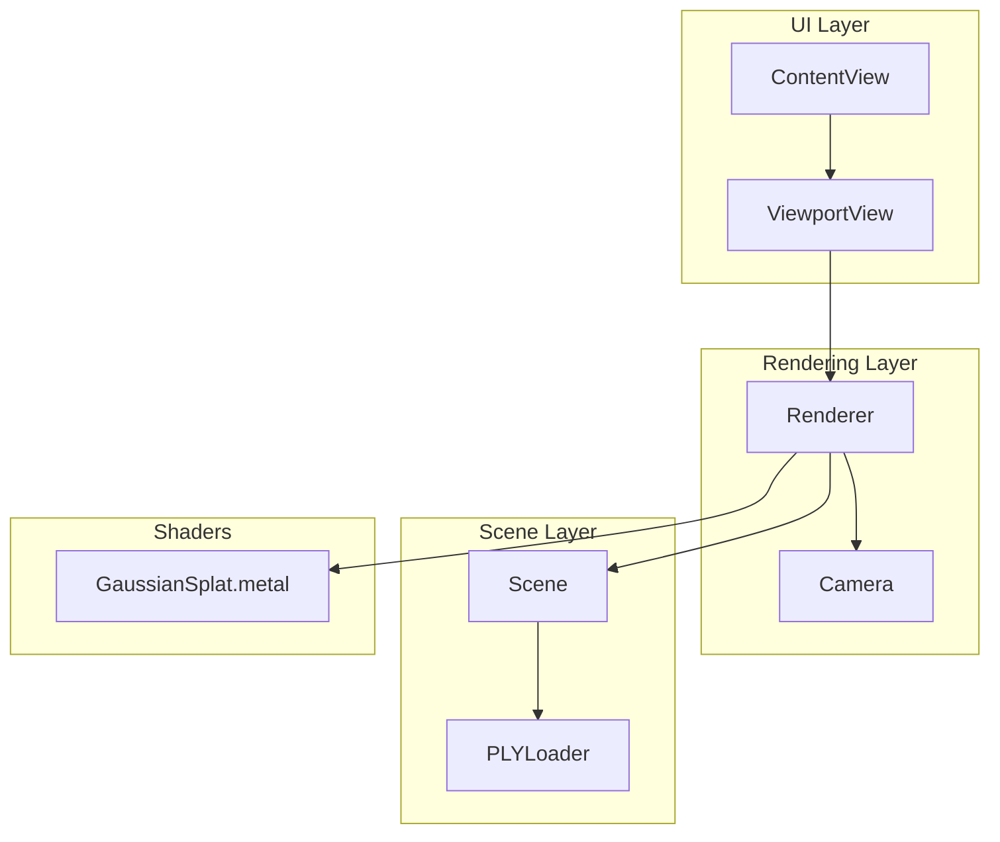
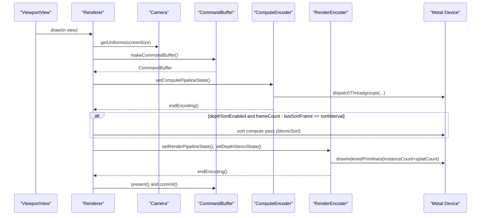
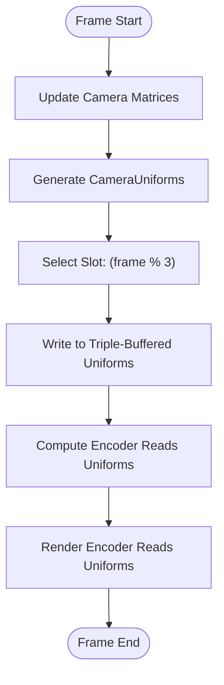
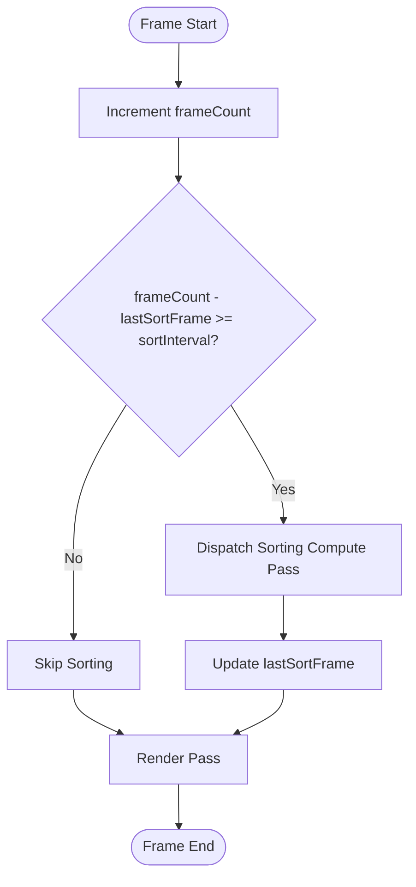
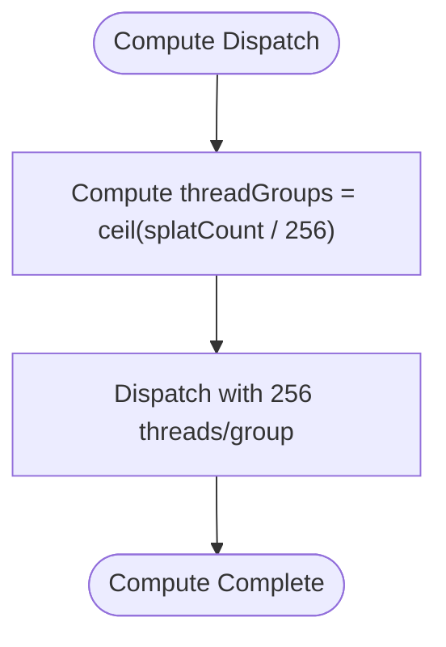
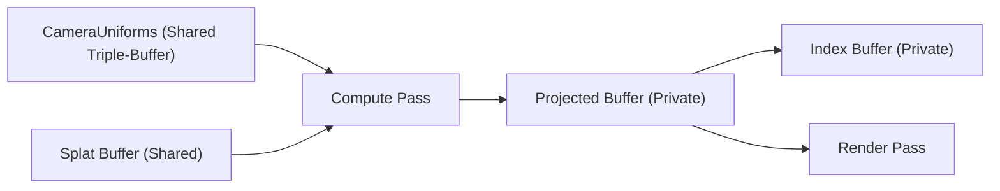
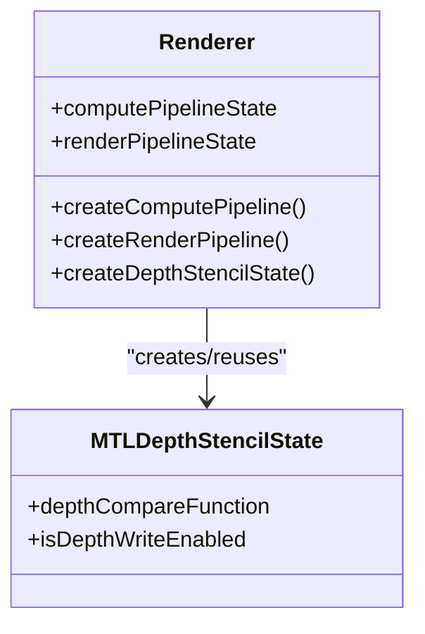
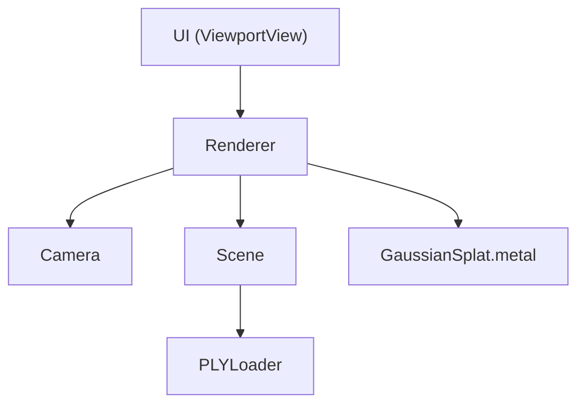

# Performance Optimization

<cite>
**Referenced Files in This Document**
- [Camera.swift](file://Sources/Rendering/Camera.swift)
- [Renderer.swift](file://Sources/Rendering/Renderer.swift)
- [GaussianSplat.metal](file://Sources/Shaders/GaussianSplat.metal)
- [MathTypes.swift](file://Sources/Math/MathTypes.swift)
- [Scene.swift](file://Sources/Scene/Scene.swift)
- [PLYLoader.swift](file://Sources/Scene/PLYLoader.swift)
- [ViewportView.swift](file://Sources/UI/ViewportView.swift)
- [ContentView.swift](file://Sources/UI/ContentView.swift)
</cite>

## Table of Contents
1. [Introduction](#introduction)
2. [Project Structure](#project-structure)
3. [Core Components](#core-components)
4. [Architecture Overview](#architecture-overview)
5. [Detailed Component Analysis](#detailed-component-analysis)
6. [Dependency Analysis](#dependency-analysis)
7. [Performance Considerations](#performance-considerations)
8. [Troubleshooting Guide](#troubleshooting-guide)
9. [Conclusion](#conclusion)

## Introduction
This document focuses on performance optimization techniques for rendering efficiency in a Gaussian Splatting viewer built with Metal. It explains the triple-buffered camera uniforms system for CPU-GPU synchronization, the frame-based depth sorting strategy with configurable intervals, and thread group sizing for compute shaders. It also documents buffer management strategies (shared storage mode usage, memory layout optimization, and buffer synchronization), render state optimization (pipeline state caching, avoiding redundant state changes, and efficient command buffer usage), and practical profiling techniques for identifying bottlenecks in large-scale Gaussian rendering. Trade-offs between quality and performance are addressed, including sorting frequency impact and memory bandwidth considerations.

## Project Structure
The project is organized around rendering, math utilities, scene loading, and UI integration:
- Rendering: Camera and Renderer orchestrate Metal pipelines, buffers, and draw cycles.
- Math: GPU-compatible structures and matrix/quaternion helpers.
- Scene: PLY loading and GPU buffer creation for splats and projected data.
- Shaders: Metal compute and fragment shaders for projection and rasterization.
- UI: SwiftUI/MetalKit integration for viewport and user interaction.

**Diagram sources**
- [ContentView.swift:1-119](file://Sources/UI/ContentView.swift#L1-L119)
- [ViewportView.swift:1-118](file://Sources/UI/ViewportView.swift#L1-L118)
- [Renderer.swift:1-288](file://Sources/Rendering/Renderer.swift#L1-L288)
- [Camera.swift:1-184](file://Sources/Rendering/Camera.swift#L1-L184)
- [Scene.swift:1-130](file://Sources/Scene/Scene.swift#L1-L130)
- [PLYLoader.swift:1-386](file://Sources/Scene/PLYLoader.swift#L1-L386)
- [GaussianSplat.metal:1-309](file://Sources/Shaders/GaussianSplat.metal#L1-L309)

**Section sources**
- [Renderer.swift:37-79](file://Sources/Rendering/Renderer.swift#L37-L79)
- [ViewportView.swift:8-31](file://Sources/UI/ViewportView.swift#L8-L31)
- [Scene.swift:24-85](file://Sources/Scene/Scene.swift#L24-L85)

## Core Components
- Camera: Maintains view/projection matrices and generates CameraUniforms for GPU. It caches matrices and exposes a method to produce GPU-ready uniforms.
- Renderer: Creates Metal pipelines, manages triple-buffered camera uniforms, dispatches compute and render passes, and controls frame-based depth sorting.
- Scene: Loads Gaussian splats from PLY, constructs GPU buffers, and computes scene bounds.
- Shaders: Compute shader projects Gaussians, vertex shader prepares per-instance geometry, and fragment shader evaluates splats with alpha blending.

Key performance-relevant elements:
- Triple-buffered camera uniforms buffer using shared storage mode.
- Frame-based depth sorting with configurable interval.
- Compute shader thread group sizing tuned to 256 threads per group.
- Shared/private storage modes for buffers to balance CPU/GPU coherency and memory bandwidth.

**Section sources**
- [Camera.swift:133-147](file://Sources/Rendering/Camera.swift#L133-L147)
- [Renderer.swift:131-145](file://Sources/Rendering/Renderer.swift#L131-L145)
- [Renderer.swift:187-250](file://Sources/Rendering/Renderer.swift#L187-L250)
- [Scene.swift:52-85](file://Sources/Scene/Scene.swift#L52-L85)
- [GaussianSplat.metal:138-198](file://Sources/Shaders/GaussianSplat.metal#L138-L198)

## Architecture Overview
The rendering pipeline consists of:
- Compute pass: Project Gaussians using a compute shader with per-frame camera uniforms.
- Optional depth sorting pass: Reorder projected Gaussians every N frames.
- Render pass: Draw instanced quads with alpha blending.

**Diagram sources**
- [Renderer.swift:171-250](file://Sources/Rendering/Renderer.swift#L171-L250)
- [GaussianSplat.metal:274-308](file://Sources/Shaders/GaussianSplat.metal#L274-L308)
- [Camera.swift:133-147](file://Sources/Rendering/Camera.swift#L133-L147)

## Detailed Component Analysis

### Triple-Buffered Camera Uniforms System
The camera uniforms buffer is triple-buffered to decouple CPU updates from GPU consumption:
- Buffer size equals the size of CameraUniforms multiplied by 3.
- Each frame selects an offset using frameCount modulo 3 to write new uniforms.
- The compute and render passes read from the same offset, ensuring the GPU always reads the most recent complete frame’s uniforms.

Benefits:
- Eliminates CPU-GPU synchronization stalls by allowing continuous CPU writes while GPU reads from a separate slot.
- Reduces contention and improves throughput in high-frequency camera updates.

Trade-offs:
- Increased memory footprint for the buffer.
- Requires careful offset calculation to avoid overwriting in-progress slots.

**Diagram sources**
- [Renderer.swift:252-259](file://Sources/Rendering/Renderer.swift#L252-L259)
- [Renderer.swift:198-208](file://Sources/Rendering/Renderer.swift#L198-L208)
- [Renderer.swift:229-230](file://Sources/Rendering/Renderer.swift#L229-L230)
- [Camera.swift:133-147](file://Sources/Rendering/Camera.swift#L133-L147)

**Section sources**
- [Renderer.swift:131-145](file://Sources/Rendering/Renderer.swift#L131-L145)
- [Renderer.swift:198-208](file://Sources/Rendering/Renderer.swift#L198-L208)
- [Renderer.swift:229-230](file://Sources/Rendering/Renderer.swift#L229-L230)
- [Renderer.swift:252-259](file://Sources/Rendering/Renderer.swift#L252-L259)

### Frame-Based Depth Sorting Strategy
The renderer implements a configurable depth-sorting interval:
- A counter tracks frames and compares against a fixed interval.
- When the interval elapses, a sorting pass is scheduled (placeholder in code).
- Sorting frequency can be tuned to balance correctness vs. performance.

Implications:
- Lower intervals improve visual correctness but increase compute cost.
- Higher intervals reduce compute cost but may cause depth artifacts.

**Diagram sources**
- [Renderer.swift:30-33](file://Sources/Rendering/Renderer.swift#L30-L33)
- [Renderer.swift:214-218](file://Sources/Rendering/Renderer.swift#L214-L218)

**Section sources**
- [Renderer.swift:30-33](file://Sources/Rendering/Renderer.swift#L30-L33)
- [Renderer.swift:214-218](file://Sources/Rendering/Renderer.swift#L214-L218)

### Thread Group Sizing for Compute Shader Performance
The compute shader dispatch uses a fixed thread group size:
- threadsPerThreadgroup: width 256, height 1, depth 1.
- threadGroups: derived from splatCount to cover all Gaussians.

Guidelines:
- Choose thread group sizes that align with GPU hardware characteristics (e.g., multiples of warp/wavefront sizes).
- Ensure sufficient occupancy while avoiding oversubscription.
- Consider work distribution granularity to minimize divergence.

**Diagram sources**
- [Renderer.swift:202-208](file://Sources/Rendering/Renderer.swift#L202-L208)

**Section sources**
- [Renderer.swift:202-208](file://Sources/Rendering/Renderer.swift#L202-L208)

### Buffer Management Strategies
- Camera uniforms buffer: triple-buffered with shared storage mode for CPU/GPU coherency.
- Splat buffer: created with shared storage mode for initial CPU-to-GPU transfer.
- Projected buffer: private storage mode for compute output to reduce coherency overhead.
- Index buffer: private storage mode for sorting indices.

Memory layout optimization:
- Structs are GPU-compatible and padded to ensure alignment.
- CameraUniforms and ProjectedGaussian are sized to minimize padding overhead.

Synchronization techniques:
- Triple-buffering avoids read/write conflicts by cycling offsets.
- Private buffers minimize cache coherency traffic for intermediate compute results.

**Diagram sources**
- [Renderer.swift:131-145](file://Sources/Rendering/Renderer.swift#L131-L145)
- [Scene.swift:52-85](file://Sources/Scene/Scene.swift#L52-L85)
- [MathTypes.swift:34-73](file://Sources/Math/MathTypes.swift#L34-L73)

**Section sources**
- [Renderer.swift:131-145](file://Sources/Rendering/Renderer.swift#L131-L145)
- [Scene.swift:52-85](file://Sources/Scene/Scene.swift#L52-L85)
- [MathTypes.swift:34-73](file://Sources/Math/MathTypes.swift#L34-L73)

### Render State Optimization
- Pipeline state caching: compute and render pipeline states are created once and reused across frames.
- Redundant state changes: depth stencil state is created per frame; consider caching and reusing a single state object.
- Efficient command buffer usage: command buffers are created per frame and immediately committed.

Recommendations:
- Cache MTLDepthStencilState and reuse it across frames.
- Minimize encoder bindings by grouping draws with identical states.
- Use command buffer lifecycle efficiently to avoid stalls.

**Diagram sources**
- [Renderer.swift:83-95](file://Sources/Rendering/Renderer.swift#L83-L95)
- [Renderer.swift:97-129](file://Sources/Rendering/Renderer.swift#L97-L129)
- [Renderer.swift:261-266](file://Sources/Rendering/Renderer.swift#L261-L266)

**Section sources**
- [Renderer.swift:83-95](file://Sources/Rendering/Renderer.swift#L83-L95)
- [Renderer.swift:97-129](file://Sources/Rendering/Renderer.swift#L97-L129)
- [Renderer.swift:261-266](file://Sources/Rendering/Renderer.swift#L261-L266)

### Practical Profiling Techniques and Bottleneck Identification
- Frame timing: Track per-frame durations for compute, sorting, and render passes.
- GPU utilization: Use Instruments to measure compute throughput and memory bandwidth.
- Sorting cost: Profile the sorting compute kernel to quantify overhead versus correctness.
- Memory bandwidth: Monitor buffer sizes and access patterns; consider reducing private buffer sizes if feasible.

Optimization strategies for large-scale Gaussian rendering:
- Reduce sorting frequency or replace with approximate methods (e.g., spatial buckets).
- Increase thread group size moderately to improve occupancy.
- Reuse depth/stencil state and minimize encoder bindings.
- Consider tiled or hierarchical approaches to reduce per-pixel work.

[No sources needed since this section provides general guidance]

### Trade-offs Between Quality and Performance
- Sorting frequency: More frequent sorting improves depth correctness but increases compute cost.
- Memory bandwidth: Shared storage mode reduces coherency overhead but increases bandwidth; private storage reduces bandwidth but requires careful synchronization.
- Thread group sizing: Larger groups improve occupancy but risk divergence; smaller groups offer finer granularity.

[No sources needed since this section provides general guidance]

## Dependency Analysis
The rendering system exhibits clear layering:
- UI depends on Renderer via ViewportView.
- Renderer depends on Camera, Scene, and Shaders.
- Scene depends on PLYLoader for data ingestion.
- Shaders define compute and render stages consumed by Renderer.

**Diagram sources**
- [ViewportView.swift:16-19](file://Sources/UI/ViewportView.swift#L16-L19)
- [Renderer.swift:57-62](file://Sources/Rendering/Renderer.swift#L57-L62)
- [Scene.swift:24-36](file://Sources/Scene/Scene.swift#L24-L36)
- [PLYLoader.swift:42-49](file://Sources/Scene/PLYLoader.swift#L42-L49)
- [GaussianSplat.metal:138-198](file://Sources/Shaders/GaussianSplat.metal#L138-L198)

**Section sources**
- [ViewportView.swift:16-19](file://Sources/UI/ViewportView.swift#L16-L19)
- [Renderer.swift:57-62](file://Sources/Rendering/Renderer.swift#L57-L62)
- [Scene.swift:24-36](file://Sources/Scene/Scene.swift#L24-L36)
- [PLYLoader.swift:42-49](file://Sources/Scene/PLYLoader.swift#L42-L49)
- [GaussianSplat.metal:138-198](file://Sources/Shaders/GaussianSplat.metal#L138-L198)

## Performance Considerations
- Triple-buffered camera uniforms: Use modulo-based offsets to avoid contention; keep buffer size minimal yet aligned.
- Frame-based sorting: Tune sortInterval to balance correctness and compute cost; consider adaptive intervals based on camera motion.
- Compute thread group sizing: Align with GPU wavefront size; monitor occupancy and adjust group size.
- Buffer storage modes: Prefer shared for frequently updated data, private for intermediate compute outputs.
- Pipeline state caching: Cache depth/stencil states and reuse across frames to avoid repeated creation overhead.
- Command buffer lifecycle: Commit promptly and avoid long-lived command buffers to prevent stalls.

[No sources needed since this section provides general guidance]

## Troubleshooting Guide
Common issues and remedies:
- Garbage or flickering splats: Verify camera uniforms are written to the correct triple-buffer slot and read consistently.
- Slow sorting: Confirm the sorting compute pass is dispatched only when needed; profile to confirm cost.
- Bandwidth spikes: Review buffer sizes and storage modes; consider reducing private buffer sizes if possible.
- Depth artifacts: Increase sorting frequency or refine the sorting algorithm.

**Section sources**
- [Renderer.swift:198-208](file://Sources/Rendering/Renderer.swift#L198-L208)
- [Renderer.swift:214-218](file://Sources/Rendering/Renderer.swift#L214-L218)
- [Renderer.swift:229-230](file://Sources/Rendering/Renderer.swift#L229-L230)

## Conclusion
The Gaussian Splatting viewer employs triple-buffered camera uniforms, frame-based depth sorting, and tuned compute thread group sizing to achieve efficient CPU-GPU synchronization and scalable rendering. Buffer management leverages shared/private storage modes to balance coherency and bandwidth. Render state optimization through caching and reduced state changes further improves performance. For large-scale scenes, carefully tuning sorting frequency and compute parameters, combined with profiling-driven optimizations, yields significant improvements in throughput while maintaining visual fidelity.