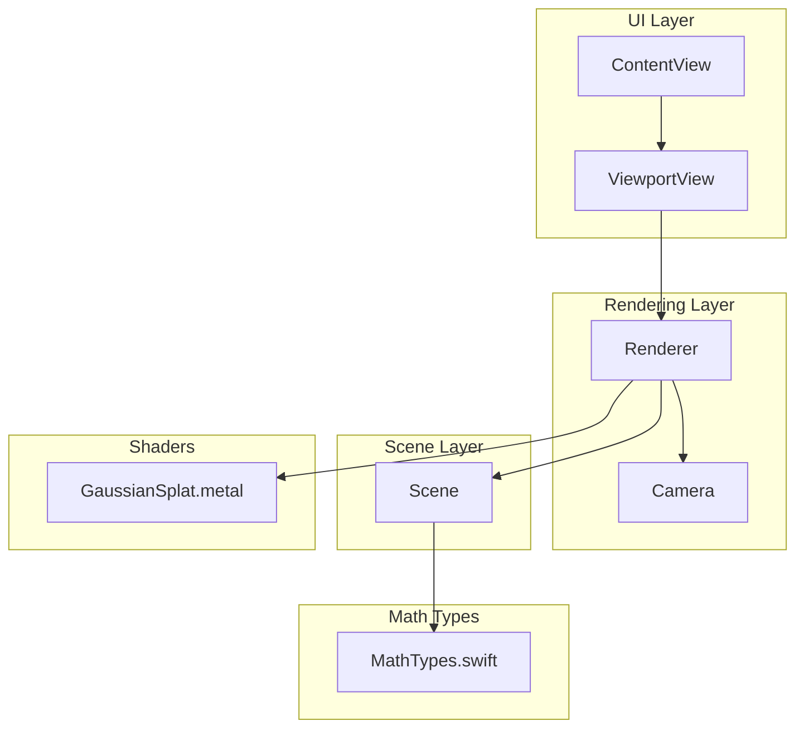
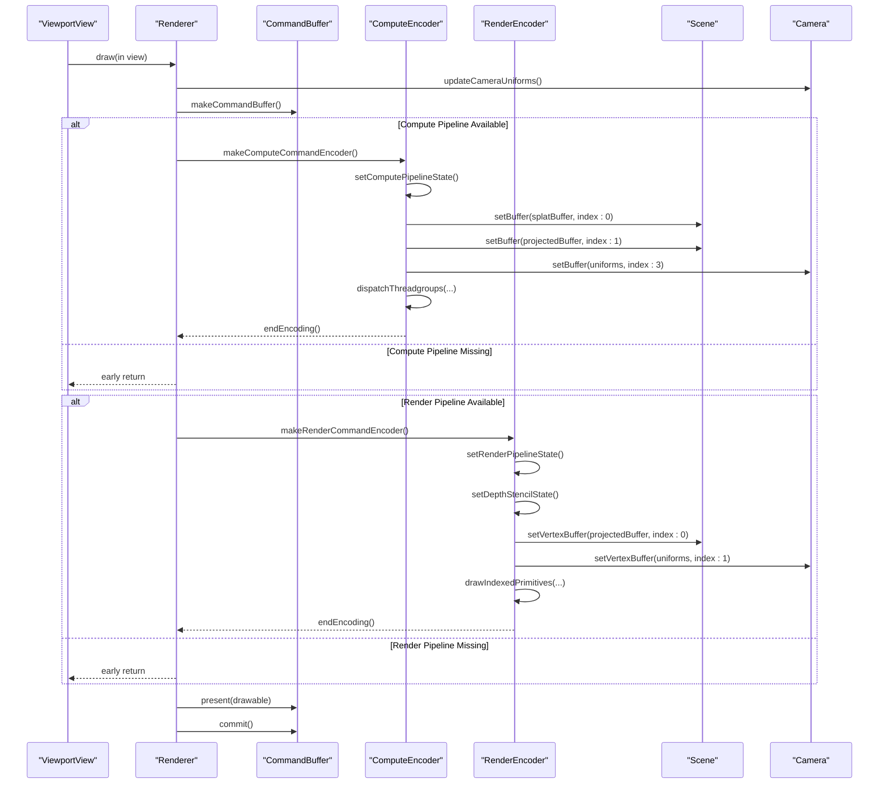
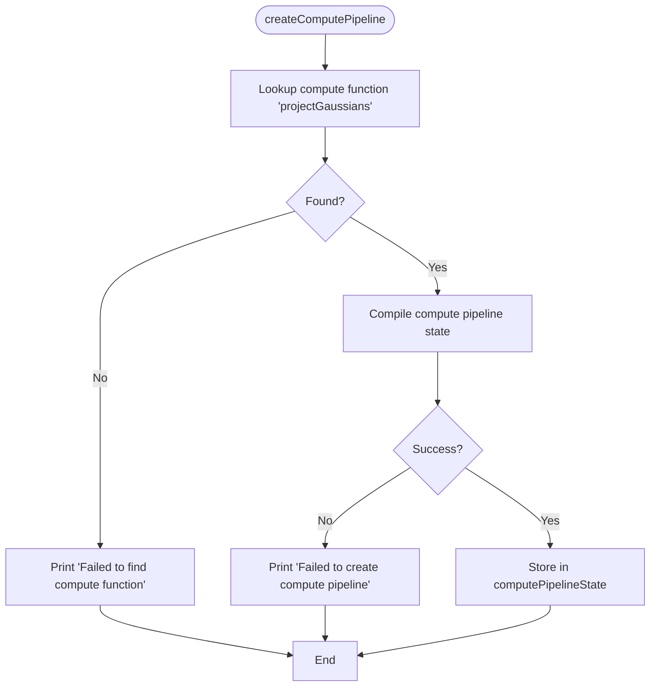
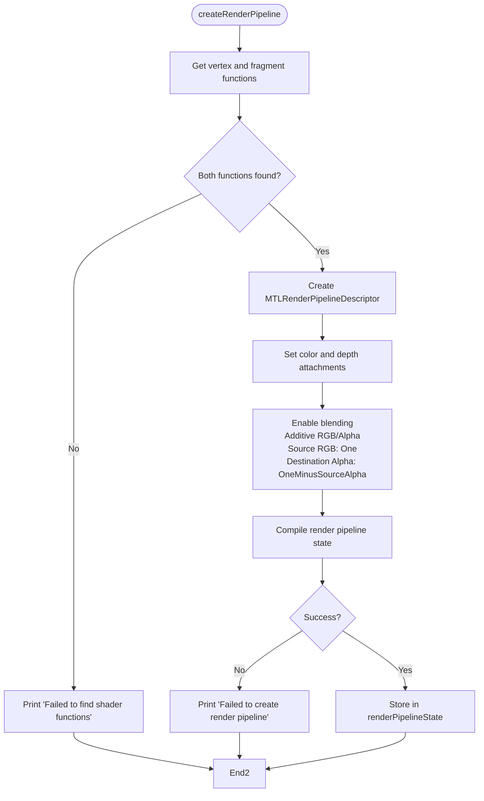
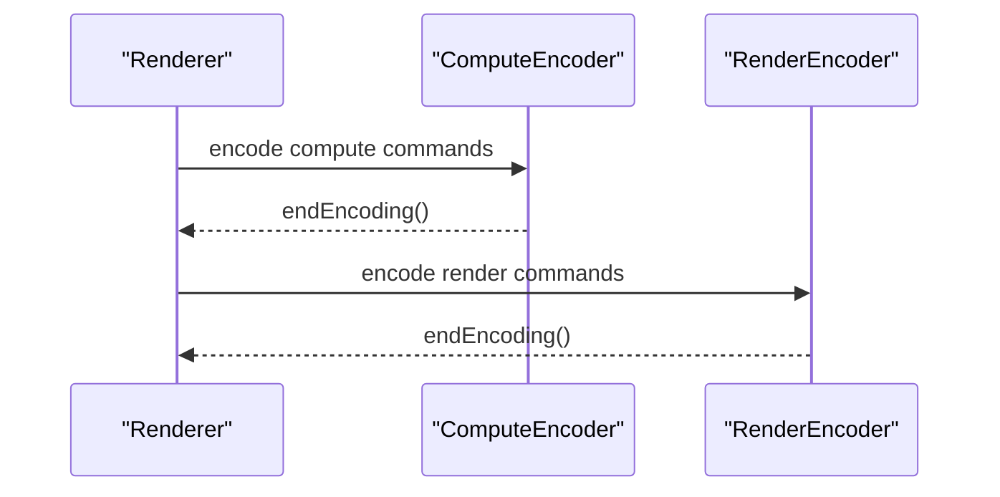
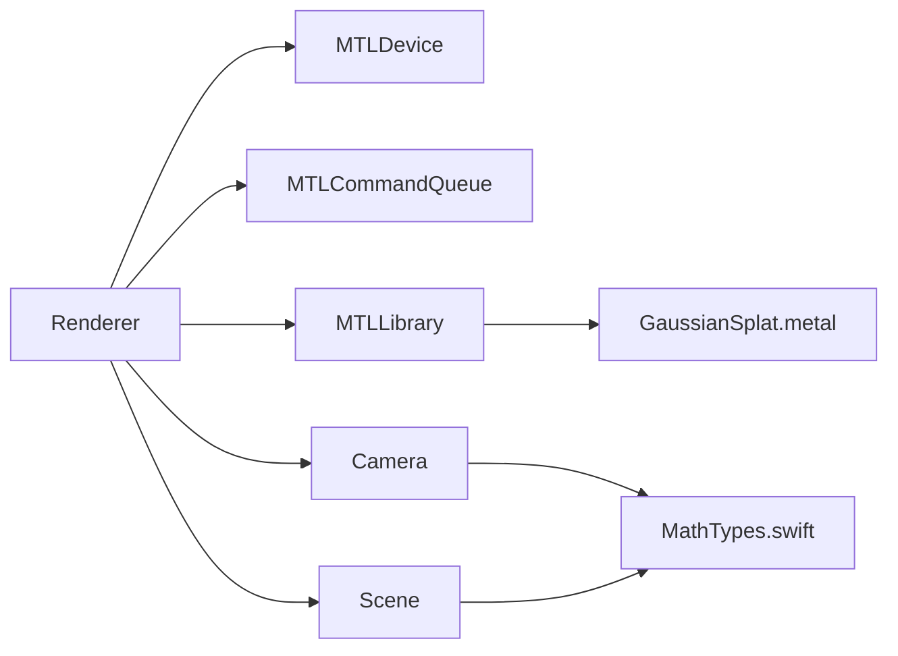

# Pipeline State Management

<cite>
**Referenced Files in This Document**
- [Renderer.swift](file://Sources/Rendering/Renderer.swift)
- [GaussianSplat.metal](file://Sources/Shaders/GaussianSplat.metal)
- [MathTypes.swift](file://Sources/Math/MathTypes.swift)
- [Scene.swift](file://Sources/Scene/Scene.swift)
- [Camera.swift](file://Sources/Rendering/Camera.swift)
- [ViewportView.swift](file://Sources/UI/ViewportView.swift)
- [ContentView.swift](file://Sources/UI/ContentView.swift)
- [Package.swift](file://Package.swift)
</cite>

## Table of Contents
1. [Introduction](#introduction)
2. [Project Structure](#project-structure)
3. [Core Components](#core-components)
4. [Architecture Overview](#architecture-overview)
5. [Detailed Component Analysis](#detailed-component-analysis)
6. [Dependency Analysis](#dependency-analysis)
7. [Performance Considerations](#performance-considerations)
8. [Troubleshooting Guide](#troubleshooting-guide)
9. [Conclusion](#conclusion)

## Introduction
This document explains the pipeline state management for the Gaussian Splatting viewer, focusing on Metal pipeline state creation and configuration. It covers:
- Compute pipeline state setup for the projectGaussians function, including function loading from the Metal library and pipeline state compilation.
- Render pipeline state creation with vertex and fragment shader configuration, color attachment setup for sRGB format, and depth attachment configuration.
- Blend state configuration for alpha compositing using additive blending with one-oneMinusSourceAlpha factors.
- Pipeline state caching strategy and error handling during pipeline creation.
- Practical examples of pipeline state validation, memory layout considerations, and performance implications of different pipeline configurations.
- The relationship between compute and render pipelines and their sequential execution requirements.

## Project Structure
The project is organized around rendering, math types, scene management, shaders, and UI integration. The renderer initializes Metal devices, compiles shaders, creates pipeline states, and executes a two-stage rendering pipeline: compute projection followed by rasterized rendering.

**Diagram sources**
- [Renderer.swift:1-288](file://Sources/Rendering/Renderer.swift#L1-L288)
- [GaussianSplat.metal:1-309](file://Sources/Shaders/GaussianSplat.metal#L1-L309)
- [MathTypes.swift:1-189](file://Sources/Math/MathTypes.swift#L1-L189)
- [Scene.swift:1-130](file://Sources/Scene/Scene.swift#L1-L130)
- [Camera.swift:1-184](file://Sources/Rendering/Camera.swift#L1-L184)
- [ViewportView.swift:1-118](file://Sources/UI/ViewportView.swift#L1-L118)
- [ContentView.swift:1-119](file://Sources/UI/ContentView.swift#L1-L119)

**Section sources**
- [Renderer.swift:1-288](file://Sources/Rendering/Renderer.swift#L1-L288)
- [Package.swift:1-17](file://Package.swift#L1-L17)

## Core Components
- Renderer: Creates Metal device, command queue, and Metal library from shader source. Builds compute and render pipeline states, manages buffers, and executes the drawing loop.
- Camera: Computes view/projection matrices and provides GPU-compatible uniforms.
- Scene: Loads Gaussian splats from PLY, constructs GPU buffers, and exposes counts and metadata.
- Shaders: Define compute and vertex/fragment stages for projection and rendering.

Key responsibilities:
- Pipeline creation and caching: computePipelineState and renderPipelineState are stored as optional properties and reused across frames.
- Buffer management: Uniforms buffer is triple-buffered for CPU/GPU synchronization; index buffer supports instanced rendering.
- Two-stage pipeline: Compute encoder projects Gaussians; render encoder draws instanced quads with blending.

**Section sources**
- [Renderer.swift:6-79](file://Sources/Rendering/Renderer.swift#L6-L79)
- [Renderer.swift:83-129](file://Sources/Rendering/Renderer.swift#L83-L129)
- [Renderer.swift:131-145](file://Sources/Rendering/Renderer.swift#L131-L145)
- [Renderer.swift:171-250](file://Sources/Rendering/Renderer.swift#L171-L250)
- [Camera.swift:133-147](file://Sources/Rendering/Camera.swift#L133-L147)
- [Scene.swift:52-85](file://Sources/Scene/Scene.swift#L52-L85)

## Architecture Overview
The renderer orchestrates a compute-first pipeline:
1. Compute pass: projectGaussians computes per-splat projected data (depth, conic, color, opacity, radius) and writes to a projected buffer.
2. Optional depth sorting: placeholder for future sorting (currently a TODO).
3. Render pass: gaussianVertex/gaussianFragment draw instanced quads with alpha blending and depth testing.

**Diagram sources**
- [Renderer.swift:171-250](file://Sources/Rendering/Renderer.swift#L171-L250)
- [Renderer.swift:252-259](file://Sources/Rendering/Renderer.swift#L252-L259)
- [Renderer.swift:261-266](file://Sources/Rendering/Renderer.swift#L261-L266)

## Detailed Component Analysis

### Compute Pipeline State: projectGaussians
- Function loading: The compute function named projectGaussians is retrieved from the compiled Metal library.
- Compilation: A compute pipeline state is created from the compute function and cached in computePipelineState.
- Error handling: If the function is missing or compilation fails, a message is printed and the pipeline remains unset.
- Dispatch: In the draw loop, the compute encoder sets buffers (input splat data, output projected data, and camera uniforms) and dispatches threadgroups sized for the splat count.

**Diagram sources**
- [Renderer.swift:83-95](file://Sources/Rendering/Renderer.swift#L83-L95)
- [GaussianSplat.metal:138-198](file://Sources/Shaders/GaussianSplat.metal#L138-L198)

**Section sources**
- [Renderer.swift:83-95](file://Sources/Rendering/Renderer.swift#L83-L95)
- [GaussianSplat.metal:138-198](file://Sources/Shaders/GaussianSplat.metal#L138-L198)

### Render Pipeline State: Vertex and Fragment Shaders
- Function loading: Vertex and fragment functions gaussianVertex and gaussianFragment are retrieved from the Metal library.
- Descriptor setup: The render pipeline descriptor specifies vertex and fragment functions, color attachment pixel format as sRGB BGRA, and depth attachment pixel format as 32-bit float.
- Blend state: Blending is enabled with additive RGB and alpha blend operations, using source RGB factor one and destination alpha factor oneMinusSourceAlpha for both channels.
- Depth stencil: A depth stencil state is created with less-than compare and depth write enabled.

**Diagram sources**
- [Renderer.swift:97-129](file://Sources/Rendering/Renderer.swift#L97-L129)
- [GaussianSplat.metal:202-270](file://Sources/Shaders/GaussianSplat.metal#L202-L270)

**Section sources**
- [Renderer.swift:97-129](file://Sources/Rendering/Renderer.swift#L97-L129)
- [GaussianSplat.metal:202-270](file://Sources/Shaders/GaussianSplat.metal#L202-L270)

### Blend State Configuration Details
- Operation: Additive blending for both RGB and alpha channels.
- Factors:
  - Source RGB: One
  - Destination Alpha: OneMinusSourceAlpha
  - Source Alpha: One
  - Destination Alpha: OneMinusSourceAlpha
- Purpose: Achieves correct alpha compositing for overlapping splats while preserving premultiplied alpha semantics.

**Section sources**
- [Renderer.swift:113-121](file://Sources/Rendering/Renderer.swift#L113-L121)
- [GaussianSplat.metal:245-270](file://Sources/Shaders/GaussianSplat.metal#L245-L270)

### Pipeline State Caching Strategy
- Storage: Both compute and render pipeline states are stored as optional properties on the renderer and reused across frames.
- Initialization: Pipelines are created once during initialization and remain valid for the app lifecycle.
- Validation: During drawing, the renderer checks for non-nil pipeline states before encoding commands.

Benefits:
- Avoids repeated compilation overhead.
- Ensures consistent state across frames.

**Section sources**
- [Renderer.swift:12-14](file://Sources/Rendering/Renderer.swift#L12-L14)
- [Renderer.swift:72-75](file://Sources/Rendering/Renderer.swift#L72-L75)
- [Renderer.swift:171-180](file://Sources/Rendering/Renderer.swift#L171-L180)

### Error Handling During Pipeline Creation
- Library compilation: If the Metal library fails to compile from source, initialization returns nil and a failure message is printed.
- Function lookup: If compute or vertex/fragment functions are missing, a failure message is printed and pipeline creation is skipped.
- Pipeline compilation: If either pipeline compilation fails, a failure message is printed.

Recommendations:
- Validate pipeline states before drawing.
- Provide fallback UI or logging when pipelines fail to compile.

**Section sources**
- [Renderer.swift:46-55](file://Sources/Rendering/Renderer.swift#L46-L55)
- [Renderer.swift:84-94](file://Sources/Rendering/Renderer.swift#L84-L94)
- [Renderer.swift:101-105](file://Sources/Rendering/Renderer.swift#L101-L105)
- [Renderer.swift:123-128](file://Sources/Rendering/Renderer.swift#L123-L128)

### Pipeline State Validation
- Pre-draw checks: The renderer verifies that compute and render pipeline states, scene readiness, command buffer, render pass descriptor, and drawable are available before proceeding.
- Uniform updates: Camera uniforms are triple-buffered and offset per frame to synchronize with GPU.

Validation steps:
- Ensure computePipelineState and renderPipelineState are non-nil.
- Confirm scene.isLoaded and buffers are allocated.
- Verify drawable and render pass descriptor are present.

**Section sources**
- [Renderer.swift:171-180](file://Sources/Rendering/Renderer.swift#L171-L180)
- [Renderer.swift:252-259](file://Sources/Rendering/Renderer.swift#L252-L259)

### Memory Layout Considerations
- Uniform buffer: Triple-buffered using a shared storage mode buffer sized by the CameraUniforms stride multiplied by three. Frame-appropriate segment is selected via offset.
- Index buffer: Shared storage mode buffer containing six 16-bit indices for a quad.
- GPU buffers:
  - Splat buffer: Shared storage mode holding GaussianGPUData entries.
  - Projected buffer: Private storage mode for compute output.
  - Index buffer: Private storage mode for sorting indices.

Alignment and padding:
- Structs in Swift and Metal are aligned to 16-byte boundaries; padding fields are explicitly declared to ensure correct alignment.

**Section sources**
- [Renderer.swift:131-145](file://Sources/Rendering/Renderer.swift#L131-L145)
- [Scene.swift:52-85](file://Sources/Scene/Scene.swift#L52-L85)
- [MathTypes.swift:34-73](file://Sources/Math/MathTypes.swift#L34-L73)
- [GaussianSplat.metal:6-42](file://Sources/Shaders/GaussianSplat.metal#L6-L42)

### Performance Implications
- Compute dispatch sizing: Thread groups use a fixed width of 256 threads; total groups scale with splat count. This balances occupancy and throughput.
- Blending cost: Additive blending with one-oneMinusSourceAlpha is efficient and suitable for translucent splats.
- Depth testing: Less-than compare with depth writes enabled reduces overdraw and improves correctness.
- Buffer storage modes:
  - Shared buffers reduce memory bandwidth pressure for frequently accessed data (uniforms, indices).
  - Private buffers minimize contention for compute outputs and sorting indices.

**Section sources**
- [Renderer.swift:202-208](file://Sources/Rendering/Renderer.swift#L202-L208)
- [Renderer.swift:113-121](file://Sources/Rendering/Renderer.swift#L113-L121)
- [Renderer.swift:261-266](file://Sources/Rendering/Renderer.swift#L261-L266)

### Relationship Between Compute and Render Pipelines
- Sequential execution: The compute pass must complete before the render pass begins. The renderer encodes compute commands, ends the compute encoder, then proceeds to render.
- Data dependency: The compute pass writes projected data consumed by the render pass.
- Optional sorting: A depth sorting step is currently a placeholder and would require additional compute passes and synchronization.

**Diagram sources**
- [Renderer.swift:187-212](file://Sources/Rendering/Renderer.swift#L187-L212)
- [Renderer.swift:220-246](file://Sources/Rendering/Renderer.swift#L220-L246)

**Section sources**
- [Renderer.swift:187-212](file://Sources/Rendering/Renderer.swift#L187-L212)
- [Renderer.swift:220-246](file://Sources/Rendering/Renderer.swift#L220-L246)

## Dependency Analysis
- Renderer depends on:
  - Metal device and command queue.
  - Metal library compiled from shader source.
  - Camera for uniforms.
  - Scene for GPU buffers and splat count.
- Shaders define the compute and vertex/fragment functions used by the renderer.
- UI integrates the renderer via MTKView and forwards user input.

**Diagram sources**
- [Renderer.swift:6-79](file://Sources/Rendering/Renderer.swift#L6-L79)
- [GaussianSplat.metal:1-309](file://Sources/Shaders/GaussianSplat.metal#L1-L309)
- [MathTypes.swift:1-189](file://Sources/Math/MathTypes.swift#L1-L189)
- [Scene.swift:1-130](file://Sources/Scene/Scene.swift#L1-L130)
- [Camera.swift:1-184](file://Sources/Rendering/Camera.swift#L1-L184)

**Section sources**
- [Renderer.swift:6-79](file://Sources/Rendering/Renderer.swift#L6-L79)
- [GaussianSplat.metal:1-309](file://Sources/Shaders/GaussianSplat.metal#L1-L309)
- [MathTypes.swift:1-189](file://Sources/Math/MathTypes.swift#L1-L189)
- [Scene.swift:1-130](file://Sources/Scene/Scene.swift#L1-L130)
- [Camera.swift:1-184](file://Sources/Rendering/Camera.swift#L1-L184)

## Performance Considerations
- Prefer shared storage mode for buffers frequently updated by CPU (uniforms, indices) to reduce bandwidth.
- Use private storage mode for compute outputs and temporary data to minimize contention.
- Keep compute dispatch sizes aligned with hardware thread group sizes for optimal occupancy.
- Enable depth testing to reduce overdraw for translucent splats.
- Validate pipeline states early to avoid redundant work and to surface errors promptly.

[No sources needed since this section provides general guidance]

## Troubleshooting Guide
Common issues and resolutions:
- Missing shader functions:
  - Symptom: Failure messages indicating missing compute or vertex/fragment functions.
  - Resolution: Ensure function names match those used in the renderer and that the Metal library was compiled successfully.
- Pipeline compilation failures:
  - Symptom: Failure messages during compute or render pipeline creation.
  - Resolution: Verify shader syntax and Metal API usage; confirm device capabilities.
- Missing drawable or render pass descriptor:
  - Symptom: Early return in draw due to unavailable drawable or descriptor.
  - Resolution: Ensure MTKView is configured with appropriate pixel formats and that the view is visible.
- Incorrect blend results:
  - Symptom: Incorrect alpha compositing or artifacts.
  - Resolution: Verify blend operation and factors match the intended compositing model.

**Section sources**
- [Renderer.swift:46-55](file://Sources/Rendering/Renderer.swift#L46-L55)
- [Renderer.swift:84-94](file://Sources/Rendering/Renderer.swift#L84-L94)
- [Renderer.swift:101-105](file://Sources/Rendering/Renderer.swift#L101-L105)
- [Renderer.swift:123-128](file://Sources/Rendering/Renderer.swift#L123-L128)
- [Renderer.swift:171-180](file://Sources/Rendering/Renderer.swift#L171-L180)

## Conclusion
The pipeline state management in this Gaussian Splatting viewer centers on robust compute and render pipeline creation, careful buffer management, and sequential execution guarantees. The compute pass projects splats into screen space, while the render pass draws instanced quads with alpha blending and depth testing. Proper validation, caching, and memory layout choices ensure efficient and reliable rendering across frames.

[No sources needed since this section summarizes without analyzing specific files]