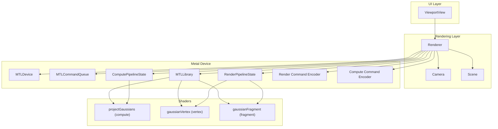
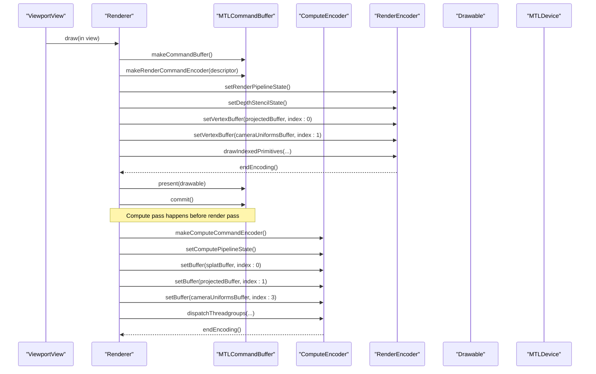
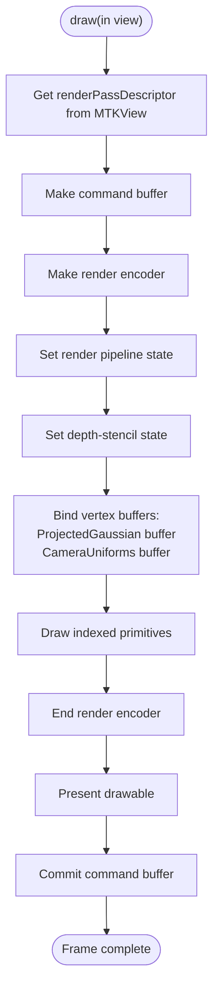
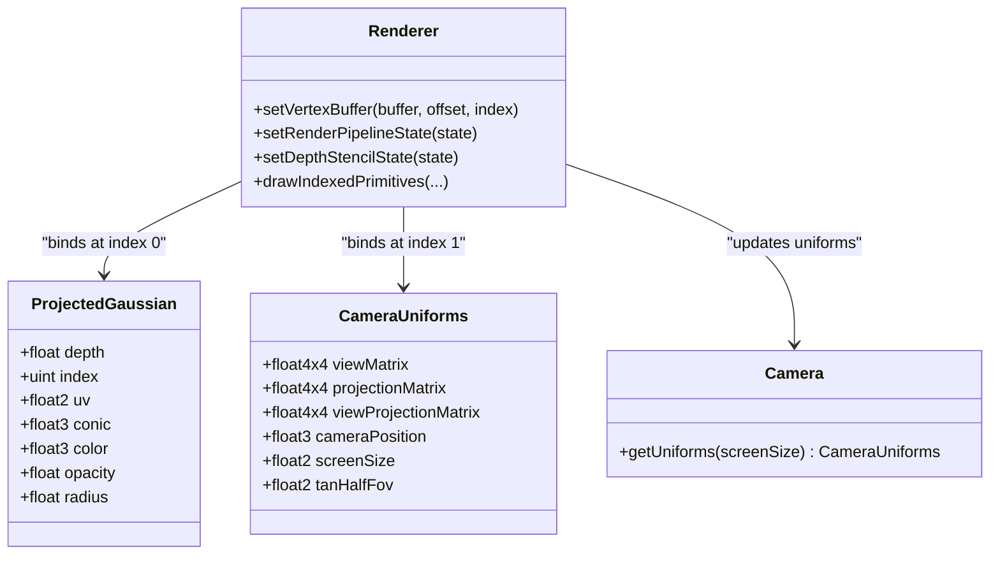
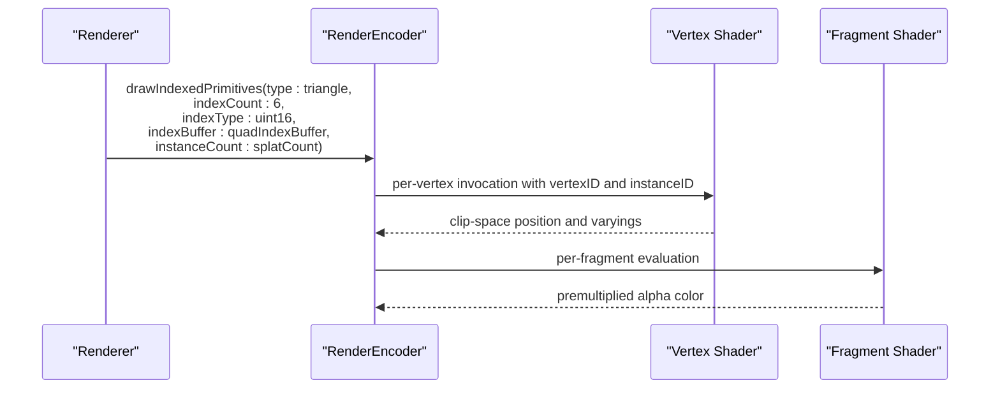
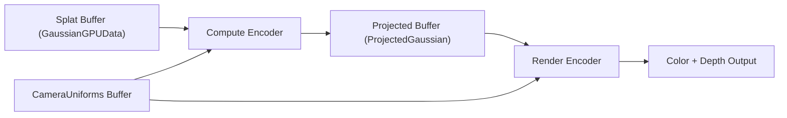
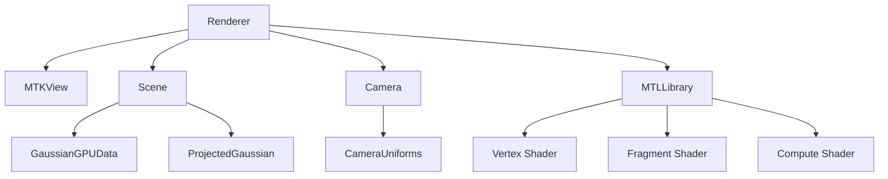

# Render Pass Encoding

<cite>
**Referenced Files in This Document**
- [Renderer.swift](file://Sources/Rendering/Renderer.swift)
- [GaussianSplat.metal](file://Sources/Shaders/GaussianSplat.metal)
- [Scene.swift](file://Sources/Scene/Scene.swift)
- [Camera.swift](file://Sources/Rendering/Camera.swift)
- [MathTypes.swift](file://Sources/Math/MathTypes.swift)
- [ViewportView.swift](file://Sources/UI/ViewportView.swift)
</cite>

## Table of Contents
1. [Introduction](#introduction)
2. [Project Structure](#project-structure)
3. [Core Components](#core-components)
4. [Architecture Overview](#architecture-overview)
5. [Detailed Component Analysis](#detailed-component-analysis)
6. [Dependency Analysis](#dependency-analysis)
7. [Performance Considerations](#performance-considerations)
8. [Troubleshooting Guide](#troubleshooting-guide)
9. [Conclusion](#conclusion)

## Introduction
This document explains the Metal render pass encoding implementation for a Gaussian splatting renderer. It covers render pass descriptor setup, color and depth attachment configuration, render pass lifecycle management, vertex buffer binding for projected Gaussian data and camera uniforms, pipeline state configuration, depth stencil state setup, draw call execution with indexed primitive rendering, and the command buffer commit/present flow. It also includes practical optimization strategies, buffer synchronization approaches, and the integration between compute pass output and render pass input data flow.

## Project Structure
The renderer integrates Metal compute and render passes with a SwiftUI-driven viewport. The key components are:
- Renderer: orchestrates compute and render passes, manages buffers, and drives the draw loop.
- Scene: holds GPU buffers for Gaussian data and projected results.
- Camera: computes uniform matrices and provides GPU-ready CameraUniforms.
- Shaders: compute shader projects Gaussians; vertex and fragment shaders render instanced quads.

**Diagram sources**
- [Renderer.swift:37-79](file://Sources/Rendering/Renderer.swift#L37-L79)
- [GaussianSplat.metal:138-198](file://Sources/Shaders/GaussianSplat.metal#L138-L198)
- [GaussianSplat.metal:202-270](file://Sources/Shaders/GaussianSplat.metal#L202-L270)
- [Scene.swift:52-85](file://Sources/Scene/Scene.swift#L52-L85)
- [Camera.swift:134-147](file://Sources/Rendering/Camera.swift#L134-L147)

**Section sources**
- [Renderer.swift:37-79](file://Sources/Rendering/Renderer.swift#L37-L79)
- [ViewportView.swift:8-31](file://Sources/UI/ViewportView.swift#L8-L31)

## Core Components
- Renderer: creates pipelines, buffers, and runs the draw loop. It sets up the render pass descriptor from the MTKView, encodes compute and render passes, and commits/presents the command buffer.
- Scene: owns GPU buffers for Gaussian data and projected results, and exposes counts and sizes.
- Camera: provides CameraUniforms with view/projection matrices and screen parameters.
- Shaders: compute shader writes ProjectedGaussian data; vertex shader reads per-instance projected data and camera uniforms; fragment shader evaluates Gaussian splats with premultiplied alpha.

**Section sources**
- [Renderer.swift:83-129](file://Sources/Rendering/Renderer.swift#L83-L129)
- [Scene.swift:52-85](file://Sources/Scene/Scene.swift#L52-L85)
- [Camera.swift:134-147](file://Sources/Rendering/Camera.swift#L134-L147)
- [GaussianSplat.metal:138-198](file://Sources/Shaders/GaussianSplat.metal#L138-L198)
- [GaussianSplat.metal:202-270](file://Sources/Shaders/GaussianSplat.metal#L202-L270)

## Architecture Overview
The render pipeline is a two-stage process:
1) Compute pass: project Gaussians into screen-space and produce ProjectedGaussian data.
2) Render pass: draw instanced quads using the computed per-splat data and camera uniforms.

**Diagram sources**
- [Renderer.swift:171-250](file://Sources/Rendering/Renderer.swift#L171-L250)
- [GaussianSplat.metal:138-198](file://Sources/Shaders/GaussianSplat.metal#L138-L198)
- [GaussianSplat.metal:202-270](file://Sources/Shaders/GaussianSplat.metal#L202-L270)

## Detailed Component Analysis

### Render Pass Descriptor Setup and Lifecycle
- The render pass descriptor is obtained from the MTKView during the draw callback. The renderer uses this descriptor to create the render command encoder.
- Color and depth attachments are configured in the render pipeline descriptor:
  - Color attachment pixel format is set to a linear sRGB format suitable for blending.
  - Depth attachment pixel format is set to a 32-bit float depth buffer.
- The render pass lifecycle:
  - Create render encoder from the current render pass descriptor.
  - Configure pipeline state and depth-stencil state.
  - Bind vertex buffers and issue draw calls.
  - End the render encoder.
  - Present the drawable and commit the command buffer.

**Diagram sources**
- [Renderer.swift:171-250](file://Sources/Rendering/Renderer.swift#L171-L250)
- [Renderer.swift:97-129](file://Sources/Rendering/Renderer.swift#L97-L129)

**Section sources**
- [Renderer.swift:66-71](file://Sources/Rendering/Renderer.swift#L66-L71)
- [Renderer.swift:97-129](file://Sources/Rendering/Renderer.swift#L97-L129)
- [Renderer.swift:171-250](file://Sources/Rendering/Renderer.swift#L171-L250)

### Color Attachment Configuration and Blending
- The render pipeline enables blending to composite translucent splats.
- RGB and alpha blend operations are additive, with source factors of one and destination factors of one minus source alpha. This supports premultiplied alpha in the fragment shader.

**Section sources**
- [Renderer.swift:113-121](file://Sources/Rendering/Renderer.swift#L113-L121)
- [GaussianSplat.metal:268-270](file://Sources/Shaders/GaussianSplat.metal#L268-L270)

### Depth Attachment Configuration and Depth Stencil State
- The render pipeline declares a depth attachment with a 32-bit float format.
- The depth-stencil state uses a less-than compare function and enables depth writes. This ensures correct depth-based occlusion during splat composition.

**Section sources**
- [Renderer.swift:110-111](file://Sources/Rendering/Renderer.swift#L110-L111)
- [Renderer.swift:261-266](file://Sources/Rendering/Renderer.swift#L261-L266)
- [GaussianSplat.metal:232](file://Sources/Shaders/GaussianSplat.metal#L232)

### Vertex Buffer Binding for Projected Gaussian Data and Camera Uniforms
- The vertex shader consumes:
  - Buffer 0: device ProjectedGaussian array (per-instance data).
  - Buffer 1: constant CameraUniforms (shared across instances).
- The renderer binds:
  - ProjectedGaussian buffer at index 0.
  - CameraUniforms buffer at index 1, with an offset based on a triple-buffering scheme to avoid CPU-GPU synchronization hazards.

**Diagram sources**
- [Renderer.swift:225-231](file://Sources/Rendering/Renderer.swift#L225-L231)
- [GaussianSplat.metal:202-241](file://Sources/Shaders/GaussianSplat.metal#L202-L241)
- [Camera.swift:134-147](file://Sources/Rendering/Camera.swift#L134-L147)

**Section sources**
- [Renderer.swift:225-231](file://Sources/Rendering/Renderer.swift#L225-L231)
- [GaussianSplat.metal:202-241](file://Sources/Shaders/GaussianSplat.metal#L202-L241)
- [Camera.swift:134-147](file://Sources/Rendering/Camera.swift#L134-L147)

### Pipeline State Configuration
- Render pipeline:
  - Vertex function: gaussianVertex.
  - Fragment function: gaussianFragment.
  - Color attachment: pixel format set to a linear sRGB format.
  - Depth attachment: pixel format set to depth32Float.
  - Blending enabled with additive blending and premultiplied alpha.
- Compute pipeline:
  - Function: projectGaussians.
  - Used to transform Gaussian data into ProjectedGaussian entries consumed by the render pass.

**Section sources**
- [Renderer.swift:97-129](file://Sources/Rendering/Renderer.swift#L97-L129)
- [Renderer.swift:83-95](file://Sources/Rendering/Renderer.swift#L83-L95)

### Depth Stencil State Setup
- Depth compare function is set to less-than.
- Depth write is enabled.
- A new depth-stencil state is created each frame to ensure correctness with dynamic render targets.

**Section sources**
- [Renderer.swift:261-266](file://Sources/Rendering/Renderer.swift#L261-L266)

### Draw Call Execution: Indexed Primitive Rendering and Instancing
- The renderer draws indexed triangles using a quad index buffer.
- Primitive type is triangle; index count is six indices forming two triangles per instance.
- Index type is 16-bit unsigned integers.
- Instance count equals the number of splats, enabling instanced rendering of quads.
- The vertex shader computes per-quad positions from projected Gaussian data and camera uniforms.

**Diagram sources**
- [Renderer.swift:234-243](file://Sources/Rendering/Renderer.swift#L234-L243)
- [GaussianSplat.metal:202-270](file://Sources/Shaders/GaussianSplat.metal#L202-L270)

**Section sources**
- [Renderer.swift:234-243](file://Sources/Rendering/Renderer.swift#L234-L243)
- [GaussianSplat.metal:202-270](file://Sources/Shaders/GaussianSplat.metal#L202-L270)

### Render Pass Completion, Drawable Presentation, and Command Buffer Commit
- After the render encoder finishes, the renderer presents the drawable and commits the command buffer to submit work to the GPU.

**Section sources**
- [Renderer.swift:247-250](file://Sources/Rendering/Renderer.swift#L247-L250)

### Compute Pass Output and Render Pass Input Data Flow
- Compute pass:
  - Reads GaussianGPUData from the splat buffer.
  - Writes ProjectedGaussian entries to the projected buffer.
  - Uses CameraUniforms for projection computations.
- Render pass:
  - Reads ProjectedGaussian entries from the projected buffer.
  - Uses CameraUniforms for transforming positions and computing depth.
- The two passes share the projected buffer as the output of compute and input of render.

**Diagram sources**
- [Renderer.swift:188-212](file://Sources/Rendering/Renderer.swift#L188-L212)
- [Renderer.swift:221-246](file://Sources/Rendering/Renderer.swift#L221-L246)
- [GaussianSplat.metal:138-198](file://Sources/Shaders/GaussianSplat.metal#L138-L198)
- [GaussianSplat.metal:202-241](file://Sources/Shaders/GaussianSplat.metal#L202-L241)

**Section sources**
- [Renderer.swift:188-212](file://Sources/Rendering/Renderer.swift#L188-L212)
- [Renderer.swift:221-246](file://Sources/Rendering/Renderer.swift#L221-L246)
- [GaussianSplat.metal:138-198](file://Sources/Shaders/GaussianSplat.metal#L138-L198)
- [GaussianSplat.metal:202-241](file://Sources/Shaders/GaussianSplat.metal#L202-L241)

## Dependency Analysis
- Renderer depends on:
  - MTKView for render pass descriptor and drawable.
  - Scene for GPU buffers and splat count.
  - Camera for uniforms.
  - MTLLibrary for shader compilation and pipeline creation.
- Shaders depend on math types and structures defined in MathTypes.swift for GPU-compatible data layouts.

**Diagram sources**
- [Renderer.swift:37-79](file://Sources/Rendering/Renderer.swift#L37-L79)
- [Scene.swift:52-85](file://Sources/Scene/Scene.swift#L52-L85)
- [Camera.swift:134-147](file://Sources/Rendering/Camera.swift#L134-L147)
- [MathTypes.swift:34-73](file://Sources/Math/MathTypes.swift#L34-L73)

**Section sources**
- [Renderer.swift:37-79](file://Sources/Rendering/Renderer.swift#L37-L79)
- [Scene.swift:52-85](file://Sources/Scene/Scene.swift#L52-L85)
- [Camera.swift:134-147](file://Sources/Rendering/Camera.swift#L134-L147)
- [MathTypes.swift:34-73](file://Sources/Math/MathTypes.swift#L34-L73)

## Performance Considerations
- Triple-buffered CameraUniforms:
  - The renderer offsets the CameraUniforms buffer by multiples of the struct stride modulo 3 to reduce contention between CPU updates and GPU consumption.
- Compute dispatch sizing:
  - Thread groups are sized to cover the total number of splats, with a fixed group size to balance occupancy and simplicity.
- Blending and alpha:
  - Additive blending with premultiplied alpha minimizes overdraw artifacts while preserving translucency.
- Depth testing:
  - Less-than compare with depth writes ensures correct occlusion without redundant overdraw.
- Instanced rendering:
  - Using a single draw call with instanceCount equal to the number of splats reduces CPU overhead.
- Buffer storage modes:
  - Shared storage mode for small, frequently-updated buffers (camera uniforms) balances CPU/GPU coherency.
  - Private storage mode for large intermediate buffers (projected data) reduces memory bandwidth pressure.

**Section sources**
- [Renderer.swift:132-144](file://Sources/Rendering/Renderer.swift#L132-L144)
- [Renderer.swift:202-208](file://Sources/Rendering/Renderer.swift#L202-L208)
- [Renderer.swift:113-121](file://Sources/Rendering/Renderer.swift#L113-L121)
- [Renderer.swift:261-266](file://Sources/Rendering/Renderer.swift#L261-L266)

## Troubleshooting Guide
- No render output:
  - Verify render pipeline descriptor color and depth formats match the MTKView configuration.
  - Confirm render encoder is created from the current render pass descriptor and that endEncoding is called.
- Incorrect depth ordering:
  - Ensure depth compare function is less-than and depth write is enabled.
  - Verify the vertex shader writes normalized depth into the z component.
- Garbage or black output:
  - Check that CameraUniforms are updated per frame and bound at the correct index with the proper offset.
  - Ensure ProjectedGaussian buffer is populated by the compute pass before the render pass.
- Poor performance:
  - Reduce instance count or enable depth sorting if applicable.
  - Consider adjusting compute thread group size and ensuring good occupancy.
  - Minimize redundant state changes and keep draw calls batched.

**Section sources**
- [Renderer.swift:66-71](file://Sources/Rendering/Renderer.swift#L66-L71)
- [Renderer.swift:221-246](file://Sources/Rendering/Renderer.swift#L221-L246)
- [Renderer.swift:261-266](file://Sources/Rendering/Renderer.swift#L261-L266)
- [Renderer.swift:252-259](file://Sources/Rendering/Renderer.swift#L252-L259)

## Conclusion
The render pass encoding in this Gaussian splatting renderer follows a clean separation of concerns: a compute pass projects Gaussians into screen space, and a render pass composites them using instanced quads with premultiplied alpha. Proper setup of the render pass descriptor, color and depth attachments, depth-stencil state, and buffer bindings ensures correct rasterization and compositing. The triple-buffered uniform strategy and instanced rendering contribute to robustness and performance in real-time scenarios.