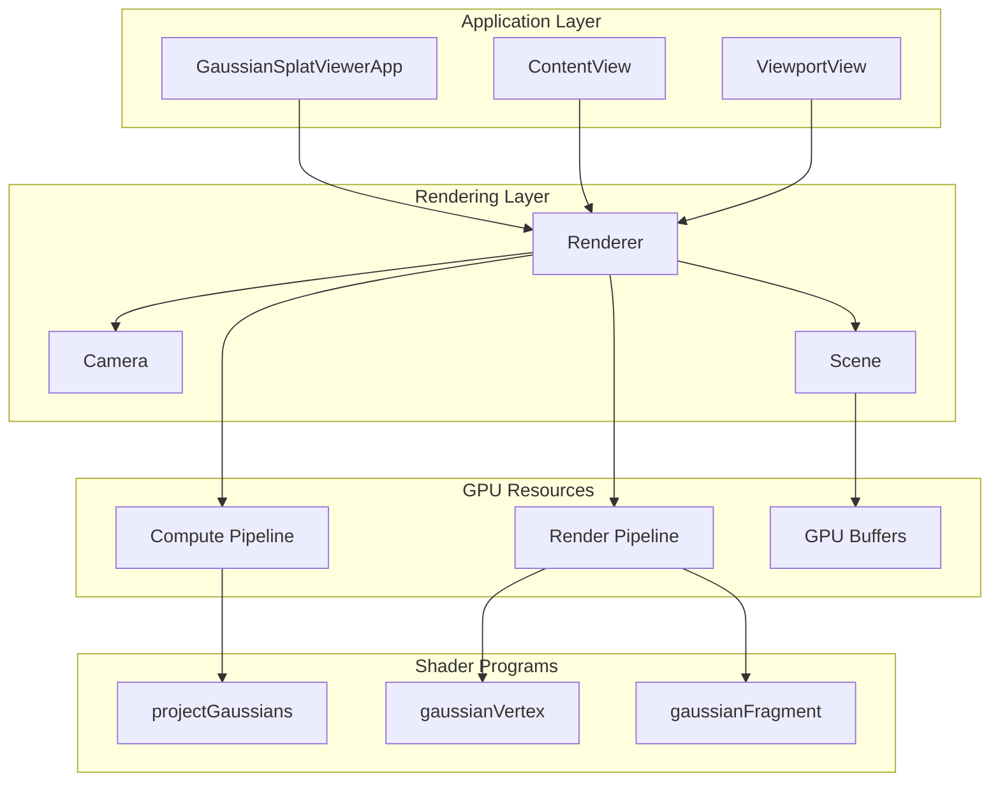
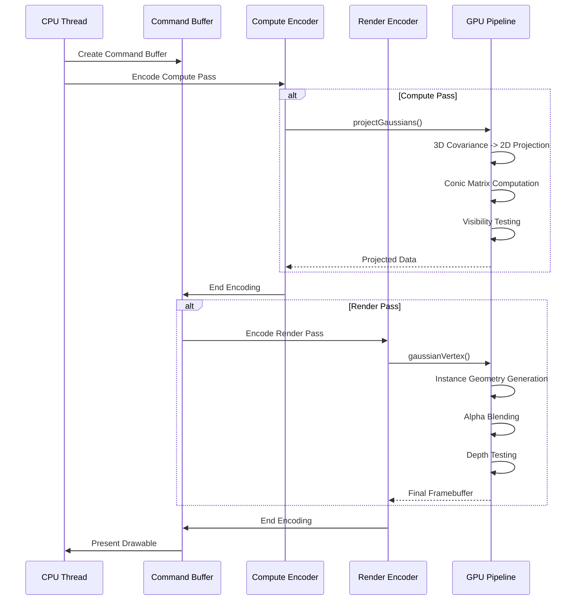
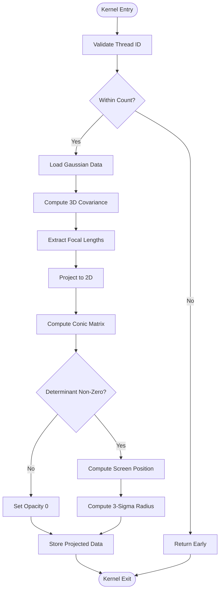
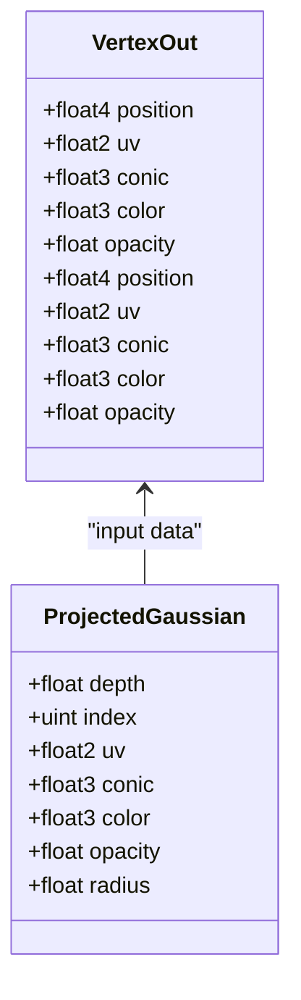
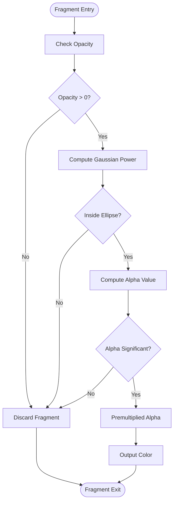
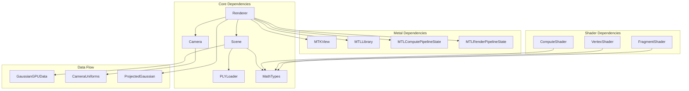

# Render Pipeline Architecture

<cite>
**Referenced Files in This Document**
- [Renderer.swift](file://Sources/Rendering/Renderer.swift)
- [GaussianSplat.metal](file://Sources/Shaders/GaussianSplat.metal)
- [Scene.swift](file://Sources/Scene/Scene.swift)
- [Camera.swift](file://Sources/Rendering/Camera.swift)
- [MathTypes.swift](file://Sources/Math/MathTypes.swift)
- [PLYLoader.swift](file://Sources/Scene/PLYLoader.swift)
</cite>

## Table of Contents
1. [Introduction](#introduction)
2. [Project Structure](#project-structure)
3. [Core Components](#core-components)
4. [Architecture Overview](#architecture-overview)
5. [Detailed Component Analysis](#detailed-component-analysis)
6. [Dependency Analysis](#dependency-analysis)
7. [Performance Considerations](#performance-considerations)
8. [Troubleshooting Guide](#troubleshooting-guide)
9. [Conclusion](#conclusion)

## Introduction

This document provides comprehensive coverage of the Metal render pipeline architecture for Gaussian splatting rendering. The implementation follows a dual-stage rendering process where a compute pass projects 3D Gaussian splats into 2D screen space, followed by a render pass that draws instanced quads representing the projected Gaussians. This approach enables efficient real-time rendering of large point cloud scenes with advanced visual effects including alpha compositing and depth-based sorting.

The render pipeline integrates sophisticated mathematical computations for 3D covariance projection, efficient GPU memory management, and optimized rendering techniques for interactive performance. The system demonstrates modern Metal programming practices including triple buffering for uniform synchronization, instanced rendering for scalability, and careful buffer management for optimal GPU utilization.

## Project Structure

The render pipeline implementation is organized around several key architectural components that work together to achieve efficient Gaussian splatting rendering:

**Diagram sources**
- [Renderer.swift:7-79](file://Sources/Rendering/Renderer.swift#L7-L79)
- [Scene.swift:5-22](file://Sources/Scene/Scene.swift#L5-L22)
- [Camera.swift:5-60](file://Sources/Rendering/Camera.swift#L5-L60)

The architecture follows a clear separation of concerns with dedicated components for rendering orchestration, scene management, camera control, and GPU resource management. The Metal-based implementation leverages modern GPU capabilities for parallel computation and high-performance rendering.

**Section sources**
- [Renderer.swift:1-288](file://Sources/Rendering/Renderer.swift#L1-L288)
- [Scene.swift:1-130](file://Sources/Scene/Scene.swift#L1-L130)
- [Camera.swift:1-184](file://Sources/Rendering/Camera.swift#L1-L184)

## Core Components

### Renderer Class Architecture

The `Renderer` class serves as the central orchestrator for the entire rendering pipeline, managing GPU resources, pipeline states, and the dual-stage rendering process. It implements the `MTKViewDelegate` protocol to integrate seamlessly with MetalKit's rendering loop.

Key responsibilities include:
- **Pipeline State Management**: Creating and maintaining both compute and render pipeline states
- **Buffer Management**: Handling uniform buffers, index buffers, and scene data buffers
- **Render Loop Control**: Coordinating compute and render passes with proper synchronization
- **Camera Integration**: Managing camera transformations and uniform updates
- **Scene Coordination**: Working with the Scene class to access Gaussian data

The renderer employs triple buffering for camera uniforms to prevent CPU-GPU synchronization conflicts, using modulo arithmetic to cycle through buffer offsets for each frame.

**Section sources**
- [Renderer.swift:6-79](file://Sources/Rendering/Renderer.swift#L6-L79)
- [Renderer.swift:131-145](file://Sources/Rendering/Renderer.swift#L131-L145)

### Scene Management System

The `Scene` class manages Gaussian splat data and GPU resources, handling the conversion from CPU-side `GaussianSplat` structures to GPU-compatible `GaussianGPUData` formats. It provides efficient buffer creation and management for large datasets containing thousands to millions of splats.

Critical features include:
- **PLY File Loading**: Comprehensive support for Stanford PLY format with multiple property mappings
- **GPU Buffer Creation**: Dynamic allocation of splat, projected, and index buffers
- **Bounding Box Calculation**: Automatic scene bounds computation for camera positioning
- **Memory Management**: Proper buffer lifecycle management and cleanup

The scene system supports both direct data loading and file-based loading, with automatic GPU resource creation upon successful data ingestion.

**Section sources**
- [Scene.swift:5-85](file://Sources/Scene/Scene.swift#L5-L85)
- [PLYLoader.swift:42-68](file://Sources/Scene/PLYLoader.swift#L42-L68)

### Camera System Integration

The `Camera` class provides comprehensive 3D navigation capabilities with orbit controls, zoom functionality, and pan operations. It generates the necessary transformation matrices and uniform data for GPU shader programs.

Advanced features include:
- **Spherical Coordinate System**: Natural orbit navigation with azimuth and elevation controls
- **Matrix Generation**: Automatic view and projection matrix computation
- **Interactive Controls**: Mouse-based camera manipulation with sensitivity adjustments
- **Uniform Generation**: GPU-ready camera data structures with screen dimensions and FOV calculations

The camera system integrates tightly with the renderer through the `getUniforms` method, providing real-time transformation data for each rendered frame.

**Section sources**
- [Camera.swift:5-147](file://Sources/Rendering/Camera.swift#L5-L147)
- [MathTypes.swift:54-62](file://Sources/Math/MathTypes.swift#L54-L62)

## Architecture Overview

The render pipeline follows a sophisticated dual-stage approach that maximizes GPU utilization while maintaining visual quality:

**Diagram sources**
- [Renderer.swift:171-250](file://Sources/Rendering/Renderer.swift#L171-L250)
- [GaussianSplat.metal:138-198](file://Sources/Shaders/GaussianSplat.metal#L138-L198)
- [GaussianSplat.metal:202-241](file://Sources/Shaders/GaussianSplat.metal#L202-L241)

### Dual-Stage Rendering Process

The pipeline executes two distinct stages in sequence:

**Stage 1: Compute Pass**
- Projects 3D Gaussian splats into 2D screen space
- Computes covariance matrices and conic parameters
- Performs visibility testing and depth calculation
- Generates per-splat rendering data for the subsequent stage

**Stage 2: Render Pass**
- Draws instanced quads representing projected Gaussians
- Applies alpha compositing with premultiplied alpha
- Performs depth testing for proper occlusion
- Utilizes GPU-instanced rendering for efficiency

This two-stage approach allows for complex mathematical computations to be performed in parallel on the GPU while maintaining clean separation between projection logic and rendering logic.

**Section sources**
- [Renderer.swift:187-246](file://Sources/Rendering/Renderer.swift#L187-L246)
- [GaussianSplat.metal:138-198](file://Sources/Shaders/GaussianSplat.metal#L138-L198)

## Detailed Component Analysis

### Compute Pipeline Implementation

The compute pipeline handles the computationally intensive task of projecting 3D Gaussian splats into 2D screen space. This stage performs essential mathematical operations that would be prohibitively expensive on the CPU.

#### Projection Algorithm

The `projectGaussians` compute kernel implements a sophisticated projection pipeline:

**Diagram sources**
- [GaussianSplat.metal:138-198](file://Sources/Shaders/GaussianSplat.metal#L138-L198)

The projection algorithm computes 3D covariance matrices from scale and rotation parameters, applies perspective projection mathematics, and calculates conic matrices for efficient fragment shading. The focal length extraction uses the projection matrix to determine screen-space scaling factors.

#### Mathematical Foundations

The covariance computation relies on quaternion-to-matrix conversion and 3D-to-2D projection mathematics:

- **Quaternion Normalization**: Ensures rotation consistency and numerical stability
- **Covariance Matrix Construction**: Combines rotation and scale transformations
- **Jacobian Computation**: Handles perspective projection derivatives
- **Conic Matrix Inversion**: Provides efficient fragment shader calculations

**Section sources**
- [GaussianSplat.metal:46-134](file://Sources/Shaders/GaussianSplat.metal#L46-L134)
- [MathTypes.swift:76-101](file://Sources/Math/MathTypes.swift#L76-L101)

### Render Pipeline State Configuration

The render pipeline is configured with specific state parameters optimized for Gaussian splatting rendering:

#### Vertex Shader Implementation

The `gaussianVertex` shader generates quad geometry for each projected Gaussian:

**Diagram sources**
- [GaussianSplat.metal:26-42](file://Sources/Shaders/GaussianSplat.metal#L26-L42)
- [GaussianSplat.metal:36-42](file://Sources/Shaders/GaussianSplat.metal#L36-L42)

The vertex shader performs per-instance calculations including quad vertex generation, depth normalization, and UV coordinate computation. Each instance represents a single Gaussian splat with its own geometric parameters.

#### Fragment Shader Mathematics

The `gaussianFragment` shader implements the core Gaussian evaluation:

**Diagram sources**
- [GaussianSplat.metal:245-270](file://Sources/Shaders/GaussianSplat.metal#L245-L270)

The fragment shader evaluates 2D Gaussian functions using the conic matrix computed in the previous stage. It implements alpha compositing with premultiplied alpha values and discards fragments below visibility thresholds.

**Section sources**
- [GaussianSplat.metal:202-270](file://Sources/Shaders/GaussianSplat.metal#L202-L270)

### Instanced Rendering Architecture

The render pipeline utilizes GPU instanced rendering to efficiently draw thousands of Gaussian splats using a single quad geometry:

#### Quad Geometry Setup

The implementation uses a simple quad consisting of four vertices (-1,-1), (1,-1), (-1,1), and (1,1). This quad is scaled by the computed radius and positioned at the projected UV coordinates for each instance.

#### Buffer Management

The renderer maintains several key buffers:
- **Splat Buffer**: Contains original Gaussian data for compute pass input
- **Projected Buffer**: Stores computed 2D projection data for render pass input
- **Index Buffer**: Defines quad topology for indexed drawing
- **Uniform Buffer**: Triple-buffered camera data synchronized per frame

The instanced rendering approach reduces vertex processing overhead by sharing geometry across thousands of instances while maintaining per-instance attribute flexibility.

**Section sources**
- [Renderer.swift:131-145](file://Sources/Rendering/Renderer.swift#L131-L145)
- [GaussianSplat.metal:210-241](file://Sources/Shaders/GaussianSplat.metal#L210-L241)

### Framebuffer and Depth Management

The render pipeline integrates with Metal's framebuffer system through the MTKView configuration:

#### Render Pass Descriptor Integration

The renderer works with MetalKit's automatic render pass descriptor management, which provides:
- **Color Attachment**: BGRA8 unorm sRGB format for final rendering
- **Depth Attachment**: 32-bit floating-point depth buffer
- **Clear Operations**: Configured clear colors for proper initialization

#### Depth Testing Configuration

The depth stencil state is configured for less-than comparison with depth writes enabled, ensuring proper occlusion handling for overlapping Gaussian splats. The depth values are normalized to [0,1] range suitable for the depth buffer format.

**Section sources**
- [Renderer.swift:68-70](file://Sources/Rendering/Renderer.swift#L68-L70)
- [Renderer.swift:261-266](file://Sources/Rendering/Renderer.swift#L261-L266)

## Dependency Analysis

The render pipeline exhibits well-structured dependencies that promote modularity and maintainability:

**Diagram sources**
- [Renderer.swift:7-25](file://Sources/Rendering/Renderer.swift#L7-L25)
- [Scene.swift:5-10](file://Sources/Scene/Scene.swift#L5-L10)
- [Camera.swift:5-25](file://Sources/Rendering/Camera.swift#L5-L25)

### Data Flow Architecture

The system implements a clear data flow pattern from CPU to GPU:

1. **CPU Side**: Scene loads PLY data → Converts to GPU structures → Creates buffers
2. **Compute Stage**: GPU projects 3D data → Produces 2D projections → Updates visibility
3. **Render Stage**: GPU draws instanced quads → Applies blending → Writes to framebuffer

This flow minimizes CPU-GPU synchronization overhead while maximizing parallel processing efficiency.

**Section sources**
- [Scene.swift:52-85](file://Sources/Scene/Scene.swift#L52-L85)
- [Renderer.swift:171-250](file://Sources/Rendering/Renderer.swift#L171-L250)

## Performance Considerations

### Pipeline State Optimization

The renderer implements several optimization strategies for efficient GPU utilization:

#### Triple Buffering Strategy

Camera uniforms employ triple buffering to eliminate synchronization conflicts:
- **Buffer Size**: 3 × `MemoryLayout<CameraUniforms>.stride` bytes
- **Offset Calculation**: `(frameCount % 3) × MemoryLayout<CameraUniforms>.stride`
- **Synchronization**: Prevents CPU-GPU race conditions during uniform updates

#### Compute Work Group Optimization

The compute shader uses 256-thread work groups optimized for GPU architecture:
- **Thread Group Size**: 256 threads per group
- **Dispatch Calculation**: `(splatCount + 255) / 256` thread groups
- **Occupancy**: Maximizes GPU utilization across multiple SMs

#### Memory Access Patterns

GPU buffers are designed for optimal memory coalescing:
- **Structured Buffers**: Contiguous memory layout for sequential access
- **Private Storage**: Projected data uses private storage for write efficiency
- **Shared Uniforms**: Camera data uses shared storage for multi-GPU access

### Render State Optimization

The render pipeline incorporates several state optimizations:

#### Blend State Configuration

Alpha blending is configured for proper Gaussian compositing:
- **Source Factors**: `GL_ONE` for both RGB and alpha channels
- **Destination Factors**: `GL_ONE_MINUS_SRC_ALPHA` for proper blending
- **Operation**: Additive blending for accumulation effect

#### Depth Testing Optimization

Depth testing is configured for efficient occlusion:
- **Compare Function**: Less-than comparison
- **Write Enabled**: Depth writes enabled for proper depth buffer updates
- **Normalization**: Depth values normalized to [0,1] range

### Performance Tuning Guidelines

For real-time rendering optimization, consider these guidelines:

1. **Batch Size Selection**: Adjust compute dispatch sizes based on scene complexity
2. **Memory Bandwidth**: Monitor GPU memory bandwidth utilization for large scenes
3. **Work Group Efficiency**: Ensure adequate work group occupancy for target GPUs
4. **Texture Binding**: Consider texture-based rendering alternatives for very large datasets
5. **Sorting Frequency**: Balance depth sorting frequency against performance impact

**Section sources**
- [Renderer.swift:132-144](file://Sources/Rendering/Renderer.swift#L132-L144)
- [Renderer.swift:202-208](file://Sources/Rendering/Renderer.swift#L202-L208)
- [Renderer.swift:113-121](file://Sources/Rendering/Renderer.swift#L113-L121)

## Troubleshooting Guide

### Common Rendering Issues

#### Visual Artifacts and Incorrect Rendering

**Symptoms**: Garbage output, incorrect colors, or missing geometry
**Causes**: 
- Incorrect buffer bindings in render encoder
- Mismatched shader uniform layouts
- Invalid vertex/index buffer configurations

**Solutions**:
- Verify buffer indices match shader binding points
- Check uniform buffer alignment and stride requirements
- Validate vertex attribute formats and offsets

#### Performance Degradation

**Symptoms**: Low frame rates, GPU bottlenecks, memory pressure
**Causes**:
- Excessive compute work group sizing
- Insufficient GPU memory for large scenes
- Poor memory access patterns

**Solutions**:
- Optimize work group sizes for target hardware
- Implement scene culling for off-screen Gaussians
- Consider LOD systems for distant splats

#### Depth Buffer Issues

**Symptoms**: Incorrect occlusion, z-fighting artifacts
**Causes**:
- Improper depth range configuration
- Incorrect depth comparison function
- Depth buffer format mismatches

**Solutions**:
- Verify depth buffer pixel format matches render pipeline
- Check depth range normalization in vertex shader
- Ensure depth writes are properly configured

### Debugging Strategies

#### GPU Memory Debugging

Monitor GPU memory usage and buffer allocations:
- Track buffer sizes for large scene datasets
- Verify buffer lifecycle management
- Check for memory leaks in buffer references

#### Shader Debugging

Use Metal's debugging tools for shader analysis:
- Enable Metal API validation for runtime errors
- Use GPU Frame Capture for frame-by-frame analysis
- Profile compute shader performance separately

**Section sources**
- [Renderer.swift:171-180](file://Sources/Rendering/Renderer.swift#L171-L180)
- [Scene.swift:87-93](file://Sources/Scene/Scene.swift#L87-L93)

## Conclusion

The Metal render pipeline architecture for Gaussian splatting demonstrates sophisticated GPU programming techniques that balance computational complexity with real-time performance. The dual-stage approach effectively separates mathematical computation from rendering, enabling efficient parallel processing while maintaining visual fidelity.

Key architectural strengths include:
- **Efficient Data Flow**: Well-designed pipeline stages with clear data dependencies
- **Optimized Resource Management**: Strategic buffer allocation and memory access patterns
- **Scalable Rendering**: Instanced rendering capable of handling large datasets
- **Modern GPU Features**: Full utilization of Metal's compute and rendering capabilities

The implementation serves as an excellent example of contemporary GPU programming, showcasing advanced techniques in parallel computing, graphics pipeline optimization, and real-time rendering. The modular design facilitates future enhancements including advanced sorting algorithms, texture-based rendering alternatives, and multi-resolution approaches for extremely large datasets.