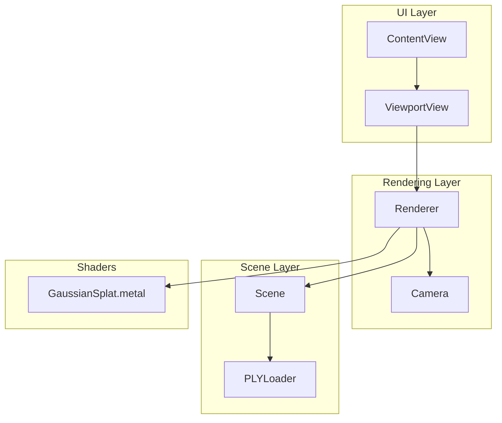
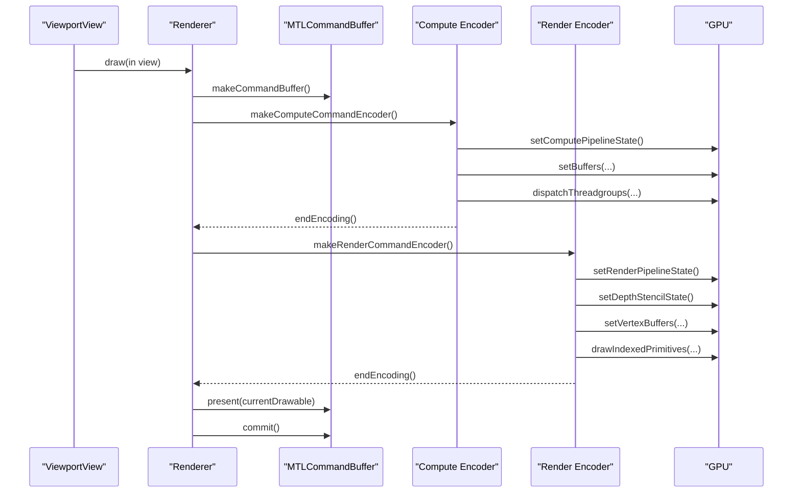
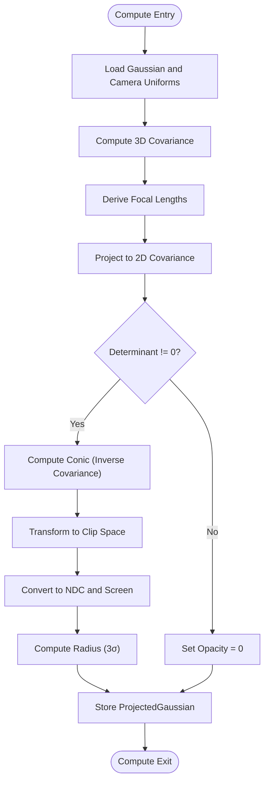
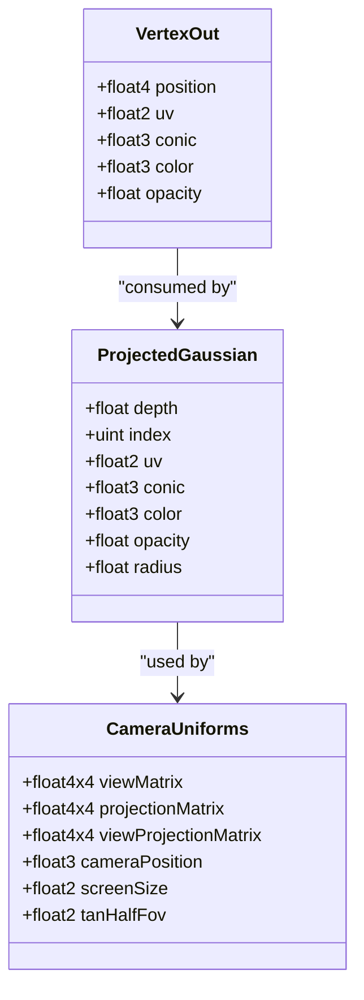
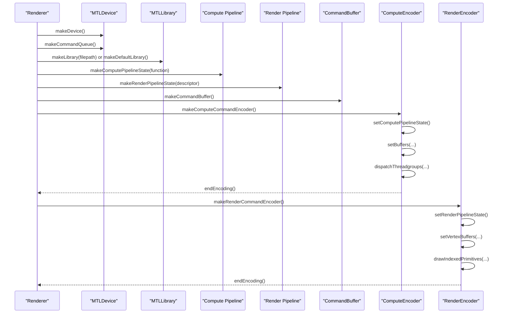
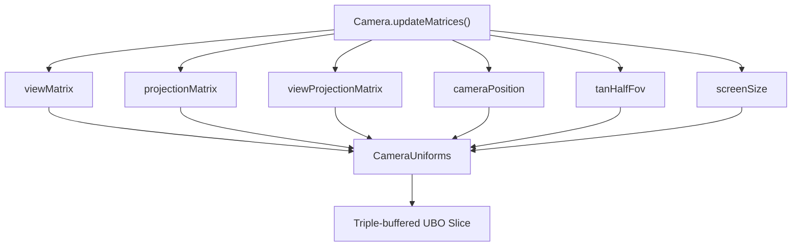
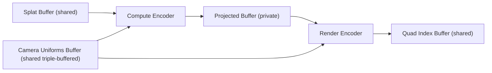
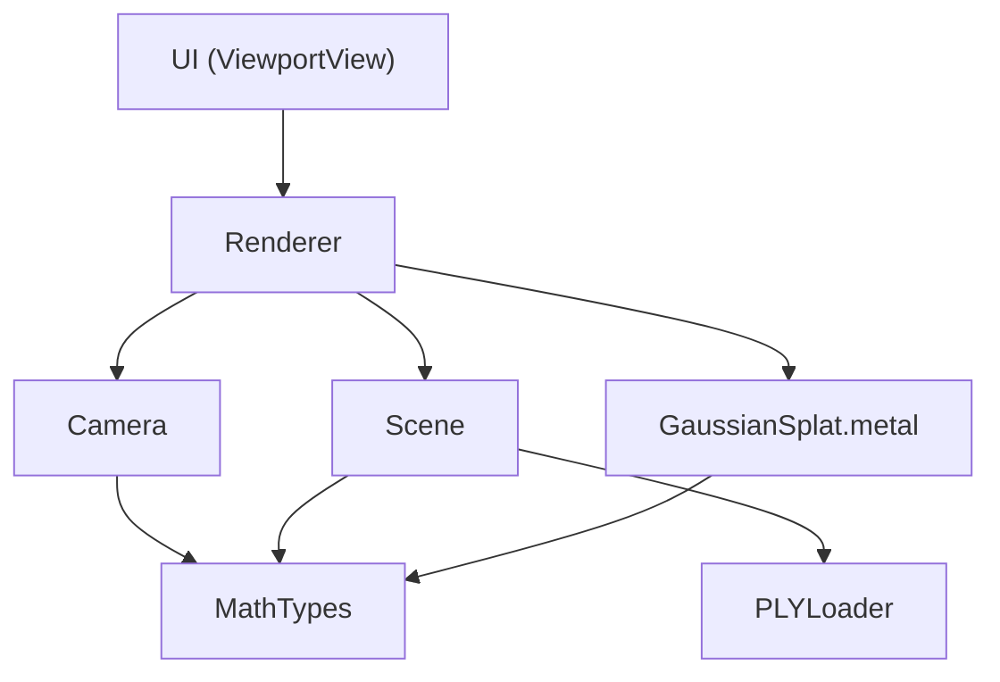

# Rendering Pipeline

<cite>
**Referenced Files in This Document**
- [GaussianSplat.metal](file://Sources/Shaders/GaussianSplat.metal)
- [Renderer.swift](file://Sources/Rendering/Renderer.swift)
- [Camera.swift](file://Sources/Rendering/Camera.swift)
- [MathTypes.swift](file://Sources/Math/MathTypes.swift)
- [Scene.swift](file://Sources/Scene/Scene.swift)
- [PLYLoader.swift](file://Sources/Scene/PLYLoader.swift)
- [ContentView.swift](file://Sources/UI/ContentView.swift)
- [ViewportView.swift](file://Sources/UI/ViewportView.swift)
- [Package.swift](file://Package.swift)
</cite>

## Table of Contents
1. [Introduction](#introduction)
2. [Project Structure](#project-structure)
3. [Core Components](#core-components)
4. [Architecture Overview](#architecture-overview)
5. [Detailed Component Analysis](#detailed-component-analysis)
6. [Dependency Analysis](#dependency-analysis)
7. [Performance Considerations](#performance-considerations)
8. [Troubleshooting Guide](#troubleshooting-guide)
9. [Conclusion](#conclusion)

## Introduction
This document explains the Metal-based rendering pipeline for Gaussian Splatting. The system uses a dual-stage architecture:
- Compute stage: A compute shader projects 3D Gaussians into 2D screen space, computes covariance projections, and prepares per-instance data for rendering.
- Render stage: A vertex/fragment pipeline draws instanced quads for each Gaussian, evaluating 2D Gaussians and compositing with premultiplied alpha.

It covers compute shader implementation, render pipeline setup, GPU resource management, camera uniform system, and performance optimization strategies.

## Project Structure
The project is organized around a clear separation of concerns:
- Rendering: Metal rendering logic and camera controls
- Scene: PLY data loading and GPU buffer management
- Shaders: Metal compute and fragment shaders
- UI: SwiftUI integration with MTKView and user interaction

**Diagram sources**
- [Renderer.swift:1-288](file://Sources/Rendering/Renderer.swift#L1-L288)
- [Camera.swift:1-184](file://Sources/Rendering/Camera.swift#L1-L184)
- [Scene.swift:1-130](file://Sources/Scene/Scene.swift#L1-L130)
- [PLYLoader.swift:1-386](file://Sources/Scene/PLYLoader.swift#L1-L386)
- [GaussianSplat.metal:1-309](file://Sources/Shaders/GaussianSplat.metal#L1-L309)
- [ContentView.swift:1-119](file://Sources/UI/ContentView.swift#L1-L119)
- [ViewportView.swift:1-118](file://Sources/UI/ViewportView.swift#L1-L118)

**Section sources**
- [Renderer.swift:1-288](file://Sources/Rendering/Renderer.swift#L1-L288)
- [Scene.swift:1-130](file://Sources/Scene/Scene.swift#L1-L130)
- [GaussianSplat.metal:1-309](file://Sources/Shaders/GaussianSplat.metal#L1-L309)
- [Camera.swift:1-184](file://Sources/Rendering/Camera.swift#L1-L184)
- [PLYLoader.swift:1-386](file://Sources/Scene/PLYLoader.swift#L1-L386)
- [ContentView.swift:1-119](file://Sources/UI/ContentView.swift#L1-L119)
- [ViewportView.swift:1-118](file://Sources/UI/ViewportView.swift#L1-L118)
- [Package.swift:1-17](file://Package.swift#L1-L17)

## Core Components
- Renderer: Creates Metal device, pipelines, buffers, and orchestrates the dual-stage rendering loop.
- Camera: Computes view/projection matrices and exposes GPU-compatible uniforms.
- Scene: Loads PLY data, constructs GPU buffers, and manages scene metadata.
- Shaders: Compute shader projects Gaussians; vertex/fragment shaders draw instanced quads with Gaussian blending.

Key responsibilities:
- Dual-stage pipeline: compute encoder for projection and render encoder for drawing.
- Triple-buffered camera uniforms for CPU/GPU synchronization.
- Instanced rendering with quad indices.
- GPU memory layout aligned to Metal buffer binding conventions.

**Section sources**
- [Renderer.swift:1-288](file://Sources/Rendering/Renderer.swift#L1-L288)
- [Camera.swift:1-184](file://Sources/Rendering/Camera.swift#L1-L184)
- [Scene.swift:1-130](file://Sources/Scene/Scene.swift#L1-L130)
- [GaussianSplat.metal:1-309](file://Sources/Shaders/GaussianSplat.metal#L1-L309)

## Architecture Overview
The rendering pipeline follows a strict two-stage flow per frame:
1) Compute pass: Project Gaussians to screen space, compute covariance, and write per-instance data.
2) Render pass: Draw instanced quads using the computed per-instance attributes.

**Diagram sources**
- [Renderer.swift:171-250](file://Sources/Rendering/Renderer.swift#L171-L250)
- [GaussianSplat.metal:138-198](file://Sources/Shaders/GaussianSplat.metal#L138-L198)
- [GaussianSplat.metal:202-270](file://Sources/Shaders/GaussianSplat.metal#L202-L270)

## Detailed Component Analysis

### Compute Shader: Gaussian Projection
The compute shader performs:
- Covariance computation from scale and rotation.
- Perspective projection and clipping checks.
- Conic (inverse covariance) calculation for Gaussian evaluation.
- Screen-space position and radius computation.
- Output per-instance data to a staging buffer.

**Diagram sources**
- [GaussianSplat.metal:138-198](file://Sources/Shaders/GaussianSplat.metal#L138-L198)

Key implementation notes:
- Uses quaternion-to-matrix conversion and covariance composition.
- Perspective projection Jacobian and view-space transformation.
- Determinant-based conic inversion with early exit for invalid covariances.
- Screen-space radius derived from eigenvalues of covariance.

**Section sources**
- [GaussianSplat.metal:64-134](file://Sources/Shaders/GaussianSplat.metal#L64-L134)
- [GaussianSplat.metal:138-198](file://Sources/Shaders/GaussianSplat.metal#L138-L198)

### Vertex and Fragment Shaders: Instanced Gaussian Rendering
The vertex shader:
- Builds a quad from vertex ID and scales by radius.
- Converts pixel positions to clip space and sets depth.
- Passes conic, color, and opacity to the fragment shader.

The fragment shader:
- Evaluates 2D Gaussian using conic parameters.
- Applies premultiplied alpha and discards small contributions.

**Diagram sources**
- [GaussianSplat.metal:26-42](file://Sources/Shaders/GaussianSplat.metal#L26-L42)
- [GaussianSplat.metal:16-24](file://Sources/Shaders/GaussianSplat.metal#L16-L24)
- [GaussianSplat.metal:202-270](file://Sources/Shaders/GaussianSplat.metal#L202-L270)

**Section sources**
- [GaussianSplat.metal:202-270](file://Sources/Shaders/GaussianSplat.metal#L202-L270)

### Renderer: Pipeline Setup and Execution
Renderer responsibilities:
- Initializes Metal device, command queue, and loads the shader library (either precompiled metallib or compiles from source).
- Creates compute and render pipeline states.
- Manages triple-buffered camera uniforms and quad index buffer.
- Executes the dual-stage rendering loop per frame.

**Diagram sources**
- [Renderer.swift:37-79](file://Sources/Rendering/Renderer.swift#L37-L79)
- [Renderer.swift:83-129](file://Sources/Rendering/Renderer.swift#L83-L129)
- [Renderer.swift:171-250](file://Sources/Rendering/Renderer.swift#L171-L250)

**Section sources**
- [Renderer.swift:37-79](file://Sources/Rendering/Renderer.swift#L37-L79)
- [Renderer.swift:83-129](file://Sources/Rendering/Renderer.swift#L83-L129)
- [Renderer.swift:171-250](file://Sources/Rendering/Renderer.swift#L171-L250)

### Camera Uniform System
Camera computes view, projection, and combined matrices, and exposes a GPU-compatible structure with:
- View and projection matrices.
- Combined view-projection matrix.
- Camera position.
- Screen size and half-angle tangents for projection.

Renderer updates a triple-buffered uniform block each frame, selecting the appropriate slice based on frame modulo 3.

**Diagram sources**
- [Camera.swift:63-84](file://Sources/Rendering/Camera.swift#L63-L84)
- [Camera.swift:134-147](file://Sources/Rendering/Camera.swift#L134-L147)
- [Renderer.swift:252-259](file://Sources/Rendering/Renderer.swift#L252-L259)

**Section sources**
- [Camera.swift:63-84](file://Sources/Rendering/Camera.swift#L63-L84)
- [Camera.swift:134-147](file://Sources/Rendering/Camera.swift#L134-L147)
- [Renderer.swift:252-259](file://Sources/Rendering/Renderer.swift#L252-L259)

### GPU Resource Management
Scene creates GPU buffers:
- Splat buffer: host-coherent shared storage for Gaussian data.
- Projected buffer: private storage for compute output.
- Index buffer: private storage for sorting indices.

Renderer maintains:
- Camera uniforms buffer: triple-buffered shared storage.
- Quad index buffer: shared storage for quad topology.

**Diagram sources**
- [Scene.swift:52-85](file://Sources/Scene/Scene.swift#L52-L85)
- [Renderer.swift:131-145](file://Sources/Rendering/Renderer.swift#L131-L145)

**Section sources**
- [Scene.swift:52-85](file://Sources/Scene/Scene.swift#L52-L85)
- [Renderer.swift:131-145](file://Sources/Rendering/Renderer.swift#L131-L145)

### Depth Sorting (Planned)
The renderer tracks frame counts and includes a placeholder for depth sorting. The compute shader includes a bitonic sort kernel, indicating potential future integration.

**Section sources**
- [Renderer.swift:29-33](file://Sources/Rendering/Renderer.swift#L29-L33)
- [GaussianSplat.metal:274-308](file://Sources/Shaders/GaussianSplat.metal#L274-L308)

### PLY Data Loading and Scene Management
PLYLoader parses ASCII and binary PLY files, extracting position, scale, rotation, color, and opacity. Scene converts parsed data to GPU-compatible structures and allocates buffers.

**Section sources**
- [PLYLoader.swift:41-68](file://Sources/Scene/PLYLoader.swift#L41-L68)
- [PLYLoader.swift:304-368](file://Sources/Scene/PLYLoader.swift#L304-L368)
- [Scene.swift:52-85](file://Sources/Scene/Scene.swift#L52-L85)

## Dependency Analysis
The rendering pipeline exhibits clean layering:
- UI depends on Renderer via MTKView.
- Renderer depends on Camera and Scene.
- Scene depends on PLYLoader and Metal device.
- Shaders depend on math types and Metal intrinsics.

**Diagram sources**
- [ViewportView.swift:1-118](file://Sources/UI/ViewportView.swift#L1-L118)
- [Renderer.swift:1-288](file://Sources/Rendering/Renderer.swift#L1-L288)
- [Scene.swift:1-130](file://Sources/Scene/Scene.swift#L1-L130)
- [PLYLoader.swift:1-386](file://Sources/Scene/PLYLoader.swift#L1-L386)
- [GaussianSplat.metal:1-309](file://Sources/Shaders/GaussianSplat.metal#L1-L309)
- [MathTypes.swift:1-189](file://Sources/Math/MathTypes.swift#L1-L189)

**Section sources**
- [Renderer.swift:1-288](file://Sources/Rendering/Renderer.swift#L1-L288)
- [Scene.swift:1-130](file://Sources/Scene/Scene.swift#L1-L130)
- [GaussianSplat.metal:1-309](file://Sources/Shaders/GaussianSplat.metal#L1-L309)
- [MathTypes.swift:1-189](file://Sources/Math/MathTypes.swift#L1-L189)
- [PLYLoader.swift:1-386](file://Sources/Scene/PLYLoader.swift#L1-L386)
- [ViewportView.swift:1-118](file://Sources/UI/ViewportView.swift#L1-L118)

## Performance Considerations
- Compute shader efficiency:
  - Vectorized covariance computations and quaternion-to-matrix conversions.
  - Early exits for invalid determinants and non-visible Gaussians.
  - Thread group size tuned to 256 for good occupancy on Apple GPUs.

- GPU memory coalescing:
  - Struct-of-arrays-like layout in buffers to improve cache coalescing.
  - Shared storage for frequently accessed uniform data.

- Render state optimization:
  - Single render pipeline with alpha blending configured for additive compositing.
  - Depth testing enabled with less compare and depth writes enabled.

- Triple-buffering strategy:
  - Three slices of the camera uniforms buffer prevent CPU/GPU synchronization stalls.

- Instanced rendering:
  - Quad indices reused across instances to minimize draw overhead.

[No sources needed since this section provides general guidance]

## Troubleshooting Guide
Common issues and remedies:
- Shader library loading failures:
  - Ensure the metallib bundle resource is present or enable source compilation fallback.
  - Verify function names match between Swift and Metal.

- Pipeline creation errors:
  - Confirm vertex and fragment functions exist in the library.
  - Validate pixel formats and blending settings.

- Buffer allocation failures:
  - Check device capabilities and buffer sizes.
  - Ensure buffers are allocated with correct storage modes.

- Incorrect rendering:
  - Verify camera matrices and uniform updates per frame.
  - Confirm compute dispatch counts match the number of splats.

**Section sources**
- [Renderer.swift:47-55](file://Sources/Rendering/Renderer.swift#L47-L55)
- [Renderer.swift:97-129](file://Sources/Rendering/Renderer.swift#L97-L129)
- [Scene.swift:52-85](file://Sources/Scene/Scene.swift#L52-L85)
- [Renderer.swift:252-259](file://Sources/Rendering/Renderer.swift#L252-L259)

## Conclusion
The Metal rendering pipeline implements a robust dual-stage Gaussian Splatting system. The compute shader efficiently projects Gaussians and prepares per-instance data, while the render stage draws instanced quads with Gaussian blending. Triple-buffered uniforms, careful buffer management, and instanced rendering contribute to smooth performance. Future enhancements could include integrating the bitonic sort kernel for depth sorting and optimizing draw call batching.