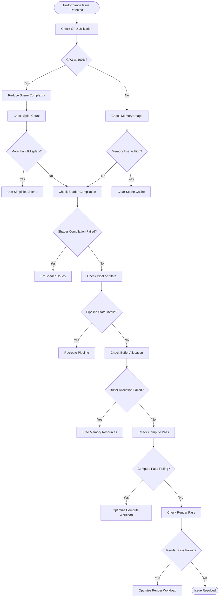
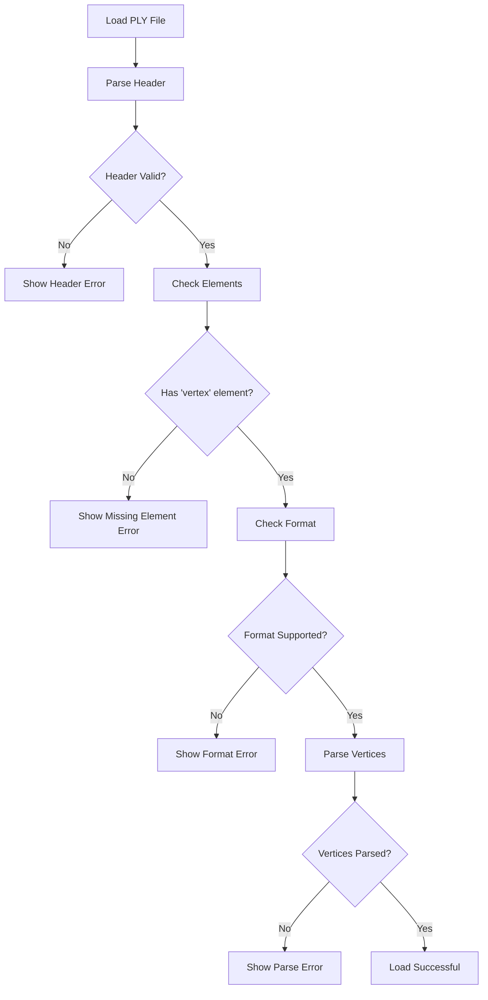
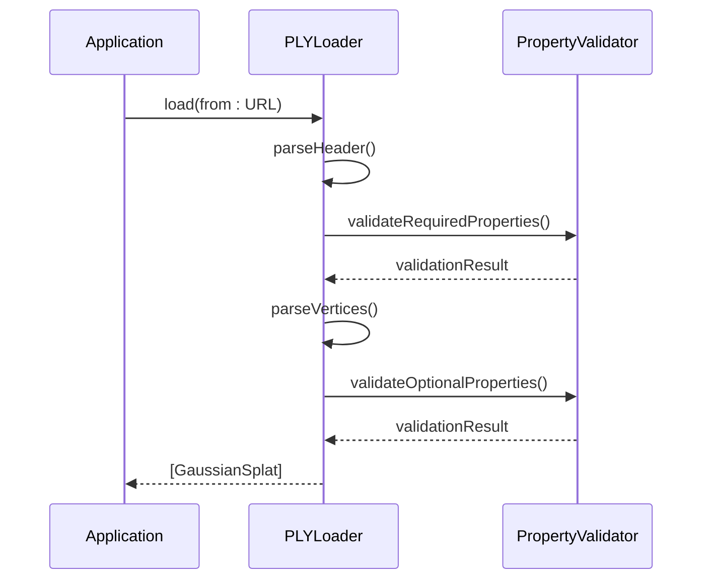
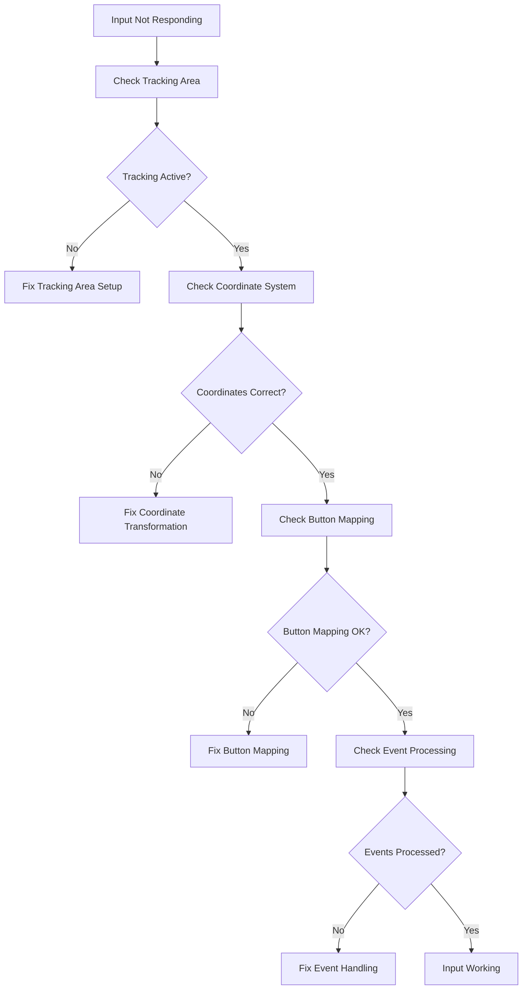
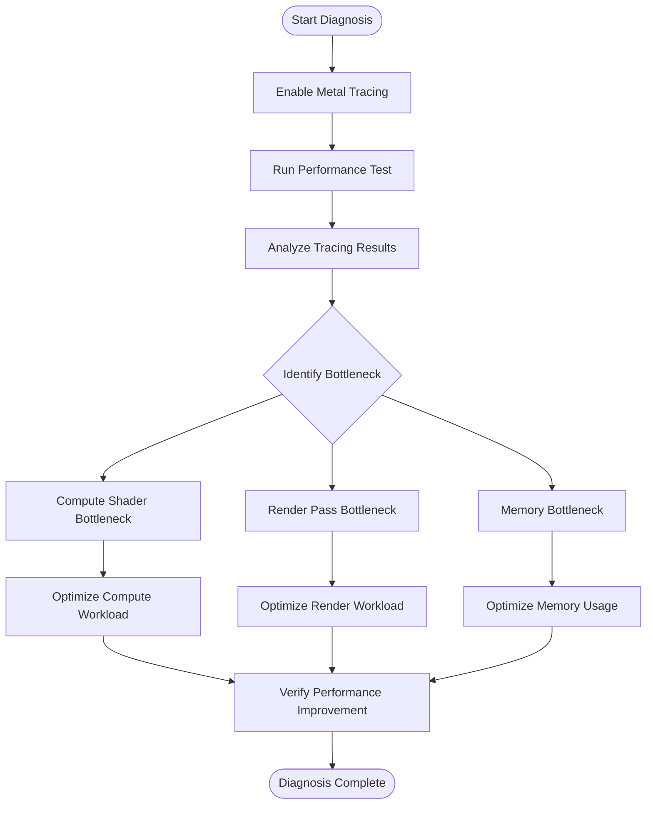
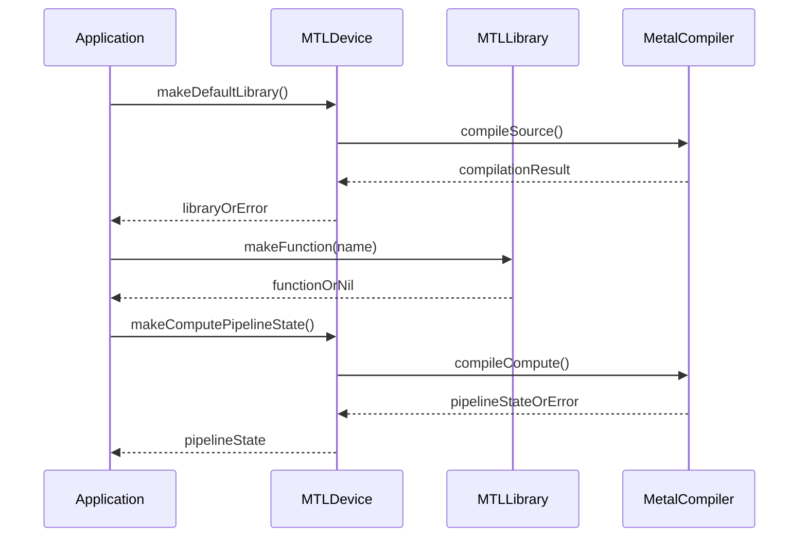
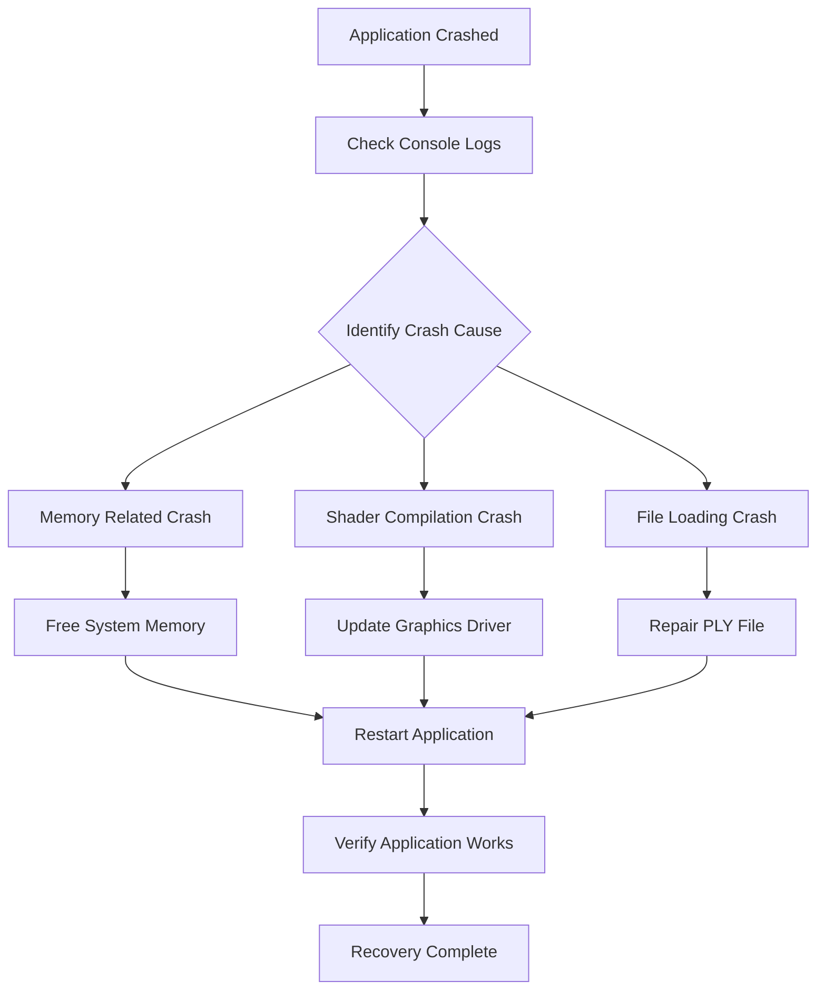
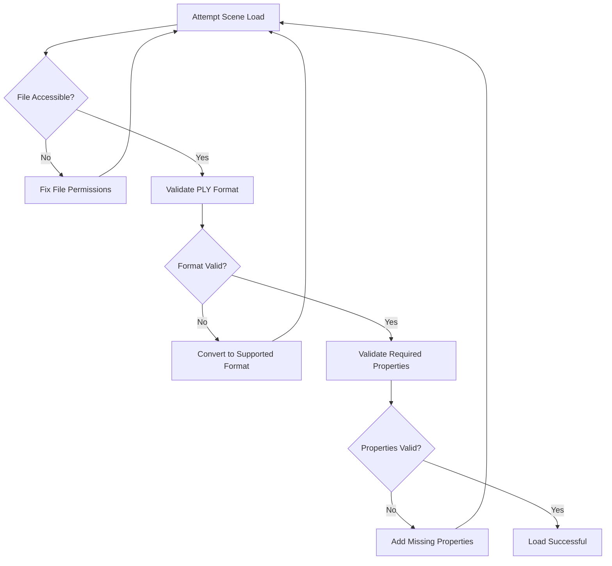

# Troubleshooting & FAQ

<cite>
**Referenced Files in This Document**
- [GaussianSplatViewerApp.swift](file://Sources/GaussianSplatViewerApp.swift)
- [ContentView.swift](file://Sources/UI/ContentView.swift)
- [ViewportView.swift](file://Sources/UI/ViewportView.swift)
- [Camera.swift](file://Sources/Rendering/Camera.swift)
- [Renderer.swift](file://Sources/Rendering/Renderer.swift)
- [Scene.swift](file://Sources/Scene/Scene.swift)
- [PLYLoader.swift](file://Sources/Scene/PLYLoader.swift)
- [GaussianSplat.metal](file://Sources/Shaders/GaussianSplat.metal)
- [MathTypes.swift](file://Sources/Math/MathTypes.swift)
- [Package.swift](file://Package.swift)
</cite>

## Table of Contents
1. [Introduction](#introduction)
2. [Performance Troubleshooting](#performance-troubleshooting)
3. [PLY File Loading Issues](#ply-file-loading-issues)
4. [Camera Control Problems](#camera-control-problems)
5. [Platform-Specific Considerations](#platform-specific-considerations)
6. [Diagnostic Tools and Techniques](#diagnostic-tools-and-techniques)
7. [Performance Tuning Guidelines](#performance-tuning-guidelines)
8. [Frequently Asked Questions](#frequently-asked-questions)
9. [Recovery Procedures](#recovery-procedures)

## Introduction
This document provides comprehensive troubleshooting and FAQ guidance for the Gaussian Splat Viewer application. It covers performance issues, PLY file loading problems, camera control issues, platform-specific considerations, diagnostic techniques, and optimization recommendations. The application renders 3D Gaussian splatting scenes using Metal on macOS with SwiftUI for the user interface.

## Performance Troubleshooting

### Low Frame Rate Issues

**Symptoms:**
- Frame rate drops below 30 FPS
- Choppy animation during navigation
- Delayed response to input

**Common Causes and Solutions:**



**Diagnostic Steps:**
1. Monitor GPU utilization using Activity Monitor
2. Check scene splat count in the UI status bar
3. Verify Metal shader compilation success
4. Examine compute and render pipeline states

**Resolution Strategies:**
- Reduce scene complexity by filtering splats
- Disable depth sorting for large scenes
- Lower render resolution temporarily
- Close other GPU-intensive applications

### GPU Memory Issues

**Symptoms:**
- Application crashes with memory warnings
- Scene fails to load with memory errors
- System becomes unresponsive

**Memory Usage Analysis:**
The application allocates GPU memory for:
- Splat buffer: ~128 bytes per splat
- Projected buffer: ~32 bytes per splat  
- Index buffer: ~4 bytes per splat

**Diagnostic Commands:**
```bash
# Check memory pressure
vm_stat

# Monitor GPU memory
samples GPU

# Check Metal memory usage
otool -l /Applications/GaussianSplatViewer.app/Contents/MacOS/GaussianSplatViewer | grep -A5 -B5 "__TEXT"
```

**Solutions:**
1. Load smaller PLY files initially
2. Use scene filtering to reduce splat count
3. Restart the application to clear memory
4. Close other applications using GPU memory

### Rendering Artifacts

**Common Issues:**
- Black screen or partial rendering
- Incorrect lighting/shading
- Splats not visible or clipped

**Diagnostic Checklist:**
1. Verify Metal device availability
2. Check shader function availability
3. Confirm buffer binding correctness
4. Validate depth/stencil state configuration

**Resolution Steps:**
1. Ensure Metal 3 support on macOS 14+
2. Verify shader compilation success
3. Check camera frustum culling
4. Adjust near/far clipping planes

**Section sources**
- [Renderer.swift:171-250](file://Sources/Rendering/Renderer.swift#L171-L250)
- [Scene.swift:52-85](file://Sources/Scene/Scene.swift#L52-L85)
- [GaussianSplat.metal:138-198](file://Sources/Shaders/GaussianSplat.metal#L138-L198)

## PLY File Loading Issues

### Unsupported Formats

**Supported Formats:**
- ASCII PLY files
- Binary little-endian PLY files
- Binary big-endian PLY files

**Unsupported Features:**
- List properties in PLY elements
- Non-float numeric types (except basic integer types)
- Custom property names not in standard set

**Diagnostic Process:**


**Validation Techniques:**
1. Verify PLY magic header (`ply`)
2. Check element declarations match expectations
3. Validate property names against supported set
4. Confirm numeric data types are supported

**Workarounds:**
- Convert PLY files using external tools
- Remove unsupported list properties
- Ensure proper ASCII/Binary format specification

### Corrupted Files

**Detection Methods:**
- Header parsing failures
- Inconsistent vertex counts
- Malformed numeric values
- Unexpected end-of-file

**Recovery Strategies:**
1. Use PLY validation tools to repair files
2. Re-export from source application
3. Split large files into smaller chunks
4. Verify file integrity using checksums

### Missing Properties

**Required Properties:**
- Position: `x`, `y`, `z` (required)
- Scale: `scale_0`, `scale_1`, `scale_2` (optional, defaults to 0.01)
- Rotation: `rot_0`, `rot_1`, `rot_2`, `rot_3` (optional, defaults to identity)
- Color: Either `f_dc_0..2` (SH coefficients) OR `red`, `green`, `blue` (direct RGB)
- Opacity: `opacity` (optional, defaults to 1.0)

**Property Validation:**


**Section sources**
- [PLYLoader.swift:42-68](file://Sources/Scene/PLYLoader.swift#L42-L68)
- [PLYLoader.swift:304-368](file://Sources/Scene/PLYLoader.swift#L304-L368)
- [PLYLoader.swift:72-151](file://Sources/Scene/PLYLoader.swift#L72-L151)

## Camera Control Problems

### Input Responsiveness Issues

**Common Symptoms:**
- Mouse movements lag behind cursor
- Drag operations feel sluggish
- Scroll wheel zoom responds slowly

**Root Causes:**
1. Event handling conflicts in SwiftUI/Metal integration
2. Coordinate system mismatches between window and Metal
3. Tracking area configuration issues
4. Button mapping problems

**Diagnostic Steps:**
1. Verify mouse tracking area setup
2. Check event coordinate transformations
3. Validate button state handling
4. Test with different input devices

**Resolution Process:**


### Navigation Glitches

**Navigation Problems:**
- Camera jumps to unexpected positions
- Rotation feels inverted
- Zoom doesn't respect object bounds
- Panning direction seems wrong

**Diagnostic Approach:**
1. Check camera initialization parameters
2. Verify sensitivity settings
3. Examine coordinate system conventions
4. Validate matrix calculations

**Sensitivity Tuning:**
- Rotation sensitivity: 0.005 radians per pixel
- Zoom sensitivity: 0.1 per scroll unit
- Pan sensitivity: 0.01 units per pixel

### Coordinate System Issues

**Coordinate System Mapping:**
- Screen coordinates: (0,0) at top-left
- Metal coordinates: (0,0) at bottom-left
- Camera expects consistent coordinate systems

**Solution Steps:**
1. Apply Y-axis inversion for Metal viewport
2. Ensure consistent coordinate transformations
3. Verify camera matrix calculations
4. Check projection matrix setup

**Section sources**
- [ViewportView.swift:51-92](file://Sources/UI/ViewportView.swift#L51-L92)
- [Camera.swift:86-115](file://Sources/Rendering/Camera.swift#L86-L115)
- [Camera.swift:150-176](file://Sources/Rendering/Camera.swift#L150-L176)

## Platform-Specific Considerations

### macOS Version Requirements

**Minimum Requirements:**
- macOS 14 (Sonoma) or later
- Metal 3 support
- SwiftUI framework availability

**Version Detection:**
The application declares macOS 14+ requirement in settings and package configuration.

**Compatibility Matrix:**
- macOS 14+: Full feature support
- macOS 13: Limited Metal 3 features
- macOS 12: Basic Metal support only

### Hardware Compatibility

**Metal Device Requirements:**
- Apple Silicon (M1/M2/M3) recommended
- Intel Macs with Metal support
- Minimum Metal 3 capability

**Performance Expectations:**
- Apple Silicon: Optimal performance
- Intel Macs: Reduced performance
- Integrated graphics: Limited capability

### Metal Framework Requirements

**Metal Features Used:**
- Compute shaders for Gaussian projection
- Render pipelines with blending
- Depth/stencil testing
- Instanced rendering

**Diagnostic Commands:**
```bash
# Check Metal support
system_profiler SPHardwareDataType | grep Chip
system_profiler SPHardwareDataType | grep "Graphics/Displays"

# Verify Metal availability
mdfind "kMDItemCFBundleIdentifier == 'com.apple.Metal'" | head -5
```

**Section sources**
- [GaussianSplatViewerApp.swift:48](file://Sources/GaussianSplatViewerApp.swift#L48)
- [Package.swift:6](file://Package.swift#L6)
- [Renderer.swift:37-79](file://Sources/Rendering/Renderer.swift#L37-L79)

## Diagnostic Tools and Techniques

### GPU Bottleneck Identification

**Monitoring Tools:**
1. **Activity Monitor**: Track GPU utilization and memory
2. **Metal System Trace**: Analyze GPU performance
3. **Instruments**: Profiling and performance analysis
4. **Console.app**: Check Metal error logs

**Performance Metrics:**
- Compute shader execution time
- Render pass duration
- Memory bandwidth utilization
- Texture upload overhead

**Diagnostic Workflow:**


### Memory Leak Detection

**Common Leak Sources:**
1. Unreleased Metal buffers
2. Retain cycles in SwiftUI views
3. Open file handles
4. Event listener leaks

**Detection Methods:**
1. Use Xcode Memory Graph Debugger
2. Monitor memory growth over time
3. Check for retained objects after scene unload
4. Verify proper cleanup in view lifecycle

**Prevention Strategies:**
1. Implement proper cleanup in `clear()` method
2. Use weak references for delegates
3. Release Metal resources promptly
4. Avoid retain cycles in closures

### Shader Compilation Errors

**Common Shader Issues:**
1. Missing function definitions
2. Type mismatch errors
3. Unsupported Metal features
4. Compiler optimization failures

**Debugging Process:**


**Shader Debugging Steps:**
1. Check shader function availability
2. Verify Metal compiler compatibility
3. Validate shader source syntax
4. Test with simplified shader variants

**Section sources**
- [Renderer.swift:46-55](file://Sources/Rendering/Renderer.swift#L46-L55)
- [Renderer.swift:83-95](file://Sources/Rendering/Renderer.swift#L83-L95)
- [Renderer.swift:97-129](file://Sources/Rendering/Renderer.swift#L97-L129)

## Performance Tuning Guidelines

### System Resource Requirements

**Minimum Specifications:**
- **CPU**: Modern Apple Silicon or Intel Core i5 equivalent
- **GPU**: Apple Silicon integrated or discrete GPU
- **RAM**: 8GB minimum, 16GB recommended
- **Storage**: SSD with adequate free space

**Performance Scaling:**
- **Small Scenes (< 100K splats)**: Low-end hardware sufficient
- **Medium Scenes (100K - 1M splats)**: Mid-range hardware recommended
- **Large Scenes (> 1M splats)**: High-end hardware required

### Optimization Recommendations

**Compute Shader Optimization:**
1. **Thread Group Size**: Use 256 threads per group
2. **Memory Coalescing**: Ensure contiguous memory access
3. **Shared Memory**: Utilize shared memory for intermediate results
4. **Branch Divergence**: Minimize conditional branches

**Render Pipeline Optimization:**
1. **Instanced Rendering**: Efficiently render multiple splats
2. **Blending Configuration**: Proper alpha blending setup
3. **Depth Testing**: Enable depth buffer testing
4. **Primitive Batching**: Minimize state changes

**Memory Management:**
1. **Triple Buffering**: Use shared memory buffers
2. **Buffer Reuse**: Reuse allocated buffers when possible
3. **Memory Alignment**: Ensure proper memory alignment
4. **Garbage Collection**: Trigger manual cleanup when needed

### Hardware-Specific Optimizations

**Apple Silicon Optimization:**
- Leverage unified memory architecture
- Use efficient cache-friendly data layouts
- Optimize for ARM64 instruction sets
- Consider GPU scheduling benefits

**Intel Mac Optimization:**
- Account for separate CPU/GPU memory
- Optimize for PCIe bandwidth
- Consider NUMA topology effects
- Monitor thermal throttling

**Section sources**
- [Renderer.swift:202-209](file://Sources/Rendering/Renderer.swift#L202-L209)
- [Renderer.swift:131-145](file://Sources/Rendering/Renderer.swift#L131-L145)
- [Scene.swift:52-85](file://Sources/Scene/Scene.swift#L52-L85)

## Frequently Asked Questions

### File Format Questions

**Q: What PLY formats are supported?**
A: ASCII, binary little-endian, and binary big-endian PLY files. List properties are not supported.

**Q: What properties are required in PLY files?**
A: Position coordinates (x, y, z) are required. Scale, rotation, color, and opacity are optional with sensible defaults.

**Q: Can I use custom property names?**
A: Only standard Gaussian splat properties are supported. Custom properties are ignored.

**Q: What color formats are accepted?**
A: Either spherical harmonics DC coefficients (f_dc_0..2) or direct RGB values (red, green, blue).

### Rendering Quality Questions

**Q: How does the application handle transparency?**
A: Uses premultiplied alpha blending with proper depth sorting for correct transparency rendering.

**Q: What is the rendering quality setting?**
A: The application uses high-quality Gaussian splat rendering with proper covariance computation and perspective projection.

**Q: Can I adjust rendering quality?**
A: Rendering quality is fixed for optimal performance. Consider reducing splat count for lower quality.

### Feature Limitations

**Q: Is real-time ray tracing supported?**
A: No, the application uses rasterization-based Gaussian splat rendering.

**Q: Can I export rendered images?**
A: The viewer focuses on interactive exploration rather than image export.

**Q: Are animations supported?**
A: Camera animations are not implemented. Only interactive camera controls are available.

### Performance Questions

**Q: What hardware is recommended?**
A: Apple Silicon Macs with at least 8GB RAM. More splats require more powerful hardware.

**Q: How many splats can the application handle?**
A: Up to millions of splats depending on hardware capabilities. Start with smaller scenes.

**Q: Why does my scene crash with memory errors?**
A: Large scenes exceed available GPU memory. Try loading smaller scenes or reducing splat count.

### Section sources**
- [PLYLoader.swift:17-37](file://Sources/Scene/PLYLoader.swift#L17-L37)
- [PLYLoader.swift:311-368](file://Sources/Scene/PLYLoader.swift#L311-L368)
- [GaussianSplatViewerApp.swift:46-60](file://Sources/GaussianSplatViewerApp.swift#L46-L60)

## Recovery Procedures

### Application Crashes

**Immediate Actions:**
1. Force quit the application
2. Restart the application
3. Clear temporary files
4. Check available disk space

**Post-Crash Recovery:**


**Memory-Related Crashes:**
1. Close other GPU-intensive applications
2. Restart the application
3. Try loading smaller scenes
4. Check system memory usage

**Shader-Related Crashes:**
1. Update macOS to latest version
2. Restart application
3. Check Metal framework status
4. Verify graphics driver updates

### Scene Loading Failures

**Step-by-Step Recovery:**
1. **Verify File Integrity**: Check PLY file validity
2. **Check File Format**: Ensure supported PLY format
3. **Validate Properties**: Confirm required properties exist
4. **Test with Sample File**: Try with known good PLY file
5. **Check Permissions**: Verify file accessibility
6. **Restart Application**: Clear application state

**File Validation Process:**


**Section sources**
- [Scene.swift:24-49](file://Sources/Scene/Scene.swift#L24-L49)
- [PLYLoader.swift:42-68](file://Sources/Scene/PLYLoader.swift#L42-L68)
- [Renderer.swift:149-162](file://Sources/Rendering/Renderer.swift#L149-L162)