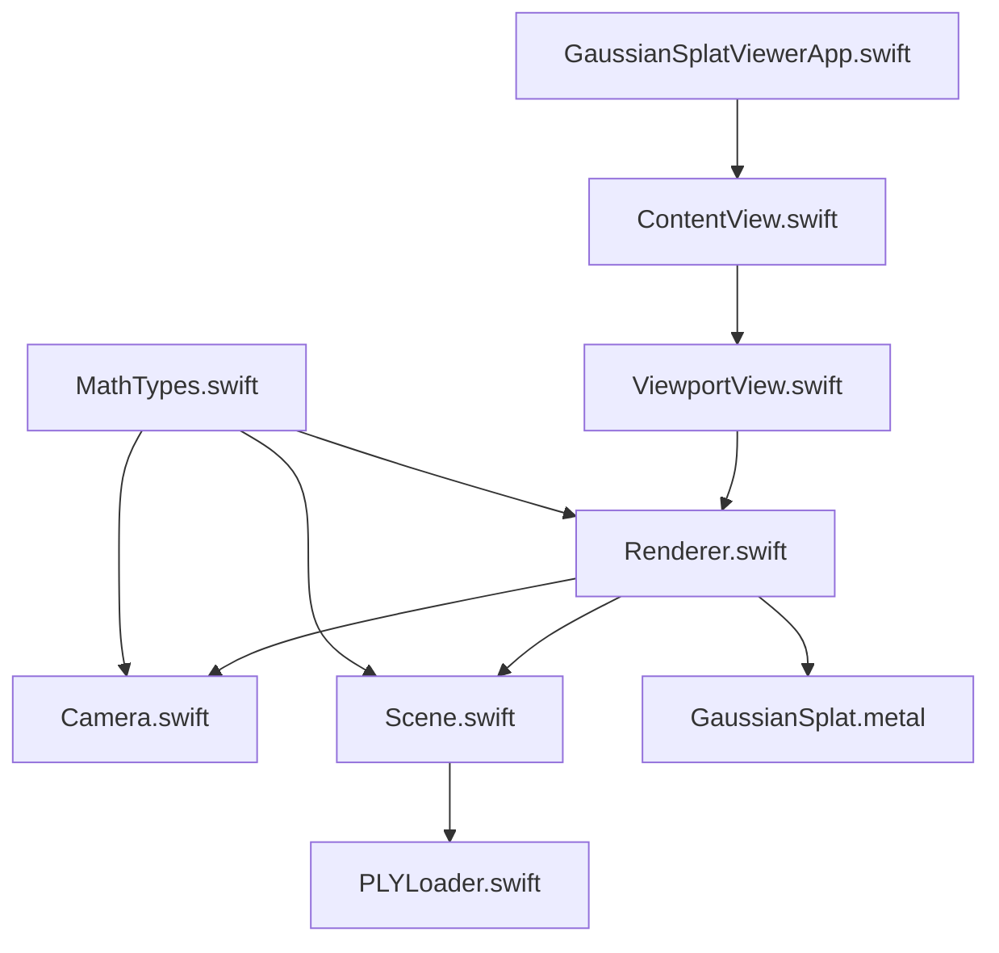
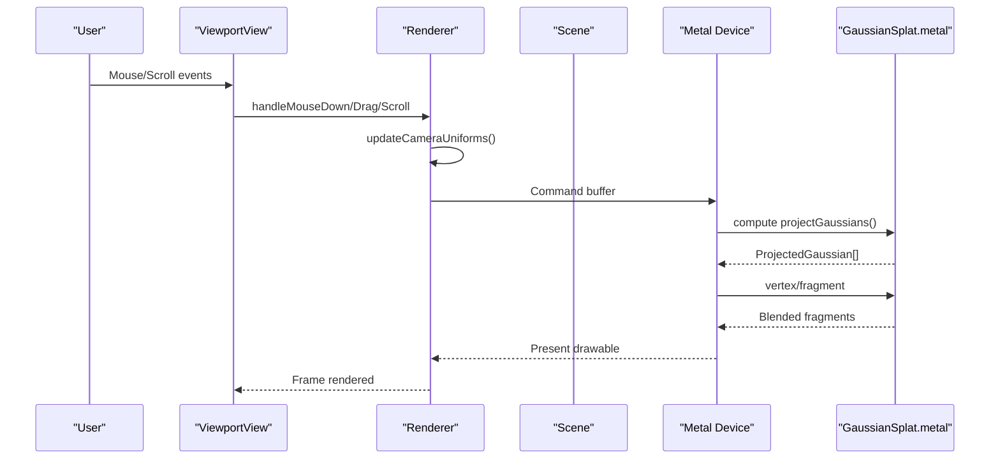
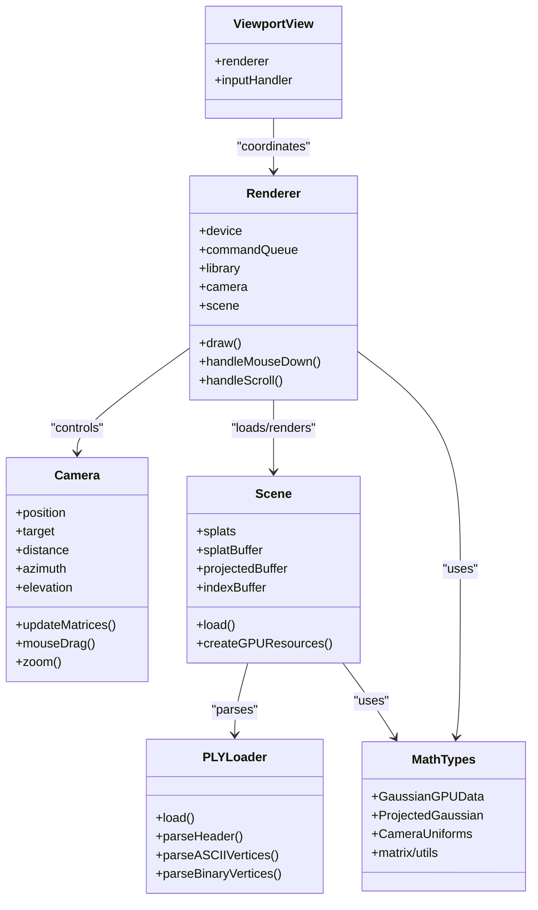

# Troubleshooting

<cite>
**Referenced Files in This Document**
- [GaussianSplatViewerApp.swift](file://GaussianSplatViewer/GaussianSplatViewerApp.swift)
- [ContentView.swift](file://GaussianSplatViewer/ContentView.swift)
- [Renderer.swift](file://Rendering/Renderer.swift)
- [Camera.swift](file://Rendering/Camera.swift)
- [Scene.swift](file://Scene/Scene.swift)
- [PLYLoader.swift](file://Scene/PLYLoader.swift)
- [ViewportView.swift](file://UI/ViewportView.swift)
- [GaussianSplat.metal](file://Shaders/GaussianSplat.metal)
- [MathTypes.swift](file://Math/MathTypes.swift)
- [GaussianSplatViewerTests.swift](file://GaussianSplatViewerTests/GaussianSplatViewerTests.swift)
- [GaussianSplatViewerUITests.swift](file://GaussianSplatViewerUITests/GaussianSplatViewerUITests.swift)
</cite>

## Table of Contents
1. [Introduction](#introduction)
2. [Project Structure](#project-structure)
3. [Core Components](#core-components)
4. [Architecture Overview](#architecture-overview)
5. [Detailed Component Analysis](#detailed-component-analysis)
6. [Dependency Analysis](#dependency-analysis)
7. [Performance Considerations](#performance-considerations)
8. [Troubleshooting Guide](#troubleshooting-guide)
9. [Conclusion](#conclusion)
10. [Appendices](#appendices)

## Introduction
This document provides comprehensive troubleshooting guidance for Gaussian Splat Viewer. It focuses on diagnosing and resolving performance issues (low frame rate, GPU memory pressure, rendering artifacts), platform-specific challenges on macOS and iOS (Metal compatibility and device limitations), PLY file loading errors and format incompatibilities, camera control and input event problems, UI responsiveness concerns, and debugging techniques for GPU shader compilation, Metal command encoding, and memory management. It also includes diagnostic tools, logging strategies, profiling methods, and preventive best practices.

## Project Structure
The application follows a layered structure:
- Application entry point and SwiftUI views
- Rendering pipeline built on Metal/MetalKit
- Scene management and PLY parsing
- Math types and GPU-compatible structures
- UI input handling and viewport integration

**Diagram sources**
- [GaussianSplatViewerApp.swift:10-17](file://GaussianSplatViewer/GaussianSplatViewerApp.swift#L10-L17)
- [ContentView.swift:10-20](file://GaussianSplatViewer/ContentView.swift#L10-L20)
- [ViewportView.swift:6-36](file://UI/ViewportView.swift#L6-L36)
- [Renderer.swift:7-77](file://Rendering/Renderer.swift#L7-L77)
- [Camera.swift:5-60](file://Rendering/Camera.swift#L5-L60)
- [Scene.swift:6-28](file://Scene/Scene.swift#L6-L28)
- [PLYLoader.swift:13-45](file://Scene/PLYLoader.swift#L13-L45)
- [GaussianSplat.metal:1-43](file://Shaders/GaussianSplat.metal#L1-L43)
- [MathTypes.swift:4-74](file://Math/MathTypes.swift#L4-L74)

**Section sources**
- [GaussianSplatViewerApp.swift:10-17](file://GaussianSplatViewer/GaussianSplatViewerApp.swift#L10-L17)
- [ContentView.swift:10-20](file://GaussianSplatViewer/ContentView.swift#L10-L20)
- [ViewportView.swift:6-36](file://UI/ViewportView.swift#L6-L36)
- [Renderer.swift:7-77](file://Rendering/Renderer.swift#L7-L77)
- [Camera.swift:5-60](file://Rendering/Camera.swift#L5-L60)
- [Scene.swift:6-28](file://Scene/Scene.swift#L6-L28)
- [PLYLoader.swift:13-45](file://Scene/PLYLoader.swift#L13-L45)
- [GaussianSplat.metal:1-43](file://Shaders/GaussianSplat.metal#L1-L43)
- [MathTypes.swift:4-74](file://Math/MathTypes.swift#L4-L74)

## Core Components
- Renderer: Manages Metal device, command queues, pipelines, buffers, camera uniforms, and the draw loop. Implements compute and render passes and integrates camera controls.
- Camera: Orbit camera with sensitivity controls, spherical coordinates, and matrix updates for view/projection.
- Scene: Loads Gaussian splats from PLY, creates GPU buffers, and computes scene bounds.
- PLYLoader: Parses ASCII and binary PLY files, validates headers, extracts vertex properties, and converts to internal structures.
- ViewportView: SwiftUI wrapper around MTKView, handles input events, and coordinates with the renderer.
- MathTypes: Defines GPU-compatible structures and math helpers for matrices, quaternions, and covariance computation.
- Metal Shaders: Compute shader projects Gaussians; vertex/fragment shaders render instanced quads with Gaussian blending.

Key responsibilities and integration points are visible in the referenced files.

**Section sources**
- [Renderer.swift:7-77](file://Rendering/Renderer.swift#L7-L77)
- [Camera.swift:5-60](file://Rendering/Camera.swift#L5-L60)
- [Scene.swift:6-28](file://Scene/Scene.swift#L6-L28)
- [PLYLoader.swift:13-45](file://Scene/PLYLoader.swift#L13-L45)
- [ViewportView.swift:6-36](file://UI/ViewportView.swift#L6-L36)
- [MathTypes.swift:4-74](file://Math/MathTypes.swift#L4-L74)
- [GaussianSplat.metal:138-270](file://Shaders/GaussianSplat.metal#L138-L270)

## Architecture Overview
The runtime flow connects UI input to rendering via the renderer and scene, with GPU compute and render passes.

**Diagram sources**
- [ViewportView.swift:38-89](file://UI/ViewportView.swift#L38-L89)
- [Renderer.swift:166-250](file://Rendering/Renderer.swift#L166-L250)
- [GaussianSplat.metal:138-270](file://Shaders/GaussianSplat.metal#L138-L270)

## Detailed Component Analysis

### Renderer: Metal Pipeline and Draw Loop
- Initializes Metal device, command queue, and loads the default library. Prints diagnostics on pipeline creation failures.
- Creates compute and render pipelines from shader functions and sets up triple-buffered camera uniforms and quad indices.
- Implements draw loop: compute pass to project Gaussians, optional depth sorting placeholder, render pass with blending.
- Handles Metal command buffer completion errors and logs them.

Common issues:
- Missing shader functions cause pipeline creation to fail.
- Missing scene data or buffers prevents drawing.
- Depth sorting is not implemented yet; expect flickering or incorrect occlusion.

**Section sources**
- [Renderer.swift:38-77](file://Rendering/Renderer.swift#L38-L77)
- [Renderer.swift:81-127](file://Rendering/Renderer.swift#L81-L127)
- [Renderer.swift:166-250](file://Rendering/Renderer.swift#L166-L250)
- [Renderer.swift:243-247](file://Rendering/Renderer.swift#L243-L247)

### Camera: Orbit Navigation
- Maintains position/target/up, spherical coordinates, and sensitivity parameters.
- Updates matrices on drag/zoom/pan and clamps elevation to prevent gimbal lock.
- Exposes mouse handlers wired by the renderer.

Common issues:
- Dragging sensitivity feels sluggish or overly sensitive; adjust sensitivity constants.
- Zoom limits may clip geometry; tune near/far planes and sensitivity.

**Section sources**
- [Camera.swift:63-84](file://Rendering/Camera.swift#L63-L84)
- [Camera.swift:87-115](file://Rendering/Camera.swift#L87-L115)
- [Camera.swift:150-176](file://Rendering/Camera.swift#L150-L176)

### Scene: PLY Loading and GPU Buffers
- Loads PLY via PLYLoader and constructs GPU buffers for splats, projections, and indices.
- Computes bounding box and center/radius for camera focusing.
- Throws buffer creation errors if GPU allocation fails.

Common issues:
- Empty splat count after load indicates parsing/validation failure.
- Buffer creation errors indicate insufficient GPU memory or device limitations.

**Section sources**
- [Scene.swift:31-55](file://Scene/Scene.swift#L31-L55)
- [Scene.swift:58-95](file://Scene/Scene.swift#L58-L95)
- [Scene.swift:106-133](file://Scene/Scene.swift#L106-L133)

### PLYLoader: Format Parsing and Validation
- Supports ASCII and binary little/big endian PLY formats.
- Validates header, requires “vertex” element, and parses properties.
- Converts SH DC coefficients or direct RGB channels; applies sigmoid activation; computes opacity via sigmoid.
- Skips invalid vertices and reports warnings.

Common issues:
- Missing required properties (e.g., position) cause parsing errors.
- Unsupported or malformed headers lead to invalid header errors.
- Binary endianness mismatches cause parsing failures.

**Section sources**
- [PLYLoader.swift:42-68](file://Scene/PLYLoader.swift#L42-L68)
- [PLYLoader.swift:72-158](file://Scene/PLYLoader.swift#L72-L158)
- [PLYLoader.swift:321-385](file://Scene/PLYLoader.swift#L321-L385)

### ViewportView: Input Handling and UI Coordination
- Wraps MTKView, wires input handlers, and exposes ViewModel for UI state.
- Delegates mouse and scroll events to renderer.
- ViewModel performs asynchronous file loading and posts load errors.

Common issues:
- Input not captured if responder chain is not focused.
- UI remains unresponsive during long loads; ensure background loading and main-thread updates.

**Section sources**
- [ViewportView.swift:9-36](file://UI/ViewportView.swift#L9-L36)
- [ViewportView.swift:38-89](file://UI/ViewportView.swift#L38-L89)
- [ViewportView.swift:151-183](file://UI/ViewportView.swift#L151-L183)

### Metal Shaders: Compute, Vertex, Fragment, Sorting
- Compute shader projects Gaussians, builds covariance, computes conic, and stores projected data.
- Vertex shader discards invisible instances and computes quad positions.
- Fragment shader evaluates Gaussian density, premultiplies alpha, and discards low-opacity pixels.
- Sorting kernel exists but is not invoked in the current draw loop.

Common issues:
- Conic determinant zero leads to zero opacity; indicates invalid covariance.
- Fragment discard path reduces overdraw but can hide subtle artifacts.
- Sorting is disabled; consider enabling for improved depth correctness.

**Section sources**
- [GaussianSplat.metal:138-201](file://Shaders/GaussianSplat.metal#L138-L201)
- [GaussianSplat.metal:205-241](file://Shaders/GaussianSplat.metal#L205-L241)
- [GaussianSplat.metal:245-270](file://Shaders/GaussianSplat.metal#L245-L270)
- [GaussianSplat.metal:274-308](file://Shaders/GaussianSplat.metal#L274-L308)

### Math Types: GPU Structures and Utilities
- Defines GaussianGPUData, CameraUniforms, ProjectedGaussian, and SIMD-based math helpers.
- Provides quaternion normalization, conversion to rotation matrices, and projection/matrix utilities.

Common issues:
- Incorrect alignment/padding in GPU structures can cause shader mismatches.
- Matrix utilities must match shader expectations.

**Section sources**
- [MathTypes.swift:34-73](file://Math/MathTypes.swift#L34-L73)
- [MathTypes.swift:76-101](file://Math/MathTypes.swift#L76-L101)
- [MathTypes.swift:108-147](file://Math/MathTypes.swift#L108-L147)

## Dependency Analysis
- Renderer depends on Camera, Scene, and Metal device/library.
- Scene depends on PLYLoader and Metal device for buffers.
- ViewportView depends on Renderer and MTKView for input and rendering.
- MathTypes underpins both Scene and Renderer with shared GPU structures.

**Diagram sources**
- [Renderer.swift:7-77](file://Rendering/Renderer.swift#L7-L77)
- [Camera.swift:5-60](file://Rendering/Camera.swift#L5-L60)
- [Scene.swift:6-28](file://Scene/Scene.swift#L6-L28)
- [PLYLoader.swift:13-45](file://Scene/PLYLoader.swift#L13-L45)
- [ViewportView.swift:6-36](file://UI/ViewportView.swift#L6-L36)
- [MathTypes.swift:4-74](file://Math/MathTypes.swift#L4-L74)

**Section sources**
- [Renderer.swift:7-77](file://Rendering/Renderer.swift#L7-L77)
- [Camera.swift:5-60](file://Rendering/Camera.swift#L5-L60)
- [Scene.swift:6-28](file://Scene/Scene.swift#L6-L28)
- [PLYLoader.swift:13-45](file://Scene/PLYLoader.swift#L13-L45)
- [ViewportView.swift:6-36](file://UI/ViewportView.swift#L6-L36)
- [MathTypes.swift:4-74](file://Math/MathTypes.swift#L4-L74)

## Performance Considerations
- Compute dispatch sizing: thread group size is fixed; ensure splat count aligns well to avoid underutilization.
- Triple-buffered camera uniforms reduce CPU/GPU synchronization stalls.
- Blending is enabled; verify alpha compositing does not dominate on low-power GPUs.
- Depth sorting is disabled; enable for scenes with heavy overlap to improve correctness and reduce artifacts.
- Large PLY files increase GPU memory usage; consider reducing splat count or simplifying geometry upstream.
- Prefer binary PLY where available to reduce parsing overhead.

[No sources needed since this section provides general guidance]

## Troubleshooting Guide

### Performance Problems
- Low frame rate
  - Verify compute dispatch sizing and splat count scaling.
  - Reduce splat count or disable non-essential features.
  - Confirm depth sorting is not causing extra compute work.
  - Check for excessive alpha blending on lower-tier GPUs.
  - Monitor GPU memory usage; large buffers can cause stutters.

- GPU memory issues
  - Large PLY files allocate substantial GPU buffers; consider downsampling or filtering.
  - Ensure buffers are cleared when switching files.
  - Validate buffer creation succeeds; failures indicate device memory constraints.

- Rendering artifacts
  - Conic determinant zero leads to zero opacity; inspect covariance computation and input scales.
  - Fragment discard path may hide faint splats; temporarily disable discard to diagnose.
  - Depth sorting disabled can cause incorrect occlusion; enable sorting for complex scenes.

**Section sources**
- [Renderer.swift:202-209](file://Rendering/Renderer.swift#L202-L209)
- [Renderer.swift:214-217](file://Rendering/Renderer.swift#L214-L217)
- [GaussianSplat.metal:166-170](file://Shaders/GaussianSplat.metal#L166-L170)
- [GaussianSplat.metal:245-270](file://Shaders/GaussianSplat.metal#L245-L270)
- [Scene.swift:58-95](file://Scene/Scene.swift#L58-L95)

### Platform-Specific Considerations (macOS and iOS)
- Metal framework compatibility
  - Ensure device supports required pixel formats and depth/stencil configurations.
  - Validate shader library loading and function availability; missing functions halt pipeline creation.
  - On iOS, consider reduced resolution or fewer splats for older devices.

- Device limitations
  - Private storage mode buffers require device capability; fallback or reduce workload if unavailable.
  - Some devices may have stricter memory budgets; profile with Instruments.

**Section sources**
- [Renderer.swift:47-53](file://Rendering/Renderer.swift#L47-L53)
- [Renderer.swift:99-103](file://Rendering/Renderer.swift#L99-L103)
- [Scene.swift:75-85](file://Scene/Scene.swift#L75-L85)

### PLY File Loading Errors
- Common symptoms
  - No splats loaded despite successful file selection.
  - Immediate load errors indicating invalid header or unsupported format.
  - Partial parsing with warnings for invalid vertices.

- Likely causes
  - Missing required properties (e.g., position).
  - Unsupported or malformed PLY header.
  - Binary endianness mismatch.
  - Unexpected property types or missing “vertex” element.

- Fixes
  - Validate PLY header and required properties.
  - Convert to supported ASCII/binary format.
  - Ensure property names match expected keys (e.g., x/y/z, scale_*, rot_*, f_dc_*, red/green/blue, opacity).
  - Re-export from source with correct format.

**Section sources**
- [PLYLoader.swift:4-10](file://Scene/PLYLoader.swift#L4-L10)
- [PLYLoader.swift:72-158](file://Scene/PLYLoader.swift#L72-L158)
- [PLYLoader.swift:321-385](file://Scene/PLYLoader.swift#L321-L385)
- [ViewportView.swift:176-180](file://UI/ViewportView.swift#L176-L180)

### Camera Control and Input Event Problems
- Symptoms
  - Mouse drags do nothing or feel unresponsive.
  - Scroll zoom not working.
  - UI not capturing input.

- Causes
  - MTKView not first responder; ensure it becomes first responder on window change.
  - Input handler not wired to MTKView.
  - Button mapping differences between left/right/middle mouse buttons.

- Fixes
  - Ensure MTKView accepts first responder and is made first responder.
  - Verify input delegate is set and events propagate to coordinator.
  - Adjust camera sensitivity if movement feels too slow/fast.

**Section sources**
- [ViewportView.swift:107-110](file://UI/ViewportView.swift#L107-L110)
- [ViewportView.swift:112-138](file://UI/ViewportView.swift#L112-L138)
- [ViewportView.swift:48-88](file://UI/ViewportView.swift#L48-L88)
- [Camera.swift:32-34](file://Rendering/Camera.swift#L32-L34)

### UI Responsiveness Concerns
- Long PLY loads block the UI thread; the ViewModel already offloads loading to a background queue and updates on main thread.
- Ensure UI respects isLoading state and displays loadError messages.

**Section sources**
- [ViewportView.swift:151-183](file://UI/ViewportView.swift#L151-L183)

### Debugging Techniques

- GPU shader compilation
  - Renderer prints pipeline creation failures; check console for shader function availability and pipeline descriptor issues.
  - Validate shader library loading and function names.

- Metal command encoding
  - Renderer registers a completion handler to log command buffer errors; check console for Metal errors.
  - Ensure all required buffers and textures are set before encoding.

- Memory management
  - Monitor GPU buffer sizes and device capabilities.
  - Clear buffers when switching files to prevent leaks.
  - Use Instruments to profile memory and GPU utilization.

- Diagnostic tools and logging
  - Console logs from renderer and scene loaders provide immediate feedback.
  - ViewModel posts loadError for user-visible issues.
  - Add timing logs around compute and render passes for profiling.

- Performance profiling
  - Use Xcode Instruments (Time Profiler, GPU Frame Capture, Allocations).
  - Measure compute dispatch duration and render pass overhead.
  - Profile with representative datasets to isolate bottlenecks.

**Section sources**
- [Renderer.swift:47-53](file://Rendering/Renderer.swift#L47-L53)
- [Renderer.swift:99-103](file://Rendering/Renderer.swift#L99-L103)
- [Renderer.swift:243-247](file://Rendering/Renderer.swift#L243-L247)
- [Scene.swift:31-55](file://Scene/Scene.swift#L31-L55)
- [ViewportView.swift:176-180](file://UI/ViewportView.swift#L176-L180)

### Preventive Measures and Best Practices
- Validate PLY inputs upstream (correct properties, supported formats).
- Keep GPU buffers aligned and sized appropriately; avoid oversized allocations.
- Enable depth sorting for complex scenes to improve correctness.
- Tune camera sensitivity and near/far planes for optimal performance.
- Use binary PLY for large datasets to reduce parsing overhead.
- Test on target devices early to catch Metal feature and memory limitations.

[No sources needed since this section provides general guidance]

## Conclusion
This guide consolidates actionable steps to diagnose and resolve common issues in Gaussian Splat Viewer. By leveraging built-in logging, validating inputs, tuning performance parameters, and following platform-specific guidelines, most problems can be quickly identified and resolved. Adopting the recommended preventive measures helps avoid typical pitfalls and ensures smoother operation across macOS and iOS devices.

[No sources needed since this section summarizes without analyzing specific files]

## Appendices

### Common User-Reported Issues and Underlying Causes
- “Nothing renders after loading”
  - Cause: No visible splats produced; verify PLY properties and parsing success.
  - Action: Inspect loadError and confirm splatCount is nonzero.

- “Low FPS on my machine”
  - Cause: Large splat count, blending overhead, or missing depth sorting.
  - Action: Reduce splat count, disable non-essential effects, enable sorting.

- “Crashes on older Mac/iPhone”
  - Cause: Private storage buffers or unsupported Metal features.
  - Action: Simplify dataset or reduce buffer sizes; test on target devices.

- “Mouse input not working”
  - Cause: MTKView not first responder or input handler not wired.
  - Action: Ensure first-responder setup and delegate assignment.

**Section sources**
- [ViewportView.swift:176-180](file://UI/ViewportView.swift#L176-L180)
- [Renderer.swift:243-247](file://Rendering/Renderer.swift#L243-L247)
- [ViewportView.swift:107-110](file://UI/ViewportView.swift#L107-L110)
- [ViewportView.swift:112-138](file://UI/ViewportView.swift#L112-L138)