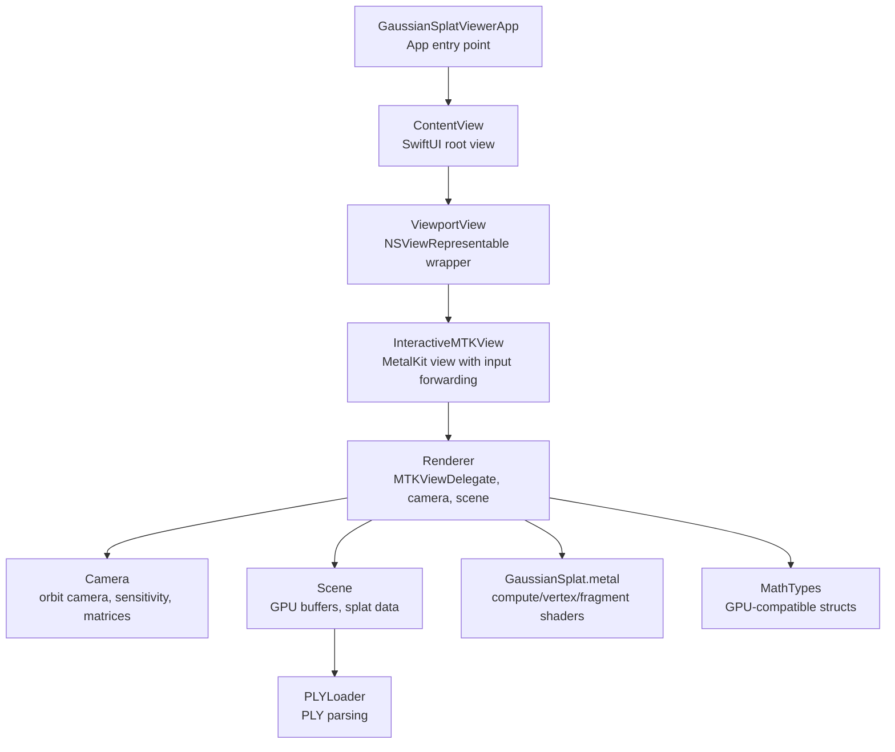
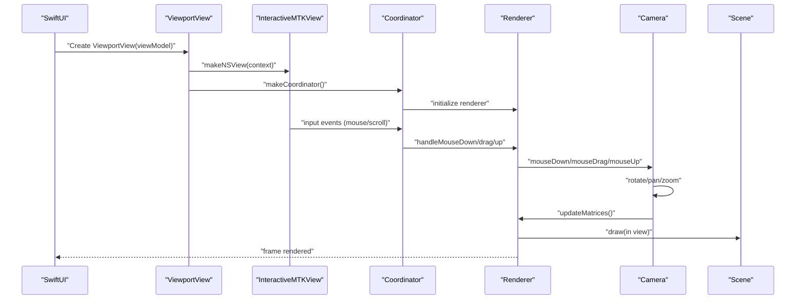
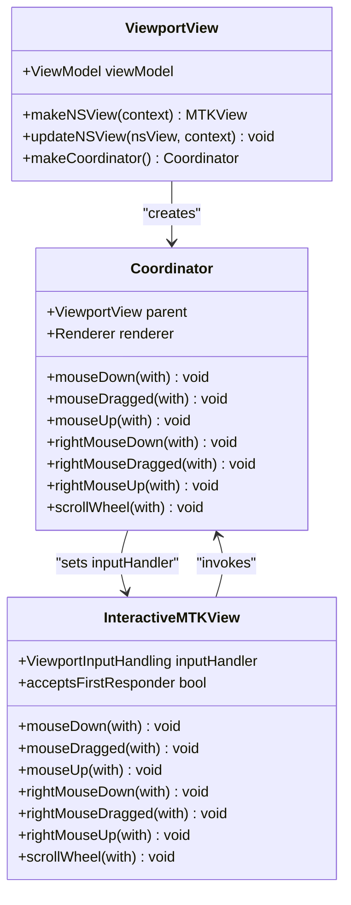
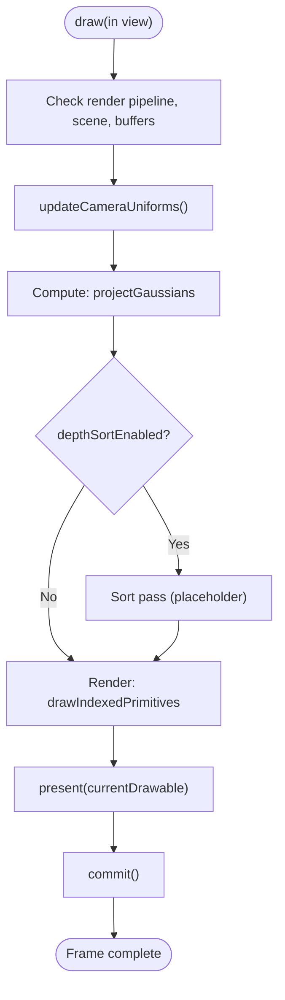
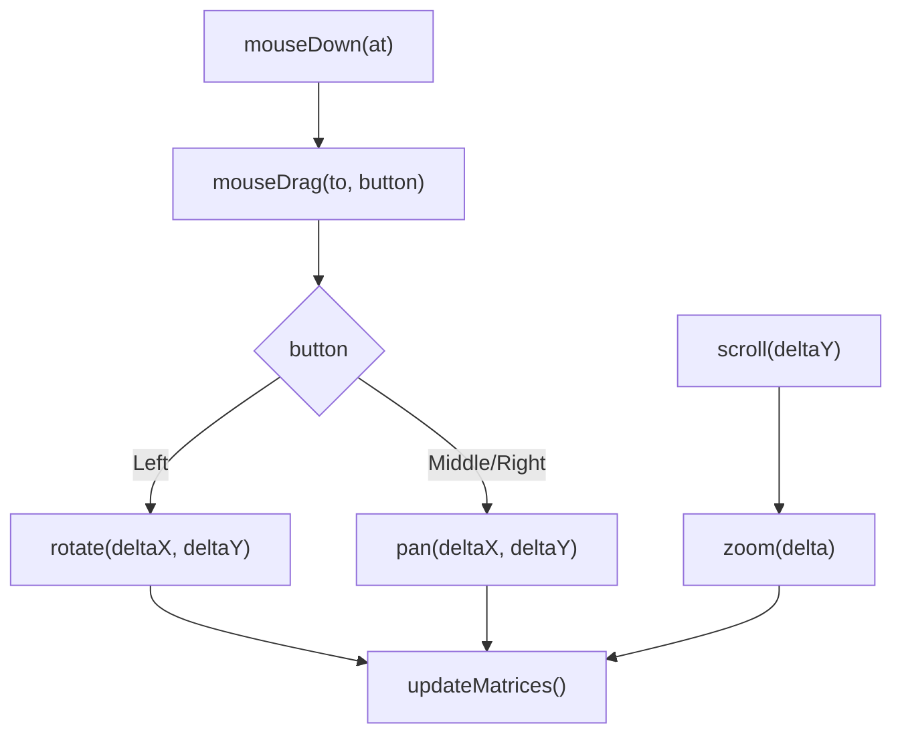
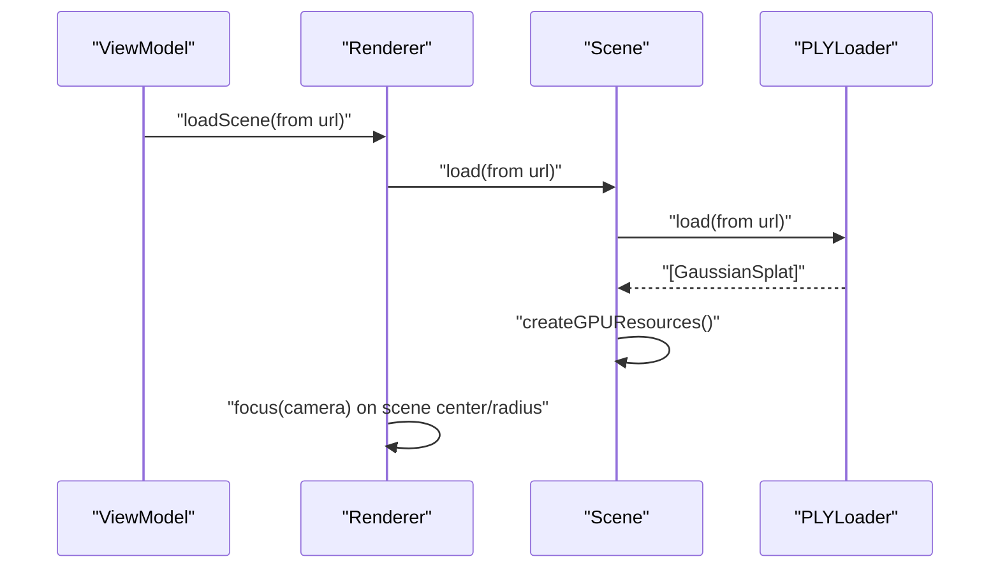
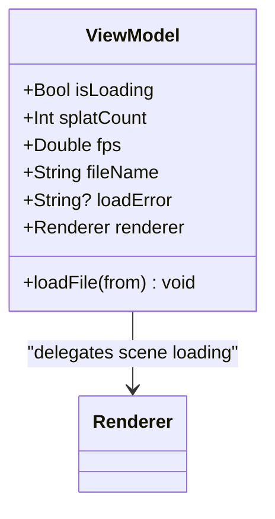
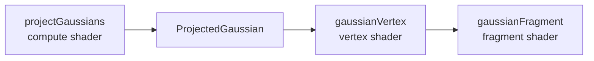
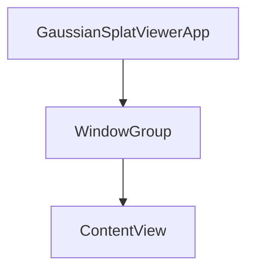
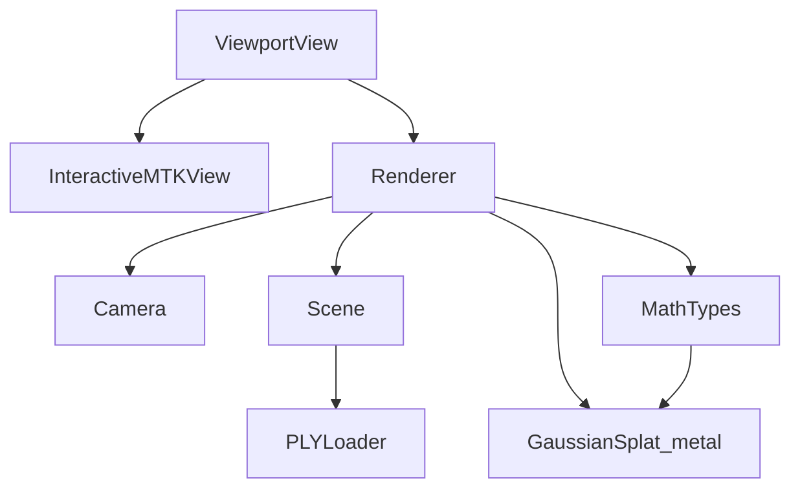

# User Interface

<cite>
**Referenced Files in This Document**
- [GaussianSplatViewerApp.swift](file://GaussianSplatViewer/GaussianSplatViewerApp.swift)
- [ContentView.swift](file://GaussianSplatViewer/ContentView.swift)
- [ViewportView.swift](file://UI/ViewportView.swift)
- [Renderer.swift](file://Rendering/Renderer.swift)
- [Camera.swift](file://Rendering/Camera.swift)
- [Scene.swift](file://Scene/Scene.swift)
- [MathTypes.swift](file://Math/MathTypes.swift)
- [GaussianSplat.metal](file://Shaders/GaussianSplat.metal)
- [PLYLoader.swift](file://Scene/PLYLoader.swift)
</cite>

## Table of Contents
1. [Introduction](#introduction)
2. [Project Structure](#project-structure)
3. [Core Components](#core-components)
4. [Architecture Overview](#architecture-overview)
5. [Detailed Component Analysis](#detailed-component-analysis)
6. [Dependency Analysis](#dependency-analysis)
7. [Performance Considerations](#performance-considerations)
8. [Troubleshooting Guide](#troubleshooting-guide)
9. [Conclusion](#conclusion)

## Introduction
This document explains the SwiftUI-based user interface and viewport interaction for a Gaussian Splatting viewer built with Metal. It focuses on how the ViewportView component integrates Metal rendering with SwiftUI, handles user input events (mouse drag for camera control, scroll for zoom), and updates frames reactively. It also documents the ContentView structure, UI state management via a shared ViewModel, and the integration with the underlying rendering system. Accessibility and customization considerations are included, along with performance optimization guidance for UI responsiveness during intensive rendering.

## Project Structure
The application follows a layered structure:
- Application entry point and SwiftUI views
- UI wrapper for Metal viewport and input handling
- Rendering pipeline and camera controls
- Scene management and asset loading
- Math types and GPU shader structures
- Metal shaders for compute and rendering

**Diagram sources**
- [GaussianSplatViewerApp.swift:10-17](file://GaussianSplatViewer/GaussianSplatViewerApp.swift#L10-L17)
- [ContentView.swift:10-20](file://GaussianSplatViewer/ContentView.swift#L10-L20)
- [ViewportView.swift:6-36](file://UI/ViewportView.swift#L6-L36)
- [Renderer.swift:7-77](file://Rendering/Renderer.swift#L7-L77)
- [Camera.swift:5-60](file://Rendering/Camera.swift#L5-L60)
- [Scene.swift:6-28](file://Scene/Scene.swift#L6-L28)
- [GaussianSplat.metal:138-201](file://Shaders/GaussianSplat.metal#L138-L201)
- [PLYLoader.swift:42-68](file://Scene/PLYLoader.swift#L42-L68)
- [MathTypes.swift:54-73](file://Math/MathTypes.swift#L54-L73)

**Section sources**
- [GaussianSplatViewerApp.swift:10-17](file://GaussianSplatViewer/GaussianSplatViewerApp.swift#L10-L17)
- [ContentView.swift:10-20](file://GaussianSplatViewer/ContentView.swift#L10-L20)
- [ViewportView.swift:6-36](file://UI/ViewportView.swift#L6-L36)
- [Renderer.swift:7-77](file://Rendering/Renderer.swift#L7-L77)

## Core Components
- ViewportView: A SwiftUI NSViewRepresentable that hosts an InteractiveMTKView, wires up input handlers, and initializes the Renderer. It exposes a Coordinator that translates NSEvent callbacks into Renderer actions.
- InteractiveMTKView: A subclass of MTKView that captures mouse and scroll events and forwards them to a delegate-like input handler.
- Renderer: Implements MTKViewDelegate to drive Metal compute and render passes, manages camera state, and exposes camera-control entry points for input.
- Camera: Encapsulates orbit-camera behavior, sensitivity, and matrix computation for GPU uniforms.
- Scene: Manages CPU and GPU data for Gaussian splats, including buffer creation and scene metrics.
- ViewModel: Coordinates UI state (loading, file name, error messages, FPS) and delegates scene loading to the Renderer.
- MathTypes: Defines GPU-compatible structures (camera uniforms, splat data) and math helpers.
- GaussianSplat.metal: Provides compute, vertex, and fragment shaders for projecting and drawing splats.
- PLYLoader: Parses PLY files into Gaussian splat data.

**Section sources**
- [ViewportView.swift:6-90](file://UI/ViewportView.swift#L6-L90)
- [ViewportView.swift:102-139](file://UI/ViewportView.swift#L102-L139)
- [Renderer.swift:7-287](file://Rendering/Renderer.swift#L7-L287)
- [Camera.swift:5-177](file://Rendering/Camera.swift#L5-L177)
- [Scene.swift:6-134](file://Scene/Scene.swift#L6-L134)
- [MathTypes.swift:54-73](file://Math/MathTypes.swift#L54-L73)
- [GaussianSplat.metal:138-270](file://Shaders/GaussianSplat.metal#L138-L270)
- [PLYLoader.swift:42-68](file://Scene/PLYLoader.swift#L42-L68)

## Architecture Overview
The SwiftUI application composes a ContentView that hosts the ViewportView. The ViewportView creates an InteractiveMTKView and sets up a Coordinator that forwards input events to the Renderer. The Renderer drives Metal compute and render passes, updating camera uniforms and drawing splats. The ViewModel publishes UI state changes that SwiftUI reacts to.

**Diagram sources**
- [ViewportView.swift:9-36](file://UI/ViewportView.swift#L9-L36)
- [ViewportView.swift:38-89](file://UI/ViewportView.swift#L38-L89)
- [Renderer.swift:166-250](file://Rendering/Renderer.swift#L166-L250)
- [Camera.swift:86-177](file://Rendering/Camera.swift#L86-L177)

## Detailed Component Analysis

### ViewportView and Input Event Processing
ViewportView bridges SwiftUI and Metal:
- Creates an InteractiveMTKView, sets device, preferred frame rate, and enables setNeedsDisplay.
- Initializes a Renderer and injects it into the ViewModel for UI coordination.
- Sets the MTK view as first responder to receive input events.
- Coordinator implements ViewportInputHandling and forwards NSEvent callbacks to Renderer.

Input handling covers:
- Mouse press, drag, and release for camera control.
- Right mouse button drag for pan.
- Scroll wheel for zoom.

**Diagram sources**
- [ViewportView.swift:6-36](file://UI/ViewportView.swift#L6-L36)
- [ViewportView.swift:38-89](file://UI/ViewportView.swift#L38-L89)
- [ViewportView.swift:102-139](file://UI/ViewportView.swift#L102-L139)

**Section sources**
- [ViewportView.swift:9-36](file://UI/ViewportView.swift#L9-L36)
- [ViewportView.swift:38-89](file://UI/ViewportView.swift#L38-L89)
- [ViewportView.swift:102-139](file://UI/ViewportView.swift#L102-L139)

### Renderer and Frame Updates
Renderer implements MTKViewDelegate to:
- Configure device, pipeline states, and buffers.
- Handle drawable size changes to update camera aspect ratio.
- Drive two passes:
  - Compute: project Gaussians using a compute shader.
  - Render: draw instanced quads with alpha blending.
- Expose camera-control entry points for input events.

**Diagram sources**
- [Renderer.swift:166-250](file://Rendering/Renderer.swift#L166-L250)
- [Renderer.swift:252-259](file://Rendering/Renderer.swift#L252-L259)

**Section sources**
- [Renderer.swift:7-77](file://Rendering/Renderer.swift#L7-L77)
- [Renderer.swift:161-164](file://Rendering/Renderer.swift#L161-L164)
- [Renderer.swift:166-250](file://Rendering/Renderer.swift#L166-L250)
- [Renderer.swift:252-259](file://Rendering/Renderer.swift#L252-L259)

### Camera Control and Gesture Recognition
Camera implements:
- Orbit navigation with spherical coordinates.
- Rotation, zoom, and pan behaviors.
- Sensitivity controls for smooth interaction.
- Matrix computation for GPU uniforms.

Input mapping:
- Left mouse drag rotates the camera.
- Middle/right drag pans the camera.
- Scroll wheel zooms.

**Diagram sources**
- [Camera.swift:86-177](file://Rendering/Camera.swift#L86-L177)

**Section sources**
- [Camera.swift:5-60](file://Rendering/Camera.swift#L5-L60)
- [Camera.swift:86-177](file://Rendering/Camera.swift#L86-L177)

### Scene Loading and GPU Buffer Management
Scene manages:
- CPU splat arrays and GPU buffers (splat data, projected data, indices).
- Loading from PLY files via PLYLoader.
- Computing scene center and radius for initial camera framing.

**Diagram sources**
- [ViewportView.swift:151-183](file://UI/ViewportView.swift#L151-L183)
- [Renderer.swift:147-157](file://Rendering/Renderer.swift#L147-L157)
- [Scene.swift:31-55](file://Scene/Scene.swift#L31-L55)
- [PLYLoader.swift:42-68](file://Scene/PLYLoader.swift#L42-L68)

**Section sources**
- [Scene.swift:31-55](file://Scene/Scene.swift#L31-L55)
- [PLYLoader.swift:42-68](file://Scene/PLYLoader.swift#L42-L68)
- [ViewportView.swift:151-183](file://UI/ViewportView.swift#L151-L183)

### UI State Management and Reactive Updates
ViewModel coordinates UI state:
- Loading indicators and error reporting.
- Published properties for file name, splat count, and FPS.
- Delegates scene loading to Renderer on a background queue and posts results on the main queue.

**Diagram sources**
- [ViewportView.swift:142-184](file://UI/ViewportView.swift#L142-L184)

**Section sources**
- [ViewportView.swift:142-184](file://UI/ViewportView.swift#L142-L184)

### Shader Pipeline and GPU Data Structures
The shader pipeline:
- Compute shader projects splats and prepares per-instance data.
- Vertex shader computes screen-space quad positions and UV offsets.
- Fragment shader evaluates 2D Gaussians with conic matrices and premultiplied alpha.

GPU structures:
- CameraUniforms for matrices and screen size.
- GaussianGPUData and ProjectedGaussian for compute and render stages.

**Diagram sources**
- [GaussianSplat.metal:138-201](file://Shaders/GaussianSplat.metal#L138-L201)
- [GaussianSplat.metal:205-241](file://Shaders/GaussianSplat.metal#L205-L241)
- [GaussianSplat.metal:245-270](file://Shaders/GaussianSplat.metal#L245-L270)

**Section sources**
- [GaussianSplat.metal:138-270](file://Shaders/GaussianSplat.metal#L138-L270)
- [MathTypes.swift:54-73](file://Math/MathTypes.swift#L54-L73)

### SwiftUI Structure and Application Entry Point
- GaussianSplatViewerApp defines the main Scene hosting ContentView.
- ContentView currently displays placeholder content; it is intended to host the ViewportView in future iterations.

**Diagram sources**
- [GaussianSplatViewerApp.swift:10-17](file://GaussianSplatViewer/GaussianSplatViewerApp.swift#L10-L17)
- [ContentView.swift:10-20](file://GaussianSplatViewer/ContentView.swift#L10-L20)

**Section sources**
- [GaussianSplatViewerApp.swift:10-17](file://GaussianSplatViewer/GaussianSplatViewerApp.swift#L10-L17)
- [ContentView.swift:10-20](file://GaussianSplatViewer/ContentView.swift#L10-L20)

## Dependency Analysis
Key dependencies and interactions:
- ViewportView depends on InteractiveMTKView and Coordinator to route input to Renderer.
- Renderer depends on Camera for view/projection matrices and Scene for splat data.
- Scene depends on PLYLoader for data ingestion.
- MathTypes provides GPU-compatible structures used by Renderer and shaders.
- Shaders depend on MathTypes structures for uniform and per-vertex data.

**Diagram sources**
- [ViewportView.swift:6-36](file://UI/ViewportView.swift#L6-L36)
- [Renderer.swift:7-77](file://Rendering/Renderer.swift#L7-L77)
- [Scene.swift:6-28](file://Scene/Scene.swift#L6-L28)
- [PLYLoader.swift:42-68](file://Scene/PLYLoader.swift#L42-L68)
- [MathTypes.swift:54-73](file://Math/MathTypes.swift#L54-L73)
- [GaussianSplat.metal:138-201](file://Shaders/GaussianSplat.metal#L138-L201)

**Section sources**
- [ViewportView.swift:6-36](file://UI/ViewportView.swift#L6-L36)
- [Renderer.swift:7-77](file://Rendering/Renderer.swift#L7-L77)
- [Scene.swift:6-28](file://Scene/Scene.swift#L6-L28)
- [PLYLoader.swift:42-68](file://Scene/PLYLoader.swift#L42-L68)
- [MathTypes.swift:54-73](file://Math/MathTypes.swift#L54-L73)
- [GaussianSplat.metal:138-201](file://Shaders/GaussianSplat.metal#L138-L201)

## Performance Considerations
- Triple-buffered camera uniforms reduce CPU-GPU synchronization stalls.
- Alpha blending is enabled for correct splat compositing; ensure minimal overdraw by leveraging depth testing and early discard in shaders.
- Depth sorting is currently a placeholder; implement a compute-based sort (e.g., bitonic sort) periodically to improve visual correctness.
- Keep UI off the main thread for heavy operations (scene loading is already dispatched to a background queue).
- Prefer efficient buffer layouts and strides aligned to GPU memory boundaries.
- Limit unnecessary SwiftUI re-renders by using @Published judiciously and grouping state updates.

[No sources needed since this section provides general guidance]

## Troubleshooting Guide
Common issues and remedies:
- No viewport rendering:
  - Verify MTKView device initialization and delegate assignment.
  - Ensure Metal library loads and shader functions exist.
- Input not responding:
  - Confirm InteractiveMTKView accepts first responder and inputHandler is set.
  - Check that Coordinator is created and attached to the MTKView.
- Scene loading errors:
  - Validate PLY file format and required properties.
  - Inspect ViewModel loadError and splatCount post-loading.
- Visual artifacts:
  - Review compute shader projection and vertex shader quad positioning.
  - Check camera uniforms and aspect ratio updates on drawable size changes.

**Section sources**
- [Renderer.swift:38-77](file://Rendering/Renderer.swift#L38-L77)
- [ViewportView.swift:9-36](file://UI/ViewportView.swift#L9-L36)
- [ViewportView.swift:151-183](file://UI/ViewportView.swift#L151-L183)
- [GaussianSplat.metal:138-270](file://Shaders/GaussianSplat.metal#L138-L270)

## Conclusion
The SwiftUI integration centers around ViewportView as a bridge between SwiftUI and Metal. Input events are captured by InteractiveMTKView and forwarded to Renderer via Coordinator, which delegates to Camera for smooth, responsive viewport interaction. ViewModel publishes UI state for reactive updates, while Renderer orchestrates the compute and render passes. The architecture supports extensibility for advanced features like depth sorting and improved keyboard shortcuts, while maintaining performance through GPU-friendly data structures and efficient rendering.